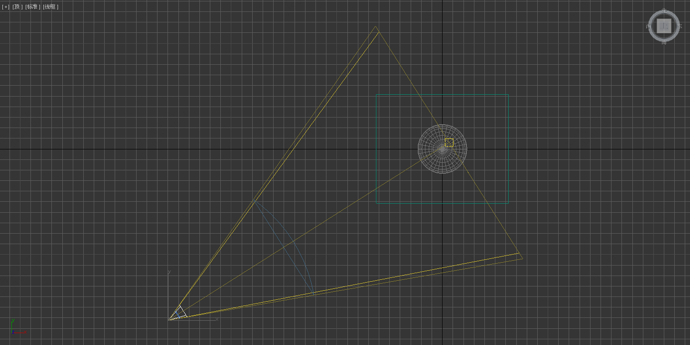
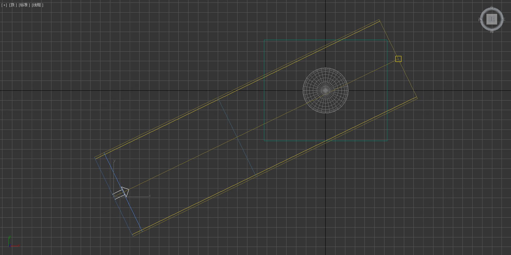
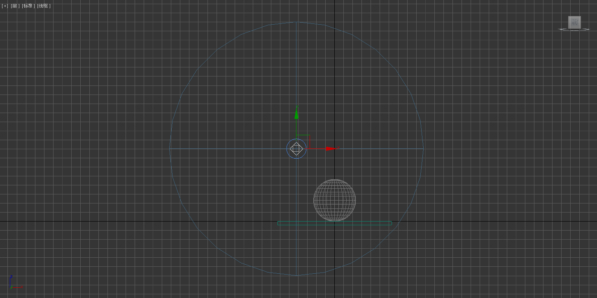
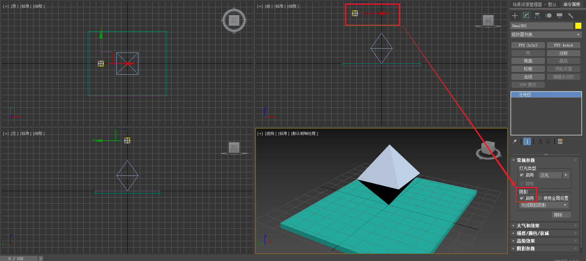
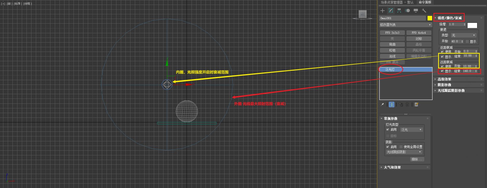
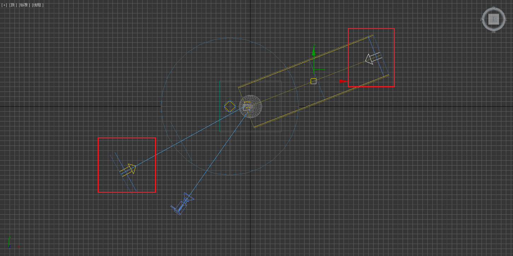
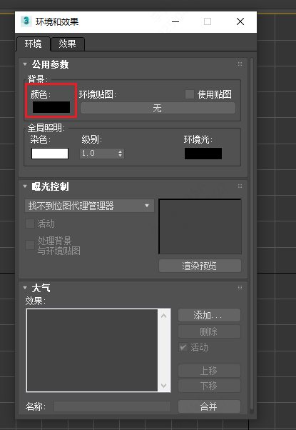

___________________________________________________________________________________________
###### [GoMenu](../3DMaxAnimationMenu.md)
___________________________________________________________________________________________
# 001_3Dmax视口调整快捷键、灯光介绍、设置背景颜色

___________________________________________________________________________________________

## 目录

[TOC]

------

## 视口调整快捷键

这部分在3Dmax模型部分有提到，这里简单梳理下

> |                    作用                    | 快捷键 |
> | :----------------------------------------: | :----: |
> |              切换**透视视图**              |   P    |
> |               切换**正视图**               |   F    |
> |               切换**左视图**               |   L    |
> |               切换**上视图**               |   T    |
> | **前提是有一个摄像机！**切换**摄像机视角** |   C    |
> |                                            |        |
> |              显示世界坐标原点              |   G    |
> |                                            |        |
> |                    位移                    |   W    |
> |                    旋转                    |   E    |
> |                    缩放                    |   R    |
> |                                            |        |
> |                  材质面板                  |   M    |
> |                                            |        |
> |            打开**渲染设置面板**            |  F10   |
> |               **预渲染面板**               |   F9   |

------

## 常用灯光介绍

在创建面板中创建灯光，选择标准灯光。

常用灯光类型包括目标聚光灯、目标平行光、泛光灯
和天光。

### 目标聚光灯

1. 目标聚光灯类似路灯，有明显的方向性
2. 照射方向明确，适用于只照射特定范围。

> 

### 目标平行光

1. 目标平行光类似手电筒，有明确的角度。
2. 适用于照亮特定范围，常用于恐怖游戏等场景。

> 

### 泛光灯（相当于点光源）

1. 泛光灯无方向性，360度照射。
2. 适用于模拟空中灯泡或太阳、月亮等光源。

> 

------

### 灯光属性调整：阴影、强度、颜色、衰减

1. 开启阴影功能，使灯光与地面有交互。
2. 调整灯光强度、颜色和衰减，确保渲染效果柔和。

> 

### 辅助光源添加

1. 添加辅助光源，照亮完全照不到的部分和相机视角
2. 辅助光源强度较低，确保不影响主光源效果。
3. 可使用**天光**或**别的光源**

> 

------

## 设置预览和渲染的背景颜色

> 

------