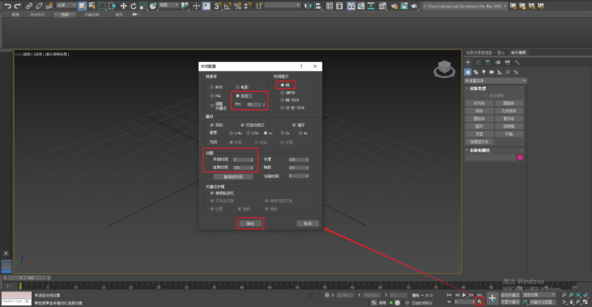
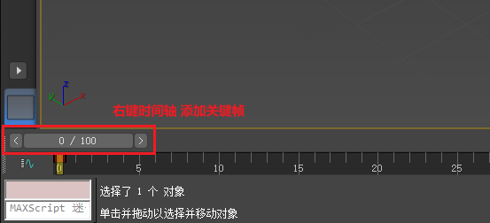
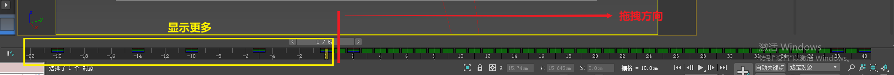
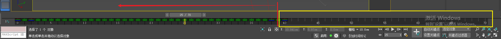
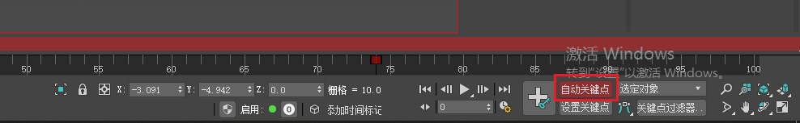
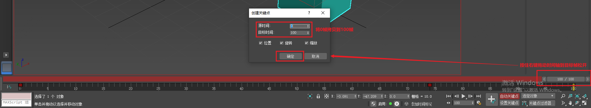
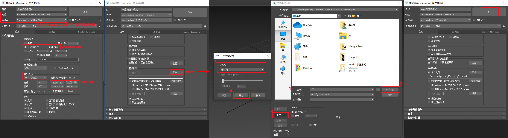

___________________________________________________________________________________________
###### [GoMenu](../3DMaxAnimationMenu.md)
___________________________________________________________________________________________
# 002_设置动画参数配置、时间轴、曲线、渲染视频

___________________________________________________________________________________________

## 目录

[TOC]

------

## 设置动画帧率

> 

------

## 添加关键帧

> 

------

## 移动时间轴

### `按住Ctrl+Alt+左键 + 向右拖拽 -> 时间轴向左显示更多`

> 

### `按住Ctrl+Alt+右键 + 向左拖拽 -> 时间轴向右显示更多`

> 

------

## 曲线编辑器缩放操作`ctrl+Alt+中键`

> - 向上缩放
> - 向下变扁
> - 向左右调整

------

## 自动记录关键帧工具

> 开启后，移动时间轴，自动记录关键帧

------

## 拷贝帧（右键拖动时间轴到目标帧松开）

> 

### 曲柄与速度关系

> 1. 曲柄定义:曲柄越陡峭，速度越快
> 2. 陡峭计算:曲柄与水平方向的夹角越大，速度越快
> 3. 应用:碰撞瞬间的速度调整

------

## 渲染视频的设置

> 

------