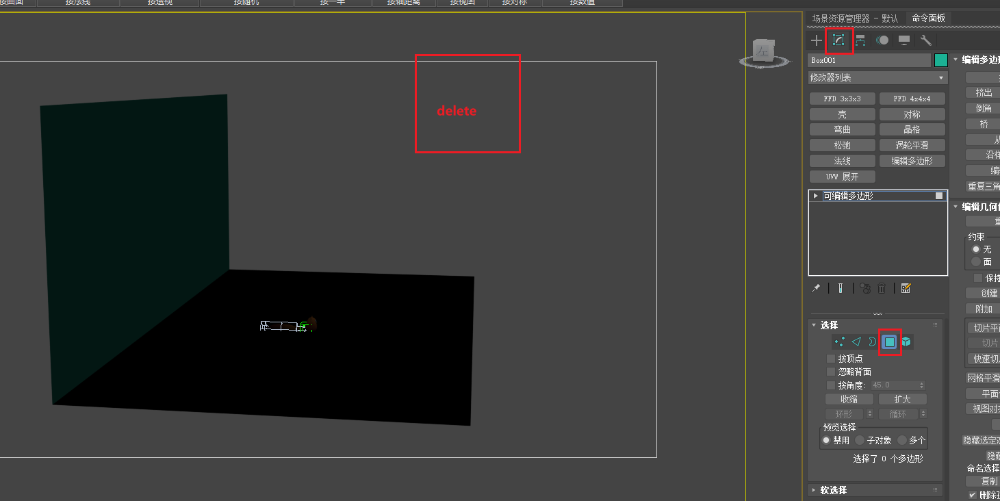
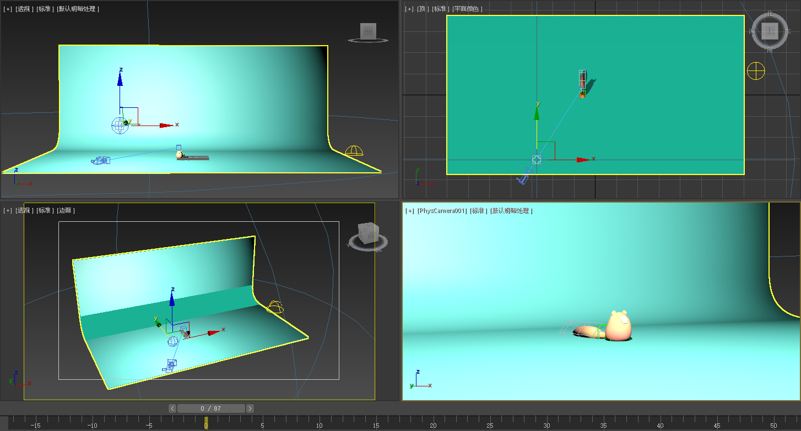

___________________________________________________________________________________________
###### [GoMenu](../3DMaxAnimationMenu.md)
___________________________________________________________________________________________
# 003_松鼠左右蹦跳动画、搭建渲染背景、使用`柔体脚本`

___________________________________________________________________________________________

## 目录

[TOC]

------

## 松鼠左右蹦跳动画

> 打开可以看到松鼠的骨骼控制器
>
> 
>
> 骨骼中有父子集概念

### 松鼠跳跃动画速度曲线设置

1. 起跳时增加向右的旋转动画，
2. 落地时保持旋转方向，略有衰减。
3. 空中运动时方向基本不变。

> 遵循运动规律：
>
> 和小球不一样的是小球是被动发力，所以可以瞬间完成；而松鼠跳跃为主动发力，需要有时间完成蓄力
>
> 且运动过程中为力度和速度衰减的过程，导致运动曲线从快到慢（起跳向空中到在空中滞留），然后由于重力影响，是一个逐渐加速到落地的状态

### 3D项目中的轴向运动

1. 3D项目中通常调整多个轴向。
2. 主要轴向运动较大，其他轴向运动较小。
3. 添加绿色和蓝色轴向的动画，使动画更丰富。

> 主要轴向比如X轴，涉及到左右蹦跳，运动幅度较大，正常K帧；其他两个轴向遵循运动规律，在蹦跳时，不可能不旋转，一般都是稍微偏向运动趋向的方向，略微偏转

### 缩放动画设计

1. 选择控制大脑袋的骨骼进行缩放动画
2. 使用体积缩放模式，保持体积不变。
3. 起跳时变长，落地时变扁

> 涉及到[体积缩放模式](#缩放模式使用：体积缩放模式)
>
> 松鼠在准备起跳时，需要进行蓄力，会使得自身体积变扁，然后起跳过程中拉长身体，到达目标位置时，体积恢复原状，下落时逐渐加速再拉长身体，然后落地，在原有的势能影响下，体积变扁，然后再次起跳，完成循环

### 松鼠尾巴动画制作

1. 松鼠尾巴动画制作的基本步骤:位移、旋转、缩放
2. 动画原理:跟随动画，尾巴由负极带动正极。
3. 推荐插件:柔体脚本，用于制作跟随动画。

> 参考[使用柔体脚本](#使用柔体脚本制作柔体动画)

#### 尾巴动画的精细调整

1. 尾巴不同节点的软硬度调整:越靠后的节点越软。（选择所有的尾部骨骼使用脚本，再逐次减去父节点，再使用脚本，多次使用以达到柔性逐级递减的效果）

   

2. 多次计算:对不同节点进行多次计算以获得更自然的动画效果。

## 制作好动画后，搭建渲染背景

1. 创建立方体，转可编辑多边形
2. 编辑面板，面模式，删掉多余面
3. 因为剩下的两个面的法线是反的，需要翻转面
4. 边模式下，对边界使用切线，增加切角的细分（别太低，不然看起来有明显的菱角感，也可以使用平滑组处理一下）

> 

### 最终的渲染场景

1. 静物台（上面创建的平面）
2. 主体
3. 摄像机
4. 主光源（泛光）
5. 辅光（天光）

> 

------

## 处理动画第一步：`冻结对象`防止误操作

> 

### 如果冻结后对象变灰，可以设置对象属性

> 

------

## 处理动画第二步：`预留初始Pose`

在负帧，尽可能多保存几个初始Pose

- 防止后续的误操作无法回退
- 防止后续新动画无法追溯最初Pose

> 

------

## 设为蒙皮姿势

> 1. 使用alt加鼠标右键的设为蒙皮姿势功能。
> 2. 设为蒙皮姿势后，可以通过读取蒙皮姿势来快速恢复到初始姿势。
>
> 

------

## 循环动画的基本概念

1. 循环动画的定义:循环动画是指在整个动画过程中反复出现的动作，如游戏中的走路、跑步、待机和攻击等动作。
2. 循环动画的要求:循环动画最终需要回到待机状态。
3. 左右蹦动画示例:选择小方块作为控制对象，确定起始位置，并设置世界坐标参考线。

------

## 简单左右蹦动画的制作

（这里只是通过描述帧来讲述大致逻辑，不要严格按照帧数，要遵循运动规律！！！）

1. 制作步骤:选择小方块，在第10帧跳到高点，第20帧跳到右边，第30帧跳回中间，第40帧跳回左边。
2. 循环设置:通过将第0帧粘贴到第40帧来实现循环。
3. 简单效果:完成简单的左右蹦动画。

------

## 小松鼠与小球的蹦跳区别

1. 区别一:小松鼠在地面上稍作停留后蹦起，而小球则刚接触地面就弹起。
2. 区别二:小松鼠的蹦跳更有蓄力感，而小球则更加硬朗。
3. 调整方法:在第18帧和第22帧增加停留时间，使小松鼠在地面上稍作停留后再蹦起。

------

## 左右蹦动画的完善

1. 完善方向:调整x轴和z轴的运动曲线，使其更加科学和完美。
2. z轴调整:上下蹦跳的运动曲线应分别为减速和自由落体
3. x轴调整:左右蹦跳的运动曲线应为减速但不减成零，

------

## x轴运动曲线的调整

1. 问题讨论:落地瞬间横向速度是否为零，
2. 答案解析:落地瞬间横向速度不为零，因为地面会提供阻力。
3. 曲线调整:调整横向运动曲线，使其减速但不减成零

------

## 旋转模式切换为`局部`旋转

> 两种方式
>
> 
>
> 

------

## 缩放模式使用：`体积缩放模式`

就是在缩放时，维持物体的体积不变，从而进行某个维度的拉伸，其余维度相应缩小

> 

------

## 使用`柔体脚本`制作柔体动画

#### 柔体脚本的使用

1. 柔体脚本的安装:将插件拖入Max文件中。
2. 柔体脚本的功能:软硬度调整、循环计算次数、运行计算。
3. **软硬度调整:0到1之间，0为最软，1为最硬。**
4. 循环计算次数:0为不循环，1为计算一次，2为**计算两次**。
5. 运行计算:**选择需要计算的骨骼**，点击运行或计算按钮。

> [柔体脚本.rar](Script\柔体脚本.rar)
>
> 可以将插件**直接拖拽**到3dmax的视口使用
>
> 也可以导入脚本使用
>
> 
>
> 

------