___________________________________________________________________________________________
###### [GoMenu](../3DMaxAnimationMenu.md)
___________________________________________________________________________________________
# 004_摆人物Pose —— 马里奥

___________________________________________________________________________________________

## 目录

[TOC]

------

> - 角色动画的难度与之前的课程相比有显著增加
> - 小球动画只控制了主体的位移和旋转，且几乎是单一轴向的
> - 小松鼠动画在位移和旋转基础上增加了其他轴向的变化，但控制器数量较少
> - 人形角色的控制器数量成倍增加，仅是手指头上的控制器就和松鼠比翻倍了。
>
> 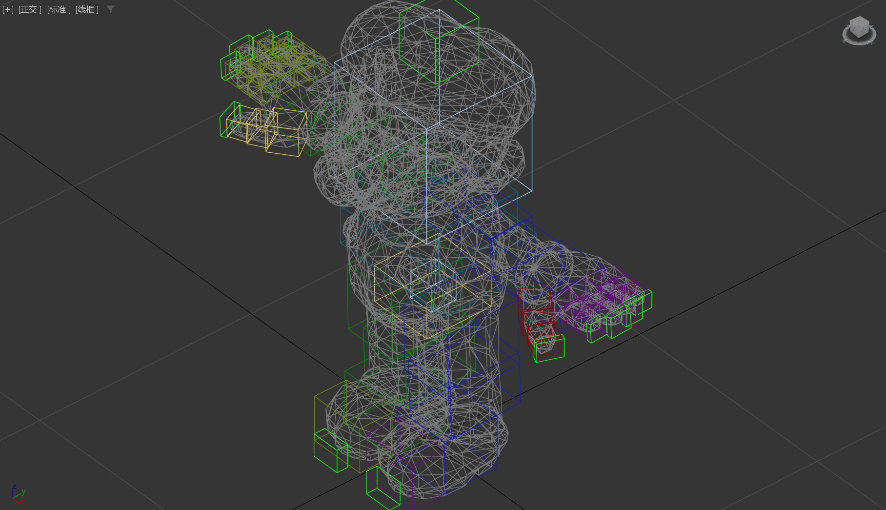
>
> - 人形骨骼适用于2D角色，显示面板使用平面颜色更好看
> - Max中有一套适合游戏项目的骨骼——`biped`骨骼
> - `biped`骨骼的设置和驱动将在第四周详细讲解
> - 今天的内容主要是熟悉骨骼操作，让角色摆Pose

------

## 恢复默认姿势的方法

> 1. 恢复默认姿势的步骤：全选骨骼删除动画，进入形体模式再点出来
> 2. 形体模式是模型建模时的默认姿势，点进骨头进入运动面板可以找到
> 3. 点进形体模式后一定要再点出来，确保返回动画模式。
>
> 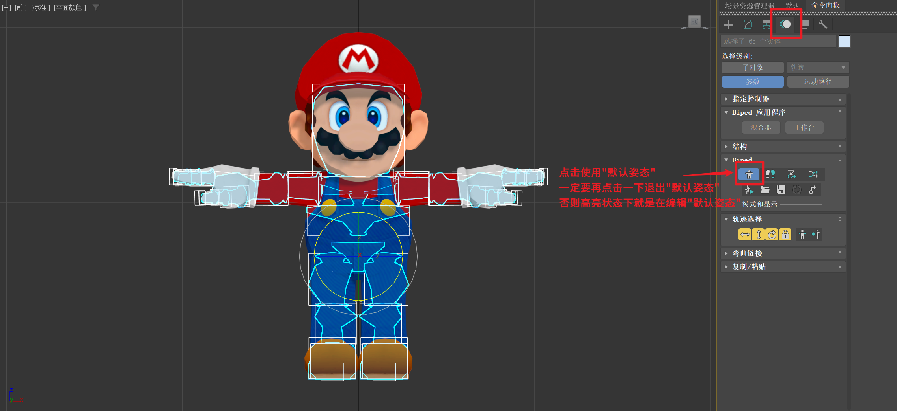

------

## 冻结模型和留初始pose

> 1. 冻结模型：选中模型右键冻结，或全选骨骼在第零帧留一帧
> 2. 设为蒙皮姿势：右键设为蒙皮姿势，与小松鼠操作相同
> 3. 点亮质心属性：在k帧之前，确保质心的所有属性都被点亮。
>
> 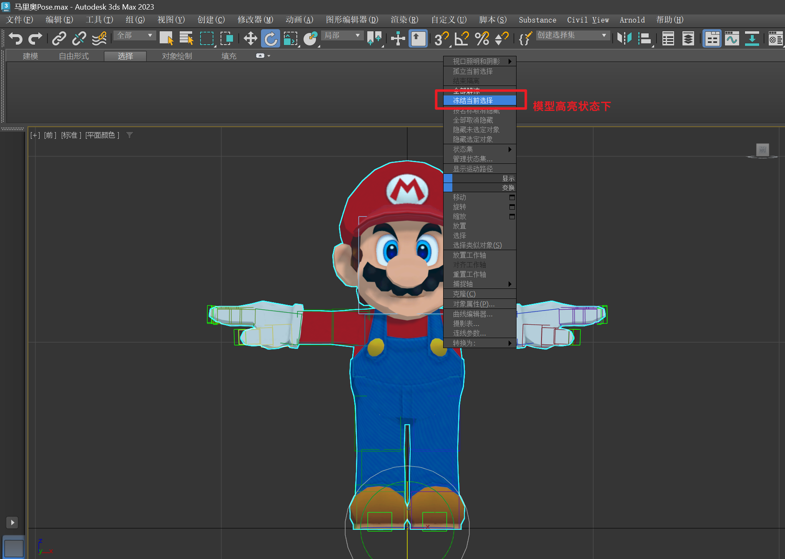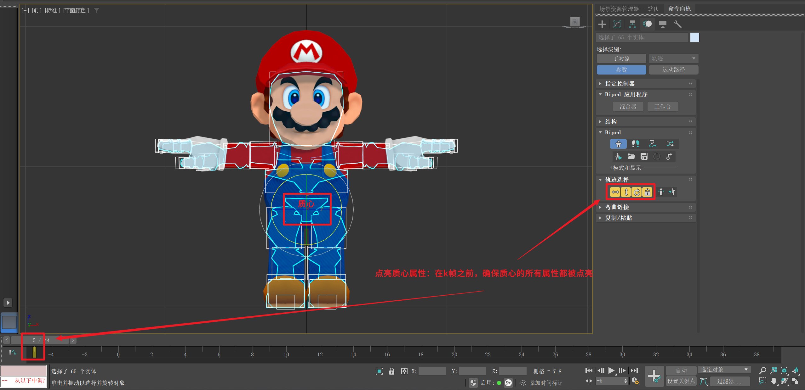

------

## Max设置快捷键

也可以不改，使用`PageUp` `PageDown`

> 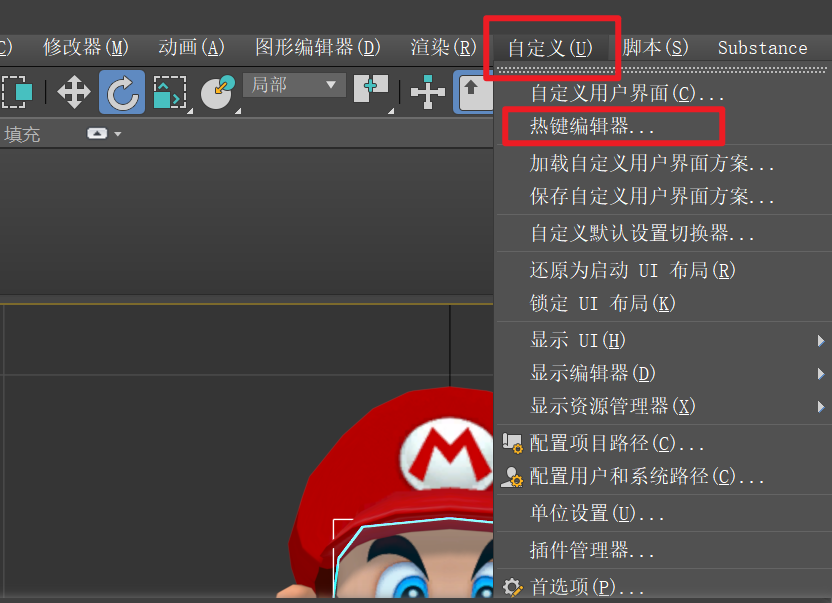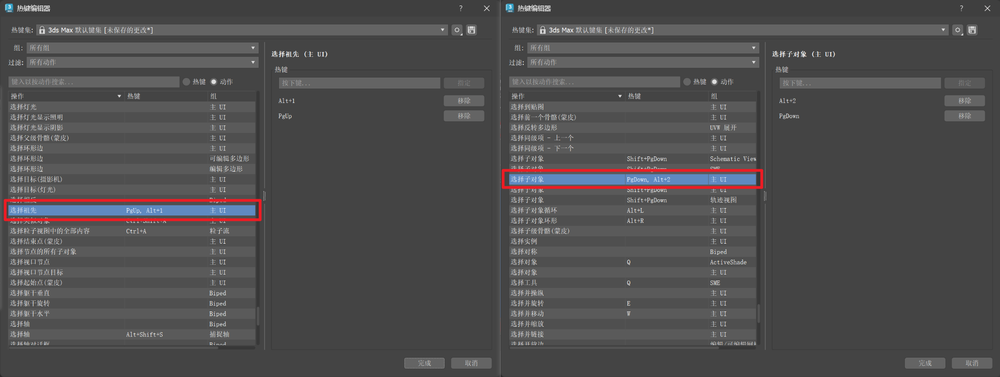

------

## 设置Max自动保存频率

> 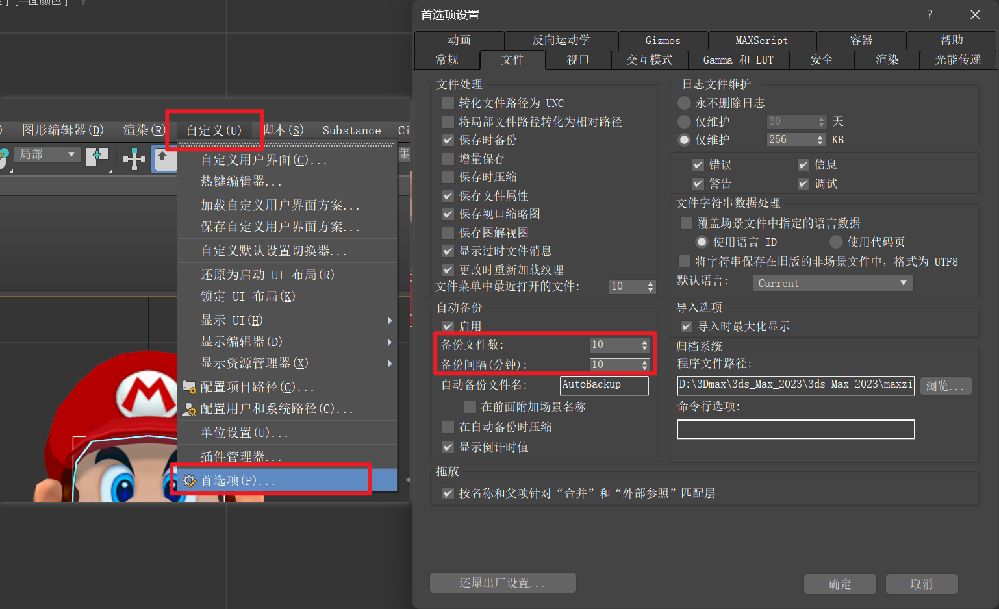

------

## 摆姿势的步骤和技巧

> 1. 调整整体质心朝向：先处理下半身，再细化上半身
> 2. 滑动关键帧：用于固定脚的位置，防止跟随质心移动
> 3. 旋转轴设置：通过ik选项调整滑动关键帧的旋转轴
> 4. **小腿方向：与脚面方向一致**，避免崴脚或过分外张内扣。

------

## 将脚设为`滑动关键帧`

> 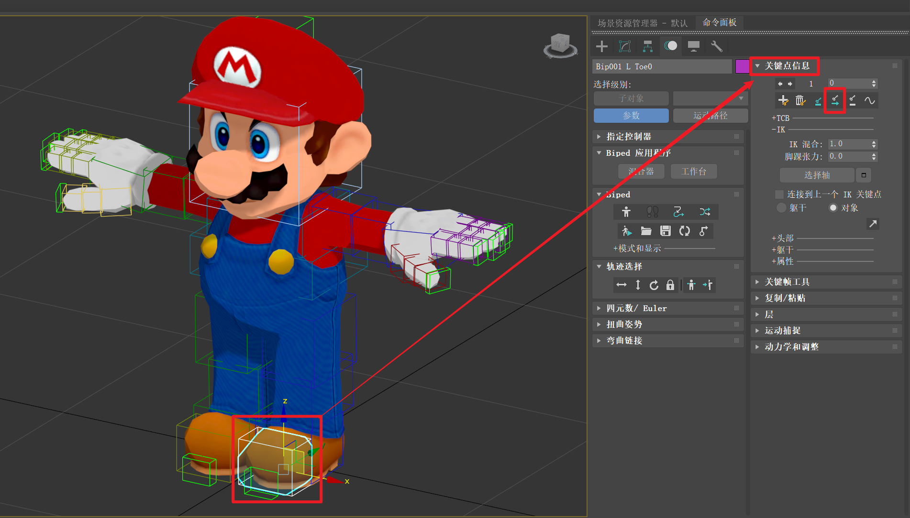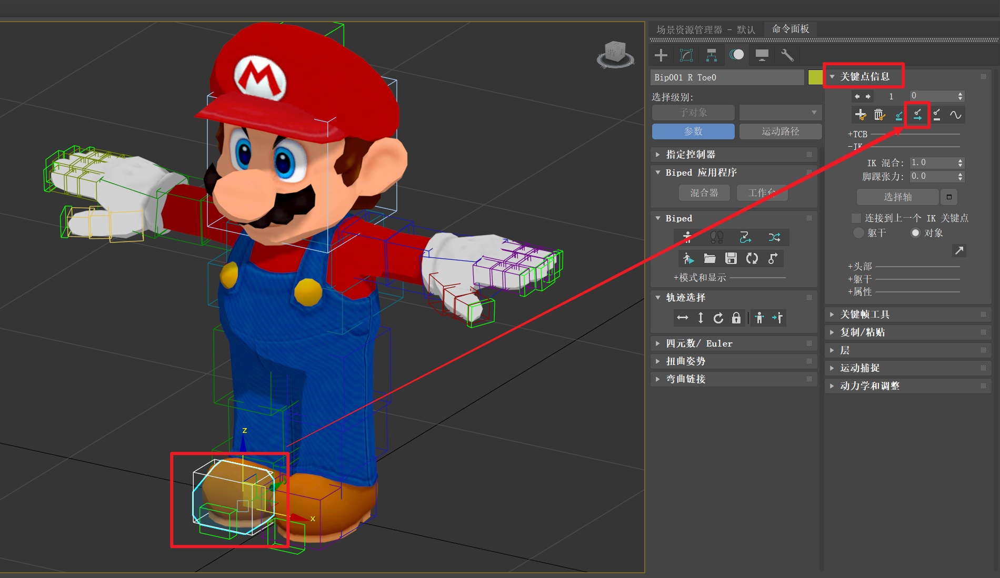

### 设置前后的对比GIF

> ### 前：
>
> 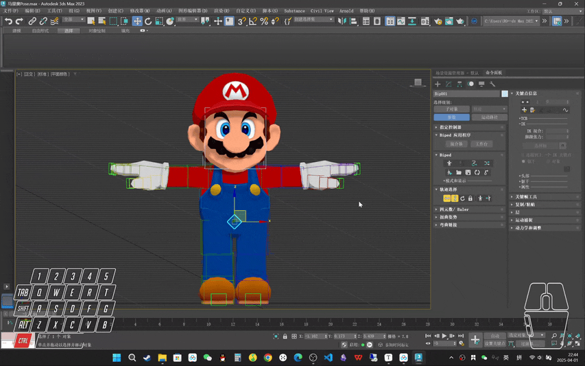
>
> ### 后：
>
> 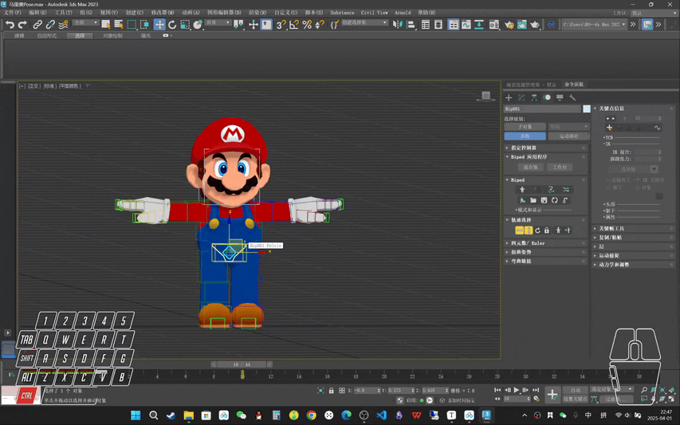

------

## 设置脚旋转轴心（滑动关键帧和旋转轴）

1. 滑动关键帧：用于在动画中保持关键帧的位置不变，常用于调整脚部的位置
2. 旋转轴：用于确定旋转时是脚跟、脚面还是脚尖在转动，常用于调整脚部的旋转。

> 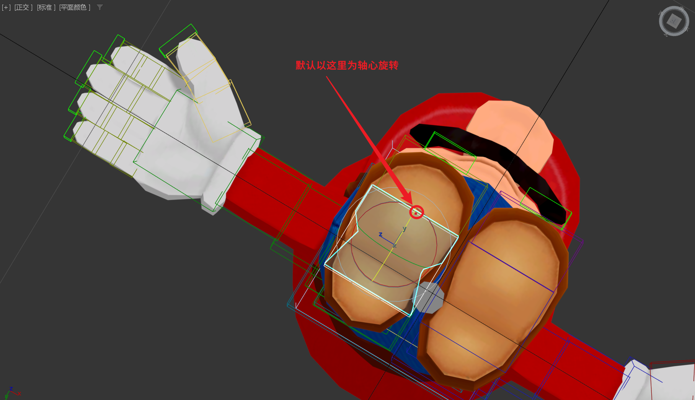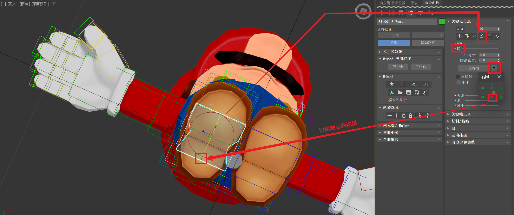

### 前后对比GIF

> 前：
>
> 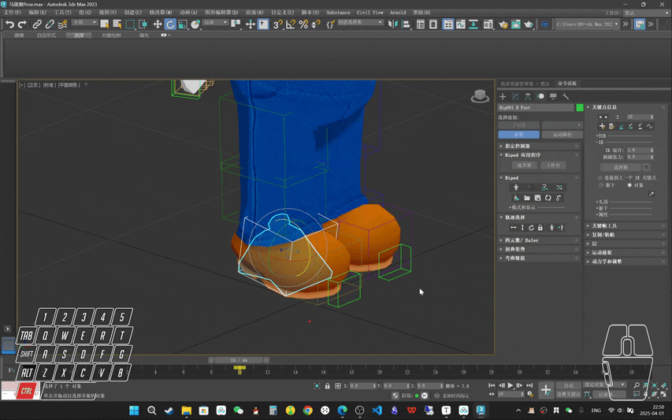
>
> 后：
>
> 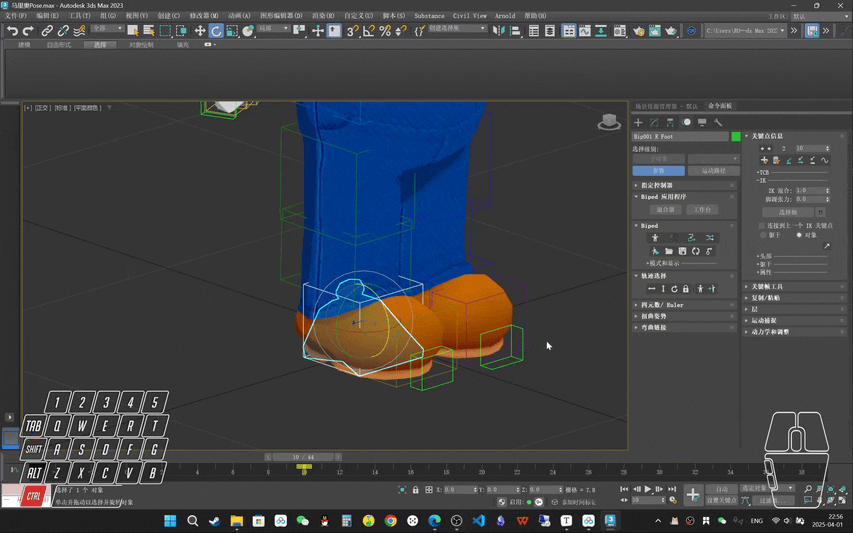

------

## 上半身动态线调整

> 1. 上半身动态线调整：根据大臂的运动调整胸腔和肩膀的位置和角度，使其更符合人体骨骼结构
> 2. 动态线：上半身向右边偏是因为大臂的向上和向内发力带动了胸腔和肩膀
> 3. 调整方法：通过转动上半身的多个轴向来调整动态线，使其更自然。

------

## 握拳姿势快速创建GIF

### `双击父节点`会同时选中所有包含的子节点

> 1. 握拳姿势快速创建：通过双击手掌选择所有子集，再简选大拇指来快速创建握拳姿势
> 2. 快捷键：利用快捷键双击和简选来快速选择子集，提高操作效率。
>
> 

------

## 反向粘贴功能

1. 反向粘贴：将左手的姿势复制并粘贴到右手，通过运动面板中的复制粘贴功能实现
2. 创建集合：首先需要创建一个集合，然后选择复制和反向粘贴选项
3. 操作方法：通过点击运动面板中的复制和反向粘贴按钮来执行操作。

> 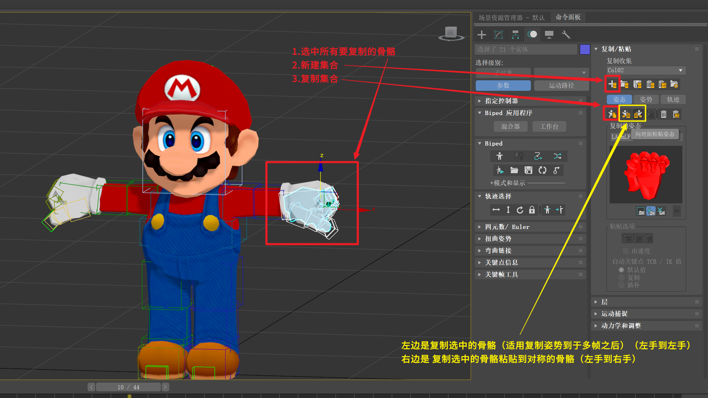

### GIF

> 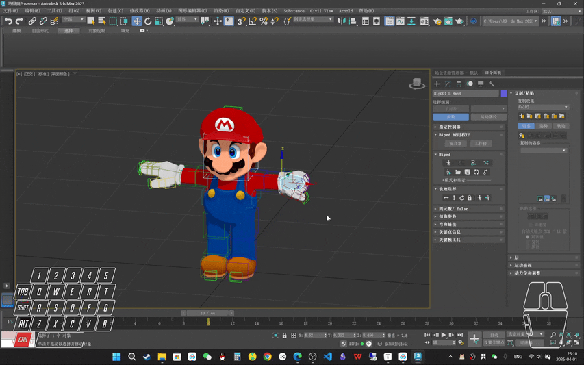

------

## 肩膀和手肘的调整

> 1. 肩膀调整：根据手臂的姿势调整肩膀的位置和角度，使其更符合人体骨骼结构
> 2. 手肘朝向：手肘朝前时基本冲前，手肘朝后时基本冲后
> 3. 手指方向：根据手肘的朝向调整手指的方向，使其更自然。

------
