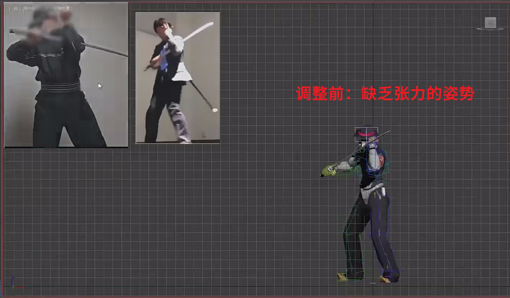
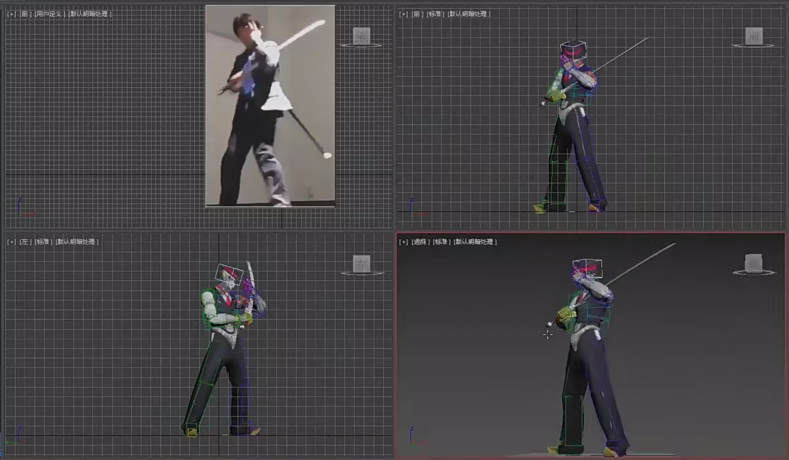

___________________________________________________________________________________________
###### [GoMenu](../3DMaxAnimationMenu.md)
___________________________________________________________________________________________
# 005_武士Pose姿势动态与张力的建议

___________________________________________________________________________________________

## 目录

[TOC]

------

## 武士角色姿势调整

1. 参考姿势调整：通过截图参考姿势，确定调整方向
2. 武器握持：确保武器刃口与手背平行，握持位置合适
3. 姿势优化：通过调整重心腿、旋转轴和胯部高度，优化姿势
4. 细节调整：包括手指状态、头部姿势和身体姿态。

------

## 姿势动态与张力

1. 动态线：通过动态线展示姿势的动态和重心
2. 重心转移：选择重心腿，确保胯部高度正确
3. 姿势张力：通过不对称和重心转移增加姿势张力

------

## 参考

> 

------
