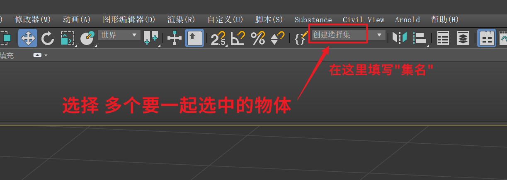
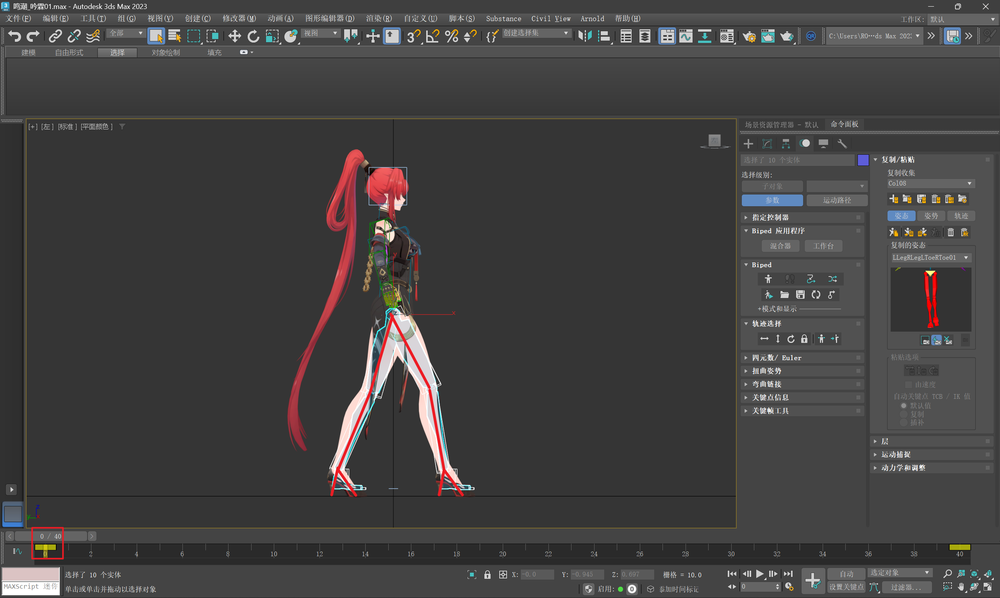
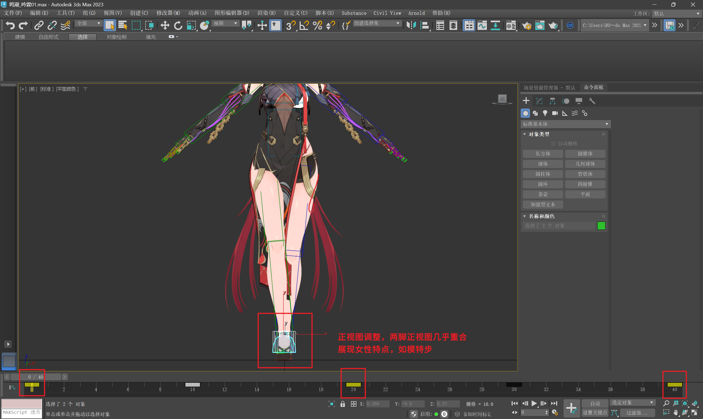
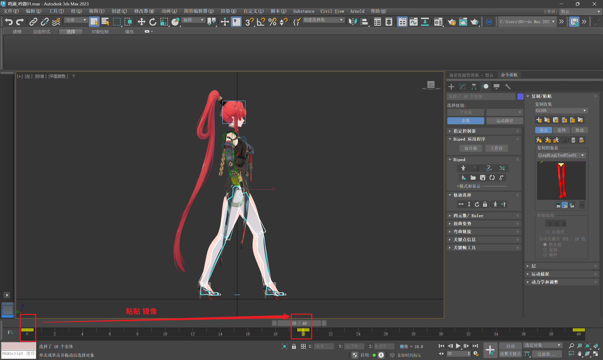
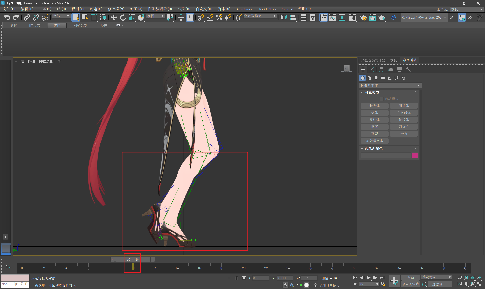
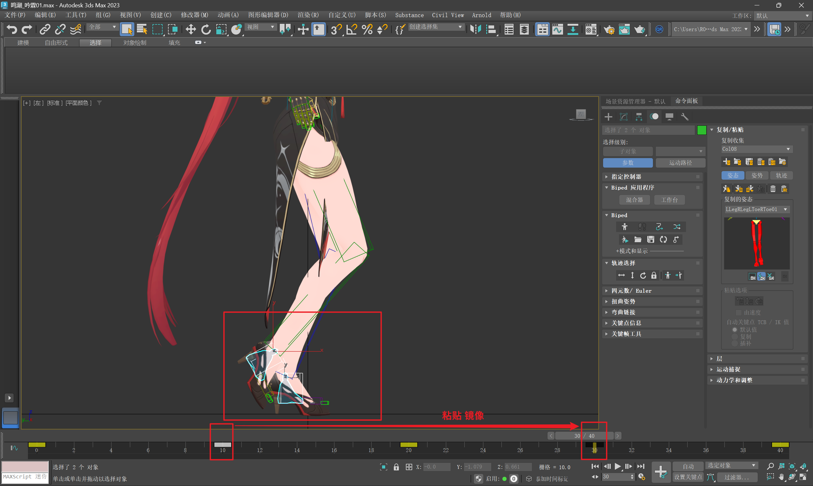
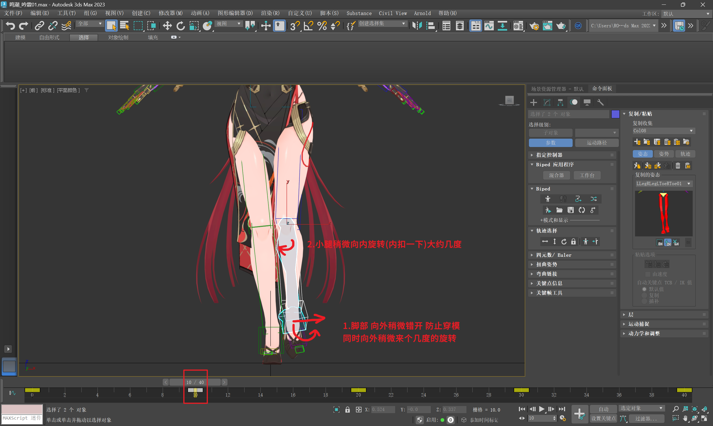

___________________________________________________________________________________________
###### [GoMenu](../3DMaxAnimationMenu.md)
___________________________________________________________________________________________
# 006_标题

___________________________________________________________________________________________

## 目录

[TOC]

------

## 骨骼分组与选择集

> 1. 创建选择集，快速选择头发和面部骨骼
> 2. 编辑选择集，重命名、添加或删除骨骼
> 3. 使用大纲视图创建层级，隐藏或显示骨骼
>
> 

------

## 女性角色基础处理

> 1. 打开骨骼`Biped`文件，删除待机动作，恢复基础姿势
> 2. 选择角色，删除所有动画，保留基础骨骼
> 3. 处理模型，隐藏不必要的骨骼，显示运动面板。

------

## 女性走路动画制作（1）

### 1.确定步幅，调整女性角色的步幅以适应动态线

> 1. 确定步幅，调整女性角色的步幅以适应动态线
> 2. 高跟鞋处理，高跟鞋情况下脚跟不着地
> 3. 正视图调整，两脚正视图几乎重合，展现女性特点，如模特步
> 4. 复制粘贴骨骼，快速制作反向走路动画。
>
> 

### 2.两脚交替的间帧（10帧左右）两脚错开、脚掌向外、小腿内扣

> 

------

> ### 以上大约完成了20%的走路部分

------

## 小标题

> 

------

## 小标题

> 

------

## 小标题

> 

------

## 小标题

> 

------

## 小标题

> 

------

## 小标题

> 

------

## 小标题

> 

------

## 小标题

> 

------

## 小标题

> 

------

## 小标题

> 

------

## 小标题

> 

------

## 小标题

> 

------

## 小标题

> 

------

## 小标题

> 

------

## 小标题

> 

------

## 小标题

> 

------

## 小标题

> 

------

## 小标题

> 

------

## 小标题

> 

------

## 小标题

> 

------

## 小标题

> 

------

## 小标题

> 

------

## 小标题

> 

------

## 小标题

> 

------

## 小标题

> 

------

## 小标题

> 

------

## 小标题

> 

------

## 小标题

> 

------

## 小标题

> 

------

## 小标题

> 

------

## 小标题

> 

------

## 小标题

> 

------

## 小标题

> 

------

## 小标题

> 

------

## 小标题

> 

------

## 小标题

> 

------

## 小标题

> 

------

## 小标题

> 

------

## 小标题

> 

------

## 小标题

> 

------

## 小标题

> 

------

## 小标题

> 

------

## 小标题

> 

------

## 小标题

> 

------

## 小标题

> 

------

## 小标题

> 

------

## 小标题

> 

------

## 小标题

> 

------

## 小标题

> 

------

## 小标题

> 

------

## 小标题

> 

------

## 小标题

> 

------

## 小标题

> 

------

## 小标题

> 

------

## 小标题

> 

------

## 小标题

> 

------

## 小标题

> 

------

## 小标题

> 

------

## 小标题

> 

------

## 小标题

> 

------

## 小标题

> 

------

## 小标题

> 

------

## 小标题

> 

------

## 小标题

> 

------

## 小标题

> 

------

## 小标题

> 

------

## 小标题

> 

------

## 小标题

> 

------

## 小标题

> 

------

## 小标题

> 

------

## 小标题

> 

------

## 小标题

> 

------

## 小标题

> 

------

## 小标题

> 

------

## 小标题

> 

------
