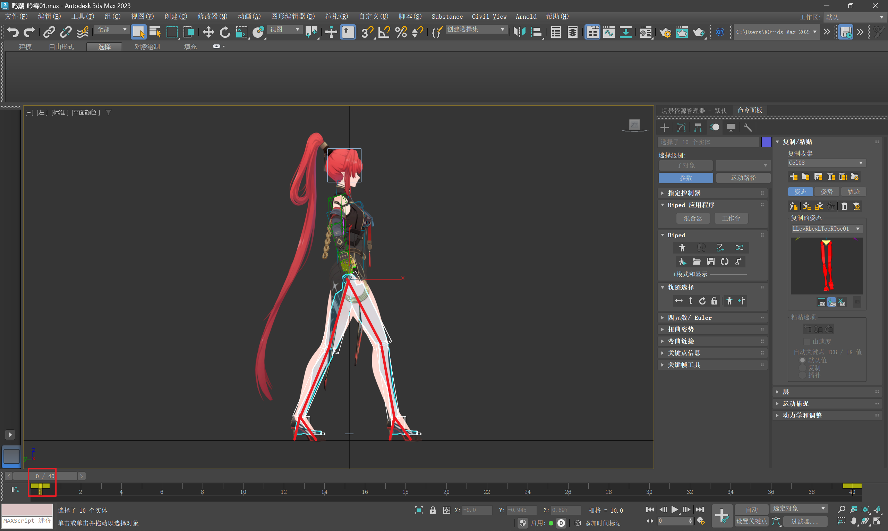
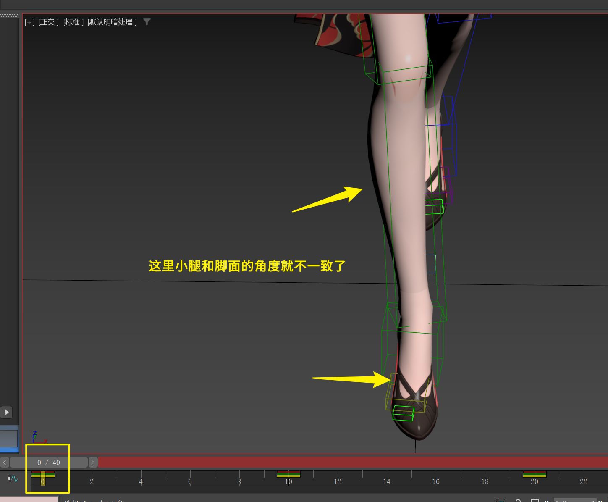

___________________________________________________________________________________________
###### [GoMenu](../3DMaxAnimationMenu.md)
___________________________________________________________________________________________
# 007_女性走路动画 步骤拆解（1）

___________________________________________________________________________________________

## 目录

[TOC]

------

## 骨骼分组、使用选择集

> 1. 创建选择集，快速选择头发和面部骨骼
> 2. 编辑选择集，重命名、添加或删除骨骼
> 3. 使用大纲视图创建层级，隐藏或显示骨骼
>
> 

------

## 使用角度捕捉工具

> 

------

## 女性角色基础处理

### 男女行走的区别GIF

> 1. 打开骨骼`Biped`文件，删除待机动作，恢复基础姿势
> 2. 选择角色，删除所有动画，保留基础骨骼
> 3. 处理模型，隐藏不必要的骨骼，显示运动面板。
>
> 

------

## ！！！卡负一帧以防止晃动！！！

> 注意一下，因为运动是max自动计算的间帧，所以`前后的帧`与`关键帧`之间的变化会影响到关键帧之间的运动曲线解决办法就是在前后多卡一帧，也就是

------

## 女性走路动画制作（1）

### 1.确定步幅，调整女性角色的步幅以适应动态线

1. 确定步幅，调整女性角色的步幅以适应动态线
2. 高跟鞋处理，高跟鞋情况下脚跟不着地
3. 正视图调整，两脚正视图几乎重合，展现女性特点，如模特步
4. 复制粘贴骨骼，快速制作反向走路动画。

#### 步幅确定的重要性

> 1. 步幅的确定对于动画的流畅性和准确性至关重要
> 2. 步幅确定的步骤：在第十帧确定步幅，确保第零帧的步幅与第十帧一致
> 3. 避免常见错误：避免步幅不一致导致的动画不自然。
>
> 

> 

### 2.两脚交替的间帧（10帧左右）两脚错开、脚掌向外、小腿内扣

> 

------

> ### 以上大约完成了20%的走路部分

------

### 3.盆骨位移和旋转

1. 位移：包括轴向位移和前后位移，与男性角色的位移基本相同
2. 旋转：包括顶视图和侧视图的旋转，女性角色的旋转幅度通常比男性更大
3. 关键帧设置：通过设置关键帧来控制位移和旋转，中间帧通过软件计算得到。

#### 位移：（需要注意腿预留一些余地，不要绷直了！）（先不调左右位移，留着后面调整）

> 
>
> |                  |      |          |      |          |      |
> | :--------------: | :--: | :------: | :--: | :------: | :--: |
> | 盆骨重心偏移方向 |  -   | 向斜后方 |  -   | 向斜后方 |  -   |
> |       帧数       |  0   |    10    |  20  |    30    |  40  |
>
> 

------

#### 旋转盆骨：弓身、转胯、顶跨

- 幅度大于男性

##### 全程弓身的旋转`8度左右`

> 

##### 盆骨（胯部）转身，通过K帧实现滞后感

1. 加减速原理：腿带动屁股走，中间帧需要加减速来表现动作的自然性
2. 加减速方法：通过调整中间帧的旋转速度来模拟腿带动屁股的效果

> |          |         | 为了产生滞后感[^1] |          | 为了产生滞后感[^1] |         |
> | -------- | ------- | ------------------ | -------- | ------------------ | ------- |
> | 胯部旋转 | 12°左右 | 6°左右             | -12°左右 | -6°左右            | 12°左右 |
> | 帧数     | 0       | 10                 | 20       | 30                 | 40      |
>
> 看一下曲线：
>
> 
>
> 

##### 腿部撑地时的顶跨旋转`8度左右`

1. 原理：脚刚落地时，胯部会被顶起，这是由于腿的动量传递
2. 观察参考：通过观察模特走路的动作，可以发现胯部的顶起现象
3. 具体操作：在脚刚落地时，调整胯部的旋转，使其符合自然动作

># 先处理`重心偏向悬空脚造成的旋转`：参考下图
>
>- **10帧**
>- **30帧**
>
>### 然后再处理`落地脚撑地造成的胯部旋转`：参考下图
>
>- **0帧**
>- **20帧**
>- **40帧**
>
>|                      | 单腿支撑时的胯部顶起                                         | 重心偏向悬空脚造成的旋转                                     | 单腿支撑时的胯部顶起                                         | 重心偏向悬空脚造成的旋转                                     | 单腿支撑时的胯部顶起                                         |
>| -------------------- | ------------------------------------------------------------ | ------------------------------------------------------------ | ------------------------------------------------------------ | ------------------------------------------------------------ | ------------------------------------------------------------ |
>| 脚撑地造成的盆骨旋转 | -6°左右                                                      | 8°左右                                                       | 6°左右                                                       | -8°左右                                                      | -6°左右                                                      |
>| 帧数                 | 0                                                            | 10                                                           | 20                                                           | 30                                                           | 40                                                           |
>| 示例图               |  |  |  |  |  |
>
>

------

### 4.重新梳理腿部关系（因为动了盆骨）：`外张内扣`、`步幅`、`腿弯曲程度`

| 因为修改了盆骨，看是否需要恢复一下的部分： | 调整方向：                           |
| :----------------------------------------- | :----------------------------------- |
| 外张内扣                                   | 之前在10帧和30帧微调过小腿内扣角度   |
| 步幅                                       | 适当                                 |
| 腿弯曲程度                                 | 后腿需要尽可能打直，又不要太直。。。 |

> ### 外张内扣（小腿与脚面角度一致）（脚跟方向顺着小腿方向）
>
> 
>
> 
>
> 
>
> 

------
## 存档备份
> [3DMaxAnimationv007.zip](Save\3DMaxAnimationv007.zip)

------

[^1]: 人物走路是腿带动盆骨也就是胯部转向，所以走路时腿部带动的屁股，转向速度会略微滞后
