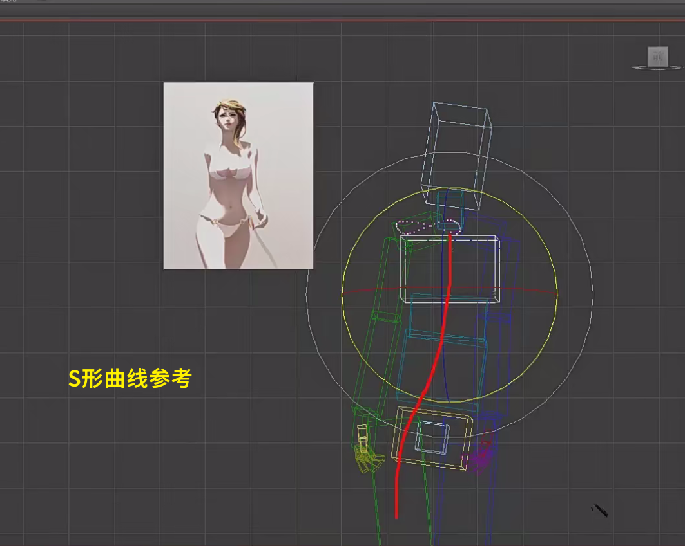
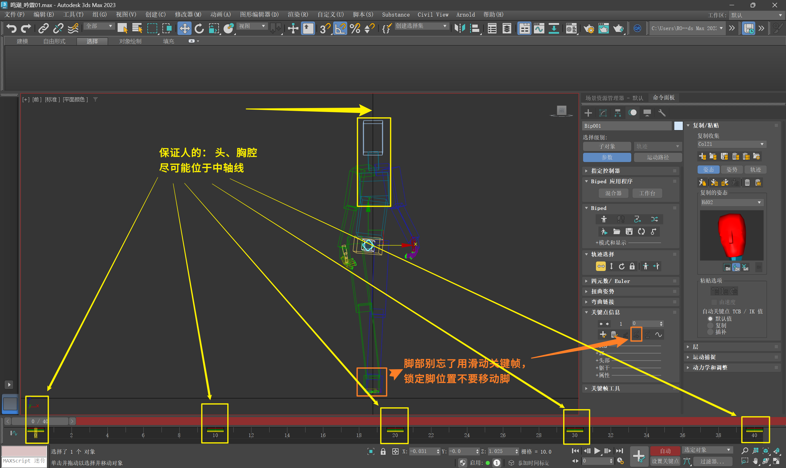
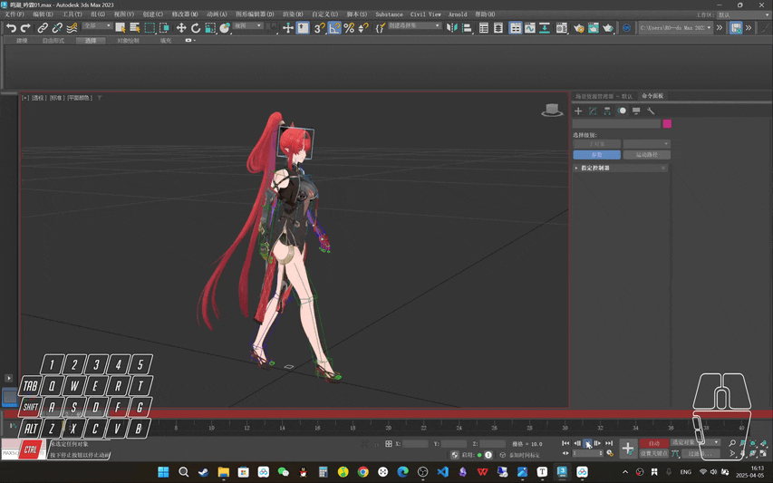

___________________________________________________________________________________________
###### [GoMenu](../3DMaxAnimationMenu.md)
___________________________________________________________________________________________
# 008_女性走路动画 步骤拆解（2）

___________________________________________________________________________________________

## 目录

[TOC]

------

> - 接下来的部分，女性和男性区别比较大
>
> - 接下来处理女性的上半身的基础动画

------

## `Shift+G`隐藏、显示模型

------

## 女性上半身动画

1. 女性走路特点：上半身稳定，臀部扭动。
2. 调整手指头动画，使其更加自然
3. 一前一后的基础姿势，手臂略弯曲，肩膀稍前
4. 手肘内扣的特点，使动作更加女性化。

### 手臂前后摆动

大臂摆动范围不要太大

> 

### 大臂向身体内侧旋转，朝向身体外侧`0帧`、`40帧`

> `20帧`镜像
>
> 

------

### 细化手指（放松状态）

> 自己的手放松下垂，观察一下，复刻pose
>
> 
>
> 镜像到另一侧

------

> ## 目前的胳膊有一些穿帮，后面再调整，重要的是：做出一前一后的动态，方便调整上半身（胸腔的旋转）和盆骨位置

------

### 上半身旋转：

#### 上半身的`X轴`的旋转

**X轴旋转：哪个胳膊在前，哪边的胸腔往前转**

##### （盆骨到肩膀之间的部分）角度几乎转正或超过一点点

这里视模型骨骼绑定而定，老师这个是3节，我这个就是2节

> 

##### 之前在第`10帧`做了胯部滞后，人的运动需要上半身加速带动胯部旋转，所以这里要K一个加速的帧（可以稍微超过一点，不然和下一帧没区别）（也需要检查下是否摆正上半身胸腔）

> [之前的链接](./3DMaxAnimationv007.md#盆骨（胯部）转身，通过K帧实现滞后感)
>
> K一个加速的帧：
>
> ## 也需要检查下是否摆正上半身胸腔！！！

------

#### 上半身的`Y轴`的旋转（最重要的轴）

> 可以稍微超一点（**让S形曲线更明显**）
>
> 

------

### 摆正头部（不要左右摇头，几乎正视前方）

> 

------

## 移动质心（盆骨）保证头和胸腔几乎在中轴线上

> 

------

## 此阶段效果GIF（基本上可以看出大致效果）

> 

------
