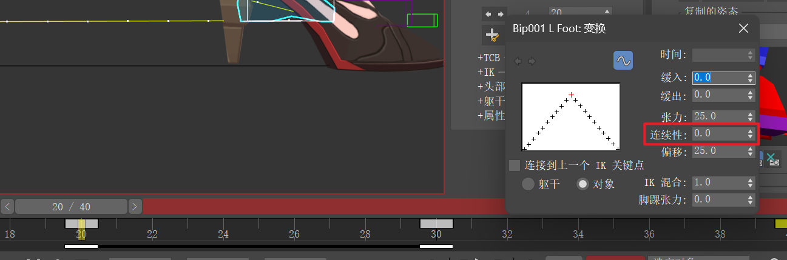
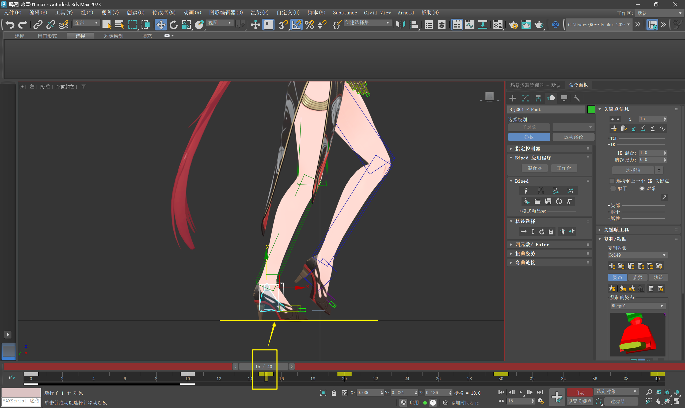
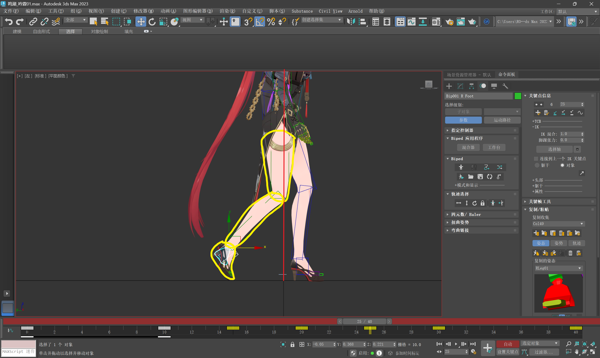

___________________________________________________________________________________________
###### [GoMenu](../3DMaxAnimationMenu.md)
___________________________________________________________________________________________
# 009_女性高跟鞋走路动画 步骤拆解（3）

___________________________________________________________________________________________

## 目录

[TOC]

------

## 侧视图的前倾后仰

> 保留当前挺胸的同时，稍微加一些变化
>
> |      | S曲线再明显一点 | 按默认即可 | S曲线再明显一点 | 按默认即可 | S曲线再明显一点 |
> | ---- | --------------- | ---------- | --------------- | ---------- | --------------- |
> | 帧数 | 0               | 10         | 20              | 30         | 40              |
>
> 如图:使用局部坐标调整了上半身的三根骨骼之后头和脖子，有较大移位(之前的工作白搞了)

### 0帧稍微多一些S曲线，10帧正常曲线不用动（推荐使用世界坐标调整，因为再用局部会影响到之前调整的脖子和头）

前两节向后转上半身最后一节将整体几乎转回原有的角度

保证了胸腔有一些变化

> ### 可以在修改前使用立方体标记头部原位置保证不会出现较大移位

------

## 当前版本（简单女性高跟鞋版本）就不做中间帧了，后续再学更复杂的，其他鞋子看后面的笔记

------

## 腿部过渡

> Max自动计算了圆滑的过程，导致脚会和地面穿可以看到并不是直线

### 不让Max计算中间过程（连续性归零）

> 

------

### 脚部几个`重要过渡关键帧`

#### `15帧`的`脚部踏实地面`（最接近伸直的一帧）

但不要完全绷直，留一点余地

> 

------

### `25帧`的`脚部向后旋转和位移`（移动程度：动态线向后）

> 

------

### `30帧`的`检查脚部角度淡入淡出`

> 

------

### `35帧`的`脚部多甩一点`（比自动计算的关键帧稍微多一些）

> 

------

## 检查曲线是否圆滑、走路是否别扭

> 

------

### `0帧`和`4帧`加一些旋转（准备踏实和踏实）

> 

------

## 接下来处理 后脚绕开前脚的动画

### `25帧`跟随的动画

> 因为小腿先动，带动脚掌运动此时脚还没跟上小腿（需要将脚掌向内，脚踝转向外侧）
>
> 

------

### `35帧`脚甩过来马上踩到地面

> 

#### `35帧`粘到`15帧`

------

## 看一下这几帧的对应关系

> | 帧   | 25   | 30   | 35   |
> | ---- | ---- | ---- | ---- |
> | 帧   | 5    | 10   | 15   |

## 空中的帧，变成自由帧

> 两只脚都需要处理
>
> 

------

## 这样下半身就搞定了GIF，接下来处理上半身

> 

------

## 上半身

### 身后的大臂再向内收一收、手肘再内扣些

另一侧看一下动画，也不要运动幅度太小，可以稍微加大一点幅度

> 
>
> 
>
> ### 可以看到还有一点穿模

------

## 处理一下手臂的跟随动画

### 先调一只手

#### `10帧`和`30帧`让小臂稍微落后于大臂

> 

### 别让手和屁股穿模的前提下调整一下大臂向外的幅度

> 看一下左侧是调整后的，右侧一点都没调整
>
> 

------

### 0帧加一些手腕内扣

> 

------

### 加强手向后甩的感觉

#### 在`5帧`和`25帧`让小臂和手腕跟不上大臂的运动

> 

#### 粘给另一只手

------

## 别忘了全选骨骼卡一下`-1帧`和`41帧`

------

## 隐藏骨骼

> 

------

## 完成GIF

> 

------

## 存档备份

> [3DMaxAnimationv009.zip](Save\3DMaxAnimationv009.zip) 

------
