___________________________________________________________________________________________
###### [GoMenu](../3DMaxBasicsMenu.md)
___________________________________________________________________________________________
# 2007次世代生存笔记

------

[TOC]

------

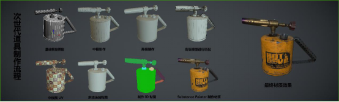

------

## 多边形建模技巧

> Bend 弯曲  选择对的轴向调整弯曲角度。如果XYZ都不是想要的这个时候在调整90在重新试。
>
> 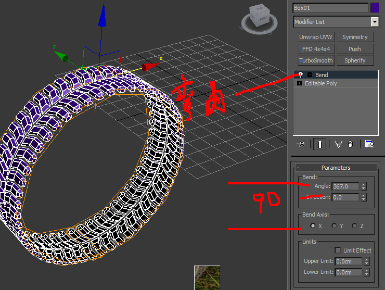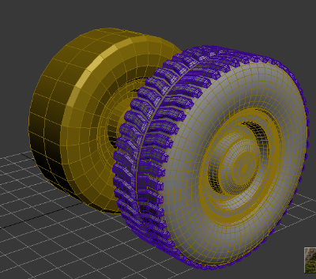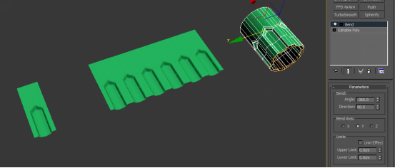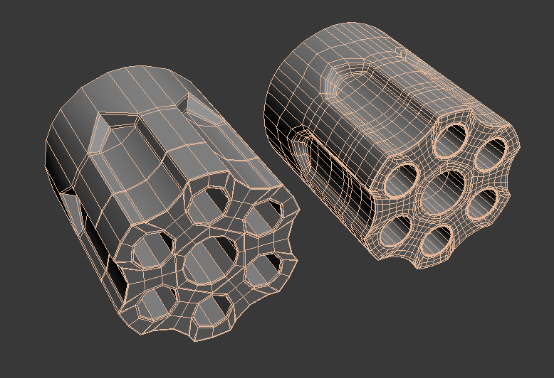

------

### 球型化：

> 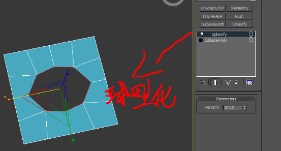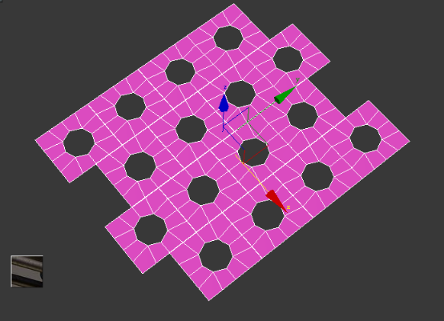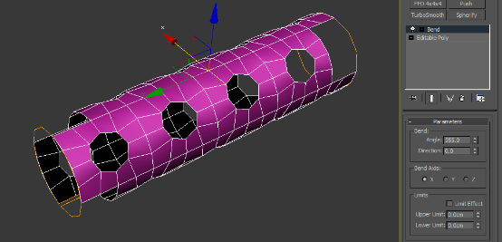

------

### 布尔运算：

> 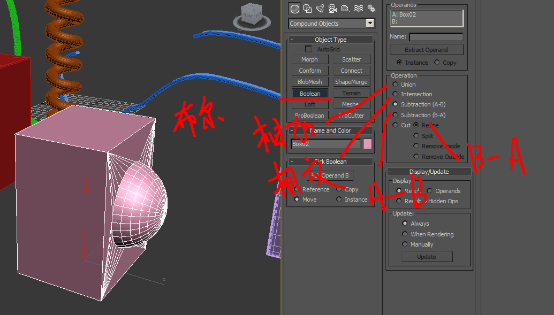

------

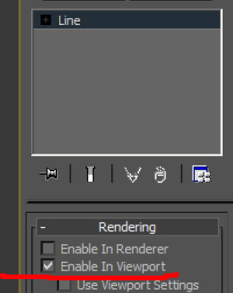

线显示模型

低于1厘米的小结构可以不在低模做。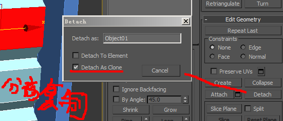

------

### 锁边

> 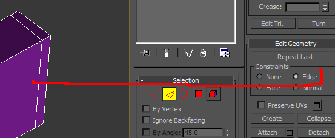

------

### 螺旋线

> 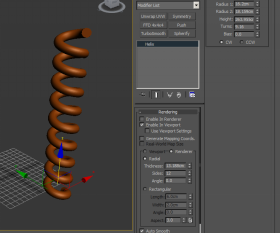

------

### 放样工具

> 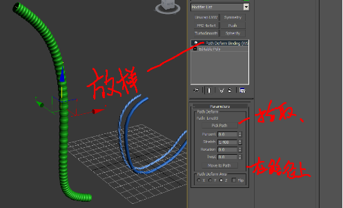

------

### 层

> 

------

### 桥接命令：

> 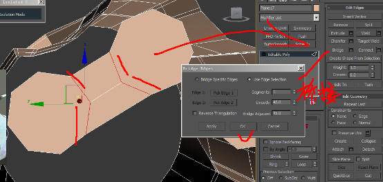

------

### 坦克履带 思路2种：

#### 1、低模面熟比较节省，再去做高模卡线烘在上面。

> 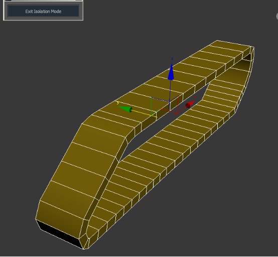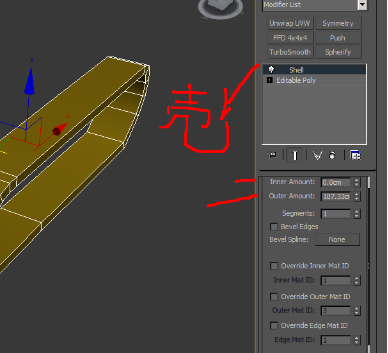

#### 2、只做一节履带，得到法线后再去用路径约束，复制出所有的。复制后再合并所有模型不要合并线，再分离复制一份，才可以调整位置。

> 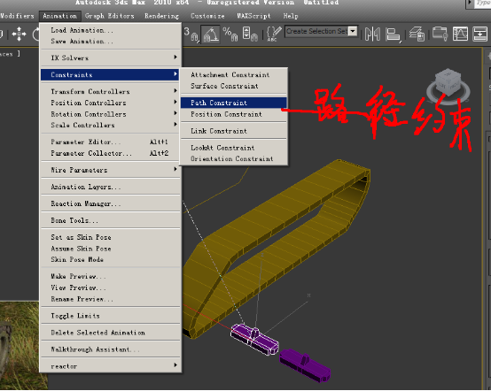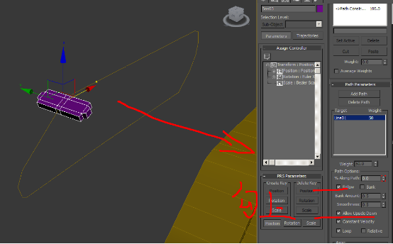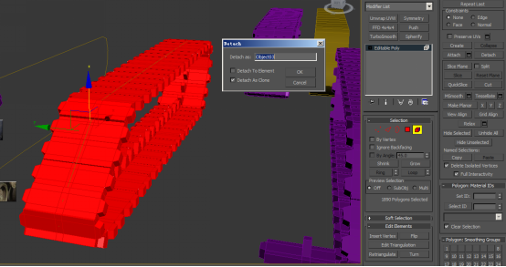

------

### 石头流程

> 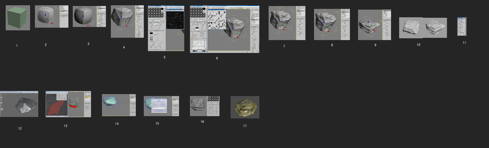

------

## 高低模匹配三要素:

1. 高低模匹配度
2. 光滑组区分是否正确
3. UV是否断开，UV展好没有拉伸和UV边界是否重叠。

### 光滑组：小于等于90度的面要分开光滑组，UV也要断开，并且移开一到两个像素。

#### 注意事项1:90度或者小于90度没有分开光滑组，低模效果不正确。

> 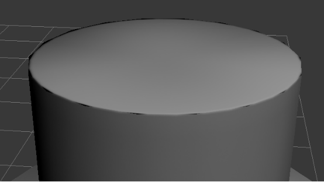

#### 注意事项2，光滑组分开,uv没有断开移开，不正确。

> 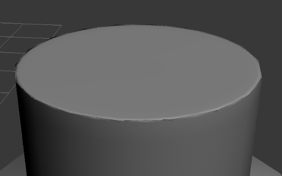

------

## 一、3Dmax烘焙法线

### 烘法线快捷键:0

> 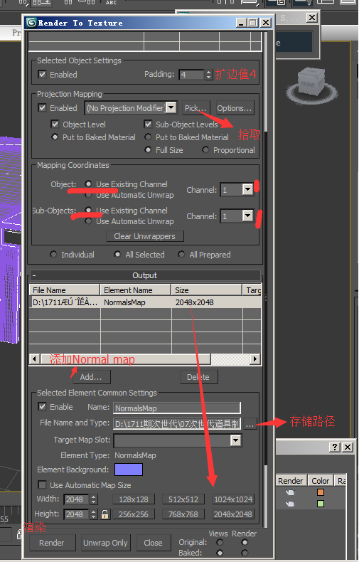

------

### 包裹器设置

> 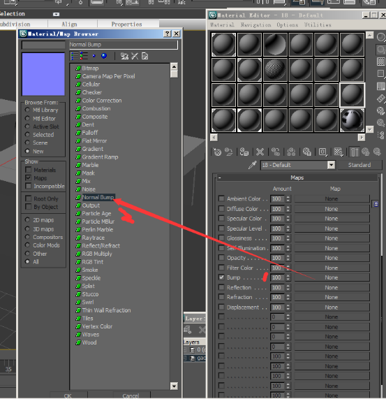

------

### 显示选择高级显示（也叫实时显示）

> 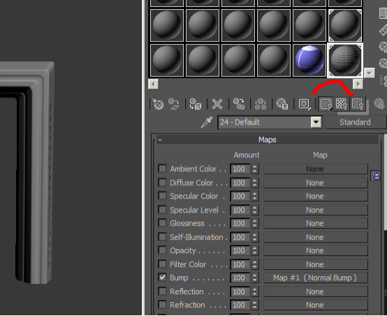

------

## 二、Substance Painter  烘法线

### 首先要在max把模型分开:

> 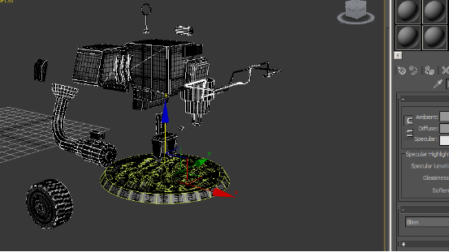

### 低模合并在一起，赋予一个新的材质球，高模不用合并在一起，也给一个新的材质球，分别导出低模和高模。

### 打开Substance Painter  导入低模后期可以添加其他贴图进来。

> 这里我只是先在这把法线图烘焙出来。
>
> 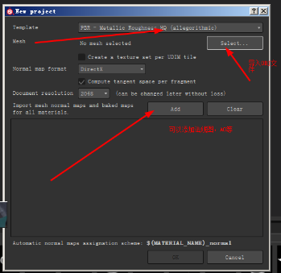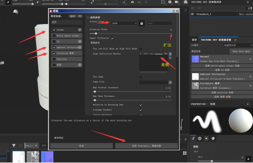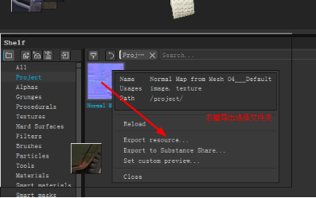
>
> ### 导出法线图回到max里把有问题的地方单独从新烘焙，在合并在一张法线图上即可。

------

## 八猴展示

> 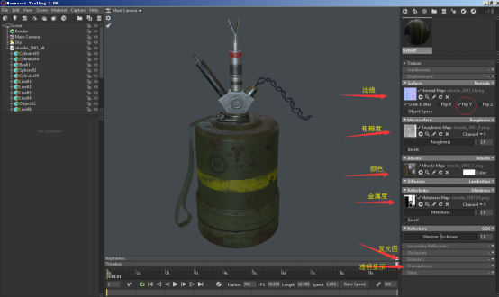

------

## 三、八候烘焙法线：

> 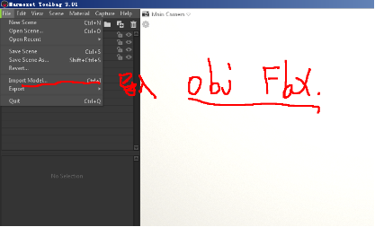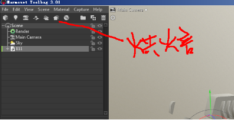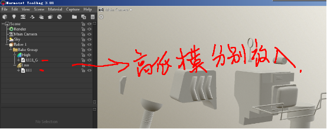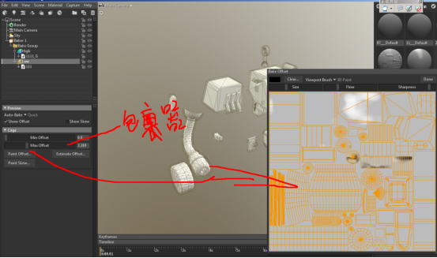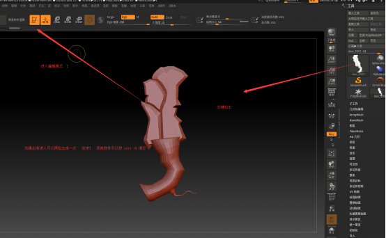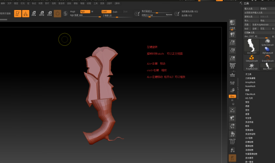
>
> ## F 键模型居中

------

## 室内人

四边形切角工具可以选择好要卡线的结构边，进行切角，也可以分好光滑组，去切角。

> 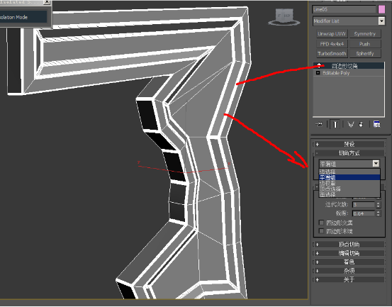

------

## ZB遮罩制作花纹

> 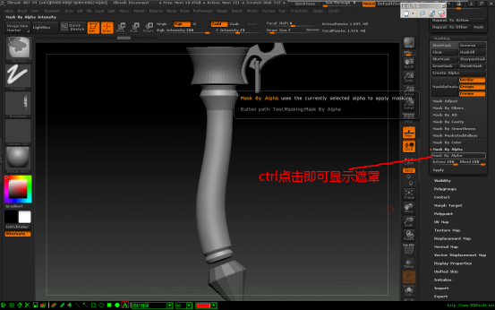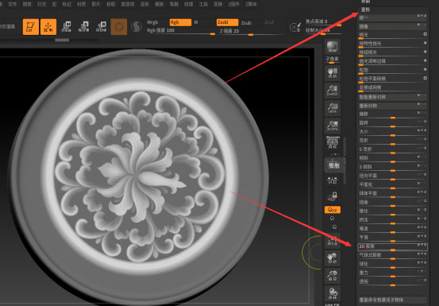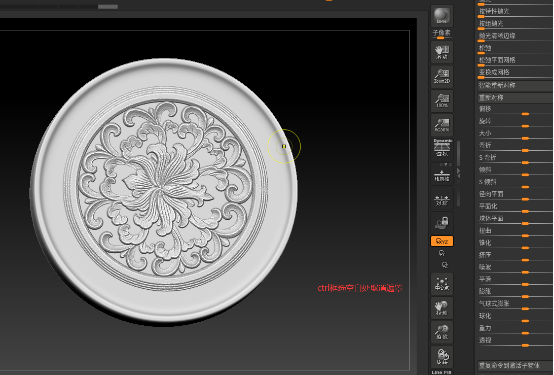

------

## 拓补插件安装

> 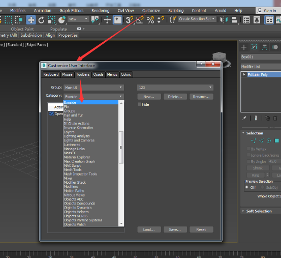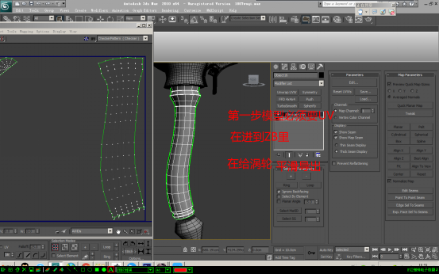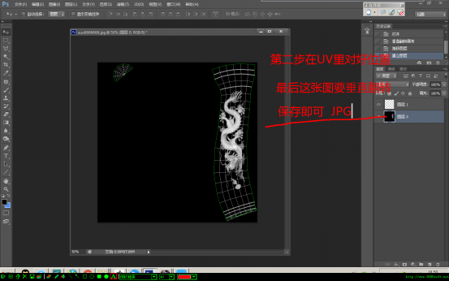

------

## 提交文件前,寻找路径里的贴图

> 提交文件，先max文件和贴图放在一个文件夹里，然后贴图好图，点击刷新在按Shift+T  寻找路径里的贴图。
>
> 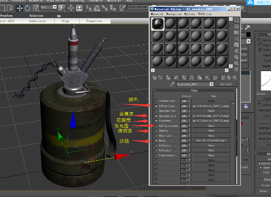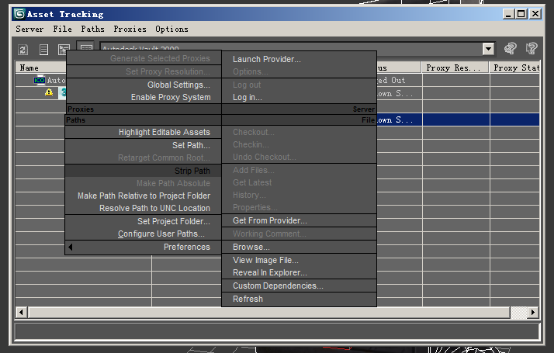
>
> 
>
> 点击寻找路径贴图上
>
> 在保存一下max文件。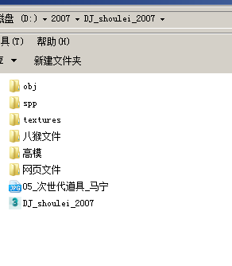

------

## 要提交的文件

> 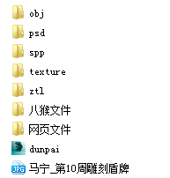