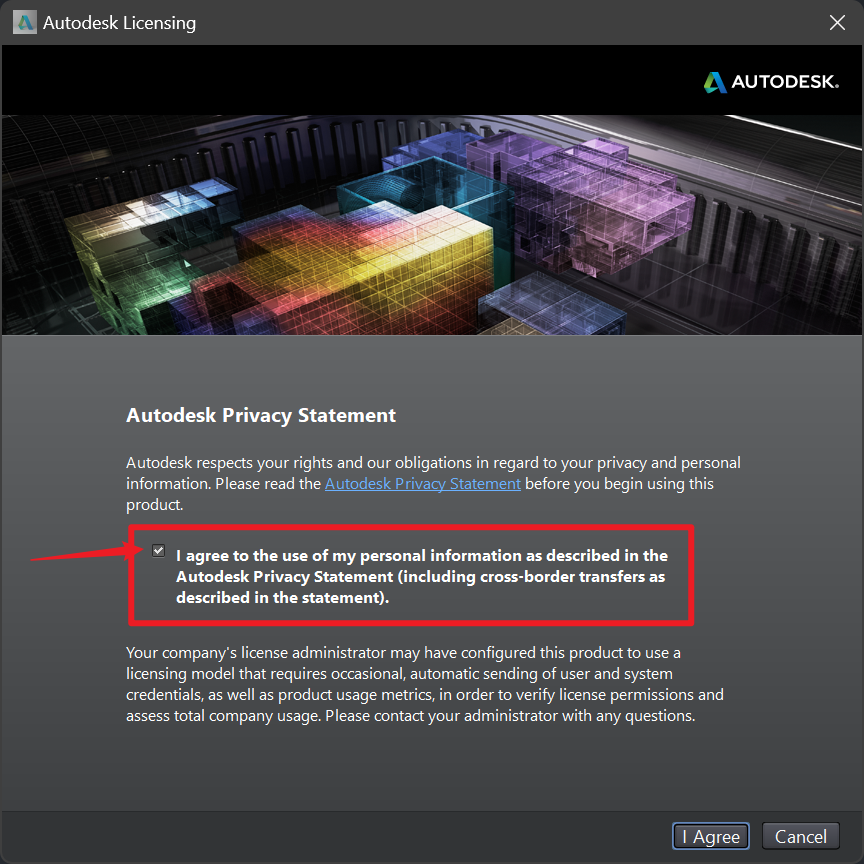
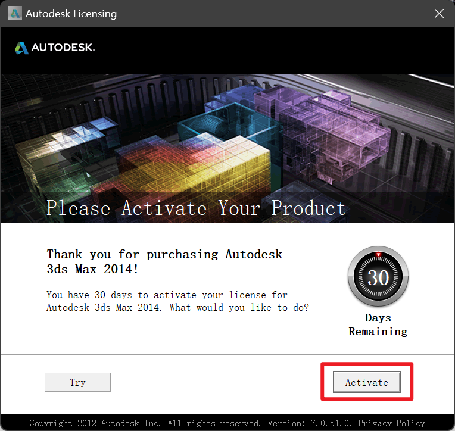
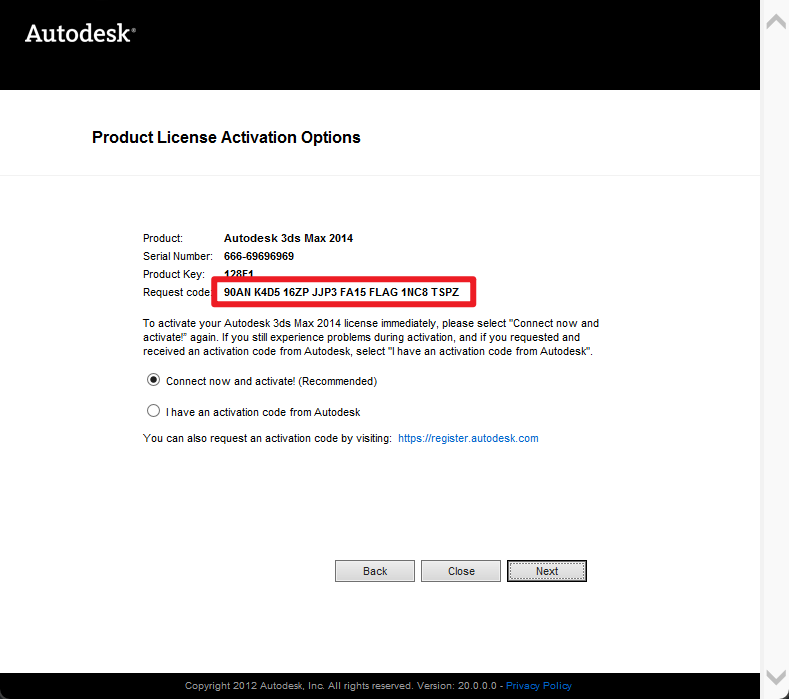
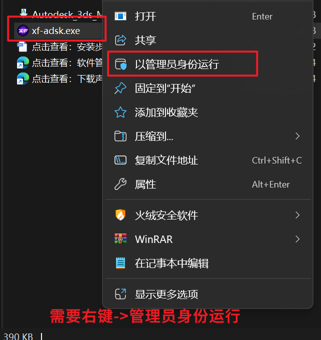
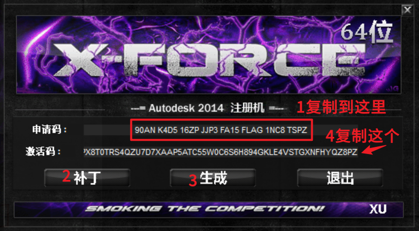
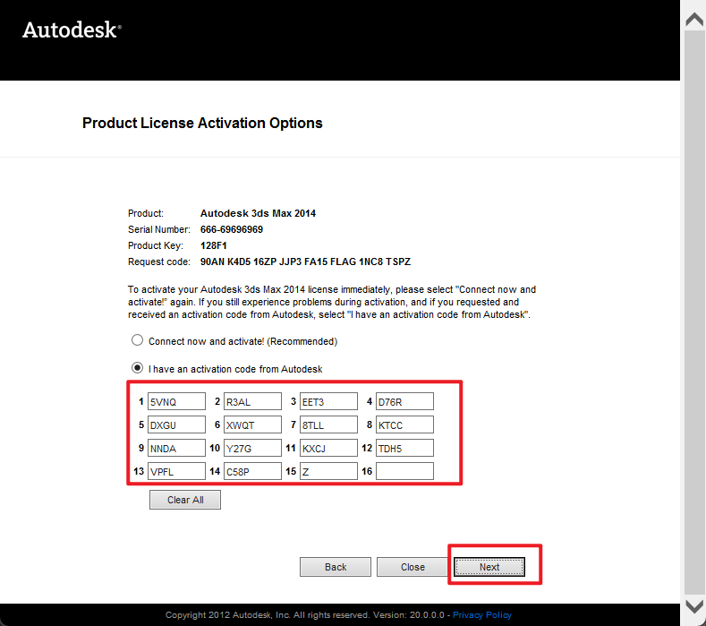
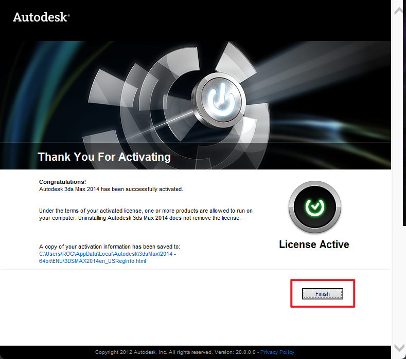
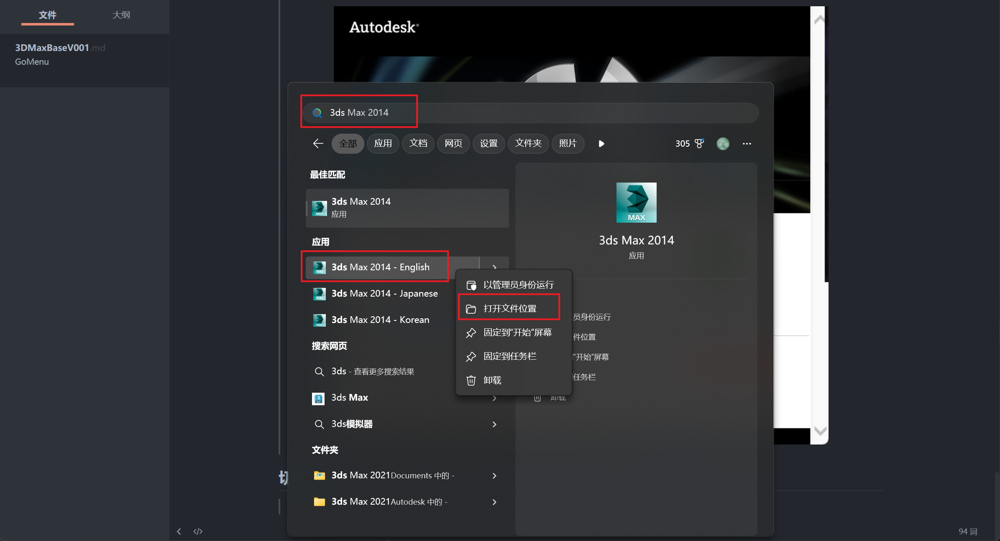
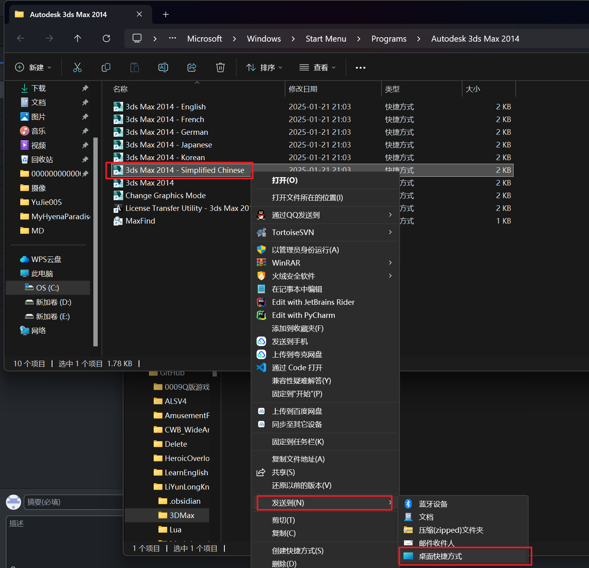

___________________________________________________________________________________________
###### [GoMenu](../3DMaxBasicsMenu.md)
___________________________________________________________________________________________
# 001_3DMax安装


___________________________________________________________________________________________


## 目录

[TOC]


___________________________________________________________________________________________

## 3DsMax破解

### 1.输入序列号

> 

``````
序列号:666-69696969
产品密钥:128F1
``````

------

### 2.勾上 同意

此阶段最好断网！

> 

------

### 3.点击激活

> 

------

### 4.输入申请号到破解软件

> 

------

### 5.完成安装

> 

## 切换中文

> - 搜索3ds
>
> 

### 发送到桌面快捷方式

> 