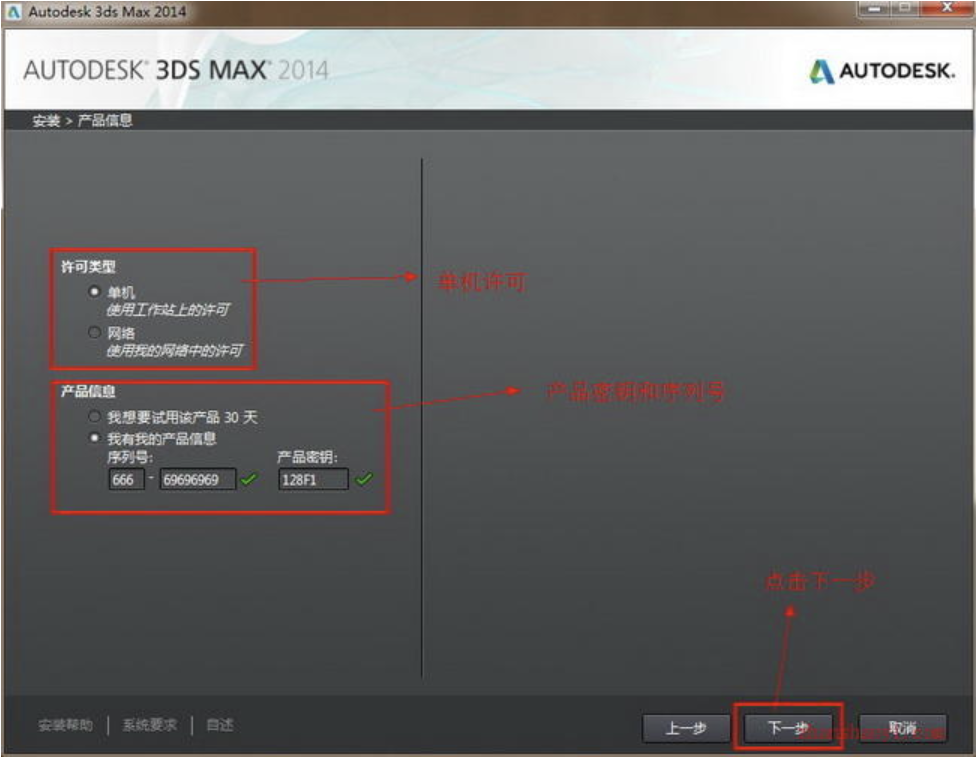

___________________________________________________________________________________________
###### [GoMenu](../3DMaxBasicsMenu.md)
___________________________________________________________________________________________
# 001_3DMax安装


___________________________________________________________________________________________


## 目录

- [001\_3DMax安装](#001_3dmax安装)
  - [目录](#目录)
  - [3DsMax破解](#3dsmax破解)
    - [1.输入序列号](#1输入序列号)
    - [2.勾上 同意](#2勾上-同意)
    - [3.点击激活](#3点击激活)
    - [4.输入申请号到破解软件](#4输入申请号到破解软件)
    - [5.完成安装](#5完成安装)
  - [切换中文](#切换中文)
    - [发送到桌面快捷方式](#发送到桌面快捷方式)


___________________________________________________________________________________________

## 3DsMax破解

### 1.输入序列号

> 

``````
序列号:666-69696969
产品密钥:128F1
``````

------

### 2.勾上 同意

此阶段最好断网！

> 

------

### 3.点击激活

> 

------

### 4.输入申请号到破解软件

> 

------

### 5.完成安装

> 

## 切换中文

> - 搜索3ds
>
> 

### 发送到桌面快捷方式

> 