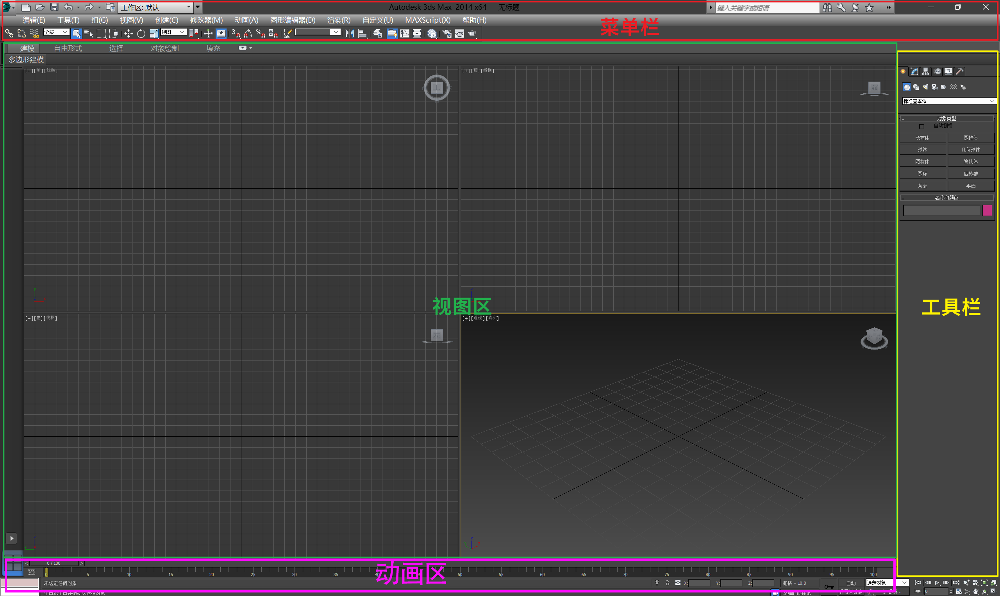
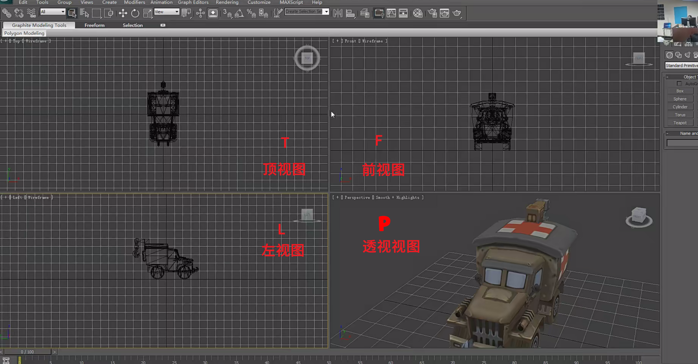
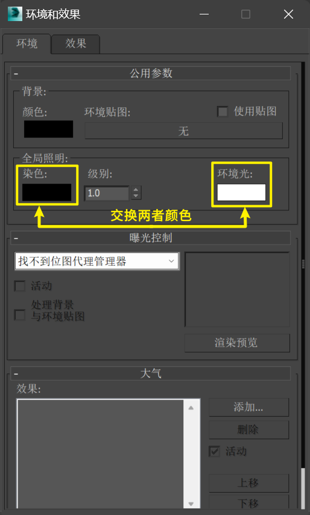
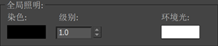
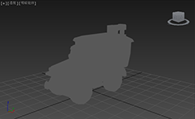
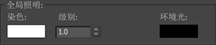
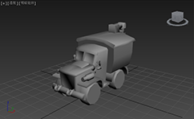

___________________________________________________________________________________________
###### [GoMenu](../3DMaxBasicsMenu.md)
___________________________________________________________________________________________
# 002_标题

___________________________________________________________________________________________

## 目录

[TOC]

------

## 1.界面 和视图介绍

> 

------

> 导入模型  [点这里打开小汽车模型](部分课件\3DMaxBaseV001\qiche.max) 

------

## 2.Max基础操作  10多个 [ 多边形命令 ]

> 
>
> | 视图：     | 快捷键 |                          |
> | ---------- | :----: | ------------------------ |
> | 顶视图 | `T` | 辅助视图（尽量不要旋转） |
> | 左视图 | `L` | 辅助视图（尽量不要旋转） |
> | 前视图 | `F` | 辅助视图（尽量不要旋转） |
> | 透视图 | `P` | **操作视图**             |
>
> | 功能                       |       快捷键       |                                              |
> | :------------------------- | :----------------: | -------------------------------------------- |
> | 视图**最大化 **/ **还原**  |    `Alt` + `W`     | 需要先**点击激活视图** 或 **鼠标放在该视口** |
> | 移动 视图                  |     `鼠标中键`     |                                              |
> | 旋转视图                   | `Alt` + `鼠标中键` |                                              |
> | 缩放视图                   |     `鼠标滚轮`     |                                              |
> | 选中的物体居中显示适配视口 |        `Z`         |                                              |
>

### 辅助视图默认为线框显示

> | 显示模式：                               | 快捷键 |                                                              |
> | :--------------------------------------- | :----: | ------------------------------------------------------------ |
> | **[ 线框 ]** 模式                        |  `F3`  | 按下后：切换 **[ 线框 ]** ； 再按：还原                      |
> | **[ 线框 + 实体 ]** 模式                 |  `F4`  | 按下后：切换 **[ 线框 + 贴图 ]** ； 再按：还原               |
> | **[ 平光 ]** 模式 / **[ 光影 ]** 模式 下 |  `8`   | [下面介绍 **[ 平光 ]** 模式 和 **[ 光影 ]** 模式](#[ 平光 ] 模式 和 [ 光影 ] 模式 的切换) |

------

###  [ 平光 ] 模式 和 [ 光影 ] 模式 的切换

- 上材质时，默认为使用 **[ 平光 ]** 模式

> ## 按下 `8` 键后
>
> #### 通过调整颜色，切换  [ 平光 ] 模式  和  [ 光影 ] 模式
>
> #### 
>
> |                    |        |                                                              |                                                              |
> | :----------------: | ------ | :----------------------------------------------------------: | ------------------------------------------------------------ |
> | **[平光]**模式[^1] | 看贴图 |  |  |
> | **[光影]**模式[^2] | 看模型 |  |  |
>
> 

------

## 3.小标题

> 

------

## 4.小标题

> 

------

## 5.小标题

> 

------

## 6.小标题

> 

------

[^1]: **[ 平光 ]** 模式：因为当上材质的时候可能会手绘高光和阴影，所以不需要环境中再有阴影，否则就会影响到最终结果
[^2]: **[ 光影 ]** 模式：光影模式为建模或雕刻时，不调整材质时使用的，便于根据光影调整物体表面
