###### [GoMenu](../3DMaxBasicsMenu.md)

# 002_Max基础操作、快捷键

## 目录

- [002\_Max基础操作、快捷键](#002_max基础操作快捷键)
  - [目录](#目录)
  - [界面和视图介绍](#界面和视图介绍)
  - [导入模型](#导入模型)
  - [（快捷键）Max基础操作：10多个多边形命令](#快捷键max基础操作10多个多边形命令)
    - [辅助视图默认为线框显示](#辅助视图默认为线框显示)
    - [平光模式和光影模式 的切换](#平光模式和光影模式的切换)
  - [操作标准最重要!!!](#操作标准最重要)
  - [**（行业标准）** 第一条标准：物体坐标轴必须在地面上，且坐标轴归零(非常重要!!!!!)](#行业标准-第一条标准物体坐标轴必须在地面上且坐标轴归零非常重要)
    - [Max中：Z轴向上 | Y轴向后 | X轴向左](#max中z轴向上--y轴向后--x轴向左)
    - [右键点击重置坐标为0](#右键点击重置坐标为0)
    - [修改物体坐标系](#修改物体坐标系)
    - [修改侧边工具栏大小](#修改侧边工具栏大小)
  - [（快捷键） 移动模型](#快捷键-移动模型)
    - [同时调整两个轴向](#同时调整两个轴向)
    - [（快捷键）缩放：有点不同，有三种模式，长按按钮切换或者按 `R` 切换，分别为：](#快捷键缩放有点不同有三种模式长按按钮切换或者按-r-切换分别为)
      - [1：三轴同时调整](#1三轴同时调整)
      - [2：两轴同时调整（极其少用)](#2两轴同时调整极其少用)
      - [3：只调整一个轴向](#3只调整一个轴向)
  - [（快捷键）物体边框显示 和 地面显示](#快捷键物体边框显示-和-地面显示)
  - [（快捷键）有时会进入周围什么UI都没有的模式 -\>专家模式： `Ctrl` + `X` 取消](#快捷键有时会进入周围什么ui都没有的模式--专家模式-ctrl--x-取消)
  - [（快捷键）最没用的两个锁：`X` `空格`](#快捷键最没用的两个锁x-空格)
  - [工具栏工具介绍](#工具栏工具介绍)
    - [创建面板](#创建面板)
    - [修改面板](#修改面板)
  - [模型转 `Poly`](#模型转-poly)
  - [（快捷键）创建模型流程](#快捷键创建模型流程)
  - [（快捷键）对于模型的操作](#快捷键对于模型的操作)
    - [阔选 和 收缩](#阔选-和-收缩)
    - [切选：将区域内选中的面 转化为 点 或者 线](#切选将区域内选中的面-转化为-点-或者-线)
    - [循环选择](#循环选择)
    - [环形选择](#环形选择)
  - [（快捷键）复制模型： `Shift + 在一个轴向上 拖拽` （需要退出所有级别\[^5\]，只对模型操作）](#快捷键复制模型-shift--在一个轴向上-拖拽-需要退出所有级别5只对模型操作)
    - [第一种复制：（普通复制）](#第一种复制普通复制)
      - [需要注意！要选择模型复制，不要选下面的层级比如 点、线、面 复制！](#需要注意要选择模型复制不要选下面的层级比如-点线面-复制)
      - [原地复制：`Ctrl` +  `V`](#原地复制ctrl---v)
    - [第二种复制： 关联复制](#第二种复制-关联复制)
      - [取消关联复制的操作](#取消关联复制的操作)
    - [第三种复制：父子级复制（极不常用）](#第三种复制父子级复制极不常用)
  - [（快捷键）删除（需要退出所有级别\[^5\]，只对模型操作）](#快捷键删除需要退出所有级别5只对模型操作)
    - [（快捷键）级别之下的删除](#快捷键级别之下的删除)
    - [（快捷键）级别之下 删除线的同时删除点](#快捷键级别之下-删除线的同时删除点)
  - [（快捷键）打开场景 `H`](#快捷键打开场景-h)
  - [修改撤销上限](#修改撤销上限)
  - [如果存档崩了，Max有一个自动备份目录](#如果存档崩了max有一个自动备份目录)


------

## 界面和视图介绍

> 

------

## 导入模型

[点这里打开小汽车模型.max文件](部分课件\3DMaxBaseV001\qiche.max)

------

## （快捷键）Max基础操作：10多个多边形命令

> 
> | 视图：     | 快捷键 |                          |
> | ---------- | :----: | ------------------------ |
> | 顶视图 | `[T]` | 辅助视图（尽量不要旋转） |
> | 左视图 | `[L]` | 辅助视图（尽量不要旋转） |
> | 前视图 | `[F]` | 辅助视图（尽量不要旋转） |
> | 透视图 | `[P]` | **操作视图**             |
>
> | 功能                       |       快捷键       |                                              |
> | :------------------------- | :----------------: | -------------------------------------------- |
> | 视图**最大化 **/ **还原**  |    `[Alt]` + `[W]`     | 需要先**点击激活视图** 或 **鼠标放在该视口** |
> | 移动 视图                  |     `[鼠标中键]`     |                                              |
> | 旋转视图                   | `[Alt]` + `[鼠标中键]` |                                              |
> | 缩放视图                   |     `[鼠标滚轮]`     |                                              |
> | 选中的物体居中显示适配视口 |        `[Z]`         |                                              |

### 辅助视图默认为线框显示

> | 显示模式：                               | 快捷键 |                                                              |
> | :--------------------------------------- | :----: | ------------------------------------------------------------ |
> | **[ 线框 ]** 模式                        |  `[F3]`  | 按下后：切换 **[ 线框 ]** ； 再按：还原                      |
> | **[ 线框 + 实体 ]** 模式                 |  `[F4]`  | 按下后：切换 **[ 线框 + 贴图 ]** ； 再按：还原               |
> | **[ 平光 ]** 模式 / **[ 光影 ]** 模式 下 |  `[8]`   | 下面介绍 [**[ 平光 ]** 模式 和 **[ 光影 ]** 模式](#平光模式-和-光影模式-的切换) |

------

### 平光模式和光影模式的切换

- 上材质时，默认为使用 **[ 平光 ]** 模式

> ## 按下 `8` 键后
>
> #### 通过调整颜色，切换 [ 平光 ] 模式 和 [ 光影 ] 模式
>
> #### 
>
> |                       |        |                                                              |                                                              |
> | :-------------------: | ------ | :----------------------------------------------------------: | ------------------------------------------------------------ |
> | **[ 平光 ]** 模式[^1] | 看贴图 |  |  |
> | **[ 光影 ]** 模式[^2] | 看模型 |  |  |

------

## 操作标准最重要!!!

- (1)建模思路（经验决定）
- (2)实际操作（软件操作）
- (3)操作标准（最重要）（专业模型师的标准）

------

## **（行业标准）** 第一条标准：物体坐标轴必须在地面上，且坐标轴归零(非常重要!!!!!)

### Max中：Z轴向上 | Y轴向后 | X轴向左

> 

### 右键点击重置坐标为0

> 

### 修改物体坐标系

> 中英版本
>
> 
>
> #### 顾名思义因为X轴、Y轴、Z轴 都拥有各自的坐标值，`最大`、`最小`、`中心` 对应的就是对齐到 选中的单个轴向的什么值
>
> 
>
> 如图所示：
> 

------

### 修改侧边工具栏大小

鼠标放置边框，长按鼠标左键拖拽

> 

------

## （快捷键） 移动模型

可以点击切换

- 移动
- 旋转
- 缩放

> 
>
> |      |       |
> | ---- | ----- |
> | 移动 | `[W]` |
> | 旋转 | `[E]` |
> | 缩放 | `[R]` |
>
> 也可以直接修改值：
>
> 

### 同时调整两个轴向

点击两个轴向间

> 

### （快捷键）缩放：有点不同，有三种模式，长按按钮切换或者按 `R` 切换，分别为：

#### 1：三轴同时调整

#### 2：两轴同时调整（极其少用)

#### 3：只调整一个轴向

> 

------

## （快捷键）物体边框显示 和 地面显示

> | 功能：       | 快捷键 |     作用     |
> | ------------ | :----: | :----------: |
> | 物体边框显示 | `[J]`  | 确认物体大小 |
> | 地面显示     | `[G]`  | 确认地面网格 |
>
> ### 物体边框显示[^3]：
>
> 
>
> 当按下 `[Z]` 居中时，总是偏的，就有可能是因为下图这种情况
>
> 
>
> ###  地面显示：
>
> 

------

## （快捷键）有时会进入周围什么UI都没有的模式 ->专家模式： `Ctrl` + `X` 取消

>  #### 一般只有截图的时候能用到（平时不要用！）
>
>  

------

## （快捷键）最没用的两个锁：`X` `空格`

不要用！介绍这两个键的目的，是为了不小心按了知道怎么取消

> | 功能：                                                       |  快捷键  |
> | ------------------------------------------------------------ | :------: |
> | 锁定单个轴向（不要用）                                       |  `[X]`   |
> | 当有多个模型时，按下后锁定除当前选定模型外的其他模型（不要用） | `[空格]` |

------

## 工具栏工具介绍

> 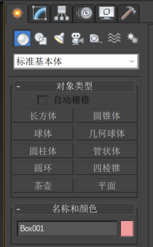
>
> | 图标                                                         | 功能                         |
> | ------------------------------------------------------------ | ---------------------------- |
> | 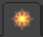 | **创建面板**                 |
> | 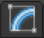 | **修改面板**                 |
> | 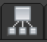 | **坐标轴面板**               |
> | 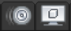 | 这两个是动画用到的，暂时不管 |
> | 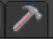 | 这个后面再讲                 |

------

### 创建面板

> 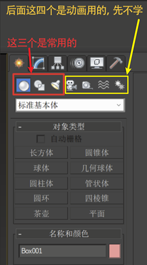
>
> 三个按钮分别为：
>
> |                                                              |                        |      |
> | ------------------------------------------------------------ | ---------------------- | ---- |
> |  | 建模（许多预设几何体） |      |
> |  |                        |      |
> |  |                        |      |
>
> 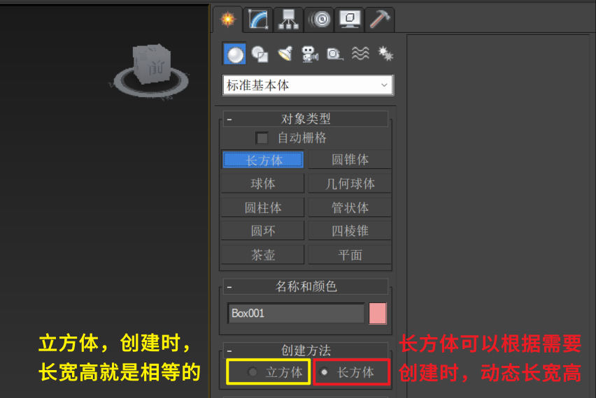

------

### 修改面板

> 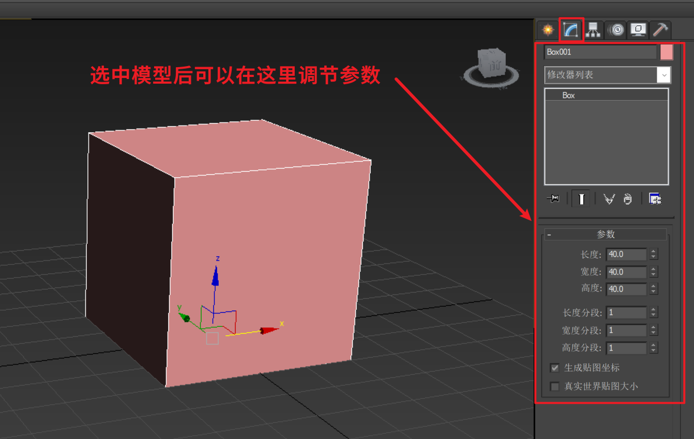

------

## 模型转 `Poly` 

> 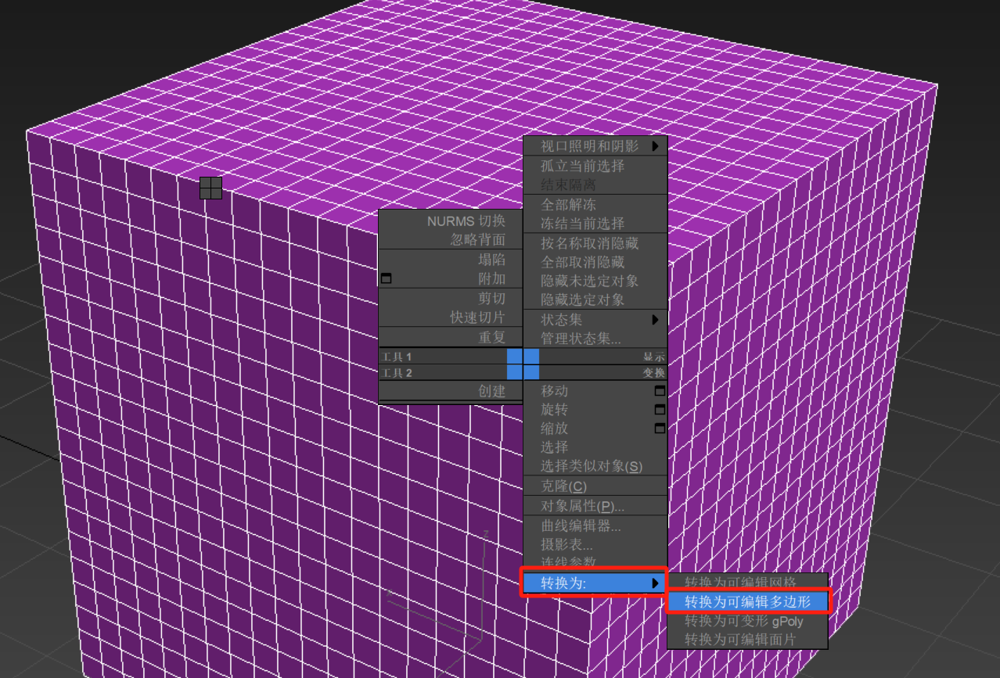
>
> ### 转 `Poly` 后**修改面板**里面的命令会修改：
> 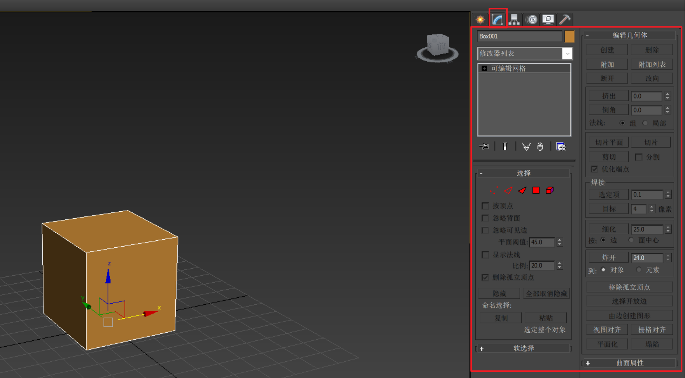
>
> |                                                              |          |      |
> | ------------------------------------------------------------ | -------- | ---- |
> |  | 点       |      |
> |  | 边       |      |
> |  | 边界     |      |
> | 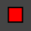 | 面       |      |
> | 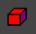 | 元素[^6] |      |

------

## （快捷键）创建模型流程

> ```mermaid
> graph TB
> 	A[创建面板] --> B[创建box]
> 	B --右键--> C[转 Poly]
> 	C --> D[修改面板]
> 	D --修改--> E[点]
> 	D --修改--> F[线]
> 	D --修改--> G[边界]
> 	D --修改--> H[面]
> 	D --修改--> I[元素]
> ```
>
> | 修改模式 | 进入到修改面板界面后，快捷键 |
> | -------- | :--------------------------: |
> | 点       |             `1`              |
> | 线       |             `2`              |
> | 边界     |             `3`              |
> | 面       |             `4`              |
> | 元素     |             `5`              |

------

## （快捷键）对于模型的操作

> |      |                  |
> | ---- | ---------------- |
> | 加选 | `[Ctrl]`         |
> | 减选 | `[Alt]`          |
> | 全选 | `[Ctrl]` + `[A]` |
> | 反选 | `[Ctrl]` + `[I]` |

### 阔选 和 收缩

> #### 模型进入**可编辑多边形**状态后：
>
> 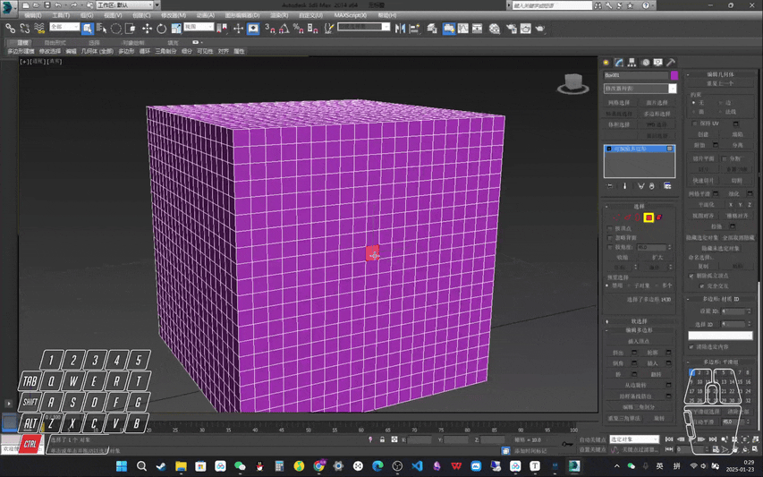

### 切选：将区域内选中的面 转化为 点 或者 线

> 按住Ctrl键点击
> 

### 循环选择

> 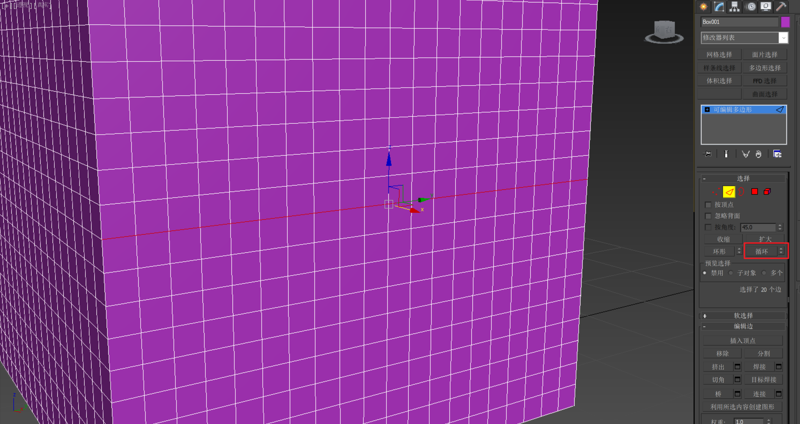

### 环形选择

> 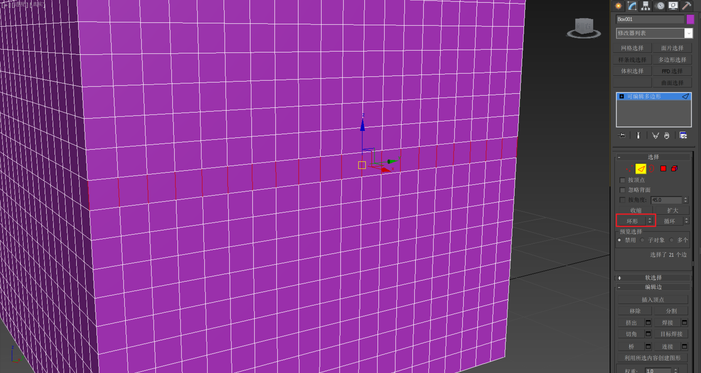

------

## （快捷键）复制模型： `Shift + 在一个轴向上 拖拽` （需要退出所有级别[^5]，只对模型操作）

### 第一种复制：（普通复制）

#### 需要注意！要选择模型复制，不要选下面的层级比如 点、线、面 复制！

> 拖拽后会有弹窗
>
> 
>
> 比如克隆5个：
> 

#### 原地复制：`Ctrl` +  `V`

> 
>
> 

------

### 第二种复制： 关联复制

> Shift拖拽复制，或者原地复制之后，选择这个选项：
>
> 
>
> - 复制完之后，任何一个模型在**级别之下** [^4]的操作时，都会复制
> - 相当于：复制完之后，操作任何一个的点线面，另一个也对应修改（一般做左右镜像用）
>
> ### 修改模型点、线、面：
>
> 
>
> ### 然后就可以在这里修改点、线、面了
>
> 
>
> 
>
> 

#### 取消关联复制的操作

> 右键其中的一个，转可编辑多边形（poly）
>
> 这样就断开了联系

### 第三种复制：父子级复制（极不常用）

> **对于父类的级别之下的修改会 关联到子类上（修改父类子类也会变）**
>
> **对于子类的级别之下的修改，父类不会变化**
>
> 断开联系也是：右键转可编辑多边形（poly）
>
> 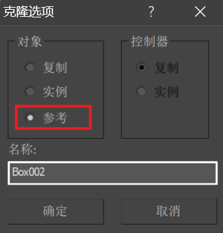

------

## （快捷键）删除（需要退出所有级别[^5]，只对模型操作）

> #### 正常 `[Delete]`

### （快捷键）级别之下的删除

> 比如需要删除一条线，这种时候不能使用 `[Delete]` 要使用 `[退格键]`
> 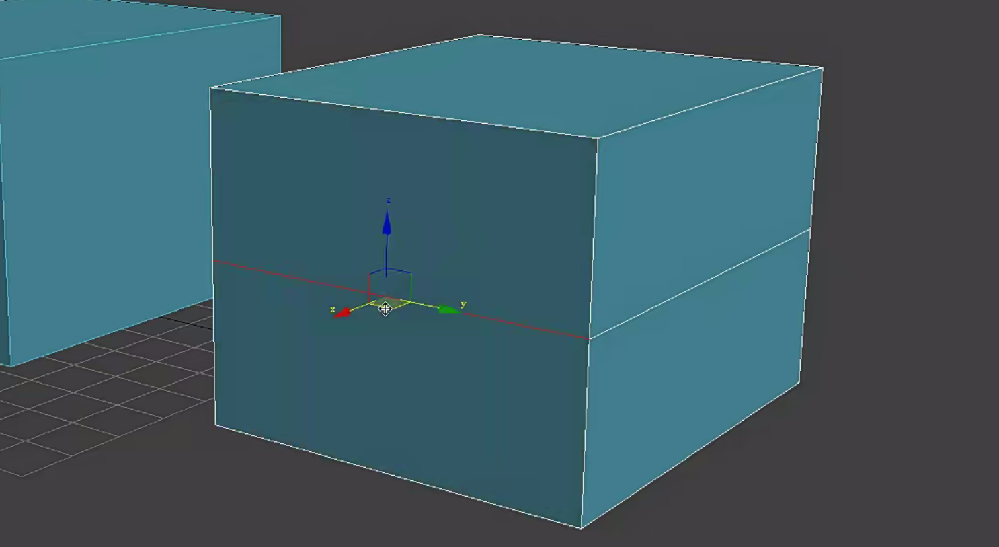

### （快捷键）级别之下 删除线的同时删除点

> 比如下图这种情况：如果循环选择了线，按 `[退格键]` 删除线后还需要再选中所有的点 再 `[退格键]` 需要删除两次
>
> 这种时候就可以：
> ### `[Ctrl]` + `[退格键]` 删除线的同时删除点
>
> 

## （快捷键）打开场景 `H`

> 可以看到场景中多余物体，进行删除或其它操作
>
> # 双击选中对象
>
> 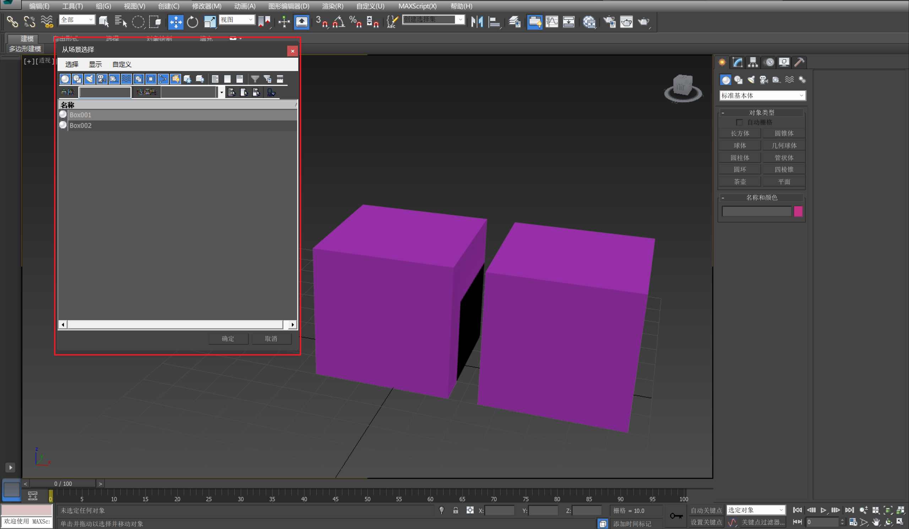

## 修改撤销上限

> 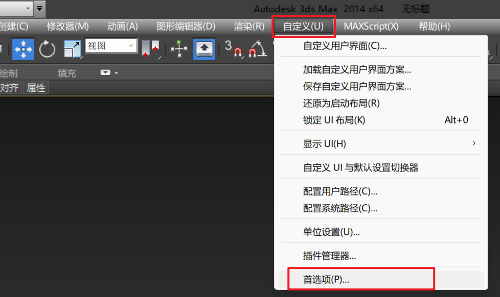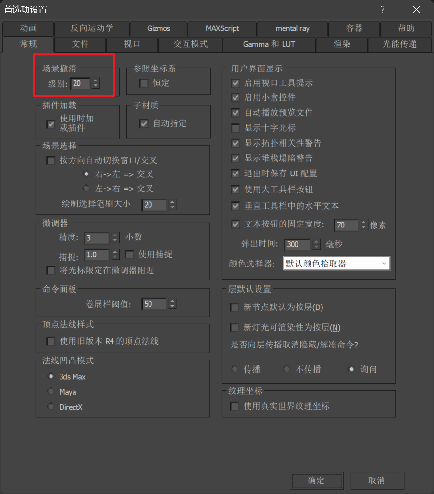

## 如果存档崩了，Max有一个自动备份目录

> ``````
> 我的文档\3dsMax\autoback\
> ``````
>
> 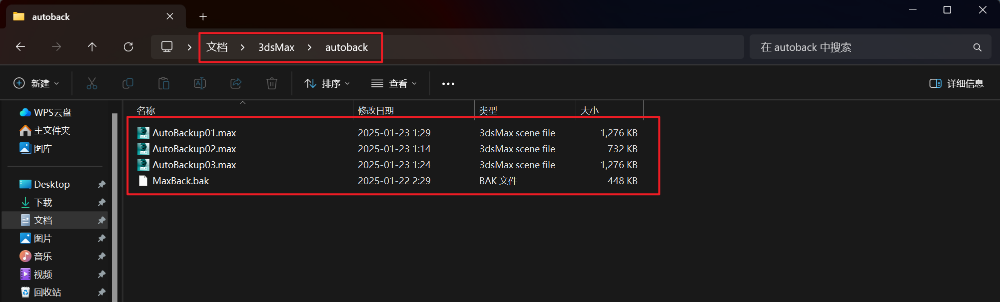

------

[^1]: **[ 平光 ]** 模式：因为当上材质的时候可能会手绘高光和阴影，所以不需要环境中再有阴影，否则就会影响到最终结果
[^2]: **[ 光影 ]** 模式：光影模式为建模或雕刻时，不调整材质时使用的，便于根据光影调整物体表面
[^3]: 物体边框显示：可以发现不标准操作，比如有多余的点在模型外，这时候按下J就可以及时发现问题
[^4]: 级别之下的操作，指的是对于模型级别之下的点、线、面 的操作。对于模型的移动、位移、缩放 均不属于级别之下的操作
[^5]: 指的是对于模型级别之下的点、线、面 的操作。
[^6]: 比如：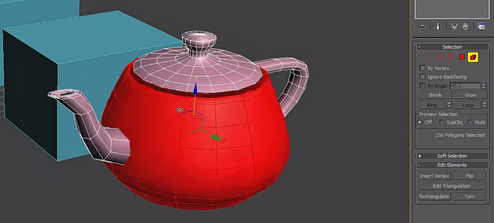
