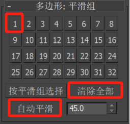
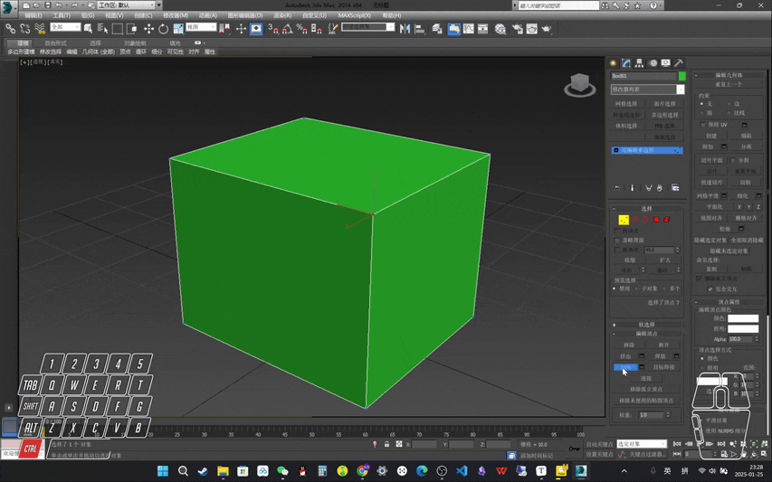
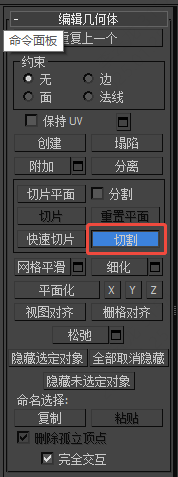
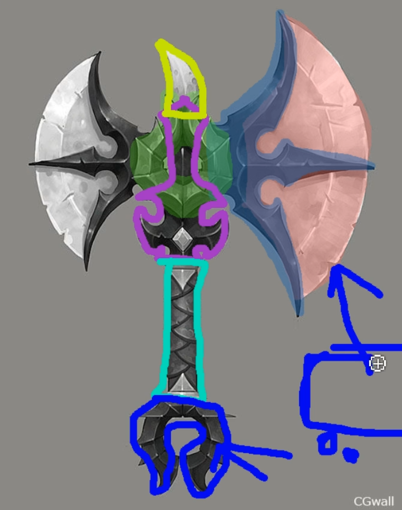

___________________________________________________________________________________________
###### [GoMenu](../3DMaxBasicsMenu.md)
___________________________________________________________________________________________
# 001_标题

___________________________________________________________________________________________

## 目录

[TOC]

------

## 十个多边形命令

> | 功能         | 什么级别下 可用 |            快捷键            |                适用场景                |
> | ------------ | :-------------- | :--------------------------: | :------------------------------------: |
> | 目标焊接[^1] | 点              | `[Ctrl]` + `[Shift]` + `[W]` | 将两个点合并为一个（但需要拖拽后点选） |
> | 塌陷[^2]     | 点、线、面      |  `[Ctrl]` + `[Alt]` + `[C]`  |           合并两个**重合点**           |
> | 倒角[^3]     | 点、线          | `[Ctrl]` + `[Shift]` + `[C]` |         **弧形角**或**弧形边**         |
> | 切割[^4]     | 点、线          |       `[Alt]` + `[C]`        |                                        |
> | 连接[^5]     | 点、线          | `[Ctrl]` + `[Shift]` + `[E]` |            在两个点之间连线            |
> | 挤压[^6]     | 点、线、面      |      `[Shift]` + `[E]`       |                                        |
> | 插入[^7]     | 面              |                              |                                        |
> | 斜切[^8]     | 面              |                              |                                        |
> | 桥接[^9]     | 线、面          |                              |        两个**边**之间创建**面**        |
> | 封面[^10]    | 边界            |                              |          不要在**拐角处**使用          |

------

## 挤出时，可以选择，按分组或者各自

### 1. 组

> 

### 2. 局部法线

> 

### 3.按多边形

> 

## 合并两个对象、拆分对象

### 合并

> 元素 级别下（面级别也可以，但需要补面）：
>
> 1. 选中物体
> 2. 元素级别下，点击->附加
> 3. 点击要附加的 子物体
>
> 完成合并
>
> #### 合并完成后请检查 轴心点
>
> 

### 拆分

> 元素 级别下（面级别也可以，但需要补面）：
>
> 1. 选中物体
> 2. 元素级别下，点击->分离
>
> 完成分离
>
> #### 合并完成后请检查 轴心点
>
> 

## 翻转

> 首先明确两个概念：正面和反面
>
> - 正面（物体表面）：可以进行**级别之下**操作的面
> - 反面（物体内部）：不可以进行**级别之下**操作的面
>
> 比如：新建一个立方体然后减去一个面
>
> 
>
> 如果要交换正面和反面的朝向，此时可以在**元素**或**面**级别之下使用**翻转**命令[^11]，执行后：
>
> 

------

## 导入参考图到正视图

### 导入

> # 快捷键：`[Alt]` + `[B]` 
>
> Max2014之前的版本可以这样设置：
> 
>
> ### 2014之后的需要先设置这里，然后重启软件
>
> 锁定平移/缩放
>
> 
>
> 然后再设置
>
> 

### 移除背景图片

> # 快捷键：`[Alt]` + `[B]` 
>
> 

------

## 分析原画

> 拆分部分[^12]
> 

------

## 使用光滑组

> 1. 先清除全部
> 2. 在选择平滑组数字
> 3. 应用：自动平滑
>
> 
>
> #### 不使用是这样的：
> 
>
> #### 上半部分使用光滑组
>
> 

------

## 总结建模流程

> 1. 分析原画
> 2. 划分结构
> 3. 大型搭建（主体优先）
> 4. 细节刻画
> 5. 检查模型（和原画对比）

------

### 1. 使用样条线，创建大致形状

> 

### 要使用直角点，而不是贝塞尔[^13]，因为贝塞尔曲线的点会成倍增加，太多了，不能用！！

> 

### 如果要加点，绘制完闭合图形后，使用 `优化`

> 

------

### 2. 右键转Poly（面片）

> 

------

### 3. 多个点汇聚在一起时可以使用塌陷[^2] 

> 

------

### 4. 刀刃部分使用 `插入` [^8]，然后修正点（尽可能均匀布线）

> 

------

### 5. 在外环刀刃面使用平滑组

> 

------

### 6. 赋予材质

> 

------

### 7. 

> // TODO

------

[^1]: 
[^2]: 
[^3]: 
[^4]: 
[^5]: 
[^6]: 
[^7]: 
[^8]: 
[^9]: 
[^10]: 
[^11]: 
[^12]: 
[^13]: 
