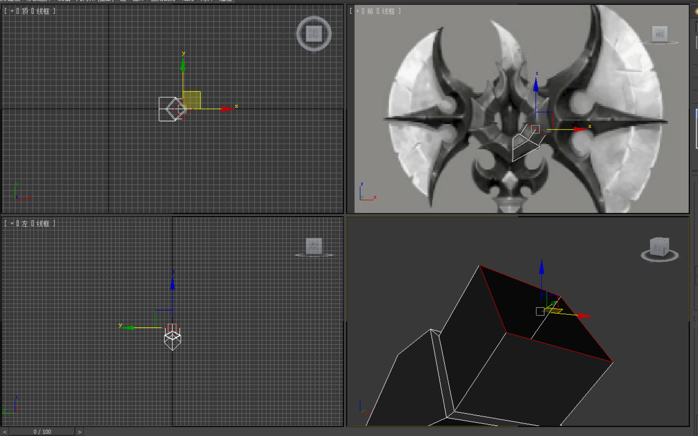
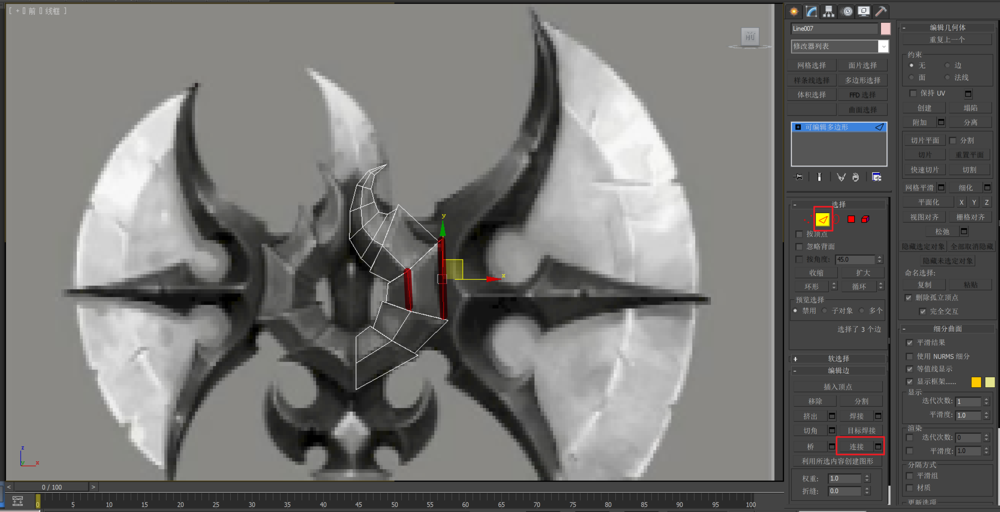

___________________________________________________________________________________________
###### [GoMenu](../3DMaxBasicsMenu.md)
___________________________________________________________________________________________
# 004_创建对称斧刃和节形装饰


___________________________________________________________________________________________


## 目录

[TOC]


------

## 视口显示面数/统计面数

> 

### 统计三角面

> 面数要看这个三角面的面数，而不是多边形面数，因为引擎默认会转化多边形面为三角面
>
> 

------

## 除了避免扭曲面时使用三边面，其他情况要避免连出三边面！！！！

------

## 对称命令

### 第一步：先把要对称的面，打平

> #### 打平：**点**级别下使用**单轴缩放**工具，
>
> #### 单轴向一个方向拖拽
>
> 检查时可以查看这一排上点的坐标
>
> 

#### 打平方法二：（点、面级别下）

> 

------

### 第二步：将要镜像的对象，坐标轴对齐到要镜像的轴上

> 
>
> 

### 第三步：重置一下模型（为了稳定性）

> 
>
> 此时打开编辑面板，发现没有点线面，说明成功
>
> 
>
> 然后右键转"可编辑多边形"
>
> 
>
> 
>
> 完成！

### 第四步：选择"对称"修改器

> 可以打字索引
>
> 

#### 分别有6种对称方式

> - X轴翻转
> - 镜像X轴翻转
> - Y轴翻转
> - 镜像Y轴翻转
> - Z轴翻转
> - 镜像Z轴翻转
>
> 

#### 焊接的意思时：会根据点和点之间的距离，小于阈值(此时为0.1)时，会合并两个点为一个

> 也就是说，图中的这几个点会合并成为一个
>
> 

### 第五步：转"可编辑多边形"，点模式下继续调点

> 

### 第七步：处理一下光滑组

> 因为光滑组会使用对称前的光滑组信息，自动继承，所以可能会对称后出现光滑组不一致的问题，还需要处理检查一下！

------

## 编辑点线面时，镜像可视 功能使用：

> 比如有这样一个形状：想让它左右翻转
> 
>
> 使用对称后如果还想修改点线面
>
> 
>
> 可以进入到可编辑多边形的界面（但这样就看不到另一半了）
>
> 
>
> 这时候可以点击这个吸管一样的图标，就可以看到镜像了（此时也可以看到镜像的操作）
>
> 
>
> 确认无误才能转多边形

------

## 处理斧刃的对称

> 1. **打平**
> 2. **调整轴心**
> 3. **重置为对象**
> 4. **对称**
> 5. **调整平滑组**
>
> 

------

## 需要注意，模型和模型之前需要轻微穿插！防止露出没有的面

------

## 将三叉戟部分，边缘的点贴到平面上

> 
>
> 

------

## 处理三叉戟的对称

> 1. **打平**
> 2. **调整轴心**
> 3. **重置为对象**
> 4. **对称**
> 5. **调整平滑组**

------

## 接下来处理三叉戟头的部分的漏空面的问题

> 
>
> 需要把面封上，但是不能封太多，如果这个内部整个都填上面，会浪费

### 隐藏单独的面

> 

### 创建面

> **面**级别下，选点（**顺时针**或者**逆时针**）
>
> 将内部的面填上
>
> 

------

## 镜像命令(整个物体翻转时，用镜像这个命令)（会影响法线！）

> 

### 镜像后调整位置和缩放

> 

------

## 接下来创建两个斧刃中间的连接处

> ```mermaid
> graph TB
> subgraph 先制作左侧或右侧一半
> 	1[曲线沟边（要使用直角点）] --> 2[转可编辑多边形]
> 	2 --> 3[加点并调整点的高度]
> 	3 --> 4[分配平滑组]
> end
> subgraph 完成前面的部分
> 	4 --> 5[调整轴心然后 先完成左右对称（不着急完成，先调整点）]
> 	5 --> 6[转可编辑多边形]
> 	6 --> 7[分配平滑组]
> end
> subgraph 整个部 分完成
> 	7 --> 8[调整轴心然后再完成前后对称（不着急完成，先调整点）]
> 	8 --> 9[转可编辑多边形]
> 	9 --> 10[分配平滑组]
> end
> ```
>
> 

------

## 宝石底座部分制作

> 

### 可以使用插入制作

> 
>
> 

### 然后倒角

> 

------

## 制作牙的部分

> 

### 先使用二维线画出中心的部分

> 

### 然后使用 `线条渲染` 

#### 生成 4细分 圆柱体

> 确认后转"可编辑多边形"
>
> 
>
> 牙齿顶部可以选中多个点，使用"塌陷"

#### 也可以，生成四边形

### 使用缩放工具调整一下圆锥的大小

> 
>
> 然后调整整体缩放让牙齿扁一些

### 最后给上光滑组

------

## 制作中间的节形装饰

> 

### 1. （先画出大型，然后调点）使用线条渲染，使用正视图调点

> 

------

### 2. 上下面不需要，需要删除

> 

------

### 3. 边模式下，选中一圈边，按Shift向内挤出一个内环

> 

------

### 4. 然后Shift挤出一个面

> 

------

### 5. 然后调点，如此往复

> 

------

### 6. 增加外圈弧度

> 边模式下，选中两个要增加弧度的边，使用"连接"
>
> 

### 7. 错开平行面

> 

#### 非常重要！！！`垂直角度做倾斜` 如果不错开，会导致当玩家俯视模型时，光影会导致看不清模型细节

> 比如这样两个模型，一个是不错开，一个是错开的：
> 
>
> #### 对比看上去的效果：
>
> 

------

### 8. 对称

> 对其坐标轴
>
> 因为对称后小于0.1的会被合并，所以不想让上面两个尖角合在一起的话，可以先空开距离，对称后再移动
>
> 

------

### 9. 一般像这种结构，都是左右两侧以片的形式存在

> 所以模型背面都不要了
>
> 

### 10. 边界级别下，使用"封口"

> 直接"封面"然后记得切成 **不大于四边面**
>
> 

### 11. 放到适当位置，镜像

> 

------