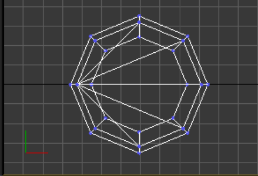
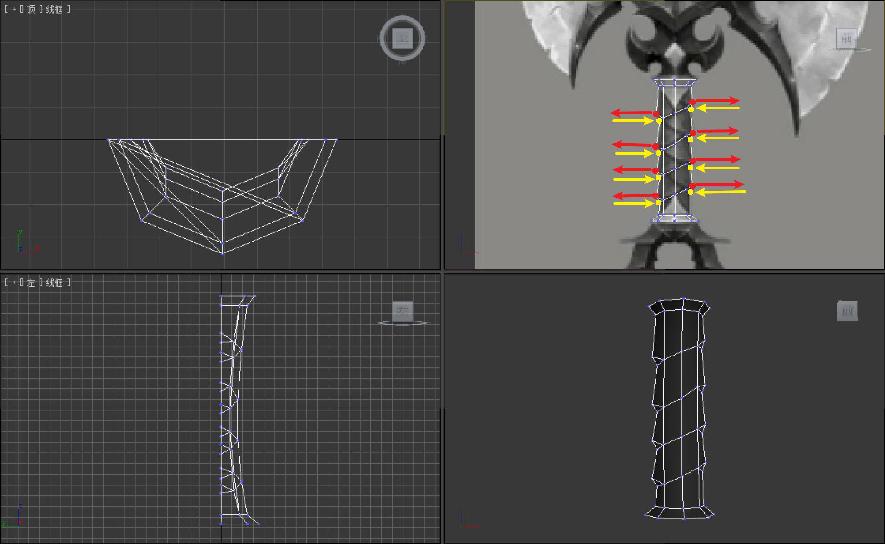
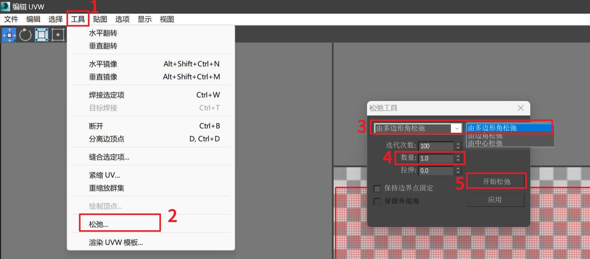
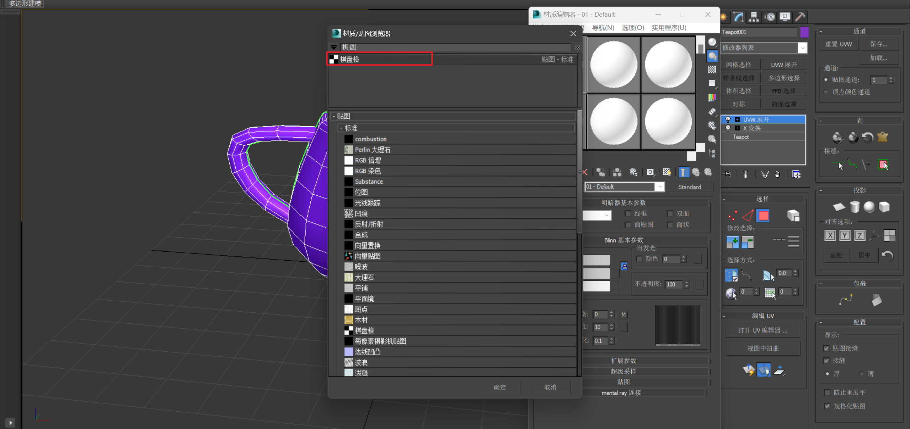

___________________________________________________________________________________________
###### [GoMenu](../3DMaxBasicsMenu.md)
___________________________________________________________________________________________
# 005_完成斧子的建模 和 `展UV`

___________________________________________________________________________________________

## 目录

- [005\_完成斧子的建模 和 `展UV`](#005_完成斧子的建模-和-展uv)
  - [目录](#目录)
  - [修改轴心](#修改轴心)
    - [方法一：手动修改轴心](#方法一手动修改轴心)
    - [方法二：使用吸附工具，将A物体轴心吸附到B物体](#方法二使用吸附工具将a物体轴心吸附到b物体)
    - [方法三：现将源对象作为元素附加到目标对象，然后再解除](#方法三现将源对象作为元素附加到目标对象然后再解除)
  - [对齐 对象 到 目标坐标](#对齐-对象-到-目标坐标)
  - [制作斧柄部分](#制作斧柄部分)
  - [关于圆顶封面的方式：](#关于圆顶封面的方式)
    - [快速应用第二种圆顶"封面"方式](#快速应用第二种圆顶封面方式)
      - [底下面也同样的方式处理](#底下面也同样的方式处理)
  - [接下来制作手握部分](#接下来制作手握部分)
  - [创建手柄底部节形挂饰](#创建手柄底部节形挂饰)
  - [添加快捷工具面板](#添加快捷工具面板)
  - [检查对称的模型是否与原画一致的方法：](#检查对称的模型是否与原画一致的方法)
  - [`展UV`](#展uv)
    - [原理解释：](#原理解释)
    - [命令位置：](#命令位置)
    - [比如要将一个立方体 `UV展开`](#比如要将一个立方体-uv展开)
      - [1. 创建一个立方体](#1-创建一个立方体)
      - [2. 展开之前需要先敲一下，防止崩溃](#2-展开之前需要先敲一下防止崩溃)
      - [3. 进入"UVW展开"面板](#3-进入uvw展开面板)
      - [4. 拍平（也就是移除现有的UV）](#4-拍平也就是移除现有的uv)
      - [5. 切换到边模式，想象沿如图的边缘将立方体切开 `Ctrl + B` ，变成一个盒子](#5-切换到边模式想象沿如图的边缘将立方体切开-ctrl--b-变成一个盒子)
      - [6. 打开UV编辑器](#6-打开uv编辑器)
      - [7. 切换到面模式，全选所有面](#7-切换到面模式全选所有面)
      - [8. 使用"松弛"命令](#8-使用松弛命令)
      - [9. 使用等比缩放，调整UV展开大小（保证在框内！）](#9-使用等比缩放调整uv展开大小保证在框内)
  - [UV展开要注意的 `原则性问题`：](#uv展开要注意的-原则性问题)
    - [一、一定要保证接缝在隐蔽处！决不能再正面来一刀（参考衣服）](#一一定要保证接缝在隐蔽处决不能再正面来一刀参考衣服)
    - [二、接缝能少则少！](#二接缝能少则少)
    - [三、所以接缝最好自己切，不要用系统默认的！](#三所以接缝最好自己切不要用系统默认的)
  - [茶壶展UV示例](#茶壶展uv示例)
  - [缝合两个UV点](#缝合两个uv点)
  - [使用棋盘格材质，检查UV是否合适](#使用棋盘格材质检查uv是否合适)
    - [1. M打开材质球，点击漫反射后的按钮](#1-m打开材质球点击漫反射后的按钮)
    - [2. 选择棋盘格材质](#2-选择棋盘格材质)
      - [棋盘格材质使用"瓷砖模式"20\*20](#棋盘格材质使用瓷砖模式2020)
      - [再点一下这个才能显示](#再点一下这个才能显示)
    - [3. 如果材质小方格子差不多，说明UV正确！](#3-如果材质小方格子差不多说明uv正确)
  - [查看展UV的图片尺寸，检查是否有穿插](#查看展uv的图片尺寸检查是否有穿插)
    - [检查穿插](#检查穿插)
  - [开始给斧子展UV（UV占有率要90%~95%，太稀疏了不行！）](#开始给斧子展uvuv占有率要9095太稀疏了不行)
    - [一、备份存档，将斧子合并元素](#一备份存档将斧子合并元素)
    - [二、删除背面，准备只给一面上材质](#二删除背面准备只给一面上材质)
    - [三、圆柱顶部和底部都需要切开：](#三圆柱顶部和底部都需要切开)
    - [展开后：（我这里大约70%~80%）](#展开后我这里大约7080)
    - [给上棋盘格](#给上棋盘格)

------

## 修改轴心

### 方法一：手动修改轴心

> 

### 方法二：使用吸附工具，将A物体轴心吸附到B物体

> 1. 选中要修改轴向的物体，右侧面板选择"修改轴面板"->"仅影响轴"
> 2. 上面菜单栏使用磁性吸附（如图所示）
> 3. 点击要对齐坐标轴到的对象
> 4. 完成！源对象坐标轴修改为与目标对象一致
>
> 

### 方法三：现将源对象作为元素附加到目标对象，然后再解除

------

## 对齐 对象 到 目标坐标

> 
>
> 这样就会把两个目标对齐
>
> 比如制作斧柄部分

------

## 制作斧柄部分

> 以圆柱为基准，要使用**4的倍数**！
>
> 一般除了高模不建议超过64
>
> 分段数以下元素相关：
>
> - 项目需求
> - 体积大小
> - 粗细相关
>
> 一般为：
>
> |      |      |      | 后面都是4的倍数： |      |      |      |      |      |      |      |
> | :--: | :--: | :--: | ----------------: | :--: | :--: | :--: | :--: | :--: | :--: | :--: |
> |  3   |  4   |  6   |                   |  8   |  12  |  16  |  24  |  32  |  48  |  64  |
>
> 
>
> 早期《暗黑血统2》模型中的面数参考：
>
> 

------

## 关于圆顶封面的方式：

> 遵循规则：
>
> - 尽可能地少面
> - 需要按轴线对齐
>
> 

### 快速应用第二种圆顶"封面"方式

> 1. 使用"插入"命令向内延申线
>
>    
>
> 2. 按住Ctrl，转换为选中点，使用"塌缩"
>
>    
>
> 3. 使用"焊接目标点"将边挪到一侧（一定要沿着轴向！）
>
>    

#### 底下面也同样的方式处理

> 

------

## 接下来制作手握部分

> 
>
> 1. 创建圆柱（这里使用8面，面很多了）
>
> 2. 对齐到手柄位置
>
> 3. 删除后一半的面
>
>    
>
> 4. 使用切割加点，做成这样的结构
>
>    
>
> 5. 手柄上有一个细点的位置，做成弧形，向内稍微凹陷，形成曲面
>
>    
>
> 6. 三角形点，上下错开，做出参差感
>
>    
>
> 7. 上下两部分分开单独使用平滑组，因为是单独结构
>
>    

## 创建手柄底部节形挂饰

> - 注意下尾部小脚丫
>
>   
>
> - 和侧面的起伏：
>
> - 别忘了整个模型都需要一个中线
>
>   

------

## 添加快捷工具面板

> 
>
> 
>
> 
>
> 

------

## 检查对称的模型是否与原画一致的方法：

> 导入图片，看一半图片一半模型，缩小模型，对比：
>
> 
>
> 

------

## `展UV`

### 原理解释：

> 什么是展UV?
>
> 简单来说就是：**把立体模型变成平面形式的过程就叫展UV。**
>
> 

### 命令位置：

> 

### 比如要将一个立方体 `UV展开`

#### 1. 创建一个立方体

#### 2. 展开之前需要先敲一下，防止崩溃

> 
>

#### 3. 进入"UVW展开"面板

#### 4. 拍平（也就是移除现有的UV）

> 
>

#### 5. 切换到边模式，想象沿如图的边缘将立方体切开 `Ctrl + B` ，变成一个盒子

> 
>

#### 6. 打开UV编辑器

> 
>

#### 7. 切换到面模式，全选所有面

> 

#### 8. 使用"松弛"命令

> 
>
> 然后UV就会被展开

#### 9. 使用等比缩放，调整UV展开大小（保证在框内！）

> 
>
> 
>
> 

------

## UV展开要注意的 `原则性问题`：

### 一、一定要保证接缝在隐蔽处！决不能再正面来一刀（参考衣服）

> 

### 二、接缝能少则少！

> 比如，使用3Dmax默认的立方体UV会把所有面都展开，每个面**四条接缝**
>
> 

### 三、所以接缝最好自己切，不要用系统默认的！

------

## 茶壶展UV示例

> 可以看到默认的茶壶拆了好多的接缝，正面还好几条，肯定是不符合规范的
>
> 1. 拍平
>
>    
>
> 2. 凡是没有接口的地方会自动变成接缝
>
>    
>
> 3. 茶壶嘴的地方可以切开这里
>
>    
>
> 4. 茶壶把手形似圆柱，是有封口的，可以切开内部的这一条
>
>    
>
> 5. 可以将整个茶壶壁视作一个圆柱，切开后边的这条边
>
>    
>
> 6. 茶壶底部
>
>    
>
> 7. 茶壶顶部
>
>    
>
> 8. 打开UV编辑器 -> 松弛 -> 由多边形角松弛，会变成下图这样：
>
>    
>
> 9. 此时，一个一个处理没展开的对象。选中一个，循环交替使用松弛中的"由多边形角松弛"和"由边角松弛"
>
>    
>
>    
>
> 10. 会出现一些自动处理不了的UV，需要手动展开
>
>     选择一些面，旋转成正确的方向，然后再自动
>
>     
>
> 11. 123
>
> 12. 123
>
> 13. 123

------

## 缝合两个UV点

> 点级别下，两个点放到一起全选两个点，`Ctrl+W`
>
> 

------

## 使用棋盘格材质，检查UV是否合适

### 1. M打开材质球，点击漫反射后的按钮

> 

### 2. 选择棋盘格材质

> 

#### 棋盘格材质使用"瓷砖模式"20*20

> 

#### 再点一下这个才能显示

> 

### 3. 如果材质小方格子差不多，说明UV正确！

> 下面是错误示例：
> 

------

## 查看展UV的图片尺寸，检查是否有穿插

> 一般尺寸：
>
> | 分辨率： | 情况：                         |
> | -------- | ------------------------------ |
> | 256      | 以前常用                       |
> | 512      | 常用                           |
> | 1024     | 常用                           |
> | 2048     | 次世代                         |
> | 4096     | 包含，再往上属于影视级别常用了 |
>
> 

### 检查穿插

> UV占有率要90%~95%我这个有点低
>
> 

------

## 开始给斧子展UV（UV占有率要90%~95%，太稀疏了不行！）

### 一、备份存档，将斧子合并元素

### 二、删除背面，准备只给一面上材质

> 
>
> 此时打开UV编辑器可以看到，UV都是乱的：

### 三、圆柱顶部和底部都需要切开：

> #### 手柄（**圆柱**）**顶部**和**底部**
>
> #### 牙（**圆锥**）**底部**
>
> #### 三叉戟补的两个面
>
> 

### 展开后：（我这里大约70%~80%）

> 

### 给上棋盘格

> 

------
