___________________________________________________________________________________________
###### [GoMenu](../3DMaxBasicsMenu.md)
___________________________________________________________________________________________
# 006_文件整理和错误排查标准

___________________________________________________________________________________________

## 目录

- [006\_文件整理和错误排查标准](#006_文件整理和错误排查标准)
  - [目录](#目录)
  - [非常重要！！！文件整理](#非常重要文件整理)
    - [1. 单位设置 : 显示单位**厘米**，系统单位，1Unit=1厘米（下图为：分别设置**显示单位**和**系统单位**）](#1-单位设置--显示单位厘米系统单位1unit1厘米下图为分别设置显示单位和系统单位)
    - [2. 物体保证在零点坐标](#2-物体保证在零点坐标)
    - [3. 坐标轴保证在零点的位置(特殊情况除外)](#3-坐标轴保证在零点的位置特殊情况除外)
    - [4. 模型要 Reset Xform,(能帮助检查法线问题，旋转，缩放的数值会归 0)](#4-模型要-reset-xform能帮助检查法线问题旋转缩放的数值会归-0)
    - [5. 模型命名正确 `HX_DJ_XXX_01` `HX_CJ_XXX_01`](#5-模型命名正确-hx_dj_xxx_01-hx_cj_xxx_01)
    - [6. 新建一个参照物，检查模型大小。](#6-新建一个参照物检查模型大小)
      - [根据现实中的大小创建参照物，再依照参照物，调整物体的缩放](#根据现实中的大小创建参照物再依照参照物调整物体的缩放)
    - [7. 检查多点，多边面，(Weld 合并，Turn to poly)](#7-检查多点多边面weld-合并turn-to-poly)
      - [移除多余的点](#移除多余的点)
        - [移除空点（也就是没有任何边的点）](#移除空点也就是没有任何边的点)
        - [移除叠在一起的点](#移除叠在一起的点)
    - [检查多边面](#检查多边面)
    - [8. 检查多余物体(layer 层里)](#8-检查多余物体layer-层里)
    - [9. 重置材质球](#9-重置材质球)
    - [可以增加预览材质球的窗口个数](#可以增加预览材质球的窗口个数)
    - [10. 确定 max 文件和 Texture 文件夹(贴图文件放在里面)在同一位置](#10-确定-max-文件和-texture-文件夹贴图文件放在里面在同一位置)
      - [贴图文件不要为PSD因为太大了,尽量转成PNG](#贴图文件不要为psd因为太大了尽量转成png)
      - [常用贴图格式](#常用贴图格式)
      - [贴图文件 `_C` 结尾](#贴图文件-_c-结尾)
    - [11. 材质球和子材质命名为 `HX_CJ_xxxx_01_xx`，连接相应贴图。](#11-材质球和子材质命名为-hx_cj_xxxx_01_xx连接相应贴图)
      - [材质球命名需要与模型命名一致](#材质球命名需要与模型命名一致)
    - [12. 设置寻找贴图路径，AssetTracking(Shift+T)。](#12-设置寻找贴图路径assettrackingshiftt)
      - [刷新](#刷新)
      - [确认贴图路径](#确认贴图路径)
      - [如果要删除重新指定](#如果要删除重新指定)
    - [13. 模型之间的穿插，注意不要漏面](#13-模型之间的穿插注意不要漏面)
    - [14. 切换成四视图模式,线框改为黑色,保存](#14-切换成四视图模式线框改为黑色保存)
  - [有时候会收到外包的截图，截图含义](#有时候会收到外包的截图截图含义)
  - [贴图绘制注意事项:](#贴图绘制注意事项)
  - [重置单独材质球](#重置单独材质球)

------

## 非常重要！！！文件整理

> 文件整理：
>

### 1. 单位设置 : 显示单位**厘米**，系统单位，1Unit=1厘米（下图为：分别设置**显示单位**和**系统单位**）

> 
>
> 设置好后，右侧就会出现单位：
>
>    
>

### 2. 物体保证在零点坐标

> 斧子这种武器的左边一般是在手柄的最下面的点：
>
> (操作步骤可以先将手柄元素级别下解除，然后调整坐标轴，再把其余元素绑定到手柄上，这样就搞定了)
>
> 

### 3. 坐标轴保证在零点的位置(特殊情况除外)

> 特殊情况一般是：云朵、月亮之类的特殊的物件
>
> 根据项目特殊要求来定
>
> 

### 4. 模型要 Reset Xform,(能帮助检查法线问题，旋转，缩放的数值会归 0)

> 

### 5. 模型命名正确 `HX_DJ_XXX_01` `HX_CJ_XXX_01`

> 示例名字释义：
>
> - `火星_道具_斧子_01`
> - `火星_场景_XXX_01`
>
> #### 修改这里的名字：
>
> 

### 6. 新建一个参照物，检查模型大小。

> 这里用来检查[第一条](#1. 单位设置 : 显示单位**厘米**，系统单位，1Unit=1厘米（下图为：分别设置**显示单位**和**系统单位**）)
>
> 

#### 根据现实中的大小创建参照物，再依照参照物，调整物体的缩放

> 

### 7. 检查多点，多边面，(Weld 合并，Turn to poly)

#### 移除多余的点

##### 移除空点（也就是没有任何边的点）

> 

##### 移除叠在一起的点

> 
>
> 要给**间距**，不然**0.1cm**有点大，**0.001cm**就可以检测**重叠点**
>
> 

### 检查多边面

> 
>
> 处理下！！！

### 8. 检查多余物体(layer 层里)

> 

### 9. 重置材质球

> 

------

### 可以增加预览材质球的窗口个数

> 

------

### 10. 确定 max 文件和 Texture 文件夹(贴图文件放在里面)在同一位置

#### 贴图文件不要为PSD因为太大了,尽量转成PNG

#### 常用贴图格式

> | 格式 |                             特点                             |
> | :--: | :----------------------------------------------------------: |
> | PSD  | `图片模式`、`8位`、`过程制作图，图层多，文件大，保留的修改的文件` |
> | JPG  |          `展示图`、`不损品质`、`色彩强`、`容纳性强`          |
> | TGA  |    `贴图(功能)`、`透明通道`、`32位`、`存储出来的通道位数`    |
> | PNG  |        `贴图格式`、`背景透明`、`压缩无损品质`、`上佳`        |
>
> 

#### 贴图文件 `_C` 结尾

Color的意思

> 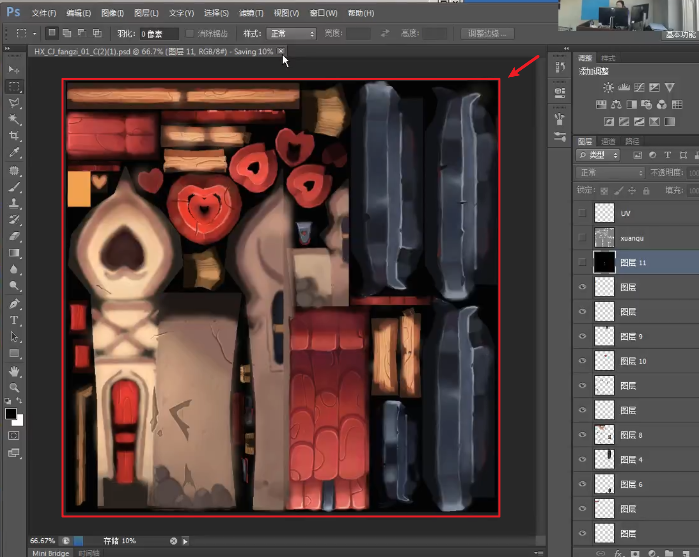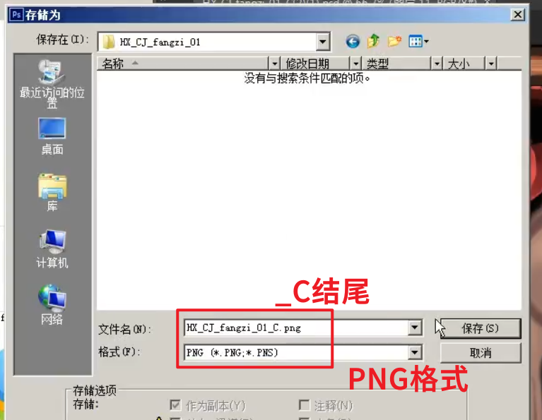

### 11. 材质球和子材质命名为 `HX_CJ_xxxx_01_xx`，连接相应贴图。

#### 材质球命名需要与模型命名一致

> 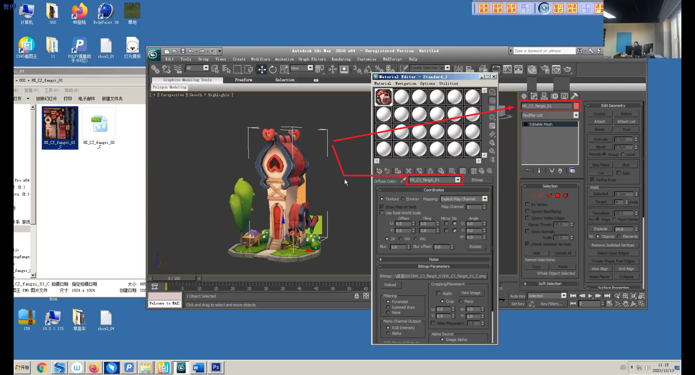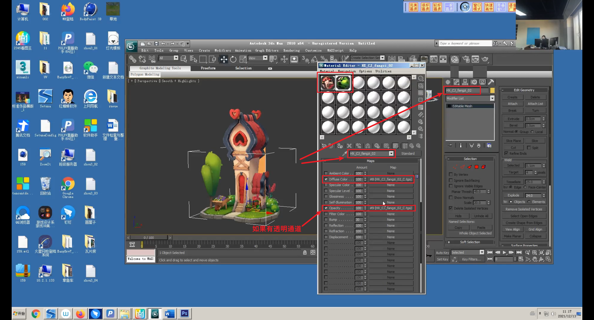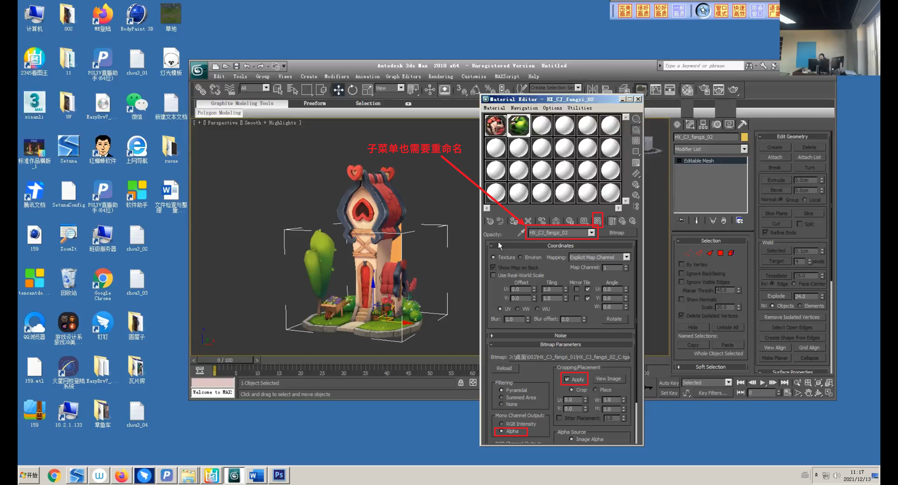

### 12. 设置寻找贴图路径，AssetTracking(Shift+T)。

#### 刷新

> 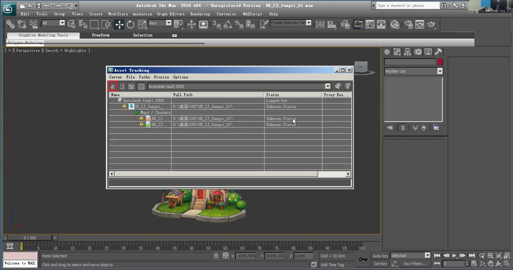

#### 确认贴图路径

> 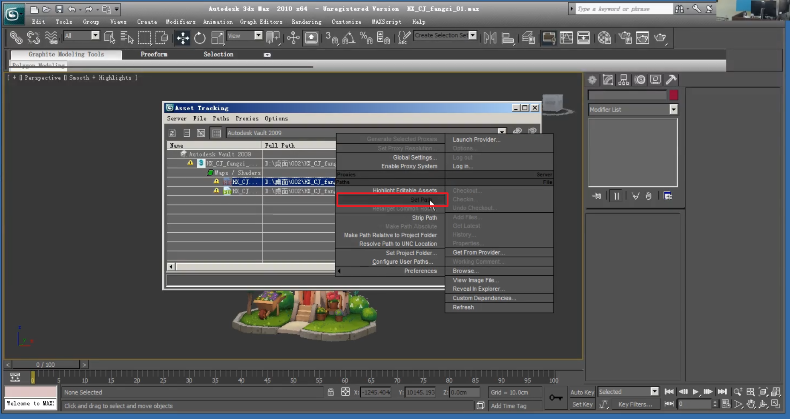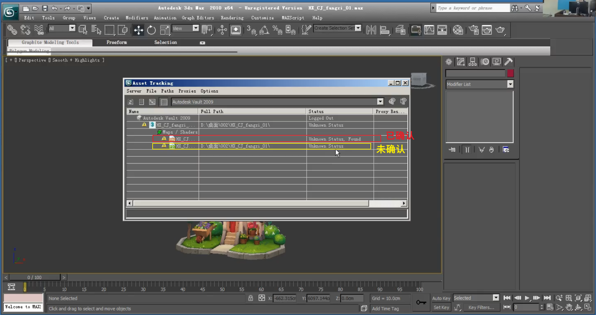

#### 如果要删除重新指定

> 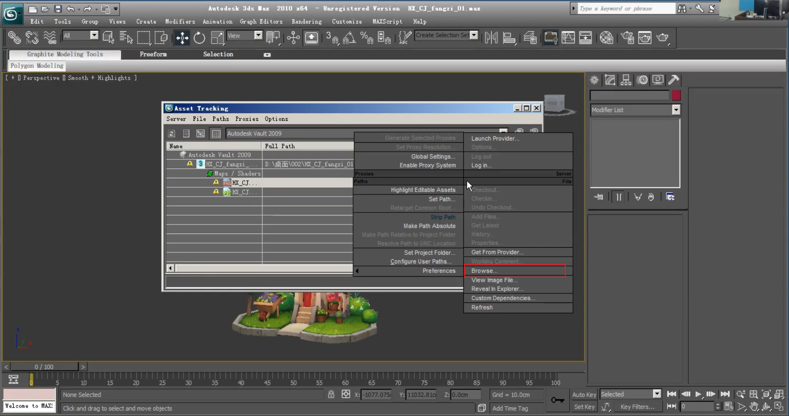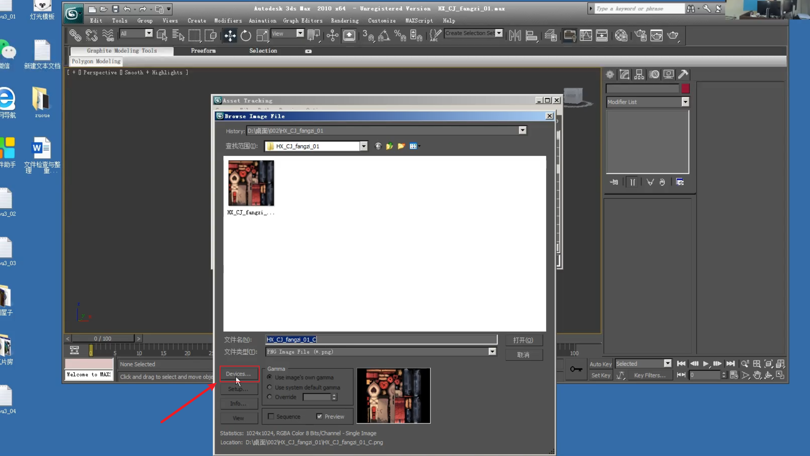

### 13. 模型之间的穿插，注意不要漏面

> 

### 14. 切换成四视图模式,线框改为黑色,保存

> 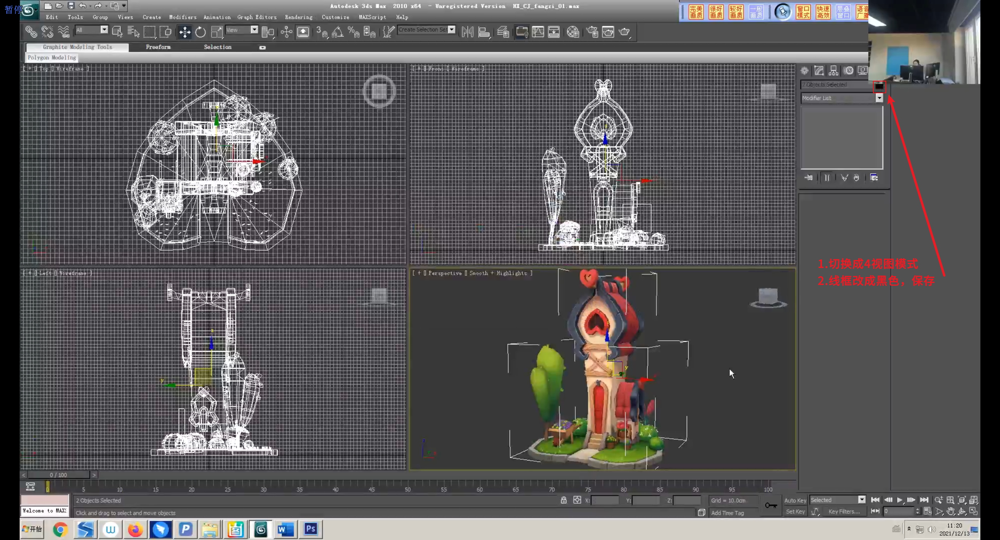

------

## 有时候会收到外包的截图，截图含义

> 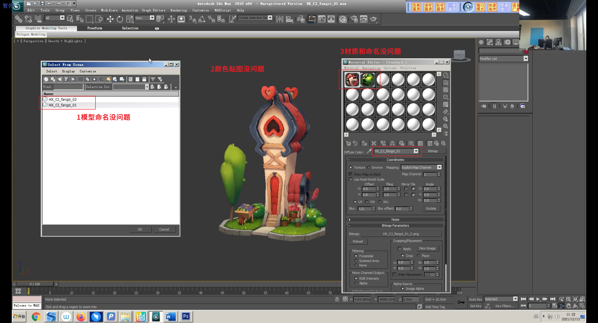

------

## 贴图绘制注意事项:

> 1. 基本底色的体现(对比原画，找到灰色调为底色)40%
> 2. 明暗对比(整体的明暗，物体的遮挡关系)
>    - 整体
>    - 物体自身
>    - 物体之间叠加阴影
> 3. 模型细节的刻画(破损，亮边以及金属、石头、木纹等材质体
> 4. 颜色的丰富度(色相的变化，冷暖的对比，模拟光感效果)

------

## 重置单独材质球

> 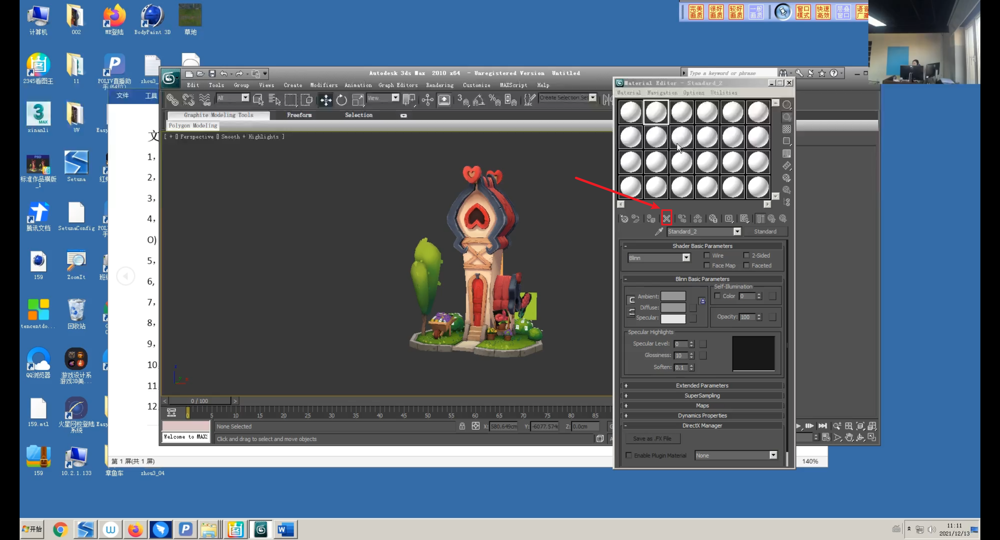