___________________________________________________________________________________________
###### [GoMenu](../3DMaxBasicsMenu.md)
___________________________________________________________________________________________
# 006_文件整理和错误排查

___________________________________________________________________________________________

## 目录

[TOC]

------

## 非常重要！！！文件整理

> 文件整理：
>

### 1. 单位设置 : 显示单位**厘米**，系统单位，1Unit=1厘米（下图为：分别设置**显示单位**和**系统单位**）

> 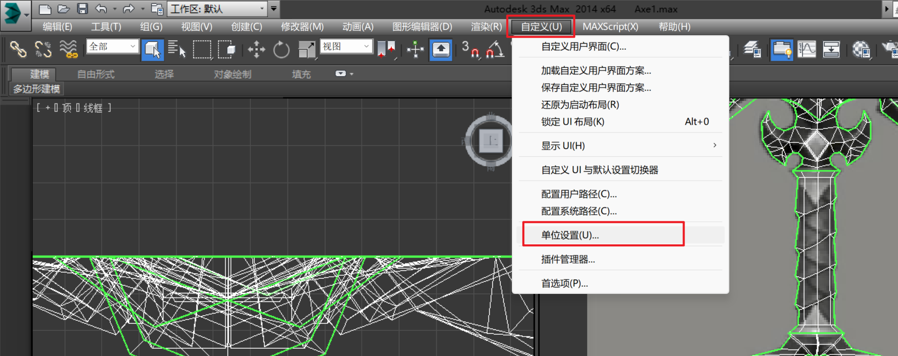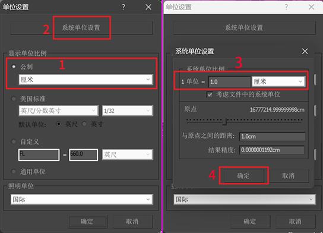
>
> 设置好后，右侧就会出现单位：
>
>    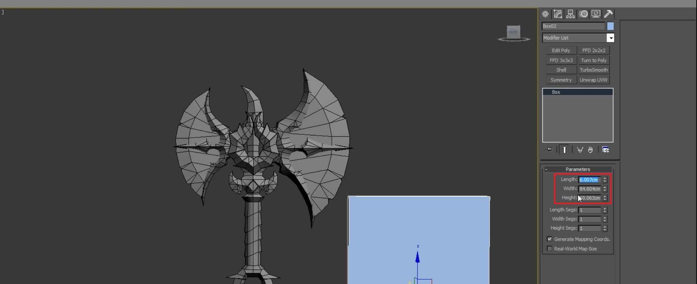
>

### 2. 物体保证在零点坐标

> 斧子这种武器的左边一般是在手柄的最下面的点：
>
> (操作步骤可以先将手柄元素级别下解除，然后调整坐标轴，再把其余元素绑定到手柄上，这样就搞定了)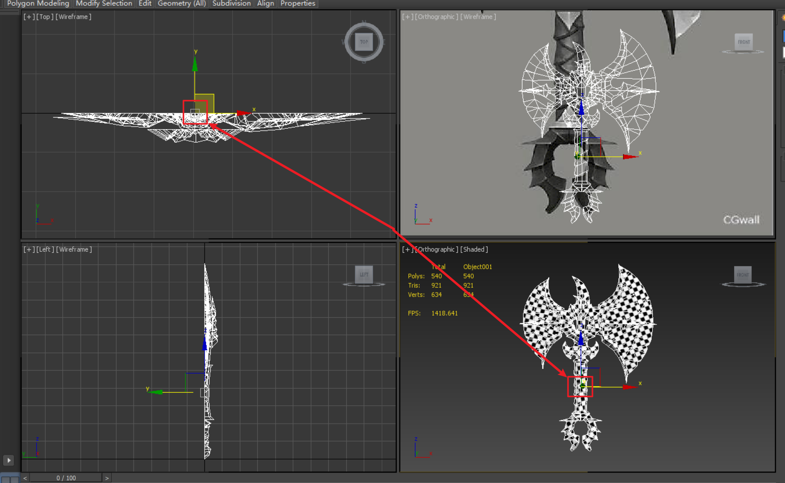
>
> 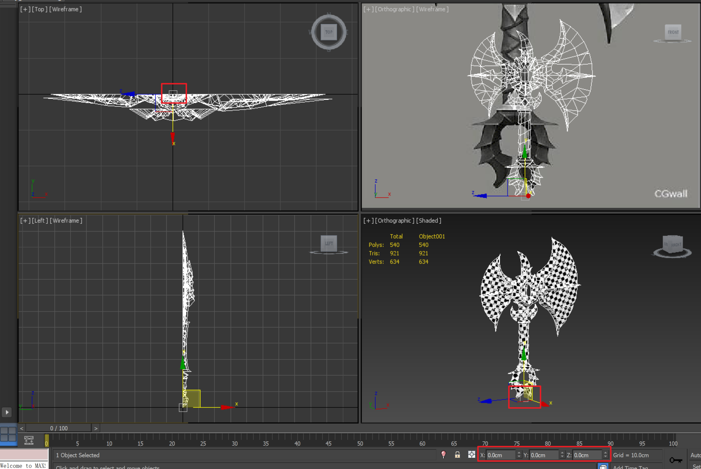

### 3. 坐标轴保证在零点的位置(特殊情况除外)

> 特殊情况一般是：云朵、月亮之类的特殊的物件
>
> 根据项目特殊要求来定
>
> 

### 4. 模型要 Reset Xform,(能帮助检查法线问题，旋转，缩放的数值会归 0)

> 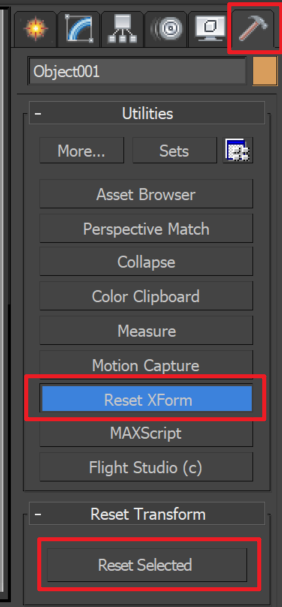

### 5. 模型命名正确 `HX_DJ_XXX_01` `HX_CJ_XXX_01`

> 示例名字释义：
>
> - `火星_道具_斧子_01`
> - `火星_场景_XXX_01`
>
> #### 修改这里的名字：
>
> 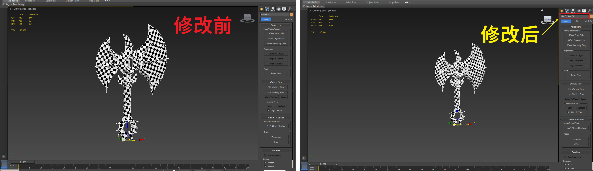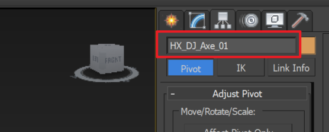

### 6. 新建一个参照物，检查模型大小。

> 这里用来检查[第一条](#1. 单位设置 : 显示单位**厘米**，系统单位，1Unit=1厘米（下图为：分别设置**显示单位**和**系统单位**）)
>
> 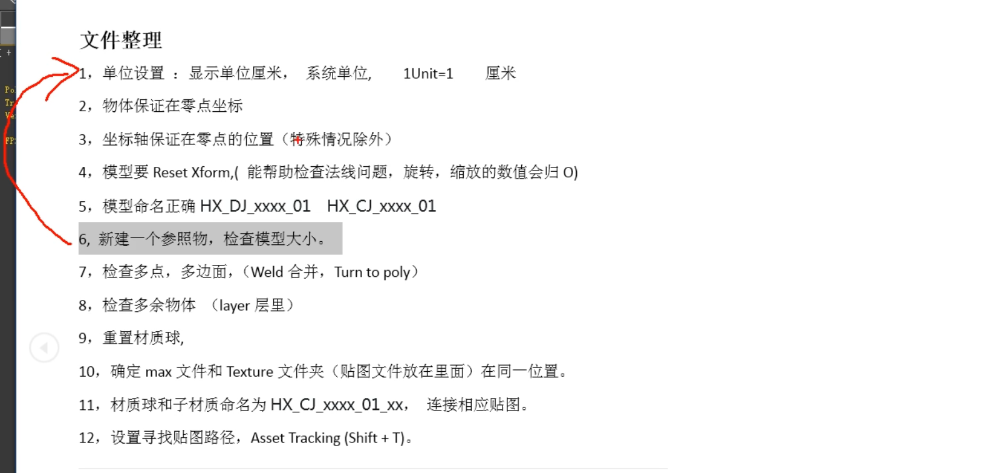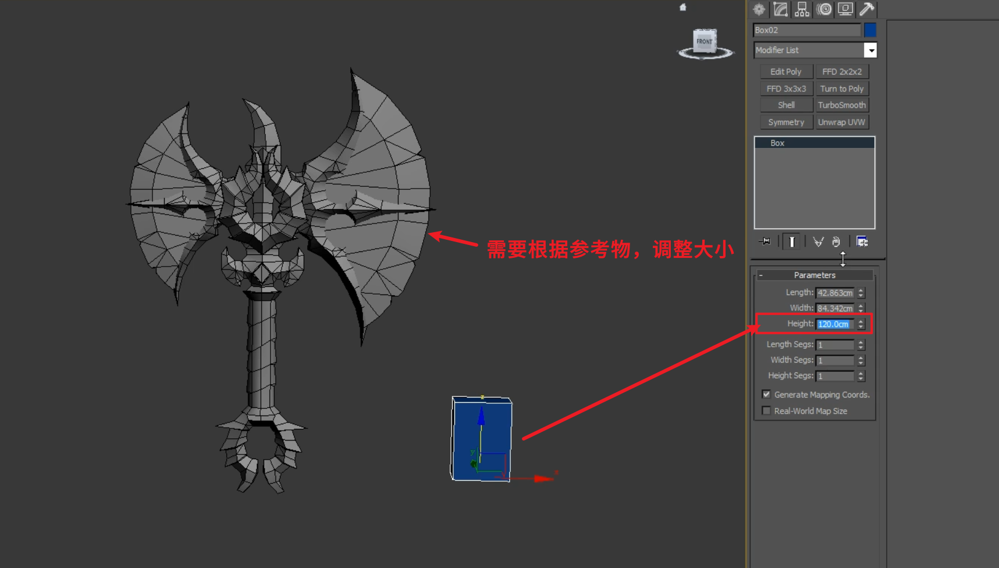

#### 根据现实中的大小创建参照物，再依照参照物，调整物体的缩放

> 

### 7. 检查多点，多边面，(Weld 合并，Turn to poly)

#### 移除多余的点

##### 移除空点（也就是没有任何边的点）

> 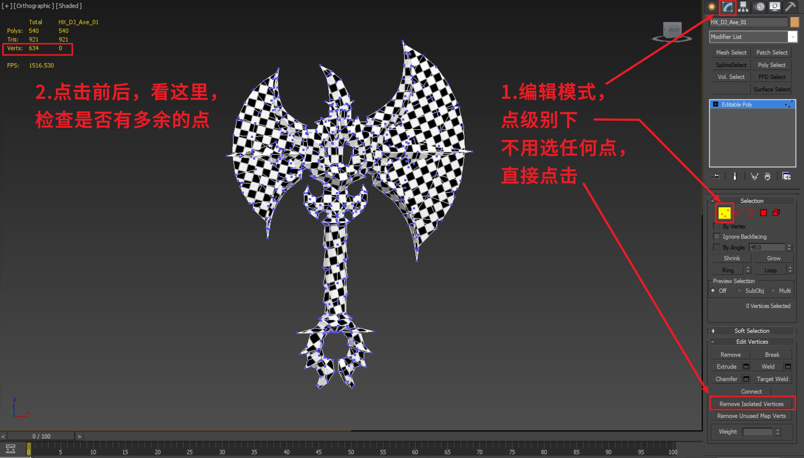

##### 移除叠在一起的点

> 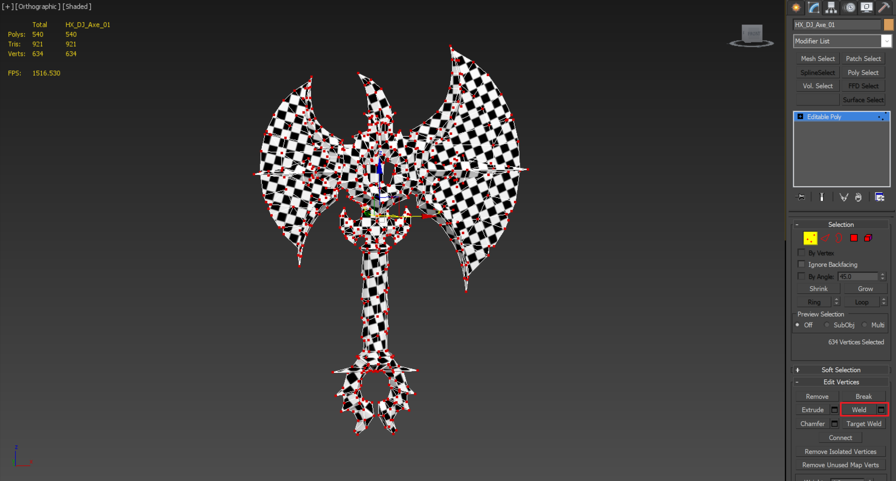
>
> 要给**间距**，不然**0.1cm**有点大，**0.001cm**就可以检测**重叠点**
>
> 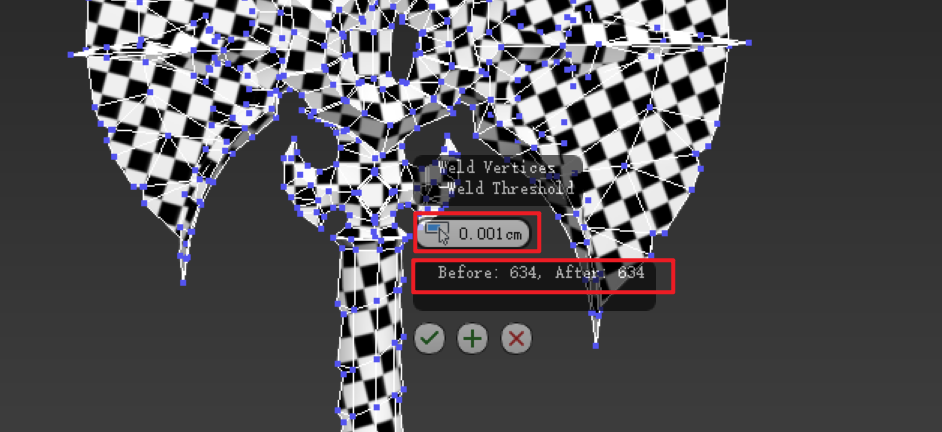

### 检查多边面

> 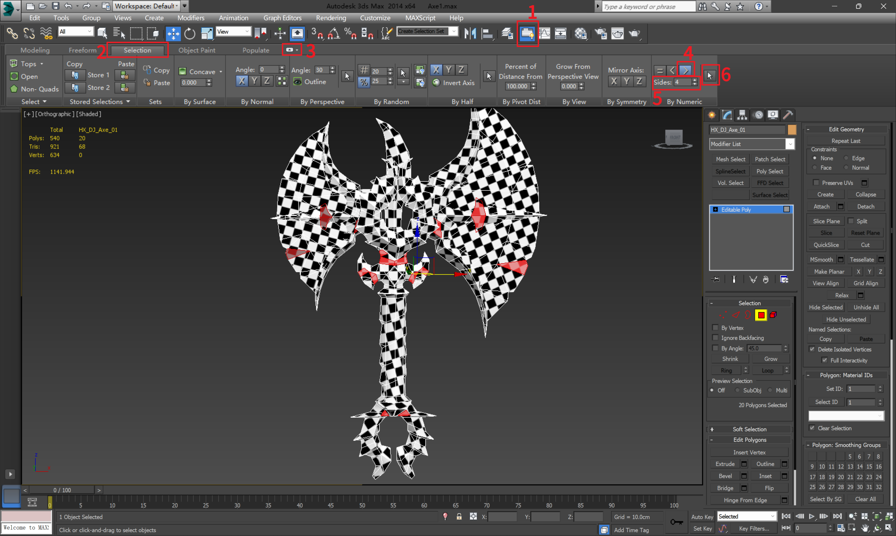
>
> 处理下！！！

### 8. 检查多余物体(layer 层里)

> 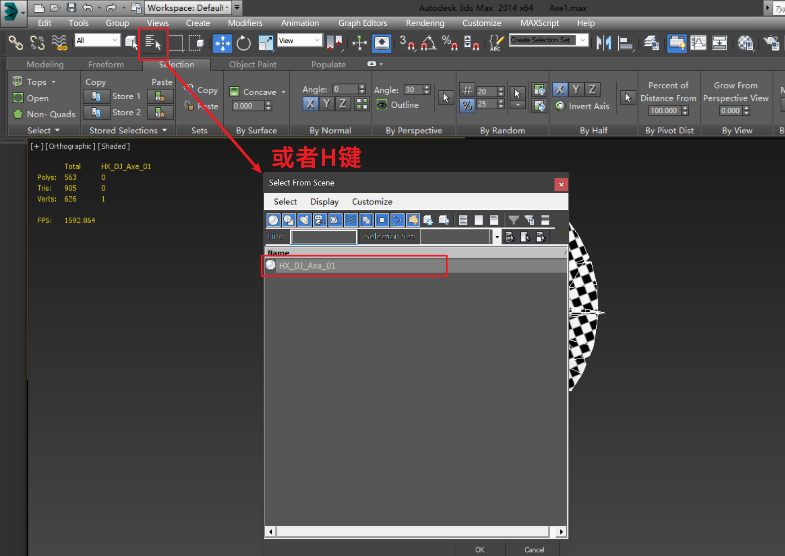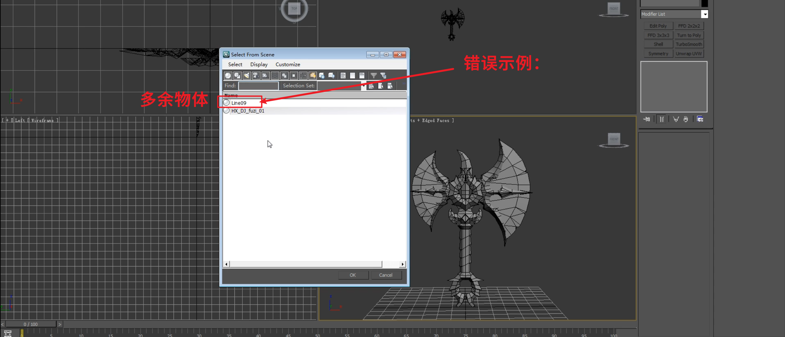

### 9. 重置材质球

> 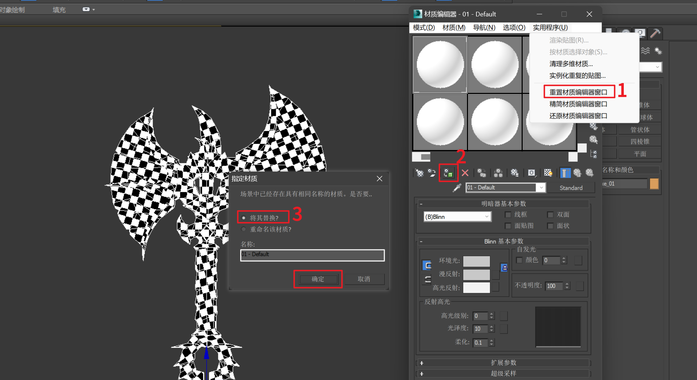

------

### 可以增加预览材质球的窗口个数

> 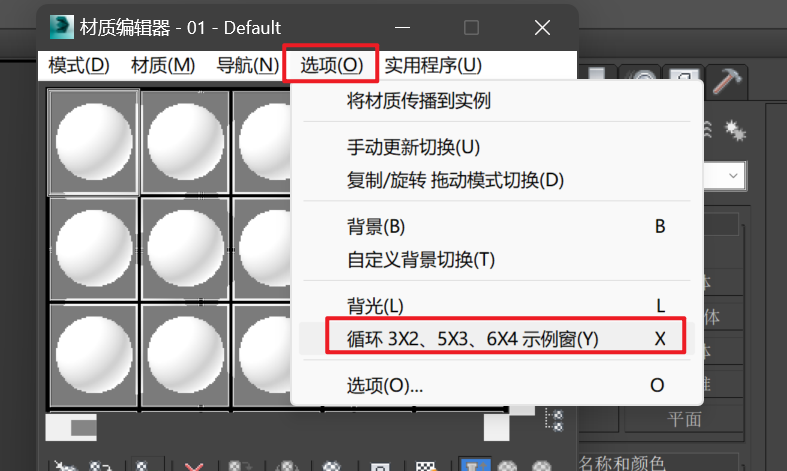

------

### 10. 确定 max 文件和 Texture 文件夹(贴图文件放在里面)在同一位置

> // TODO

### 11. 材质球和子材质命名为 `HX_CJ_xxxx_01_xx`，连接相应贴图。

> // TODO

### 12. 设置寻找贴图路径，AssetTracking(Shift+T)。

> // TODO

### 13. 模型之间的穿插，注意不要漏面

> 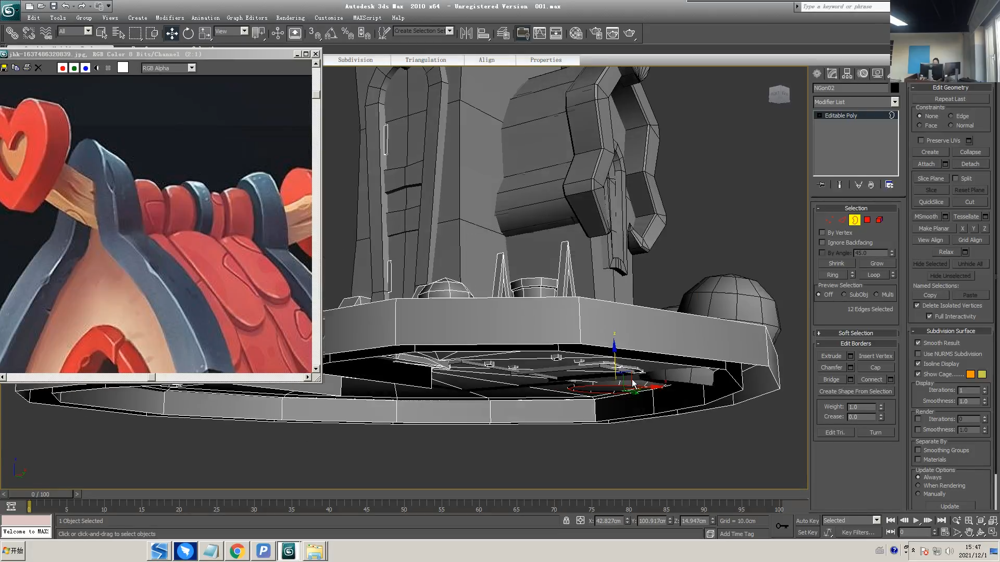

------
