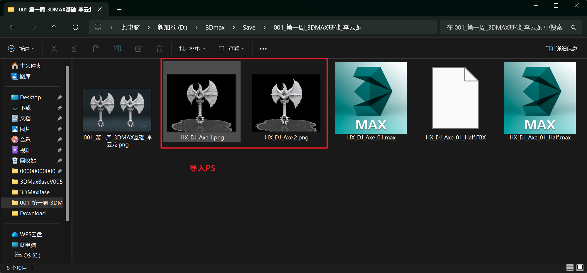

___________________________________________________________________________________________
###### [GoMenu](../3DMaxBasicsMenu.md)
___________________________________________________________________________________________
# 007_使用KeyShot渲染白膜展示


___________________________________________________________________________________________


## 目录

- [007\_使用KeyShot渲染白膜展示](#007_使用keyshot渲染白膜展示)
  - [目录](#目录)
  - [第一步：使用3Dmax渲染线框](#第一步使用3dmax渲染线框)
    - [1. Ctrl+V 拷贝一份](#1-ctrlv-拷贝一份)
    - [2. Alt+Q 孤立目标](#2-altq-孤立目标)
    - [3. 使用"晶格" 修改器](#3-使用晶格-修改器)
      - [调整参数](#调整参数)
    - [3. 给 有厚度的线框 赋予材质](#3-给-有厚度的线框-赋予材质)
    - [4. 然后再取消孤立模式，这样我们的模型就自带线框了](#4-然后再取消孤立模式这样我们的模型就自带线框了)
    - [5. 导出FBX](#5-导出fbx)
  - [安装KeyShot 11.3](#安装keyshot-113)
  - [使用KeyShot导入FBX](#使用keyshot导入fbx)
    - [视口操作](#视口操作)
    - [场景中查看、显示、隐藏 对象](#场景中查看显示隐藏-对象)
    - [1. 设置环境光源](#1-设置环境光源)
    - [2. 开启地面阴影和投影](#2-开启地面阴影和投影)
    - [3. 设置照明](#3-设置照明)
      - [可以直接使用"室内"级别，直接出，不用调](#可以直接使用室内级别直接出不用调)
      - [使用自定义时，推荐参数](#使用自定义时推荐参数)
    - [4. 渲染](#4-渲染)
    - [呼出快捷键面板](#呼出快捷键面板)
  - [需要渲染带线框和无线框版，使用PS放在一起，作为作品集里的作品](#需要渲染带线框和无线框版使用ps放在一起作为作品集里的作品)
  - [作品展示](#作品展示)


------

## 第一步：使用3Dmax渲染线框

> 因为我们的最终目的是使用KeyShot渲染成品的：
>
> - 白膜
> - 白膜+线框
>
> 而KeyShot无法识别线框，需要在3Dmax中复制一份模型转成线框晶体，给一个比较细的厚度，再给上材质一起渲染

------

### 1. Ctrl+V 拷贝一份

> 

### 2. Alt+Q 孤立目标

> 再次点击这里可以取消
>
> 

### 3. 使用"晶格" 修改器

> 中英命名：
>
> 

#### 调整参数

> 

### 3. 给 有厚度的线框 赋予材质

> 

### 4. 然后再取消孤立模式，这样我们的模型就自带线框了

> 

### 5. 导出FBX

> 最常用的：
>
> - FBX
> - OBJ
>
> 

------

## 安装KeyShot 11.3

> 安装参考压缩包内的步骤
>
> 这里放一下我的百度云的链接：
>
> 通过网盘分享的文件：KeyShot Pro WIN
> 链接: 
>
> ```
> https://pan.baidu.com/s/1SS2pjIR606swgLJlF7spAg?pwd=qufy
> ```
>
>  提取码: **qufy**

## 使用KeyShot导入FBX

> 导入前请先检查**多边面**和**重合点**
>
> 非常吃内存，实时渲染光线！！！
>
> 

### 视口操作

> |   功能   |   操作   |
> | :------: | :------: |
> | 旋转视角 | 鼠标左键 |
> | 移动视角 | 鼠标中键 |
> | 缩放视角 | 鼠标滚轮 |

### 场景中查看、显示、隐藏 对象

> 

### 1. 设置环境光源

> 使用**室内**和**室外**多一些
>
> 

### 2. 开启地面阴影和投影

> 

### 3. 设置照明

> 

#### 可以直接使用"室内"级别，直接出，不用调

>  勾选这个即可
>
> 

#### 使用自定义时，推荐参数

> 

### 4. 渲染

> 大小推荐使用：
> # 4500*3142
>
> 也可以使用（但是不建议，高一点好）
>
> - 3840*3208
> - 2560*2138
>
> 
>
> ### 点击渲染后，等待几分钟，完成

------

### 呼出快捷键面板

> 

------

## 需要渲染带线框和无线框版，使用PS放在一起，作为作品集里的作品

> 

------

## 作品展示

> 

------
