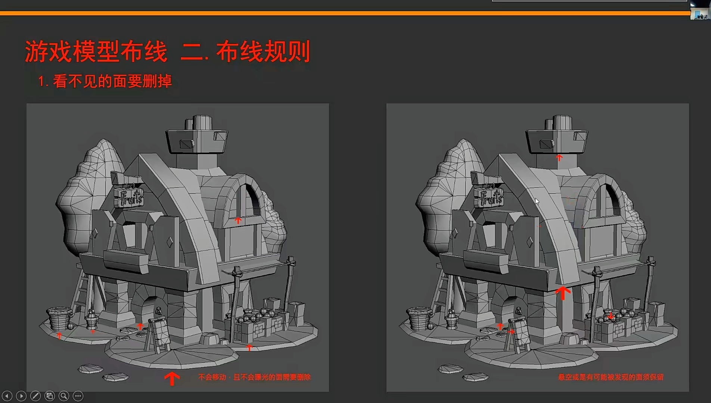
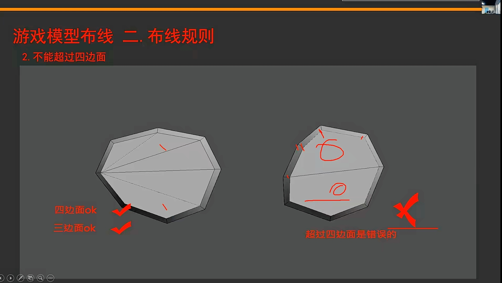
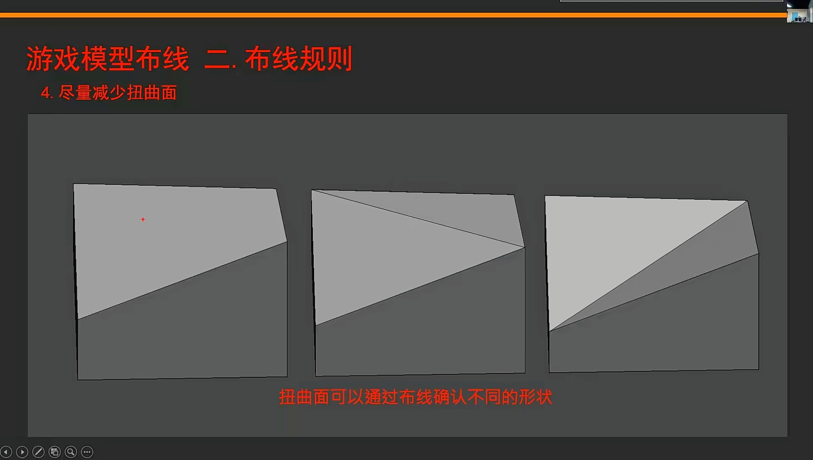
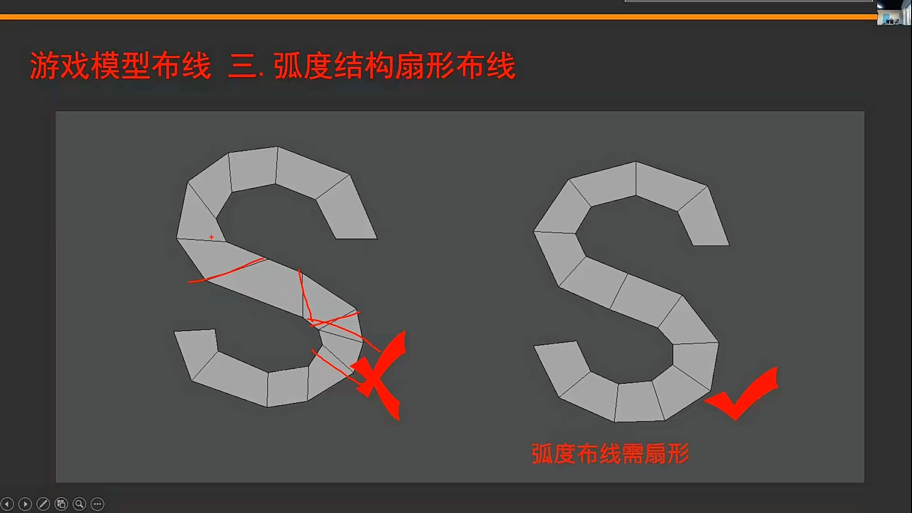
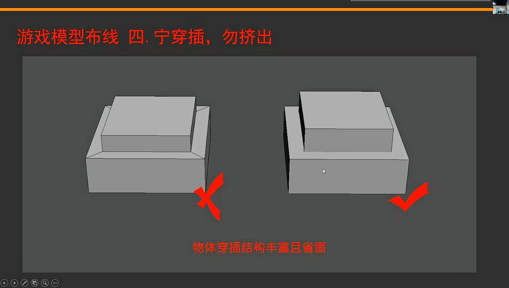
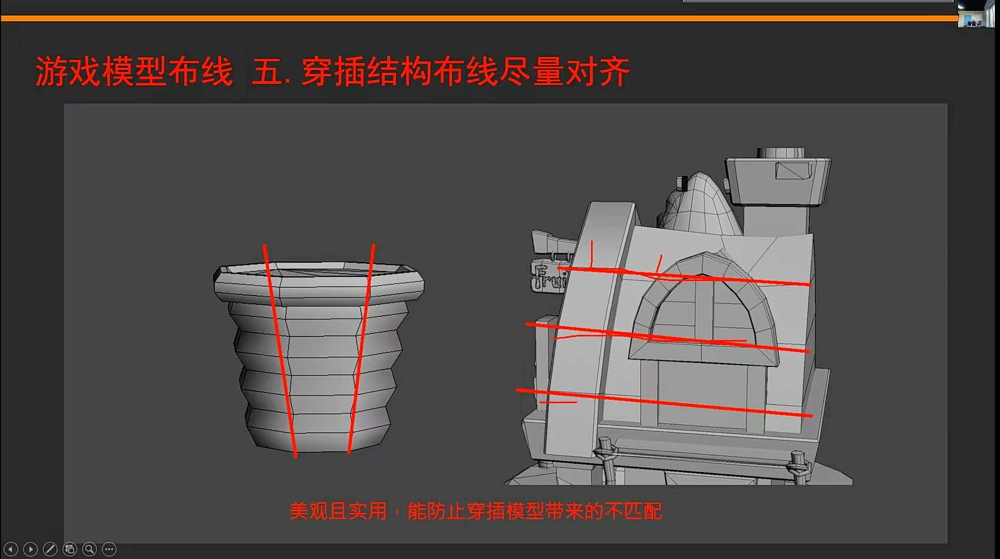
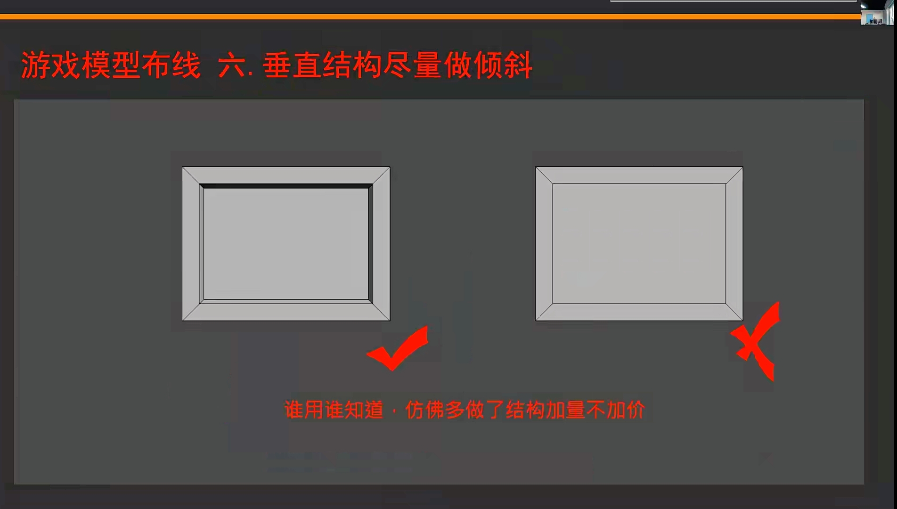

___________________________________________________________________________________________
###### [GoMenu](../3DMaxBasicsMenu.md)
___________________________________________________________________________________________
# 009_建模需要注意的几个重要步骤

___________________________________________________________________________________________

## 目录

- [009\_建模需要注意的几个重要步骤](#009_建模需要注意的几个重要步骤)
  - [目录](#目录)
  - [步骤流程：](#步骤流程)
    - [1. 检查单位是否为  cm](#1-检查单位是否为--cm)
    - [2. 仔细观察原画](#2-仔细观察原画)
    - [3. 看不见的面需要删掉，注意不要让模型穿模！](#3-看不见的面需要删掉注意不要让模型穿模)
    - [4. 拆分部分，将大块拆分为基本几何体](#4-拆分部分将大块拆分为基本几何体)
    - [5. 外侧边缘发亮的部分，可以对线使用切角（使用切角后一定要处理点，容易出问题）](#5-外侧边缘发亮的部分可以对线使用切角使用切角后一定要处理点容易出问题)
    - [6. 避免出现多变面](#6-避免出现多变面)
    - [7. 对结构不产生影响的边要删掉！！！](#7-对结构不产生影响的边要删掉)
    - [8. 不要出现扭曲面！](#8-不要出现扭曲面)
    - [9. 弧度结构扇形布线！](#9-弧度结构扇形布线)
    - [10. 宁穿插勿挤出](#10-宁穿插勿挤出)
    - [11. 穿插结构布线尽量对齐](#11-穿插结构布线尽量对齐)
    - [12. 垂直结构尽量做倾斜](#12-垂直结构尽量做倾斜)
    - [13. 建完模型反复比对原画修改！！！](#13-建完模型反复比对原画修改)

------

## 步骤流程：

### 1. 检查单位是否为  cm

### 2. 仔细观察原画

- 观察各部位之间的比例

### 3. 看不见的面需要删掉，注意不要让模型穿模！

> 

### 4. 拆分部分，将大块拆分为基本几何体

### 5. 外侧边缘发亮的部分，可以对线使用切角（使用切角后一定要处理点，容易出问题）

### 6. 避免出现多变面

> 

### 7. 对结构不产生影响的边要删掉！！！

### 8. 不要出现扭曲面！

> 

### 9. 弧度结构扇形布线！

> 

### 10. 宁穿插勿挤出

> 

### 11. 穿插结构布线尽量对齐

> 

### 12. 垂直结构尽量做倾斜

> 

### 13. 建完模型反复比对原画修改！！！

------