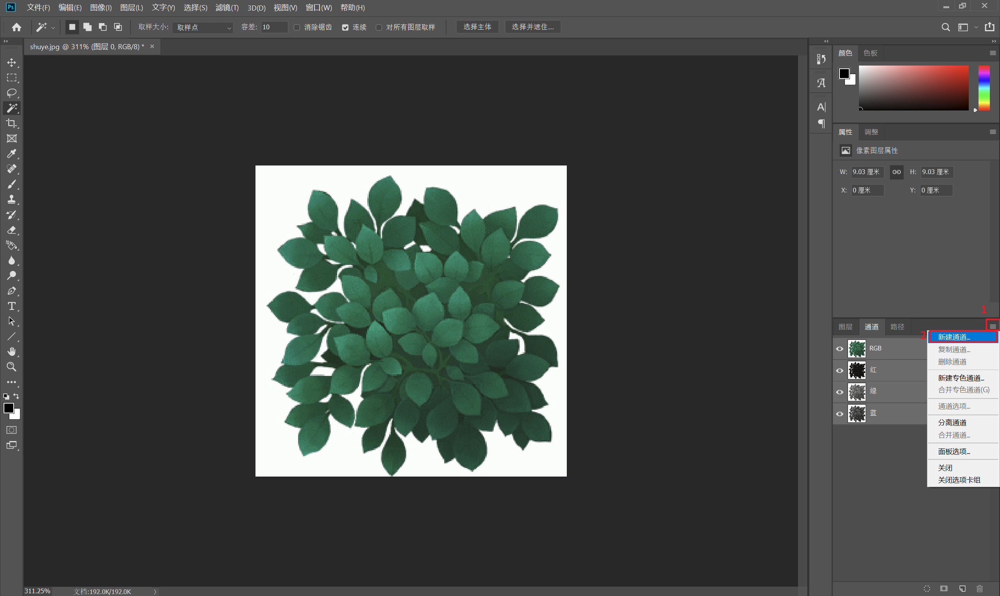

___________________________________________________________________________________________
###### [GoMenu](../3DMaxBasicsMenu.md)
___________________________________________________________________________________________
# 010_透明贴图的使用和制作方法

___________________________________________________________________________________________

## 目录

[TOC]

------

## 介绍下常见的透明贴图

> 

------

## 优点

> 1. 省资源
> 2. 制作难度低
> 3. 效率高

------

## 常用类型

### 1. 花纹

> 

### 2. 植物

> 

### 3. 毛发、眉毛、胡须、披风、破损战旗、羽毛等

> 

------

## 制作透明贴图的步骤

> 可以使用下面这张示例：
> 

### 1. PS打开抠图将白色部分创建Alpha

> 

### 2. 3Dmax中，创建平面，赋予材质

> 
>
> Finish
>
> ### 如果制作植物的话
>
> 可以对角线连接点，然后将中心点调高（金字塔型）
>
> 然后多复制出来几个，调整缩放以后错开放
>
> 大约两到三个就可以有**树**的效果了
>
> 

------

## 购买手绘板推荐

> 初学者200-500左右就可以
>
> 

------

