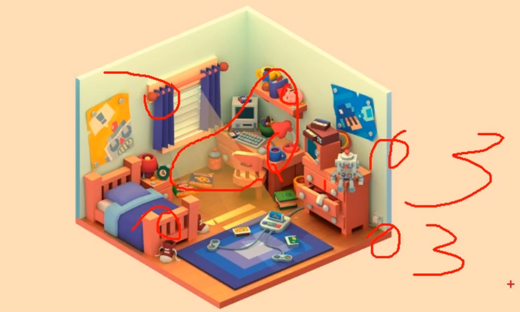

___________________________________________________________________________________________
###### [GoMenu](../3DMaxBasicsMenu.md)
___________________________________________________________________________________________
# 011_模型分组准备上贴图

___________________________________________________________________________________________

## 目录

[TOC]

------

## 贴图要注意：

> 大的拆分成小的，比如：
>
> - 角色的脸、头发、眼睛尽可能地把每部分的贴图独立
> - 制作场景时，按如下状态区分贴图第一组和第二组：
>
> 最常用的大小为 `1024`

## 贴图分区示例：

> |                           场景模型                           | 几张贴图 |                    分组情况                     |
> | :----------------------------------------------------------: | :------: | :---------------------------------------------: |
> |  |    3     |              二楼、一楼、场景杂物               |
> |  |    2     |                 主体、地台+地面                 |
> |  |    2     |                 主体、地台+地面                 |
> |  |    3     |               顶、中间、一楼+地台               |
> |  |    2     |                 顶上、一楼+地台                 |
> |  |    3     | 左侧主题主体房子、后面的二楼+右侧简单建筑、地台 |
> |  |    3     |            墙床窗户、桌子柜子、零件             |
> |  |    1     |                       全                        |
> |  |    1     |                       全                        |
> |  |    2     |             主体、小亭子+地面+零件              |
> |  |    2     |                 主体、地面+零件                 |
> |  |    2     |                 主体、地面+零件                 |
> |  |    1     |                       全                        |
>
> 

------

## 贴图的流程

### 1. 将元素逐个合并为组

> 

### 2. 坐标轴归到0点

> 

------
