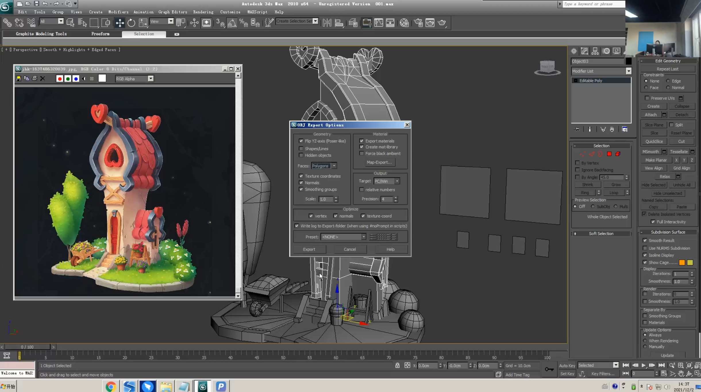
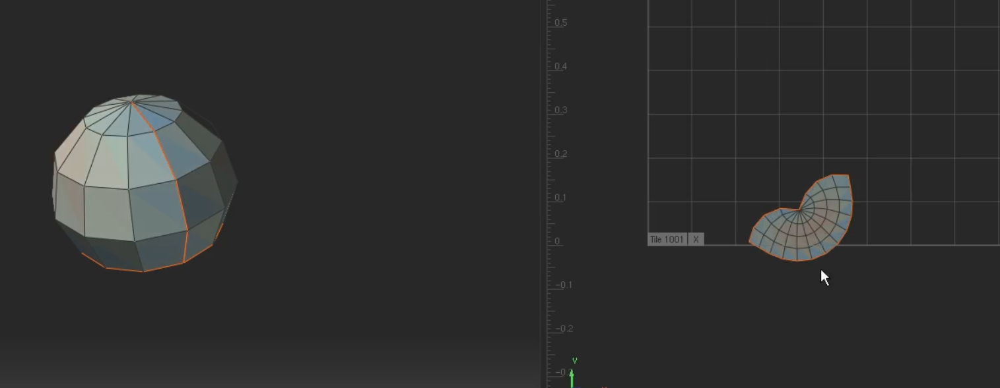

___________________________________________________________________________________________
###### [GoMenu](../3DMaxBasicsMenu.md)
___________________________________________________________________________________________
# 013_使用RizomUV处理UV再导入3Dmax摆放

___________________________________________________________________________________________

## 目录

[TOC]

------

## 检查 合并 重合点

> 

------

## 保留场景中不对称UV的部分，导出Obj准备导入RizomUV

> 

------

## RizomUV中切开UV

> 

------

## RizomUV中展开UV（尽可能打直）

> 

### 基于线的自定义打直（大头针功能）

有的时候，有一条线是直的也比全是弯的容易绘制

> 

#### 一定要尽可能的打直，能提高UV在贴图上的占有率

> 

## 如果UV打直后出现特别红的，可以手动调整点，减弱或消除红色

> 

------

## 导出RizomUV为Obj，3dmax中的这部分元素删除，导入修改后的Obj

------

## 重新摆UV（否则容易在游戏引擎像素溢出以后，出现像素侵占或者像素遗失问题）

> 因为RizomUV的白凤占有率不高，且不是很各个之间的间距较近，容易在游戏引擎像素溢出以后，出现像素侵占或者像素遗失问题从而导致边缘出现黑边！！！！！
>
> 
>
> 高占有率的例子：（但是要注意不要太近！否则会导致边缘溢出，互相侵占）

## 什么是像素溢出

> 

------

## 要点总结

> 1. UV摆放之前:
>    - 把多余的面删除，在uv界面把所有模型移出象限
>    - 模型赋予棋盘格，模型与U同时出现在画面中方便比对
> 2. 分析模型主次物体，次要的和完全不重要的后放。
> 3. 体积大、且在视觉中心UV占有率高，反之，则低
> 4. 打直U，方便摆放
> 5. WV不要重叠，不要压框出框，且要有一定距离(三条绿线)
> 6. 整组模型在视觉范围内，棋盘格差距不能超三倍

------

## 将其余组逐个到RazomUV中处理

> 

------

## 球形的常规切法（背后切开）

> 

------

## RazomUV中打直，导出

> 

------
