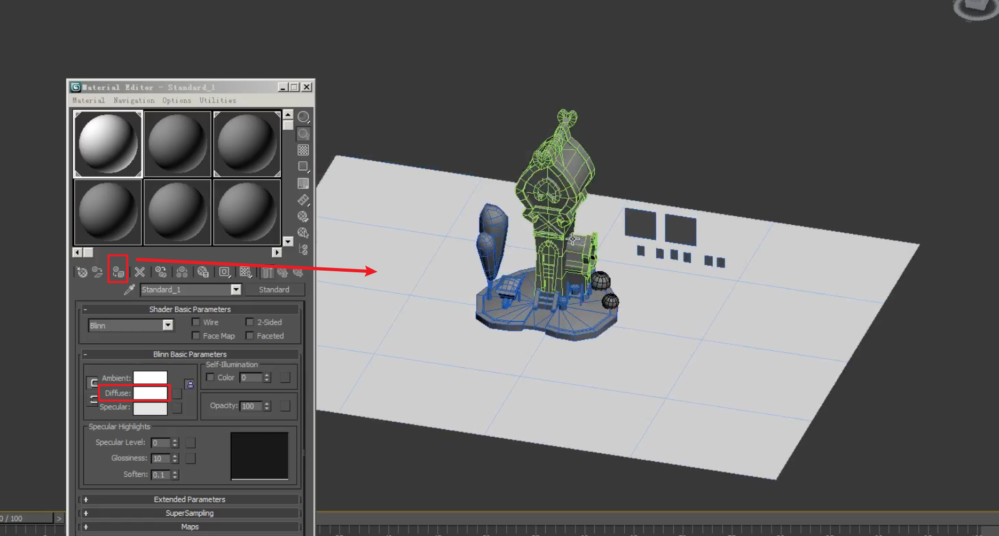

___________________________________________________________________________________________
###### [GoMenu](../3DMaxBasicsMenu.md)
___________________________________________________________________________________________
# 014_标题

___________________________________________________________________________________________

## 目录

[TOC]

------

## 绘制UV流程图

> 1. 模型
> 2. AO
> 3. 材质
> 4. // TODO
> 5. // TODO
>
> 

------

## 处理AO需要注意的问题：

### 处理AO前一定要先处理光滑组！

> 如果没有区分光滑组之后导出AO是错的，错误示例：
>
> 

### 当光滑组失效时（需要重新将对象指定为多边形）

引擎可能失去了对象的多边形链接，需要重新将对象指定为多边形

> 

------

## AO的烘焙：

分为两种情况：

|     是否共用     |                如何做AO                |
| :--------------: | :------------------------------------: |
| 不共用也无对称时 |           直接单个对象烘焙AO           |
|  有对称或共用时  | 尽可能的各部分独立，只携带自身的AO信息 |

### 有对称或共用时：

当两个物体或者一个物体的两面共用一块区域的AO时，需要尽可能的使两边看起来都正常

> 比如下图的情况：
>
> 如果要保留正面的被另一个房子遮挡的信息，那反面就不要能用了，所以，在这时处理AO的话需要隐藏小房子，然后再烘焙AO
>
> 
>
> 比如假如下图这种情况：
>
> | 物体 | AO共用情况  | AO涵盖信息 |
> | ---- | ----------- | ---------- |
> | A    | A、B1共用AO | 自身+B1    |
> | B1   | A、B1共用AO | 自身+C+A   |
> | C    | 单独        | C+B1       |
>
> 此时，B1的AO非常的复杂，没法给别的使用，所以，拷贝了一份放在原处，保证只有自身的AO信息（也就是下图B2）
>
> 
>
> 只需要渲染C和B2的AO即可，这样分配烘焙后的AO：
>
> | 物体 | AO分配 |
> | ---- | ------ |
> | A    | B2     |
> | B1   | B2     |
> | C    | C      |
>
> ### 也就是说当共用时，只是用自身的AO忽略与其他物体交互部分的光影信息，如下图：
>
> 茶壶就没有其他杯子重叠部分的阴影，杯子和杯子之间也没有阴影信息，每个物体只有包含自身阴影信息的AO！
>
> ### 

------

## 第一步：烘焙AO前先检查模型

> ### 烘焙前要保证：
>
> 1. **光滑组**没问题
> 2. 对称部分不能缺失（也就是**不能只搞一半**），比如下图这种错误示例：

### 如果需要对称，可以将对称部分从当前组解除以后再对称，这样会使用一样的UV

------

## 第二步：烘焙AO

### 1. 添加一个平面，作为地面（可以挡住天光）

不要和模型之间贴合，也能不要穿插，保持一点距离

> 

### 2. 地面需要赋予一个白色的材质球

> 

### 3. 整体拷贝出来一个放在旁边备份，防止后面不小心的修改

### 4. 将复用部分独立出来

> 

### 5. 添加天光（只有一个，不要添加多了！）

> 

### 6.天光一定要启用阴影

> 

### 确认当前是否为光影模式

> 如果不是的话，需要[检查光影模式](./3DMaxBaseV002.md\#平光模式-和-光影模式-的切换)

------

## 小标题

> 

------

## 小标题

> 

------

## 小标题

> 

------

## 小标题

> 

------

## 小标题

> 

------

## 小标题

> 

------

## 小标题

> 

------

## 小标题

> 

------

## 小标题

> 

------

## 小标题

> 

------

## 小标题

> 

------

## 小标题

> 

------

## 小标题

> 

------

## 小标题

> 

------

## 小标题

> 

------

## 小标题

> 

------

## 小标题

> 

------

## 小标题

> 

------

## 小标题

> 

------

## 小标题

> 

------

## 小标题

> 

------

## 小标题

> 

------

## 小标题

> 

------

## 小标题

> 

------

## 小标题

> 

------

## 小标题

> 

------

## 小标题

> 

------

## 小标题

> 

------

## 小标题

> 

------

## 小标题

> 

------

## 小标题

> 

------

## 小标题

> 

------

## 小标题

> 

------

## 小标题

> 

------

## 小标题

> 

------

## 小标题

> 

------

## 小标题

> 

------

## 小标题

> 

------

## 小标题

> 

------

## 小标题

> 

------

## 小标题

> 

------

## 小标题

> 

------

## 小标题

> 

------

## 小标题

> 

------

## 小标题

> 

------

## 小标题

> 

------

## 小标题

> 

------

## 小标题

> 

------

## 小标题

> 

------

## 小标题

> 

------

## 小标题

> 

------

## 小标题

> 

------

## 小标题

> 

------

## 小标题

> 

------

## 小标题

> 

------

## 小标题

> 

------

## 小标题

> 

------

## 小标题

> 

------

## 小标题

> 

------

## 小标题

> 

------

## 小标题

> 

------

## 小标题

> 

------

## 小标题

> 

------

## 小标题

> 

------

## 小标题

> 

------

## 小标题

> 

------

## 小标题

> 

------

## 小标题

> 

------

## 小标题

> 

------

## 小标题

> 

------

## 小标题

> 

------

## 小标题

> 

------

## 小标题

> 

------

## 小标题

> 

------

## 小标题

> 

------
