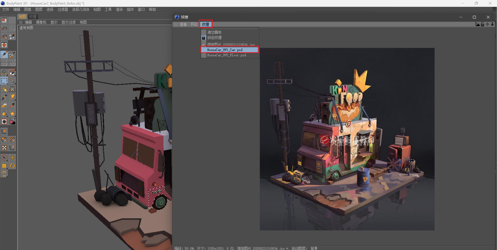
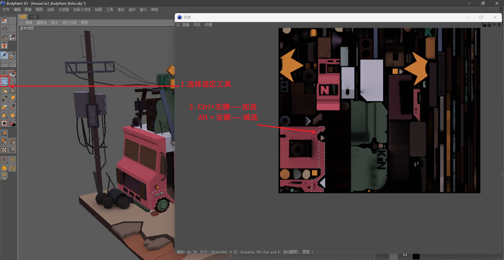
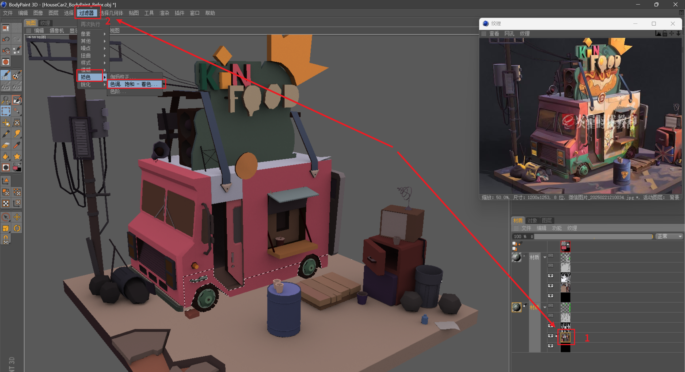
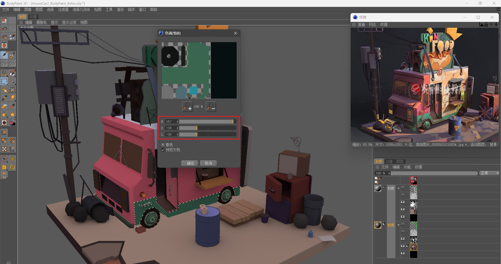
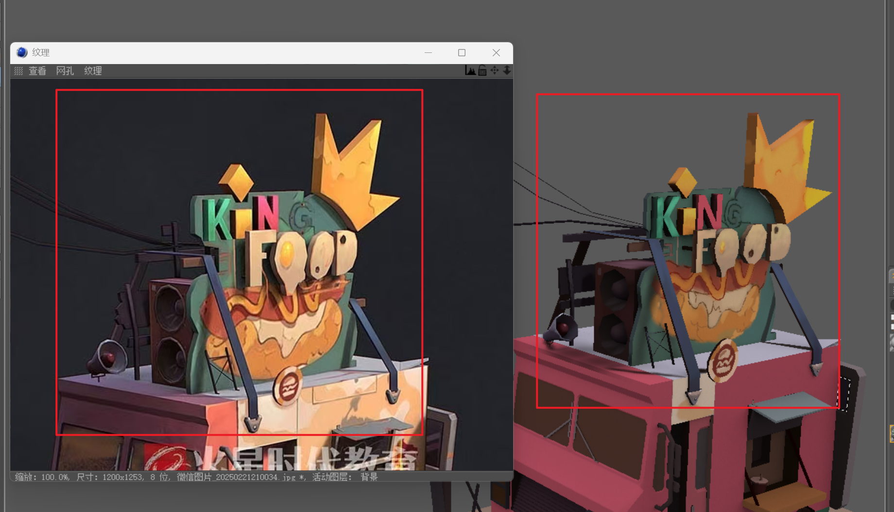

___________________________________________________________________________________________
###### [GoMenu](../3DMaxBasicsMenu.md)
___________________________________________________________________________________________
# 016_标题

___________________________________________________________________________________________

## 目录

[TOC]

------

## 选择部分纹理区域，调色

> 
>
> 也可以直接在纹理中使用曲线选择，来区域绘制

------

## 选择选区然后使画笔吸色并绘制

> 

------

## 小标题

> 

------

## 小标题

> 

------

## 小标题

> 

------

## 小标题

> 

------

## 小标题

> 

------

## 小标题

> 

------

## 小标题

> 

------

## 小标题

> 

------

## 小标题

> 

------

## 小标题

> 

------

## 小标题

> 

------

## 小标题

> 

------

## 小标题

> 

------

## 小标题

> 

------

## 小标题

> 

------

## 小标题

> 

------

## 小标题

> 

------

## 小标题

> 

------

## 小标题

> 

------

## 小标题

> 

------

## 小标题

> 

------

## 小标题

> 

------

## 小标题

> 

------

## 小标题

> 

------

## 小标题

> 

------

## 小标题

> 

------

## 小标题

> 

------

## 小标题

> 

------

## 小标题

> 

------

## 小标题

> 

------

## 小标题

> 

------

## 小标题

> 

------

## 小标题

> 

------

## 小标题

> 

------

## 小标题

> 

------

## 小标题

> 

------

## 小标题

> 

------

## 小标题

> 

------

## 小标题

> 

------

## 小标题

> 

------

## 小标题

> 

------

## 小标题

> 

------

## 小标题

> 

------

## 小标题

> 

------

## 小标题

> 

------

## 小标题

> 

------

## 小标题

> 

------

## 小标题

> 

------

## 小标题

> 

------

## 小标题

> 

------

## 小标题

> 

------

## 小标题

> 

------

## 小标题

> 

------

## 小标题

> 

------

## 小标题

> 

------

## 小标题

> 

------

## 小标题

> 

------

## 小标题

> 

------

## 小标题

> 

------

## 小标题

> 

------

## 小标题

> 

------

## 小标题

> 

------

## 小标题

> 

------

## 小标题

> 

------

## 小标题

> 

------

## 小标题

> 

------

## 小标题

> 

------

## 小标题

> 

------

## 小标题

> 

------

## 小标题

> 

------

## 小标题

> 

------

## 小标题

> 

------

## 小标题

> 

------

## 小标题

> 

------

## 小标题

> 

------

## 小标题

> 

------

## 小标题

> 

------

## 小标题

> 

------
