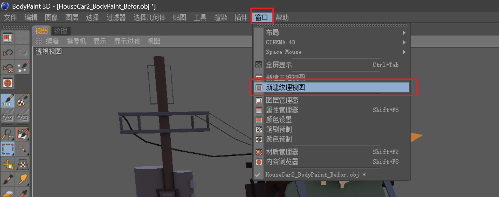
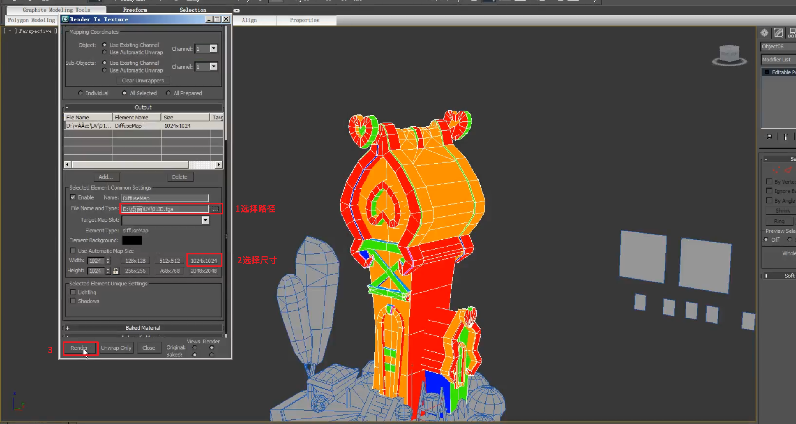

___________________________________________________________________________________________
###### [GoMenu](../3DMaxBasicsMenu.md)
___________________________________________________________________________________________
# 016_色相偏移、明暗绘制技巧、ID图渲染、渲染原画光源角度AO

___________________________________________________________________________________________

## 目录

- [016\_色相偏移、明暗绘制技巧、ID图渲染、渲染原画光源角度AO](#016_色相偏移明暗绘制技巧id图渲染渲染原画光源角度ao)
  - [目录](#目录)
  - [选择部分纹理区域，调色](#选择部分纹理区域调色)
  - [选择选区然后使画笔吸色并绘制](#选择选区然后使画笔吸色并绘制)
  - [分层绘画逻辑](#分层绘画逻辑)
  - [ID贴图烘焙](#id贴图烘焙)
    - [1. 在3Dmax中重新分配光滑组](#1-在3dmax中重新分配光滑组)
    - [2. 选中不同光滑组的面分别给上材质](#2-选中不同光滑组的面分别给上材质)
    - [3. 按8切换为平光模式](#3-按8切换为平光模式)
    - [4. 选中模型按0渲染ID图层](#4-选中模型按0渲染id图层)
      - [（1）激活图层](#1激活图层)
      - [（2）添加`Diffuse`通道](#2添加diffuse通道)
      - [（3）选择渲染位置和尺寸](#3选择渲染位置和尺寸)
    - [5. 导入PS命名为ID层,保存，完成！](#5-导入ps命名为id层保存完成)
  - [明暗绘制技巧](#明暗绘制技巧)
    - [常用到`色相偏移`](#常用到色相偏移)
  - [色相偏移绘制技巧](#色相偏移绘制技巧)
    - [`颜色偏移色盘`](#颜色偏移色盘)
    - [`颜色偏移表`：](#颜色偏移表)
  - [绘制明暗部分实操](#绘制明暗部分实操)
    - [亮部的绘制技巧：](#亮部的绘制技巧)
    - [暗部的绘制技巧：](#暗部的绘制技巧)
  - [分图层绘制，便于使用橡皮擦局部修改](#分图层绘制便于使用橡皮擦局部修改)
  - [打一盏模拟光源，渲染出模拟原画角度的AO帮助绘制](#打一盏模拟光源渲染出模拟原画角度的ao帮助绘制)
    - [1. 对象给上默认材质](#1-对象给上默认材质)
    - [2. 场景中要有一个天光](#2-场景中要有一个天光)
      - [调整天光亮度](#调整天光亮度)
    - [3. 添加平行光修改配置光源](#3-添加平行光修改配置光源)
    - [4. `F10`设置画面渲染](#4-f10设置画面渲染)
    - [5. 渲染](#5-渲染)

------

## 选择部分纹理区域，调色

> 
>
> 也可以直接在纹理中使用曲线选择，来区域绘制

------

## 选择选区然后使画笔吸色并绘制

> 

------

## 分层绘画逻辑

> - AO之上放**阴影和高光的手绘**
> - AO之下只放**基础颜色**，也就是**固有色**
>
> 

------

## ID贴图烘焙

### 1. 在3Dmax中重新分配光滑组

将不同的区域之间使用光滑组隔开

### 2. 选中不同光滑组的面分别给上材质

> 按M呼出材质界面先创建几种颜色材质，然后面级别下，逐个选中光滑组，赋予材质

### 3. 按8切换为平光模式

> 

### 4. 选中模型按0渲染ID图层

#### （1）激活图层

> 

#### （2）添加`Diffuse`通道

> 

#### （3）选择渲染位置和尺寸

> 

### 5. 导入PS命名为ID层,保存，完成！

> 

------

## 明暗绘制技巧

### 常用到`色相偏移`

什么是色相偏移？

> 下图的两哥颜色过渡，上面的这个是正常明暗过渡，下面的是色相偏移的，可以发现：
>
> | 过渡绘制方法： |         缺点         |                       优点                       |
> | :------------: | :------------------: | :----------------------------------------------: |
> |      明暗      |   颜色发灰，看着脏   |              好绘制（尽量不要用！）              |
> |    色相偏移    | 颜色偏移方向不好掌握 | 颜色不发灰、符合日常生活中的色相变化和常识、好看 |
>
> 

------

## 色相偏移绘制技巧

### `颜色偏移色盘`

> 首先牢记一张色谱：
>
> 
>
> - 左侧为冷色，右侧为暖色
> - 中性色（万能色！）：黄色、紫色（上下两个）（在冷色中偏暖、暖色中偏冷）
>   - 高光往黄色偏，不会错
>   - 暗部往紫色偏，不会错
>
> 当基础色为以下颜色时，亮色和暗色的颜色偏移方向为：

### `颜色偏移表`：

> | 基础色 | 亮色方向 | 暗色方向 |
> | ------ | -------- | -------- |
> | 橙色   | 黄色     | 红色     |
> | 红色   | 橙色     | 紫色     |
> | 蓝色   | 绿色     | 紫色     |
> | 绿色   | 黄色     | 蓝色     |
>
> 举个栗子：
>
> 

------

## 绘制明暗部分实操

### 亮部的绘制技巧：

> 吸取图中亮部颜色，手动往黄色方向偏移然后再向下边吸边画，画出过渡
>
> 

### 暗部的绘制技巧：

- 第一步：先吸取亮部区域的偏暗部分的颜色，往暗部画一笔
- 第二步：吸取画的这笔边缘的过渡色，再边吸边画，过渡到暗部

> 第一步：
>
> 第二步：

------

## 分图层绘制，便于使用橡皮擦局部修改

> 

------

## 打一盏模拟光源，渲染出模拟原画角度的AO帮助绘制

### 1. 对象给上默认材质

### 2. 场景中要有一个天光

#### 调整天光亮度

> 

### 3. 添加平行光修改配置光源

> 1. 第一次点击为光源位置
> 2. 第二次点击为照射到的体置，建议照到地面上，需要覆盖场景
> 3. 打开阴影
> 4. 选择区域阴影
> 5. 光照强度调低，设为0.6
> 6. 调整内圈外圈范围
>    - 内圈：光源直射范围
>    - 外圈：光源衰减范围（外圈尽量包含整个场景否则会有部分纯黑）
> 7. 调整光源到合适的角度
>
> 

### 4. `F10`设置画面渲染

> 点击Render，用来查看光线
>
> 

### 5. 渲染

> 这里走和之前渲染AO一样的流程：[查看渲染AO流程](./3DMaxBaseV014.md#7-选中对象按0渲染目标对象的ao)
>
> 渲染完后再重新导入`PS`然后导入`BodyPaint`

------
