___________________________________________________________________________________________
###### [GoMenu](../3DMaxBasicsMenu.md)
___________________________________________________________________________________________
# 017_结构线的画法、PS帮助处理各种纹理

___________________________________________________________________________________________

## 目录

- [017\_结构线的画法、PS帮助处理各种纹理](#017_结构线的画法ps帮助处理各种纹理)
  - [目录](#目录)
  - [结构线的绘制技巧（新建图层搞！）](#结构线的绘制技巧新建图层搞)
    - [绘制伤口参考：](#绘制伤口参考)
    - [结构线也可以使用画线工具，画完后调整图层不透明度，然后用橡皮擦去部分](#结构线也可以使用画线工具画完后调整图层不透明度然后用橡皮擦去部分)
  - [关于石头和木头的手绘结构线，可以上网搜下魔兽世界相关原画](#关于石头和木头的手绘结构线可以上网搜下魔兽世界相关原画)
  - [木纹绘制](#木纹绘制)
  - [金属的画法（太难了我形容不了）](#金属的画法太难了我形容不了)
  - [瓦片的搞法](#瓦片的搞法)
  - [木头、金属、瓦片、石头的画法总结思路](#木头金属瓦片石头的画法总结思路)
  - [画小花](#画小花)
    - [自己绘制的方法](#自己绘制的方法)
    - [可以上网找一些，然后PS处理（这个适合我）](#可以上网找一些然后ps处理这个适合我)

------

## 结构线的绘制技巧（新建图层搞！）

几乎每一个面的边都有结构线（受光的影响就会在边缘产生结构线！）

> 1. **新建图层**
> 2. 吸取颜色，往浅一点的颜色取色，再根据[颜色偏移表](./3DMaxBaseV016.md#颜色偏移色盘)，往亮色部分再做一些偏移，慢慢绘制
> 3. 可以使用橡皮擦，擦去多余部分
> 4. 伤口部分，暗部取同元素中稍微深一点的颜色，然后也要画结构线
> 5. 伤口的亮面暗面颜色不同，需要注意！
>
> 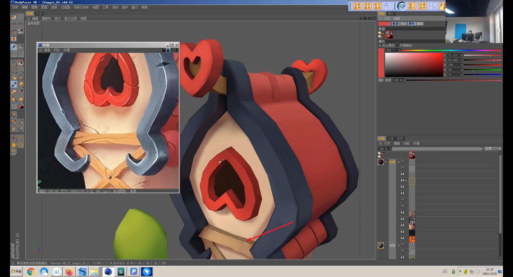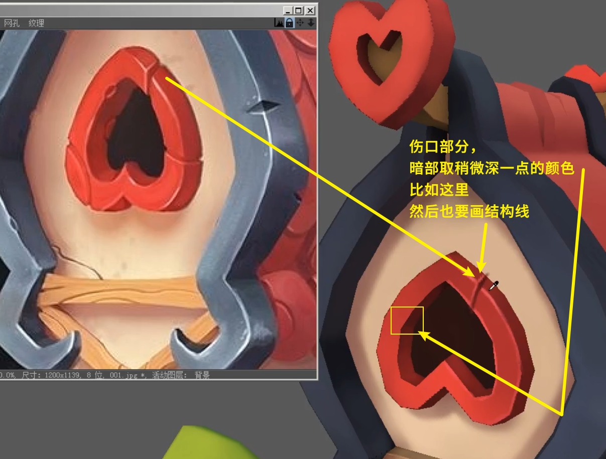

### 绘制伤口参考：

> 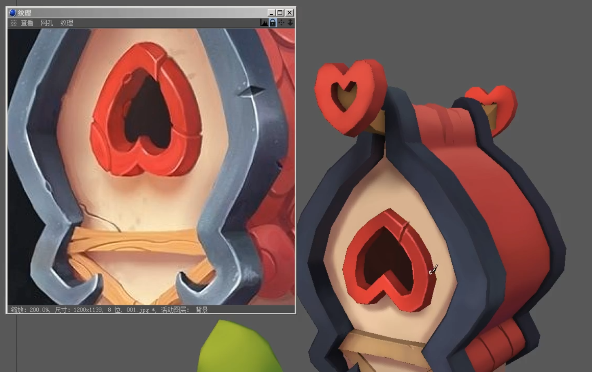

### 结构线也可以使用画线工具，画完后调整图层不透明度，然后用橡皮擦去部分

> 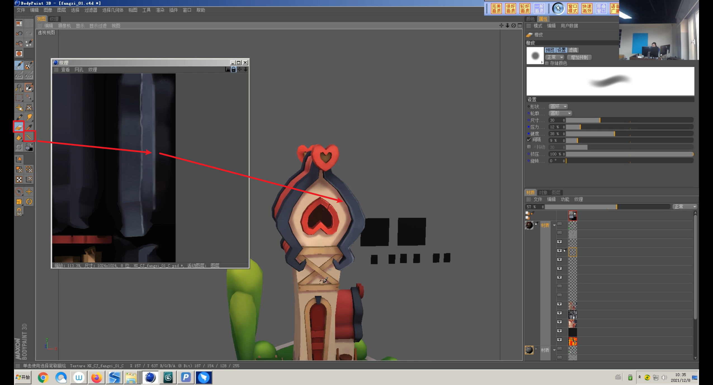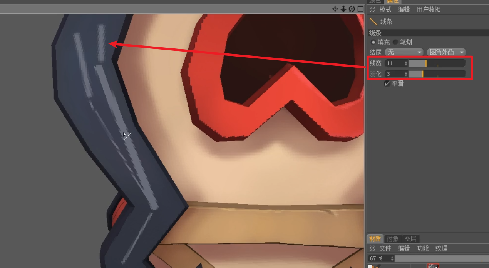

------

## 关于石头和木头的手绘结构线，可以上网搜下魔兽世界相关原画

> 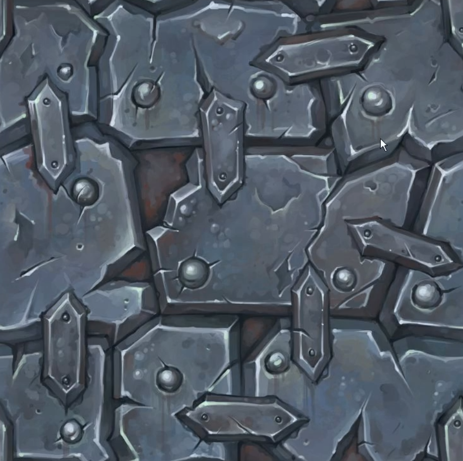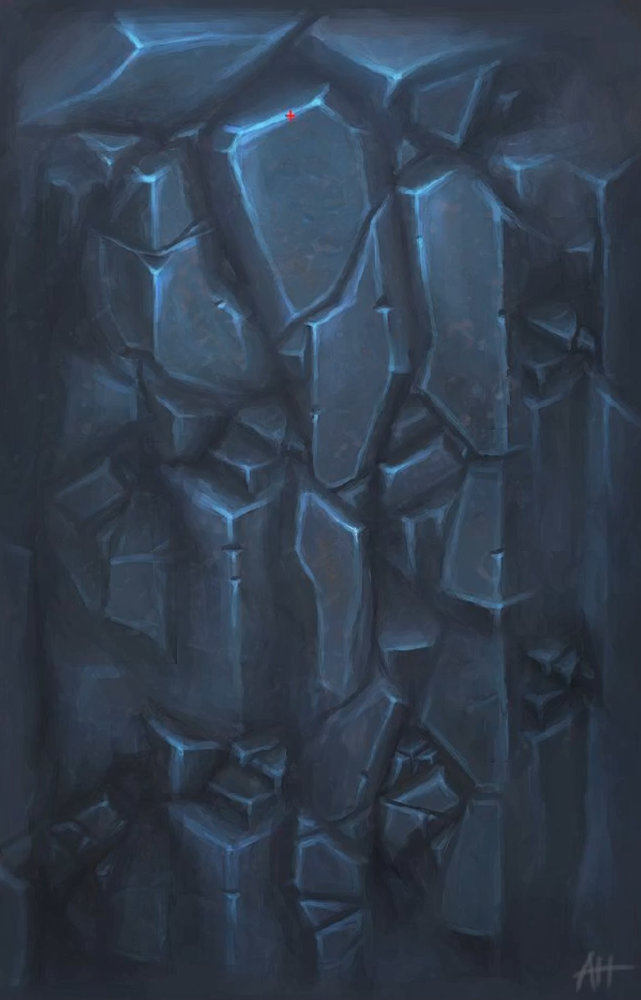

------

## 木纹绘制

可以在最后调整图层整体透明度

> 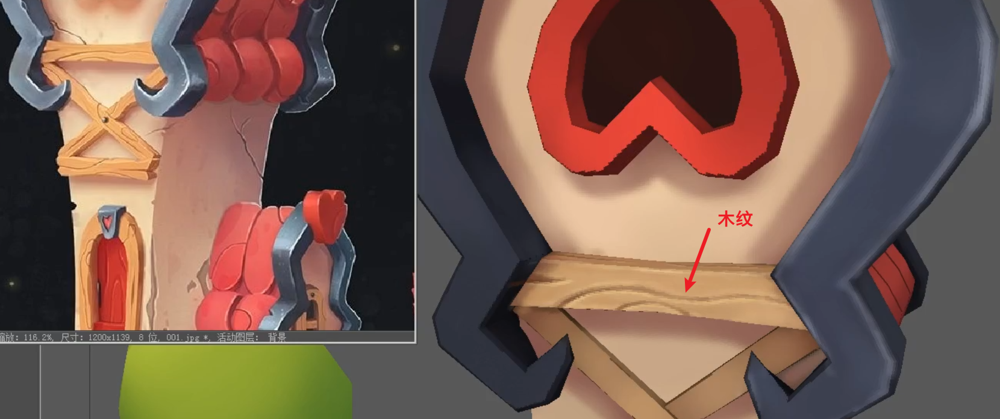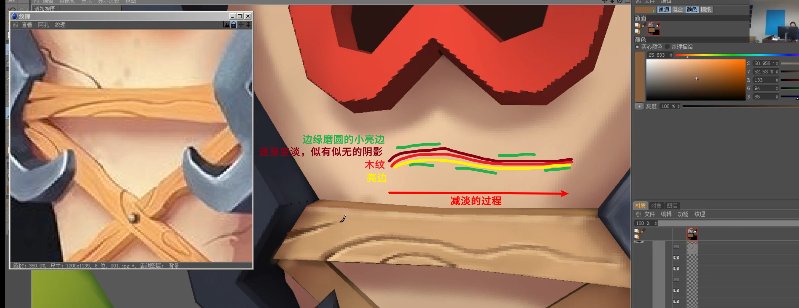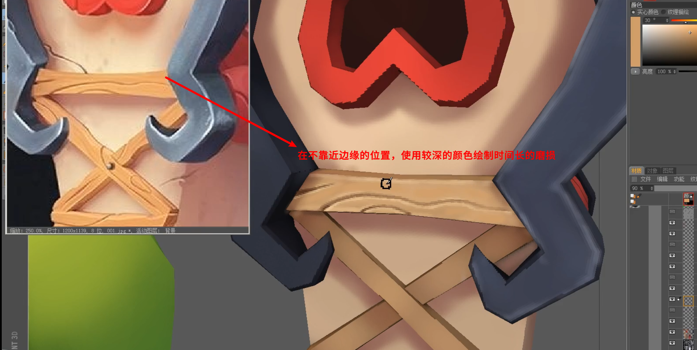

------

## 金属的画法（太难了我形容不了）

第三周第三天上午讲的，1：29：00~1：38：00，建议自己听，救命

但是我想到一个方法，可以去ps里面直接找个贴图给上，哈哈哈

> 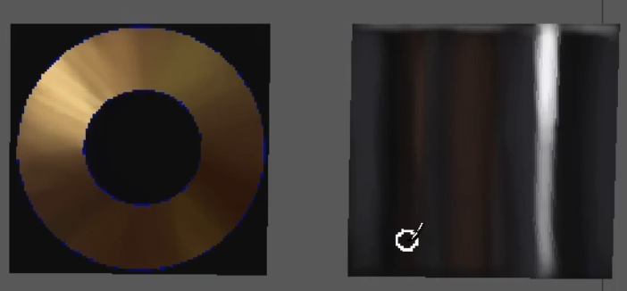

------

## 瓦片的搞法

可以整一个，然后去PS里面铺，甚至可以使用投影啥的，哈哈哈（偷懒大法）

> 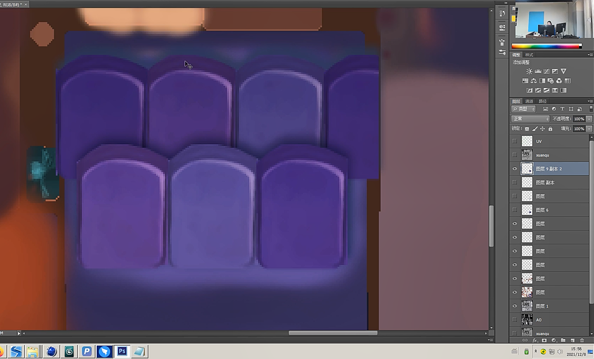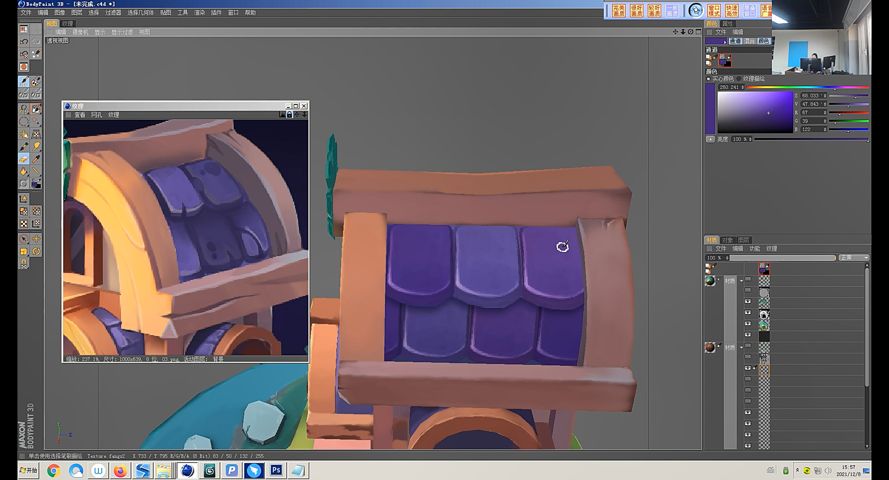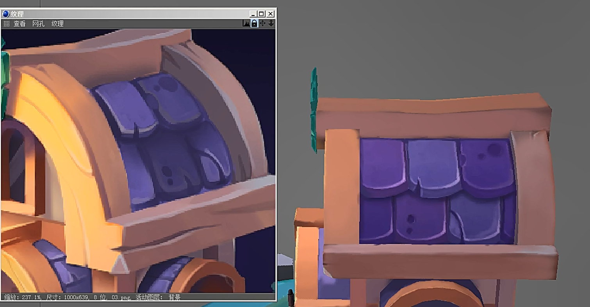

------

## 木头、金属、瓦片、石头的画法总结思路

> - 木头：刻画木纹→ 有亮必有暗，有结构线。在木头边缘位置刻痕最为明显，中间位置相反( 使用图层 透明度以及橡皮)
> - 金属：刻画金属→ 边缘结构线尤为明显，且高光又细又亮
> - 瓦片：刻画瓦片→ 暗面的大小最下面厚度最厚，侧面较为薄，结构线断断续续
> - 石头：刻画石头→笔刷硬一点，笔触干净，面与面之间转折生硬
> - 晶体：刻画晶体→ 接近高光的位置暗下面亮(上暗下亮)  高光对角线(折射原理)高光 会有清晰边缘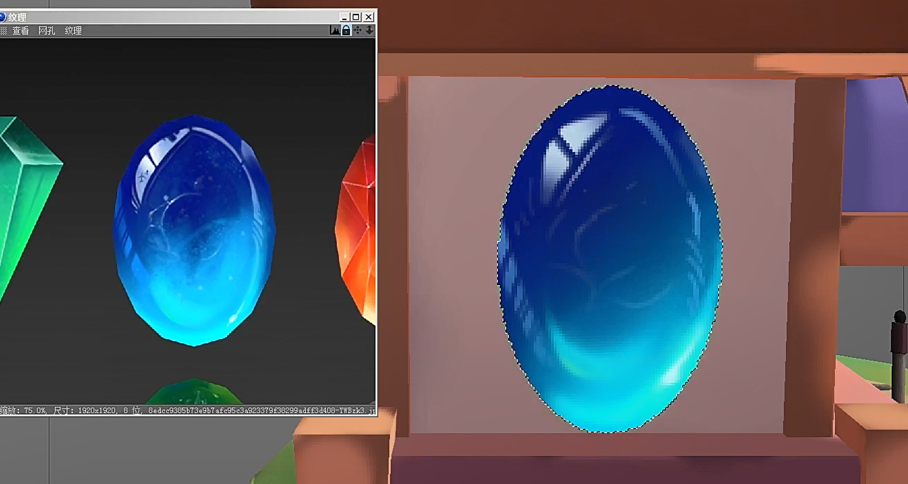

------

## 画小花

### 自己绘制的方法

> 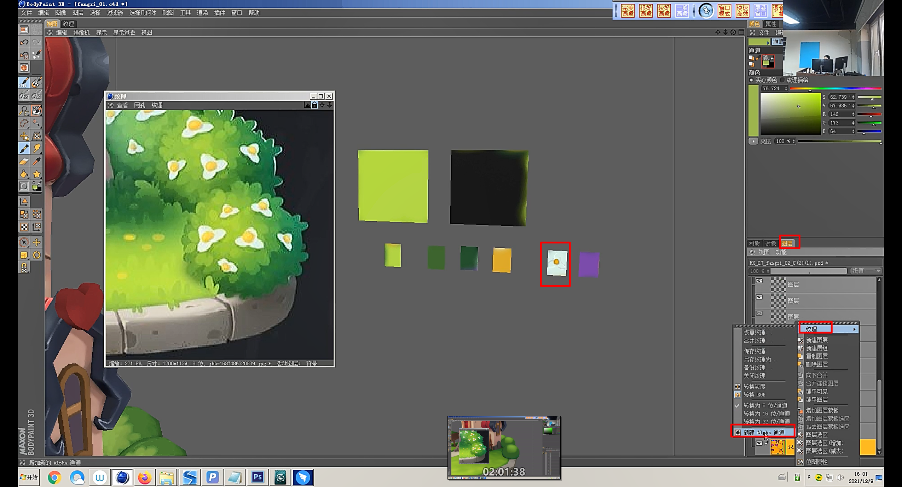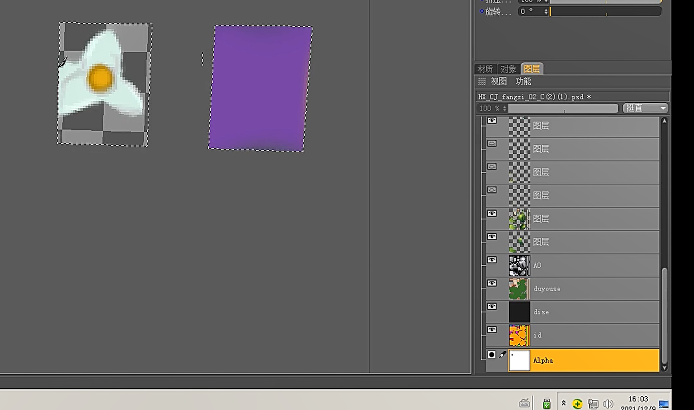
>
> 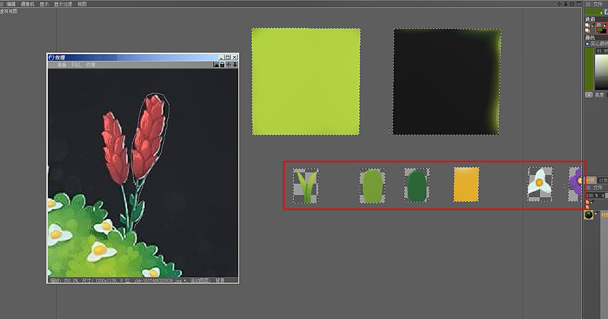

### 可以上网找一些，然后PS处理（这个适合我）

> 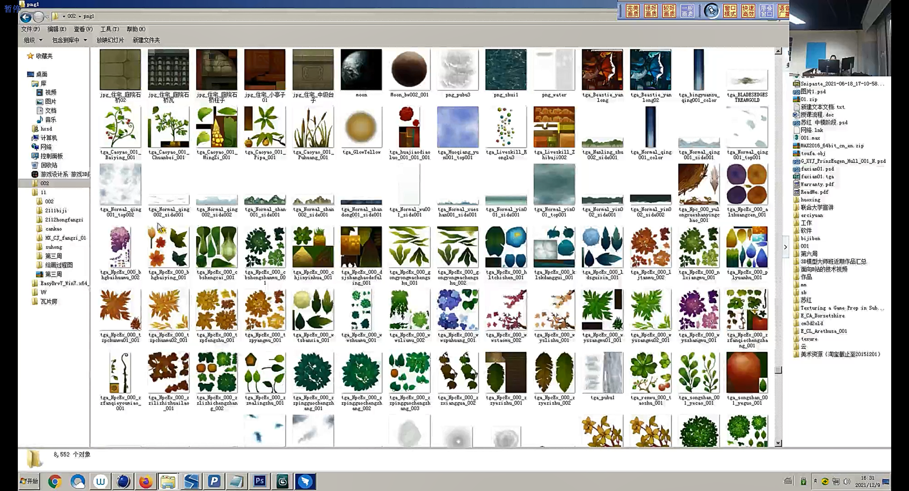

------
