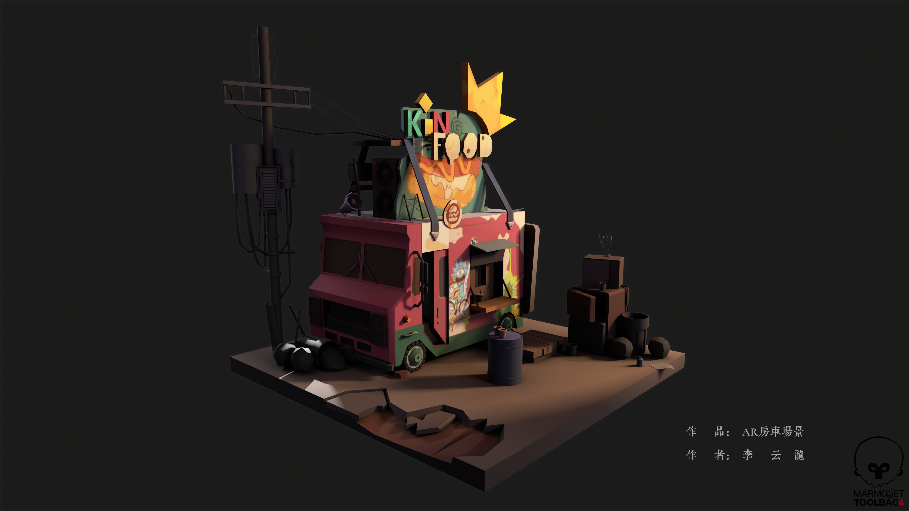

___________________________________________________________________________________________
###### [GoMenu](../3DMaxBasicsMenu.md)
___________________________________________________________________________________________
# 018_3Dmax打包导出压缩包、使用八猴渲染模型的视频和图片


___________________________________________________________________________________________


## 目录

- [018\_3Dmax打包导出压缩包、使用八猴渲染模型的视频和图片](#018_3dmax打包导出压缩包使用八猴渲染模型的视频和图片)
  - [目录](#目录)
  - [3Dmax打包导出压缩包（归档）](#3dmax打包导出压缩包归档)
  - [安装`八猴`Marmoset Toolbag 4](#安装八猴marmoset-toolbag-4)
  - [渲染](#渲染)
    - [1. 导入模型](#1-导入模型)
      - [删除多余材质球](#删除多余材质球)
    - [2.](#2)
  - [`八猴`相关设置了解](#八猴相关设置了解)
    - [背景SkyHDR相关设置](#背景skyhdr相关设置)
    - [添加光源](#添加光源)
      - [创建光源方法：](#创建光源方法)
    - [打开AO](#打开ao)
    - [使用忽略背面，在模型反面看过去时也能看到面](#使用忽略背面在模型反面看过去时也能看到面)
    - [添加地面](#添加地面)
  - [使用`八猴`渲染流程](#使用八猴渲染流程)
    - [1. 导出OBJ，导入八猴并删掉多余默认材质球](#1-导出obj导入八猴并删掉多余默认材质球)
    - [2. 添加两个材质球，拖拽添加贴图](#2-添加两个材质球拖拽添加贴图)
    - [添加灯光](#添加灯光)
    - [老师教的渲染视频，但是我用的是八猴4老师用的八猴3，懒得搞了我渲染一张图片出来得了](#老师教的渲染视频但是我用的是八猴4老师用的八猴3懒得搞了我渲染一张图片出来得了)


------

## 3Dmax打包导出压缩包（归档）

> 

------

## 安装`八猴`Marmoset Toolbag 4

> 百度云链接：
>
> ```
> https://pan.baidu.com/s/1boKV4FMz8OoE_pB-AlM2cw?pwd=n3it
> ```

------

## 渲染

### 1. 导入模型

我也不知道怎么回事，我这个不支持导入zip，那就导出FBX或者OBJ再倒入吧

> 

#### 删除多余材质球

> 

### 2. 

------

## `八猴`相关设置了解

### 背景SkyHDR相关设置

> 

------

### 添加光源

有三种光：平行光、聚光灯、点光源

#### 创建光源方法：

> 先找一个合适的角度然后点击光源
>
> 

------

### 打开AO

> 

------

### 使用忽略背面，在模型反面看过去时也能看到面

> 

------

### 添加地面

> 

------

## 使用`八猴`渲染流程

### 1. 导出OBJ，导入八猴并删掉多余默认材质球

> 

### 2. 添加两个材质球，拖拽添加贴图

> 

### 添加灯光

> 酌情增加点光
>
> 

### 老师教的渲染视频，但是我用的是八猴4老师用的八猴3，懒得搞了我渲染一张图片出来得了

> 渲染图片：
>
> 
>
> 

------