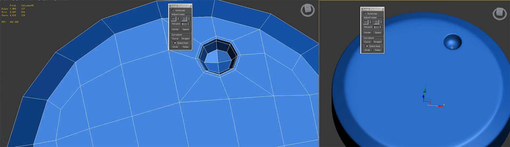

___________________________________________________________________________________________
###### [GoMenu](../3DMaxBasicsMenu.md)
___________________________________________________________________________________________
# 019_VR模型-高模卡线、布线技巧、圆上卡方、方上卡圆


___________________________________________________________________________________________


## 目录

[TOC]


------

## 次世代流程

> ```mermaid
> graph TD
> A[中模] --卡线后的中模--> B[高模]
> B --根据烘焙的法线修改--> C[低模：尽可能贴合高模否则法线会有黑边]
> A --卡线前的中模--> C
> C --> D[展UV:平滑组需要和展开的UV切边一致]
> D --> E[烘焙：3Dmax烘焙法线,其余到SubStance中上完材质再烘焙]
> E --> F[材质]
> ```
>
> 

------

## 高模卡线遵循

> 

### 1.布线尽量四边形，避免三角边

> 四边可循环
>
> 

### 2.布线尽量环形

### 3.三条固定一个结构造型

> 

### 4.线的距离决定效果软硬

线越少过渡越圆润

> 

### 5.涡轮平滑(尽量不要塌陷)

#### 不要使用太多次的涡轮平滑，两三级差不多了，不然面数奇高

> 

------

## 高模卡线练习：

### 练习一

> [HightTest_0.obj](部分课件\3DMaxBaseV019\HightTest_0.obj)

<details> <summary>最终效果</summary>


</details>


------

## 创建螺丝示例

> 下图的这种角上的三角面
>
> 
>
> 可以切角这条线

### 处理多边面

> 

### 处理三边面

> 


------

## 卡线常用方法功能和技巧

> |   功能   |             适用场景              |                                                              |
> | :------: | :-------------------------------: | :----------------------------------------------------------: |
> |   连接   |    均匀卡线，同时卡住两边结构     |  |
> |   切角   |      圆滑过渡，角度数值调控       |  |
> |   切割   |     复杂、非环形乡、遇事不决      |  |
> |   插入   |           面数多未连线            |  |
> | 快速加线 | 快，喜欢哪里加哪里(石墨工具→建模) |  |

------

## 六边形和圆形转四边面示例

> 

------

## 练习一下：螺丝帽和六边形的卡线

> 

------

## 圆形上卡方形的方法

### 圆形常用20边的

> 

------

## 方形、圆形上卡圆形的方法

### 方法一：球形化修改器（有时候不好用，出的椭圆）

> 
>
> 比如下图的情况：
>
> 

### 方法二：石墨工具出正圆

> 1. 先挤出内圈
> 2. 边级别下
> 3. 选择石墨工具
> 4. 建模选项卡
> 5. 点击循环
> 6. 点击循环工具
> 7. 循环工具中点击 呈圆形
> 8. 如果圆大，可以使用缩放工具缩小
>
> 
>
> 

> 
>
> 示例：
> 

------

## 枪管的制作方法

> 1. 先整一个方形扣圆
> 2. 打开吸附
> 3. 出现捕捉点后，按住shift点击左键拖拽到另一个吸附点松开左键
> 4. 如此往复
> 5. 使用"弯曲"修改器，调整角度和轴向
> 6. 转可编辑多边形
> 7. 全选所有点，使用 [焊接指令](./3DMaxBaseV004.md#焊接的意思时会根据点和点之间的距离小于阈值此时为01时会合并两个点为一个)
> 8. 涡轮平滑
>
> 
>
> 
>
> 
>
> 

------

### 如果吸附失效可以在吸附上按右键呼出菜单

> 

------

## 高模布线参考

> 
>
> .jpg).jpg).jpg).jpg).jpg).jpg).jpg).jpg).jpg).jpg).jpg).jpg)

------