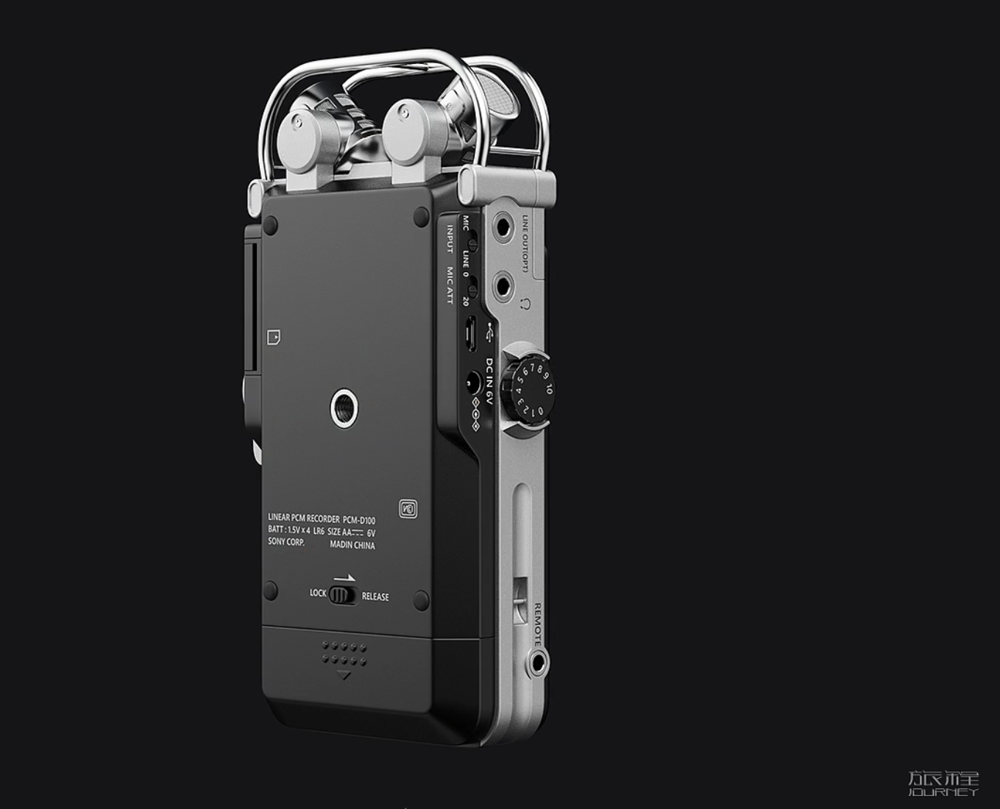
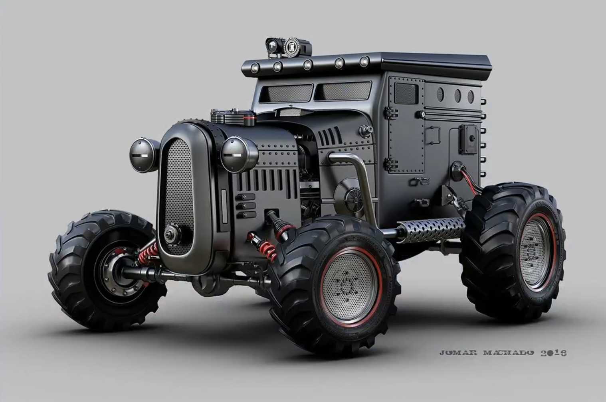
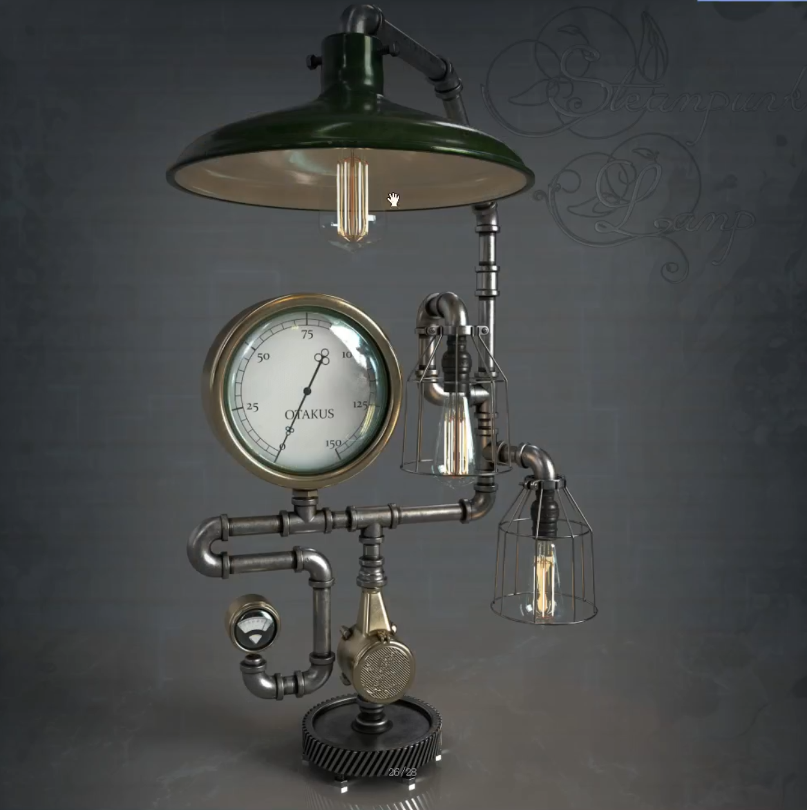

___________________________________________________________________________________________
###### [GoMenu](../3DMaxBasicsMenu.md)
___________________________________________________________________________________________
# 020_创建高模

___________________________________________________________________________________________

## 目录

[TOC]

------

## 选一个建模

> 

------

## 布尔运算

- **需要注意：对象必须封口不能漏面，否则可能会有bug**

- **当模型特别复杂时，容易出现问题**
  - 建议将要处理的部分作为元素分离出来处理之后再合并回去

### 示例1：多通水管

> 比如像创建这样的结构：
>
> 
>
> 创建了两个圆柱交叉叠放以后，中间的部分需要移除
>
> **使用前最好重置下**
>
> 

#### 步骤：

> 1. 创建圆柱，复制一个旋转90°挪到合适位置，需要是**两个对象**！
> 2. 选择"复合对象"选项卡中的超级布尔
> 3. 选择并集，展开高级选项，选择"只移除不可见"，点击"开始拾取"选择要布尔运算的对象
> 4. 布尔运算可能会出现多个点，需要
>
> 

### 示例2：立方体内扣球体

使用差集

> 如图所示：
>
> 
>
> 

### 示例3：保留相交线

> 
>
> 

------

## 球形三角手的制作

> 
>
> 

------

## 小标题

> 

------

## 小标题

> 

------

## 小标题

> 

------

## 小标题

> 

------

## 小标题

> 

------

## 小标题

> 

------

## 小标题

> 

------

## 小标题

> 

------

## 小标题

> 

------

## 小标题

> 

------

## 小标题

> 

------

## 小标题

> 

------

## 小标题

> 

------

## 小标题

> 

------

## 小标题

> 

------

## 小标题

> 

------

## 小标题

> 

------

## 小标题

> 

------

## 小标题

> 

------

## 小标题

> 

------

## 小标题

> 

------

## 小标题

> 

------

## 小标题

> 

------

## 小标题

> 

------

## 小标题

> 

------

## 小标题

> 

------

## 小标题

> 

------

## 小标题

> 

------

## 小标题

> 

------

## 小标题

> 

------

## 小标题

> 

------

## 小标题

> 

------

## 小标题

> 

------

## 小标题

> 

------

## 小标题

> 

------

## 小标题

> 

------

## 小标题

> 

------

## 小标题

> 

------

## 小标题

> 

------

## 小标题

> 

------

## 小标题

> 

------

## 小标题

> 

------

## 小标题

> 

------

## 小标题

> 

------

## 小标题

> 

------

## 小标题

> 

------

## 小标题

> 

------

## 小标题

> 

------

## 小标题

> 

------

## 小标题

> 

------

## 小标题

> 

------

## 小标题

> 

------

## 小标题

> 

------

## 小标题

> 

------

## 小标题

> 

------

## 小标题

> 

------

## 小标题

> 

------

## 小标题

> 

------

## 小标题

> 

------

## 小标题

> 

------

## 小标题

> 

------

## 小标题

> 

------

## 小标题

> 

------

## 小标题

> 

------

## 小标题

> 

------

## 小标题

> 

------

## 小标题

> 

------

## 小标题

> 

------

## 小标题

> 

------

## 小标题

> 

------

## 小标题

> 

------

## 小标题

> 

------

## 小标题

> 

------

## 小标题

> 

------

## 小标题

> 

------

## 小标题

> 

------

## 小标题

> 

------
