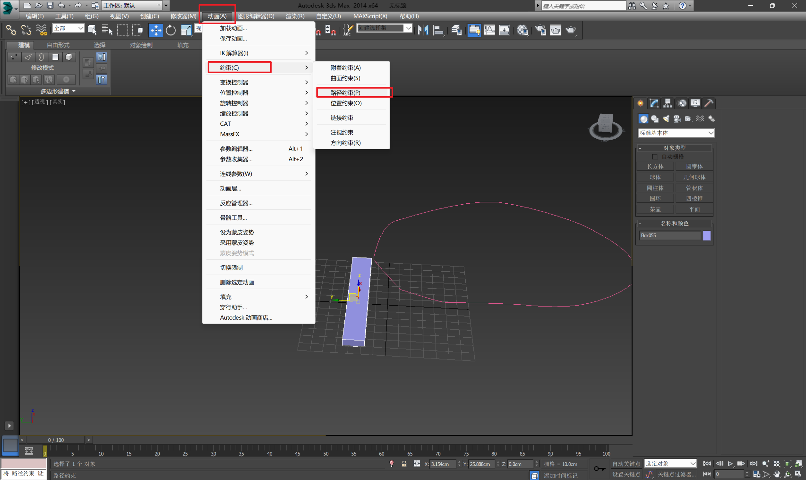
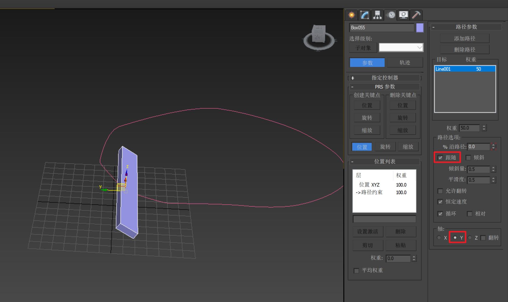
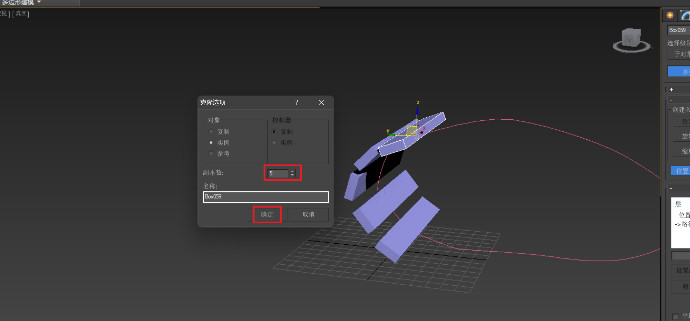
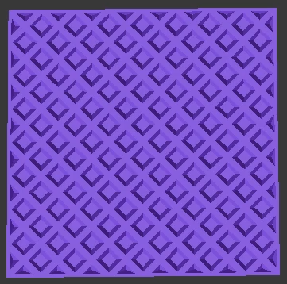
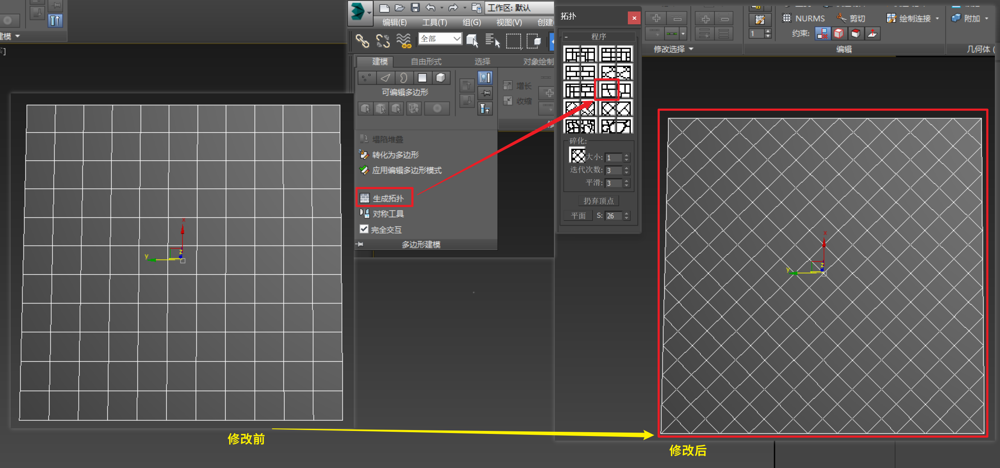
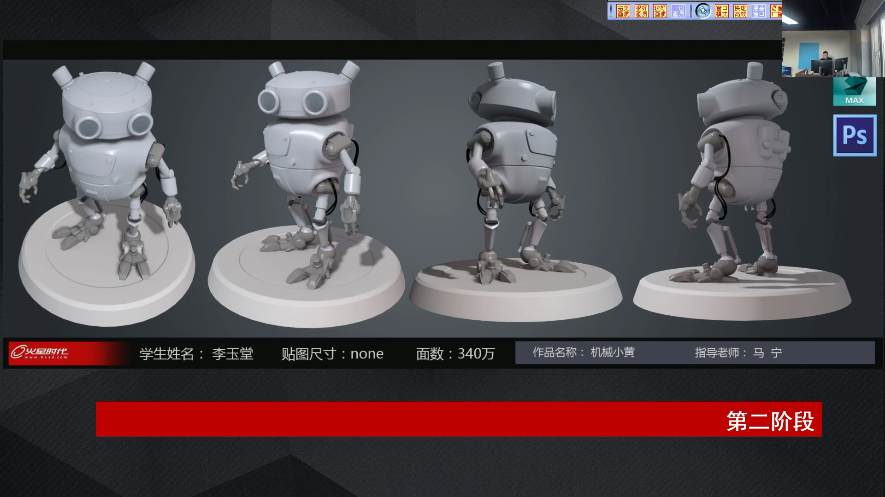
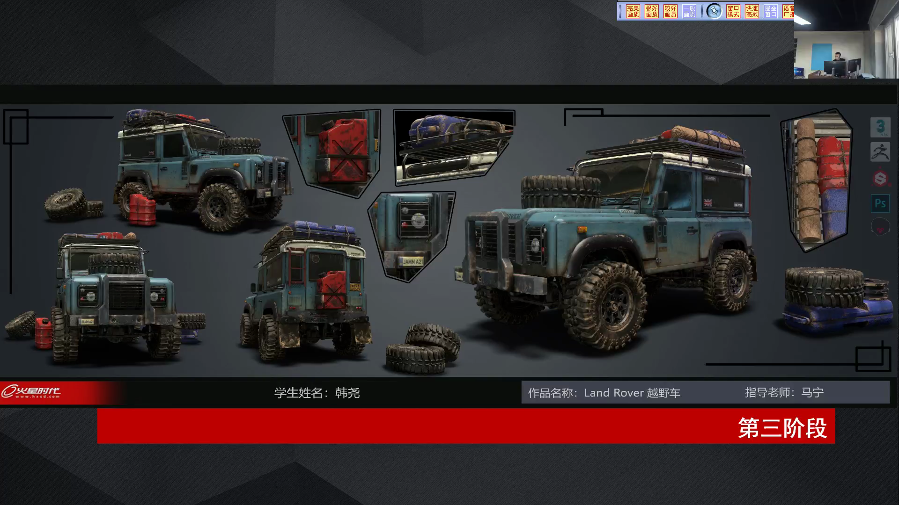
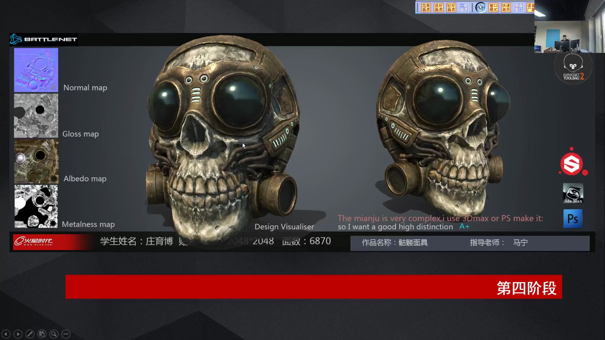
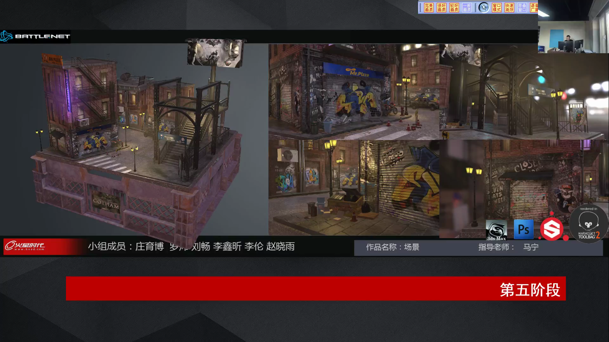

___________________________________________________________________________________________
###### [GoMenu](../3DMaxBasicsMenu.md)
___________________________________________________________________________________________
# 021_履带、斜纹的制作方法、作品展示参考

___________________________________________________________________________________________

## 目录

[TOC]

------

## 履带的制作方法

> 1. 创建Box和路径
> 2. 选中box，选择菜单栏中的 **动画->约束->路径约束**，然后拾取路径（执行完拾取就会自动贴合路径）
> 3. 勾选贴合路径，选择轴向，按住shift拖拽，设置要复制的数量
>
> 

------

## 斜纹的制作方法

> 
>
> 

------

## 后续作品展示参考
> 

------