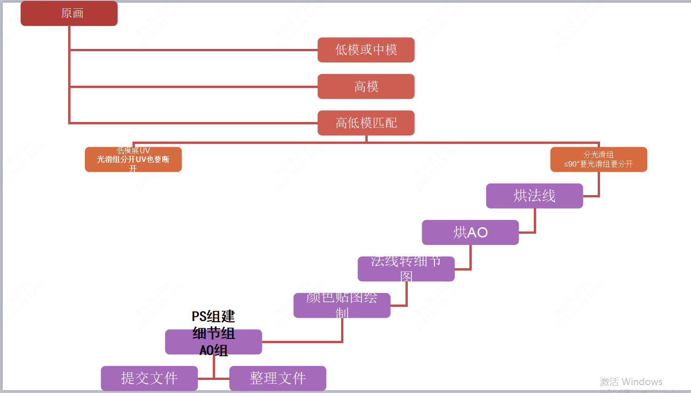
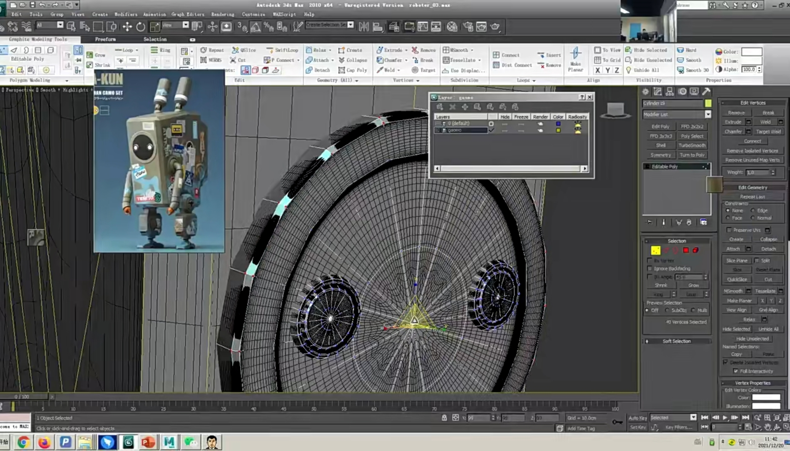
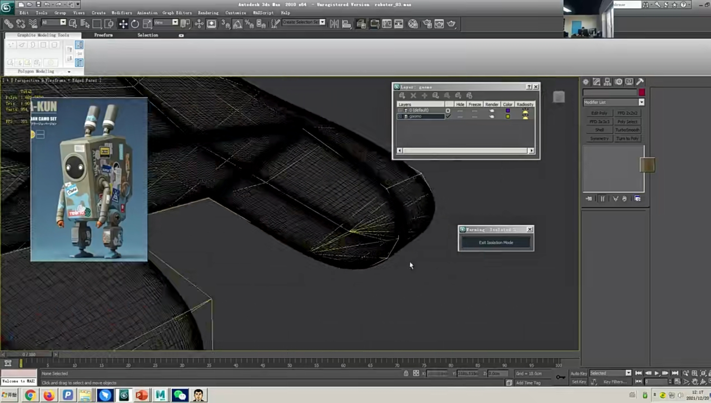
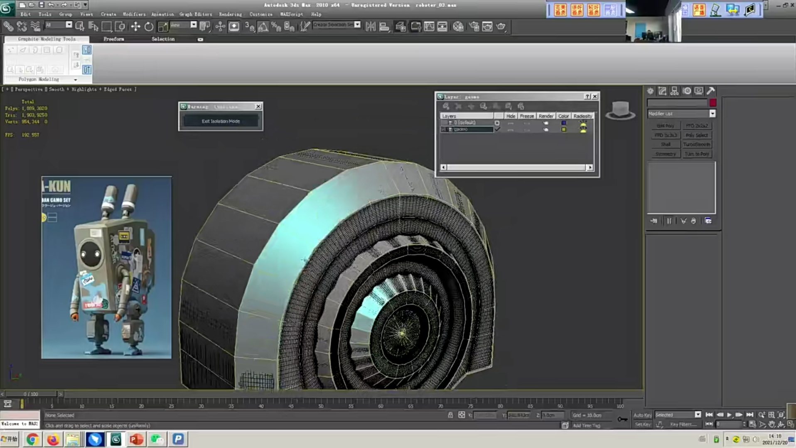
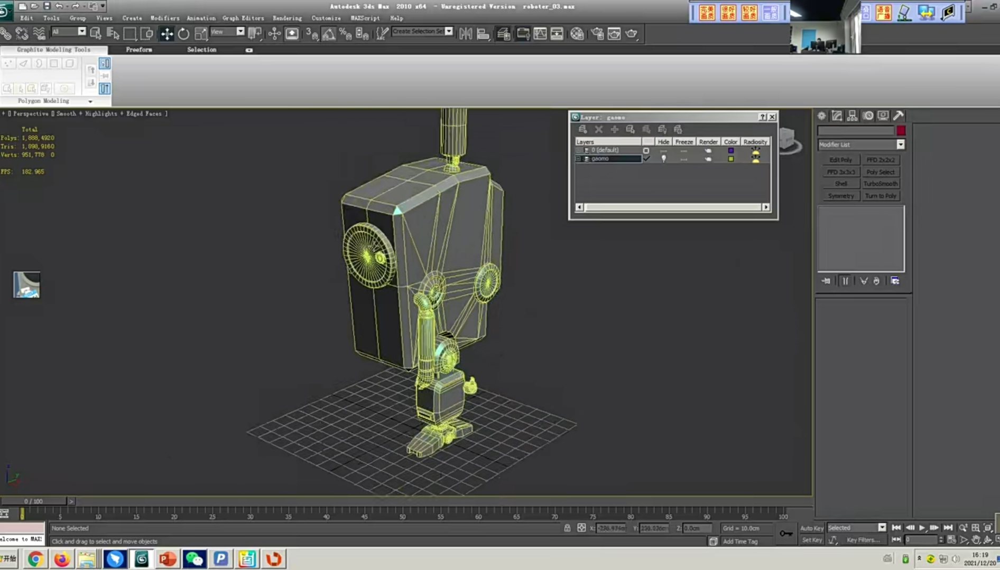
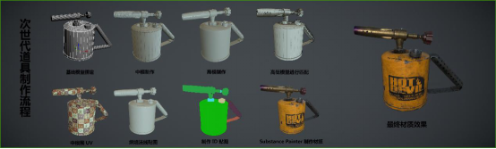
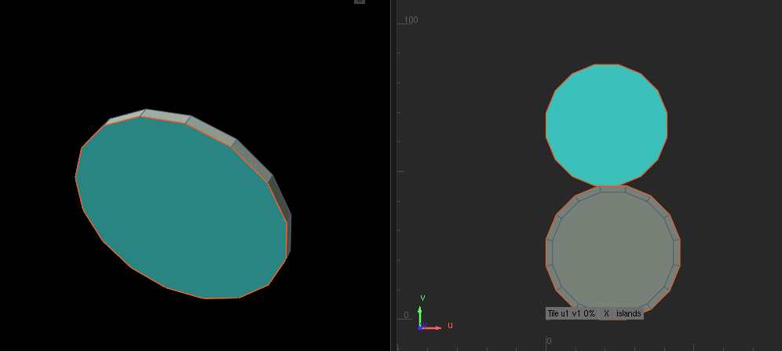
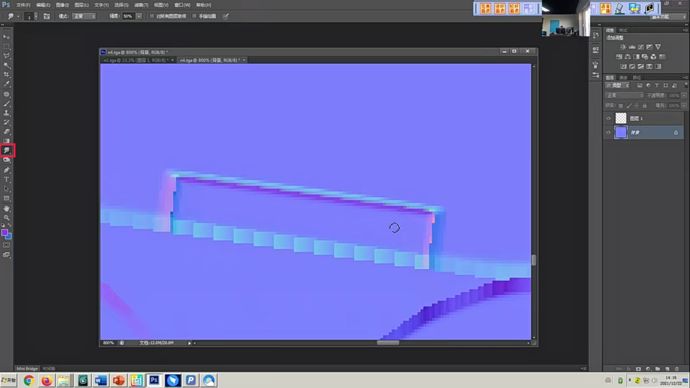
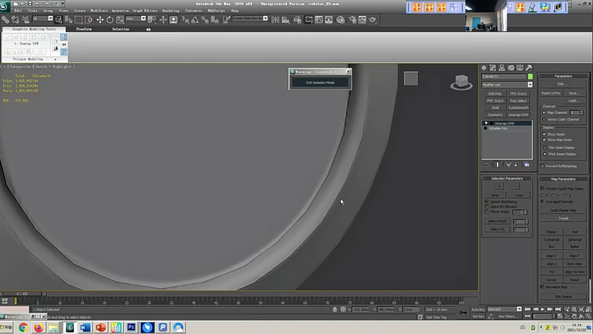
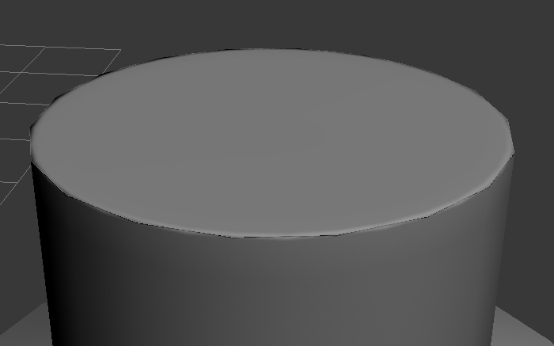

___________________________________________________________________________________________
###### [GoMenu](../3DMaxBasicsMenu.md)
___________________________________________________________________________________________
# 022_高低模匹配三要素、PBR材质制作步骤、切UV技巧、PS修改法线瑕疵


___________________________________________________________________________________________


## 目录

- [022\_高低模匹配三要素、PBR材质制作步骤、切UV技巧、PS修改法线瑕疵](#022_高低模匹配三要素pbr材质制作步骤切uv技巧ps修改法线瑕疵)
  - [目录](#目录)
  - [流程图](#流程图)
  - [低模修改注意事项](#低模修改注意事项)
    - [修改低模以匹配高模烘焙法线,之后再减面](#修改低模以匹配高模烘焙法线之后再减面)
    - [要对称的复用法线和uv的，留一半，拆完uv烘焙完法线再手动拖拽复制](#要对称的复用法线和uv的留一半拆完uv烘焙完法线再手动拖拽复制)
  - [PBR材质制作步骤](#pbr材质制作步骤)
    - [第一步：新建组](#第一步新建组)
    - [第二步： 给组添加一个颜色ID 遮罩](#第二步-给组添加一个颜色id-遮罩)
    - [第三步：新建一个填充层   （给他存金属的材质）](#第三步新建一个填充层---给他存金属的材质)
    - [第四步：新建一个填充层    （给他一个金属漆的材质效果）](#第四步新建一个填充层----给他一个金属漆的材质效果)
    - [第五步：添加一个智能遮罩   （让他漏出掉漆的效果）](#第五步添加一个智能遮罩---让他漏出掉漆的效果)
    - [第六步：可以添加一个填充层  （给他一个锈迹的材质）](#第六步可以添加一个填充层--给他一个锈迹的材质)
    - [第七步：给锈迹的材质一个智能遮罩（让他有物体之间的脏迹）](#第七步给锈迹的材质一个智能遮罩让他有物体之间的脏迹)
  - [切UV技巧](#切uv技巧)
    - [切之前看一下该平整的面,点是否平齐](#切之前看一下该平整的面点是否平齐)
    - [如果法线反了，可以锤一下（重置一下坐标），然后加一个"多边形编辑"命令（重置模型）](#如果法线反了可以锤一下重置一下坐标然后加一个多边形编辑命令重置模型)
    - [圆柱底下圆环切就能直接展开](#圆柱底下圆环切就能直接展开)
  - [PS修改法线瑕疵](#ps修改法线瑕疵)
  - [烘焙法线如果出现黑边，是因为这里UV没有切开](#烘焙法线如果出现黑边是因为这里uv没有切开)
  - [高低模匹配三要素:](#高低模匹配三要素)
    - [光滑组：小于等于90度的面要分开光滑组，UV也要断开，并且移开一到两个像素。](#光滑组小于等于90度的面要分开光滑组uv也要断开并且移开一到两个像素)
      - [注意事项1:90度或者小于90度没有分开光滑组，低模效果不正确。](#注意事项190度或者小于90度没有分开光滑组低模效果不正确)
      - [注意事项2，光滑组分开,uv没有断开移开，不正确。](#注意事项2光滑组分开uv没有断开移开不正确)


------

## 流程图

> 
>
> ```mermaid
> graph TD
> A[原画] --> B[低模或中模]
> B --> C[高模]
> C --> D[高低模匹配]
> D --> E[低模展开UV 光滑组分开处UV也需要断开]
> D --> F[分光滑组<=90度要光滑组分开]
> F --> G[烘法线]
> G --> H[烘AO]
> H --> I[法线转细节图]
> I --> J[颜色贴图绘制]
> J --> K[PS组建:细节组和AO组]
> K --> L[提交文件]
> L --> M[整理文件]
> ```
>
> 

------

## 低模修改注意事项

### 修改低模以匹配高模烘焙法线,之后再减面

> 
>
> 
>
> 

------

### 要对称的复用法线和uv的，留一半，拆完uv烘焙完法线再手动拖拽复制

> 

------

## PBR材质制作步骤

> 

### 第一步：新建组 
### 第二步： 给组添加一个颜色ID 遮罩 
### 第三步：新建一个填充层   （给他存金属的材质）
### 第四步：新建一个填充层    （给他一个金属漆的材质效果）
### 第五步：添加一个智能遮罩   （让他漏出掉漆的效果）
### 第六步：可以添加一个填充层  （给他一个锈迹的材质）
### 第七步：给锈迹的材质一个智能遮罩（让他有物体之间的脏迹）

------

## 切UV技巧

### 切之前看一下该平整的面,点是否平齐

### 如果法线反了，可以锤一下（重置一下坐标），然后加一个"多边形编辑"命令（重置模型）

### 圆柱底下圆环切就能直接展开

> 

------

## PS修改法线瑕疵

> 边缘切线特别明显的地方，可以使用PS的涂抹工具，圆滑过渡
>
> 

------

## 烘焙法线如果出现黑边，是因为这里UV没有切开

> 

------

## 高低模匹配三要素:

1. 高低模匹配度
2. 光滑组区分是否正确
3. UV是否断开，UV展好没有拉伸和UV边界是否重叠。

### 光滑组：小于等于90度的面要分开光滑组，UV也要断开，并且移开一到两个像素。

#### 注意事项1:90度或者小于90度没有分开光滑组，低模效果不正确。

> 

#### 注意事项2，光滑组分开,uv没有断开移开，不正确。

> 

------