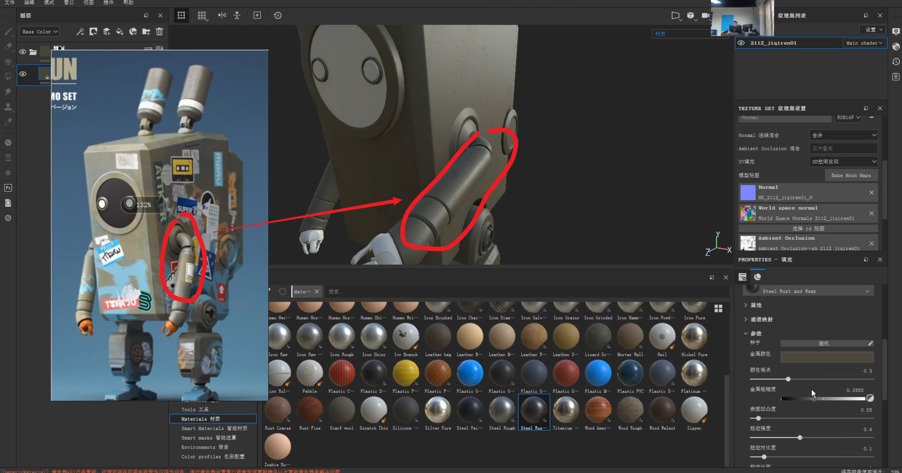

___________________________________________________________________________________________
###### [GoMenu](../3DMaxBasicsMenu.md)
___________________________________________________________________________________________
# 023_材质分层介绍、使用SubStance上材质、锈迹、贴纸、喷绘字体、玻璃材质、渲染图片、导出贴图纹理

___________________________________________________________________________________________

## 目录

[TOC]

------

## 材质分层

> 金属材质分层：
>
> 1. 基础颜色（金属质感）
> 2. 掉漆
> 3. 脏旧
> 4. 锈迹
>
> .jpg)

------

## 使用SubStance上材质

### 导入流程

> 

### 烘焙其他辅助贴图

> 

------

### 上基础材质

> 1. 新建组
> 2. 新建填充层->填充红色
> 3. 新建黑色遮罩
> 4. 选择几何体填充
>
> 

### 使用基础材质

使用这个材质的好处是自带划痕和金属磨损

> 

#### 可以使用Height制作凸起和凹槽

> 

#### 界面其他属性

> 

#### 画笔模式`绘制直线`,按住Shift

> 

#### 画笔调整旋转方向按住`Ctrl+左键`

#### 旋转HDR：`Shift+右键`

------

#### 可以单独制作突起和凹槽图案

> 

------

### 根据原画调节粗糙度和高光

> 

### 制作边缘磨损材质

> 1. 先来个磨损材质（倒数第八个）
> 2. 使用智能遮罩（拖拽到磨损图层上）
>    - 调整智能遮罩参数
> 3. 手绘调整智能遮罩
>    - 使用透贴绘制模拟剐蹭的效果
>    - 可以擦去一些剐蹭，让整体更自然
> 4. 常用的关节处，磨损会稍微严重些，可以画一画
>
> 
>
> 

#### 为磨损材质添加一些厚度

> 

------

### 制作物体关系（缝隙中的脏迹）

> 

### 制作漏油的物体关系（使用粒子笔刷）

> 可以复制物体关系这层，颜色在深一些，使用粒子笔刷
>
> 

### 手绘部分材质

> 

### 制作锈迹

> **一般出现在关节衔接处**
>
> 1. 找一个锈迹的材质
> 2. 使用智能遮罩
> 3. 添加智能滤镜
> 4. 调整一下智能滤镜参数
>
> 

### 制作贴纸

> 1. PS中制作，对好位置
> 2. 导入SubStance
> 3. 但是填充层会挡住别的层的效果所以需要调节质感
> 4. 然后再给贴纸的填充层添加黑色遮罩使用笔刷，将要的贴纸区域绘制蒙版
>
> 

------

### 喷绘字体

> 使用默认笔刷
>
> 透贴选择指定的这几个字体之一（名中有font的）
>
> 

------

### 玻璃材质

> 1. 还是使用倒数第七个材质
> 2. 关闭金属度
> 3. 颜色为灰色偏绿
> 4. 金属粗糙度（应该不粗糙）
>
> 

#### 添加玻璃划痕

> 1. 只保留粗糙度
> 2. 选择一张划痕的黑白图
> 3. 缩小UV比例
>
> 

#### 添加玻璃灰尘

> 1. 选一个土的材质
> 2. 不要高度
> 3. 比例缩小
> 4. 点状强度小一些
> 5. 颜色暗一些
> 6. 破璃的灰尘一般出现在边缘:
>    - 加一个边缘的智能遮罩
>    - 调整强度、纹理和不透明度
> 7. 使用点状笔刷，点一些玻璃上的脏点
> 8. 与别的结构衔接处可以手动，画一些灰尘
>
> 

------

## SubStance渲染图片

> 

------

## 导出贴图纹理

> 检查一下大小
>
> 

------