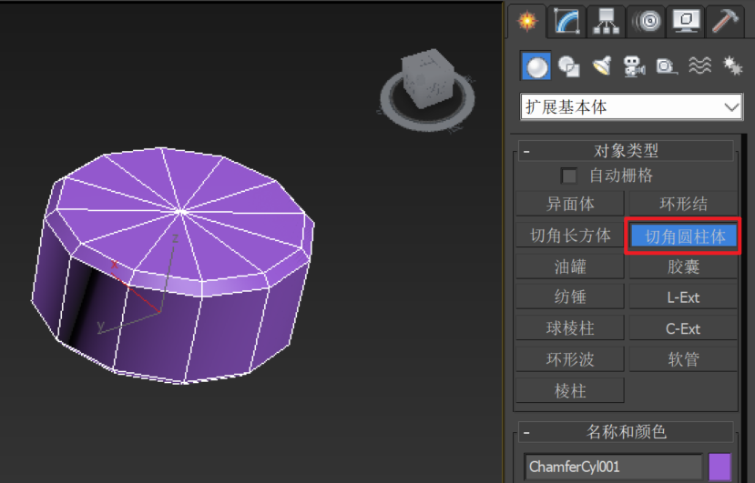

___________________________________________________________________________________________
###### [GoMenu](../3DMaxBasicsMenu.md)
___________________________________________________________________________________________
# 024_标题


___________________________________________________________________________________________


## 目录

[TOC]


------

## 多边形建模技巧

> 1. 使用几何体搭建大型结构然后再慢慢细化模型
> 2. 强调了比例和外剪影的重要性，以及如何利用盒子和圆柱等基本形体进行建模。

------

## 容易出现的问题需要注意：

> 1. 结构问题严重，比例和形状都不准确。
> 2. 透视和比例错误，形体结构不对，弹夹大小和形状错误。
> 3. 建议加强结构理解，从基本形状和比例入手进行练习。

------

## 复杂结构的拆解方法

> 1. 复杂结构可以拆解成简单的几何形状，逐步拼接和焊接。 
> 2. 利用圆柱、盒子等基本形状，规划洞的位置和大小。 
> 3. 通过复制、旋转和缩放，快速构建复杂结构。

------

## 高模制作方法

> 1. 高模制作有三种方法：手动卡线、四边形切角工具、2018拓扑插件。 
> 2. 对于曲面结构，建议手动卡线再进行涡轮平滑。 
> 3. 对于硬转折结构，可以直接使用四边形切角工具或2018拓扑插件。 
> 4. 高模制作预计需要两到三天时间完成。

------

## 高模制作的注意事项

> 1. 在高模制作过程中注意剪影和比例的准确性。
>
> 2. 强调了在确定剪影和比例后再进行细节雕刻的重要性。

------

## 创建扩展几何体（图示）

> 

------

## 自动拓扑插件的使用（低模直接生成高模）

> 比如有一个复杂的形状（使用布尔运算）
>
> 

### 安装自动拓扑插件（需要2018起步）

> 百度云链接：
>
> ```
> https://pan.baidu.com/s/18s4bwck5S69sRwyIhGJLwg?pwd=ytxt
> ```
>
> 先拖拽到界面安装，然后按照下图操作添加插件到界面
>
> 

### 使用自动拓扑插件 `QuadRemesher`

#### 1.需要注意！低模圆的部分，细分不能太低，不然生成的高模会将边缘识别为硬边

#### 2.先分一下光滑组

>
> 

------
