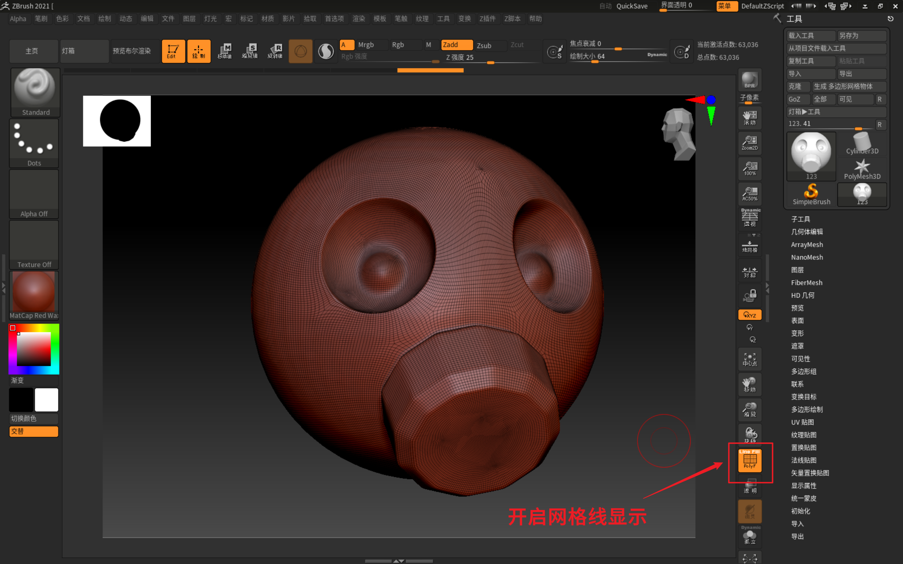

___________________________________________________________________________________________
###### [GoMenu](../3DMaxBasicsMenu.md)
___________________________________________________________________________________________
# 025_标题

___________________________________________________________________________________________

## 目录

[TOC]

------

## 原画选择的重要性

> 1. 原画选择应丰富色彩，避免选择过于简单或模糊的原画。
> 2. 原画应体现硬表面结构，有助于展示个人能力
> 3. 避免选择过于复杂或模糊的原画，确保大部分人认为好看
> 4. 原画应符合课程要求，避免选择与课程内容不符的原画。

------

## ZBrush雕刻褶皱

> 选中要雕刻的对象导出OBJ

------

## 介绍一下`ZBrush`界面

### 逗号键（隐藏显示工具界面）

> 

### 导入导出ZB格式文件

> 

------

### 导入导出OBJ

> 

------

### 进入编辑模式才可以编辑，快捷键`T`

> 

------

### 开启网格线显示

> 

------

### 重置界面

> 

------

### 按组拆分模型

> 

------

## 常用快捷键

> | 功能                         |         快捷键          |                              |
> | ---------------------------- | :---------------------: | :--------------------------: |
> | 编辑模式                     |            T            |                              |
> | 旋转                         |       左键或右键        |                              |
> | 移动                         |        Alt+左键         |                              |
> | 缩放                         | Alt+左键点击之后松开Alt |          Ctrl+右键           |
> | 90度旋转                     |      旋转中按Shift      |                              |
> | 居中                         |            F            |                              |
> | 多个对象时，选中要操作的对象 |      Alt+点击对象       |                              |
> | 画遮罩                       |     按住Ctrl点模型      |                              |
> | 画凸起                       |     按住左键点模型      |                              |
> | 平滑笔刷                     |       Shift点模型       | 如果平滑不明显，降低细分等级 |
> | 画凹处                       |   按住Alt+左键点模型    |                              |

------

## 雕刻前需要：添加细分等级

### 3级雕刻大型

### 456雕刻细节（因为无法撤销）

> 

------

## 切换锐利笔刷

> 

------

## ZB绘制之后的高模减面之后导入3Dmax

> 减面之后看是否少了细节，没有影响才可以减，否则可以撤销，我下面那个就是稍微减的有点狠
>
> 差不多有个十几万面导入3Dmax烘焙完法线就删了
>
> 

------
