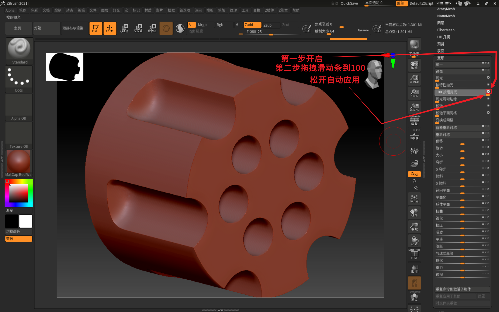

___________________________________________________________________________________________
###### [GoMenu](../3DMaxBasicsMenu.md)
___________________________________________________________________________________________
# 026_根据平滑组自动切UV自动摆UV、使用ZBrush低模变高模

___________________________________________________________________________________________

## 目录

- [026\_根据平滑组自动切UV自动摆UV、使用ZBrush低模变高模](#026_根据平滑组自动切uv自动摆uv使用zbrush低模变高模)
  - [目录](#目录)
  - [根据平滑组自动切UV自动摆UV（3Dmax2018）](#根据平滑组自动切uv自动摆uv3dmax2018)
    - [得先分好`光滑组`](#得先分好光滑组)
  - [使用ZBrush低模变高模](#使用zbrush低模变高模)
    - [第一步：按UV分组](#第一步按uv分组)
    - [第二步：增加面数](#第二步增加面数)
    - [第三步：抛光表面（让低面边之间的过渡变平滑）](#第三步抛光表面让低面边之间的过渡变平滑)
    - [第四步：圆滑边缘（处理结构线）](#第四步圆滑边缘处理结构线)
    - [第四步完事儿以后最后别忘了清除遮罩！！！！！！](#第四步完事儿以后最后别忘了清除遮罩)
      - [有一个小问题我使用抛光以后边缘感觉像有半圆的鼓起](#有一个小问题我使用抛光以后边缘感觉像有半圆的鼓起)
      - [我感觉我用这个`抛光清晰边缘`更好些](#我感觉我用这个抛光清晰边缘更好些)
    - [第五步：减面后导出OBJ到3Dmax](#第五步减面后导出obj到3dmax)
    - [最后来一张`对比图`](#最后来一张对比图)

------

## 根据平滑组自动切UV自动摆UV（3Dmax2018）

### 得先分好`光滑组`

> 

------

## 使用ZBrush低模变高模

### 第一步：按UV分组

> 

### 第二步：增加面数

> 
>
> #### 点之前：
>
> 

### 第三步：抛光表面（让低面边之间的过渡变平滑）

比如之前使用得低模变高模插件[点这里跳转查看之前的笔记](./3DMaxBaseV024#自动拓扑插件的使用（低模直接生成高模）)会有这个问题：

转换后，边缘在高模上也能隐约看到，比较明显（但是不想看到某些因面数低出现的较硬边缘）处理比较头疼

这个方法就可以回避之前的问题

这一步抛光就是解决**优化**这个问题的关键

> 

### 第四步：圆滑边缘（处理结构线）

> 

### 第四步完事儿以后最后别忘了清除遮罩！！！！！！

> 

#### 有一个小问题我使用抛光以后边缘感觉像有半圆的鼓起

> 

#### 我感觉我用这个`抛光清晰边缘`更好些

> 

### 第五步：减面后导出OBJ到3Dmax

> [跳转之前的笔记](./3DMaxBaseV025#ZB绘制之后的高模减面之后导入3Dmax)
>
> 我觉得高模小物品的细节有个**20万**到**30万面**差不多了

### 最后来一张`对比图`

> 

------
