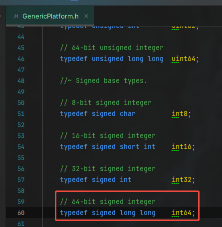
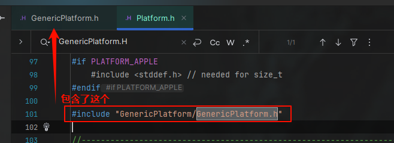
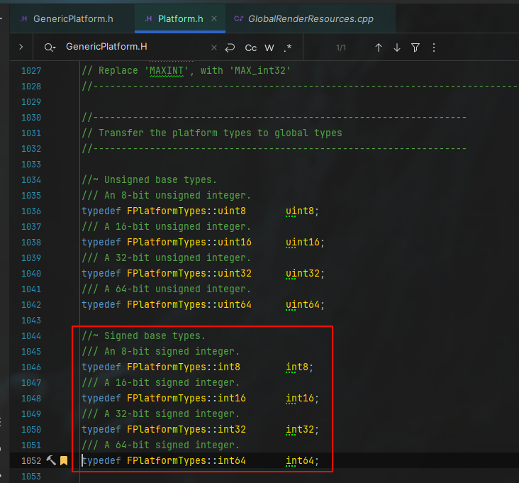

------
###### [GoMenu](../CPP_Learn_Menu.md)
------

# 01_在UE中使用CPP20

------

## 目录

[TOC]

------

视频链接

[【UE5】现代C++核心特性解析读书笔记与UE C++ 开坑视频_哔哩哔哩_bilibili](https://www.bilibili.com/video/BV18w411H7nC/?spm_id_from=333.1391.0.0&vd_source=9e1e64122d802b4f7ab37bd325a89e6c)

------

------

## XXXXXXXXX

> 

------

------

## XXXXXXXXX

> 

------

------

## XXXXXXXXX

> 

------

------

## XXXXXXXXX

> 

------

------

## XXXXXXXXX

> 

------

------

## XXXXXXXXX

> 

------
