___________________________________________________________________________________________
###### [GoLibraryMainMenu](../_LibraryMainMenu_.md)
___________________________________________________________________________________________
# Lua快速入门


___________________________________________________________________________________________


## 目录

- [UE  TypeScripe插件 `Puerts` 的使用方法](#ue--typescripe插件-puerts-的使用方法)
  - [目录](#目录)
  - [介绍：](#介绍)
    - [`Puerts` 安装方式：](#puerts-安装方式)
      - [第一步：下载：打开github下载压缩包](#第一步下载打开github下载压缩包)
      - [第二步：打开压缩包下的Ureal文件夹，会看到一个叫 `Puerts` 的文件夹，将这个文件夹拷贝到 "项目Plugins文件夹" 下](#第二步打开压缩包下的ureal文件夹会看到一个叫-puerts-的文件夹将这个文件夹拷贝到-项目plugins文件夹-下)
      - [第三步：在命令行执行一下开启插件](#第三步在命令行执行一下开启插件)
      - [第五步：设置一下枚举类型](#第五步设置一下枚举类型)
      - [第六步：然后重新生成下项目：](#第六步然后重新生成下项目)
      - [第七步：为项目添加 `模块` 依赖](#第七步为项目添加-模块-依赖)
      - [第八步：运行项目后可以看到图标](#第八步运行项目后可以看到图标)
      - [第九步：去到工程根目录运行 `npm init -y` 创建一个默认的 `package.json`](#第九步去到工程根目录运行-npm-init--y-创建一个默认的-packagejson)
      - [第十步：需要安装 `VSCode`](#第十步需要安装-vscode)
      - [第十一步：在文件夹下创建ts文件](#第十一步在文件夹下创建ts文件)
      - [第十二步：保存ts文件后，在引擎中会多出一个BP](#第十二步保存ts文件后在引擎中会多出一个bp)


___________________________________________________________________________________________

## 介绍：

[【无废话30分钟】Lua快速入门教程 - 4K超清_哔哩哔哩_bilibili](https://www.bilibili.com/video/BV1vf4y1L7Rb/?spm_id_from=333.880.my_history.page.click)


### 在网页端使用`Lua` ：[LuatOS 文档](https://wiki.luatos.com/)

> 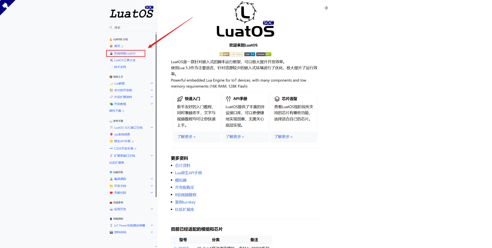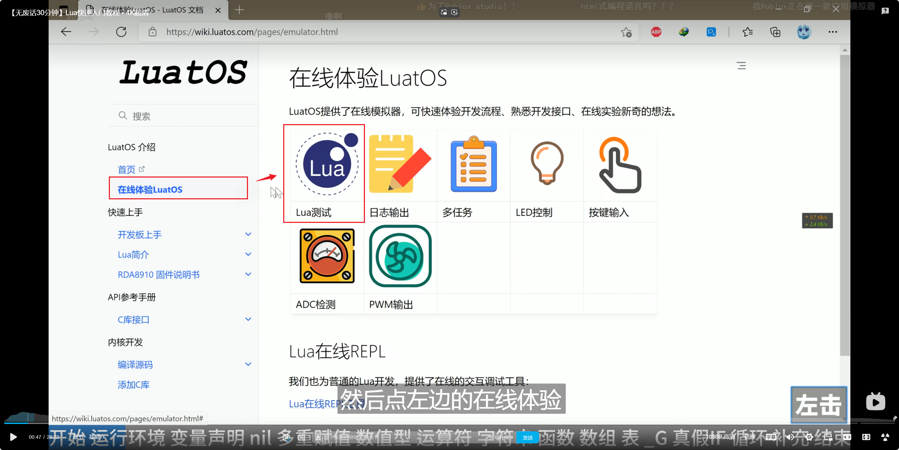
>
> ### 然后删除所有代码就可以使用自己的代码，开始测试了
>
> 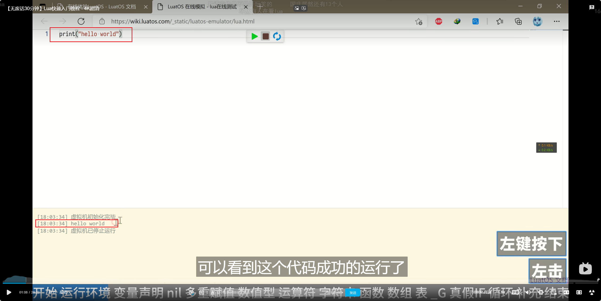

------

### 先说注释的方法

#### 单行注释：

```lua
--这是 lua 的单行注释
```

#### 多行注释：

- 第一种：

  ```lua
  --[[
      这里是多行注释
      这里是多行注释
      这里是多行注释
  ]]
  ```

- 第二种：

  ```lua
  --[[
  	这是 lua 的多行注释
  	第二行
  	第三行
  --]]
  ```

------

### 变量声明

#### 全局变量

> 在Lua中只要给一个变量赋值就可以创建出一个变量，比如：
>
> ```lua
> a = 1
> b = 2
> --上面两行就创建了两个全局变量
> ```
>
> ## 需要注意的是：
>
> - Lua中默认声明的变量都是 `全局变量`
>

#### 局部变量

> 如果想创建局部变量可以使用关键字 `local` 比如：
>
> ```lua
> local a = 1
> local b = 2
> --上面两行就创建了两个局部变量
> ```
>
> #### 假如在文件中声明，那这两个变量就是文件内的局部变量，其他文件不可以使用

------

#### `nil` 类型

- 在Lua里没有被声明过的变量都是 `nil`
- `nil` 类似于其它语言的 `NULL` 类型

> 比如如下代码:
>
> ```lua
> a = 1
> b = 2
> print(c)
> -- 因为c没有被声明过,所以打印的默认值就是 nil
> ```
>
> 输出结果为：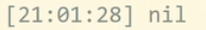

------

### 多重赋值

> 可以在一行内给多个变量赋值，比如：
>
> ```lua
> a,b = 1,2
> print(a,b)
> ```
>
> 此时输出结果为：
>
> 假如代码为：(声明了 `a` , `b` , `c` 但是没有给 `c` 赋值，此时打印，`c` 为 `nil` )
>
> ```lua
> a,b,c = 1,2
> print(a,b,c)
> ```
>
> 此时输出结果为：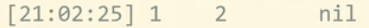

------

### `number` 数值型

> 在C语言中有多种数值类型比如：`int`  `float` 这些在Lua里面对应的只有一种类型： `number` 类型
>
> 比如：这里 a 和 b 就都是 number 类型
>
> ```lua
> a = 1
> b = 2
> ```
>
> ### 在Lua里面支持 `十六进制表示方法` 就是0x开头 和 `科学计数法`
>
> 比如：
>
> ```lua
> a = 0x11
> b = 2e10
> print(a,b)
> ```
>
> 输出结果为：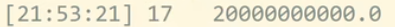

------

### 运算符

#### 也支持 加 减 乘 除

> 比如：
>
> ```lua
> print(10+5)
> print(10-5)
> print(10*5)
> print(10/5)
> ```

#### 支持 乘幂符号

> 比如：
>
> ```lua
> print(10^5)
> ```
>
> 输出结果：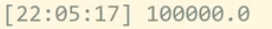

#### 支持 左移 右移（**在Lua5.3里面左移右移符号的支持加上了**）

> 比如：
>
> ```lua
> print(1<<3)
> ```
>
> 输出结果：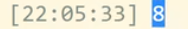

------

### `string` 字符串

这里和 C 差不多

#### `单引号` 和 `双引号` 都可以

> 比如：
>
> ```lua
> a = "我是字符串"
> b = '我是字符串'
> ```

#### 支持换行符 `\n`

> 比如：
>
> ```lua
> a = "我是\n字符串"
> b = '我是字符串'
> print(a,b)
> ```
>
> 输出结果：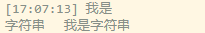

#### 使用多行文本

> 可以使用两个中括号包裹，比如：
>
> ```lua
> c = [[
> 我是第一行///！@#￥%……&*（）--我是注释,但是因为在多行文本内，所以不是注释
> 我是第二行
> 我是第三行
> ]]
> print(c)
> ```
>
> 输出结果：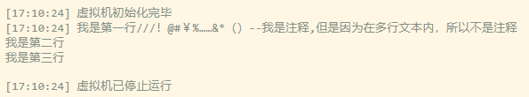

#### 连接两个字符串使用两个点连接，比如： `a..b` 

> 比如：
>
> ```lua
> a = "我是"
> b = '字符串'
> print(a..b)
> ```
>
> 输出结果：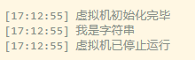

#### 字符串和数字互相转化

> - #### **字符串转数字：**
>
>   ```lua
>   c = tostring(10)
>   print(c)
>   ```
>
> - #### **数字转字符串：**
>
>   ```lua
>   n = tonumber("10")
>   print(n)
>   ```

##### 需要注意！如果转换失败，值为 `nil`

> 比如：
>
> ```lua
> n = tonumber("ABC")
> print(n)
> ```
>
> 输出结果：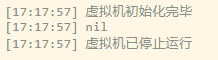

#### 获取字符串的长度，可以在字符串前使用 `#`

> 比如：
>
> ```lua
> n = "abc"
> print(#n)
> ```
>
> 输出结果：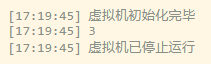

- ##### **需要注意！一个中文是3个字符长度，比如：**

  > ```lua
  > n = "我是字符串"
  > print(#n)
  > ```
  >
  > 输出结果为：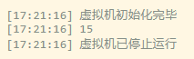

------

### `function` 函数

#### 声明函数 两种方法

> `( ... )` 是形参
>
> - 方法一
>
>   ```lua
>   function f( ... )
>       -- body
>   end
>   
>   function f(a,b)
>       print(a,b)
>   end
>   ```
>
> - 方法二：
>
>   ```lua
>   f = function( ... )
>       -- body
>   end
>   ```

#### 函数返回值

> ```lua
> function f(a,b)
>     return a
> end
> 
> print(f(1,2))
> ```
>
> 输出结果：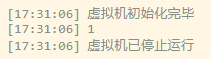


