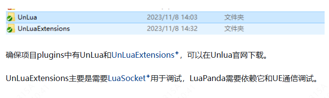
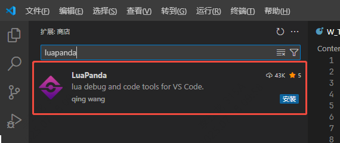
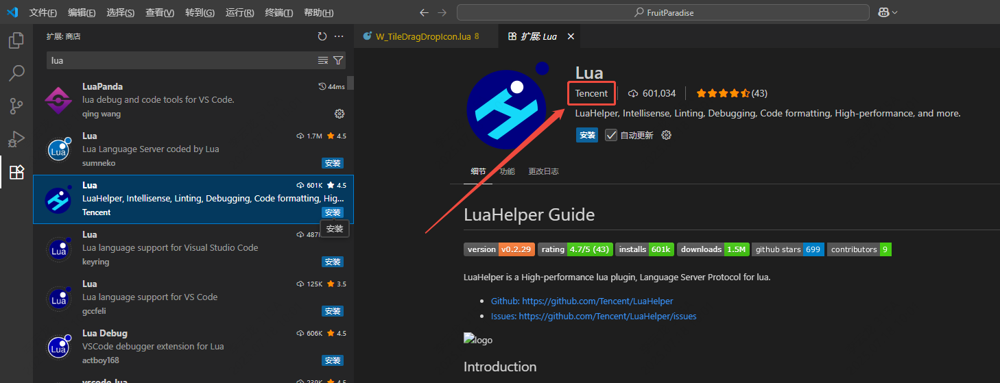
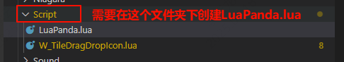
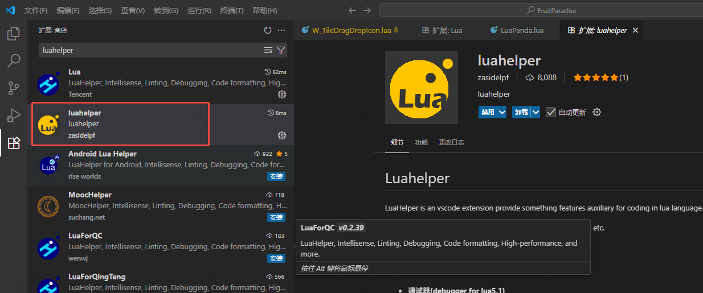

___________________________________________________________________________________________
###### [GoLibraryMainMenu](../_LibraryMainMenu_.md)
___________________________________________________________________________________________
# UE  Lua插件 `UnLua` 的使用方法

___________________________________________________________________________________________

[TOC]

------

## 第一步，拉库：

[官方UnLua库链接](https://github.com/Tencent/UnLua?tab=readme-ov-file)

## 第二步，编译：

这里我遇到了版本的问题，我使用的UE5.5官方版本拉下来以后，由于5.5修改了UHT相关源码，所以导致UnLua的插件相应的调用也需要修改

## 第三步，使用Lua基础语法：

参考这个[Lua基础语法_lua语法-CSDN博客](https://blog.csdn.net/m0_74189279/article/details/148214407)

## 第四步，断点调试准备 [官方文档](https://github.com/Tencent/UnLua/blob/master/Docs/CN/Debugging.md)

[[UE\]Unlua断点调试及其环境配置（LuaPanda） - 知乎](https://zhuanlan.zhihu.com/p/665748615)

参考视频：

1. 需要安装：

   - **`LuaPanda`**[^1]

   - **`Lua`**[^2]
   - **`LuaHelper`**[^4]

2. 在**Script**文件夹下创建`LuaPanda.lua`文件[^3]

[Lua基础语法_lua语法-CSDN博客](https://blog.csdn.net/m0_74189279/article/details/148214407)

[🕹️ 在线体验LuatOS - LuatOS 文档](https://wiki.luatos.com/pages/emulator.html)

------

[^1]: LuaPanda
[^2]: Lua
[^3]: 在**Script**文件夹下创建`LuaPanda.lua`文件
[^4]: LuaHelper
