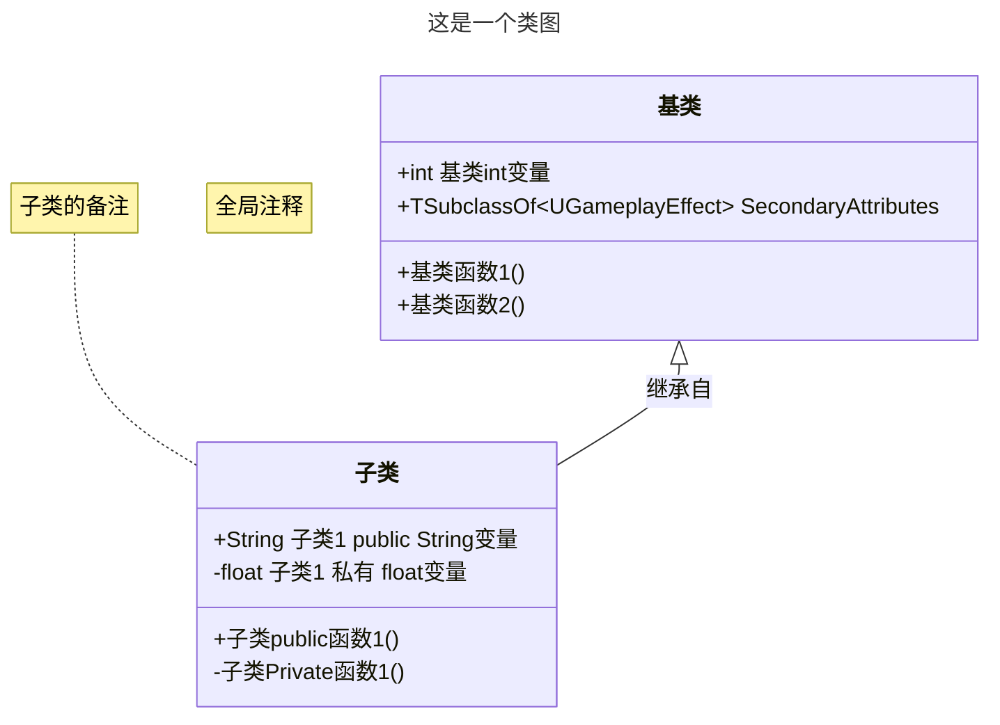

**Mermaid**，它是一种用于生成图表的工具，常用于Markdown文件中，可以生成各种类型的图，包括类图、流程图、序列图等。

______________________________________________________________

## 目录
- [目录](#目录)
- [使用尖括号](#使用尖括号)
- [流程图](#流程图)
  - [流程图 参考1上下  `TD`](#流程图-参考1上下--td)
  - [流程图 参考2左右  `LR`](#流程图-参考2左右--lr)
- [树形图](#树形图)
  - [树形图 参考1上下  `TD`](#树形图-参考1上下--td)
  - [树形图 参考2左右  `LR`](#树形图-参考2左右--lr)
- [类图](#类图)
  - [类图参考1上下  `TB`](#类图参考1上下--tb)
  - [类图参考2左右  `LR`](#类图参考2左右--lr)


______________________________________________________________

## 使用尖括号

[使用尖括号需要HTML转义_这里是csdn链接_转义对照表](https://blog.csdn.net/qq_27852041/article/details/87914729)

______________________________________________________________

## 流程图 
````

````

### 流程图 参考1上下  `TD` 


### 流程图 参考2左右  `LR` 


______________________________________________________________

## 树形图 


````

````

### 树形图 参考1上下  `TD` 


### 树形图 参考2左右  `LR` 


______________________________________________________________

## 类图




````

````


______________________________________________________________

### 类图参考1上下  `TB` 


______________________________________________________________

### 类图参考2左右  `LR` 


______________________________________________________________

