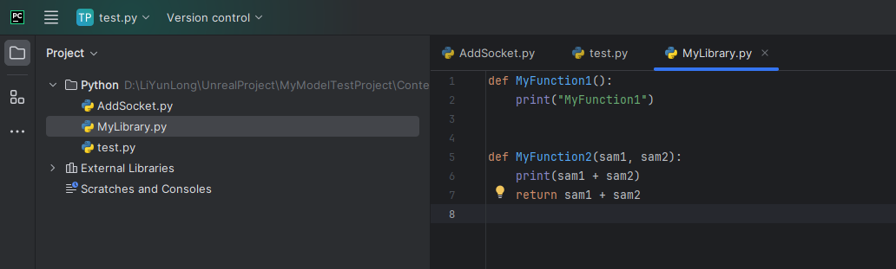
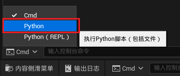
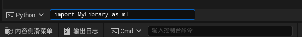
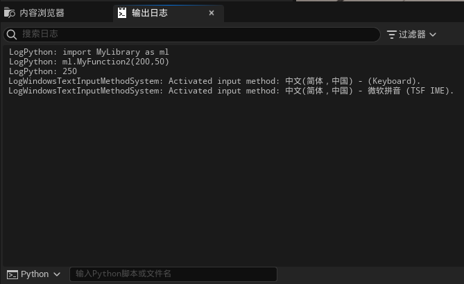
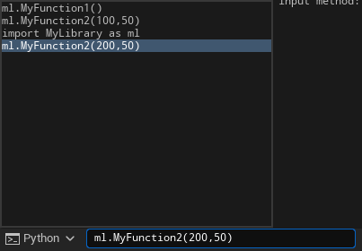
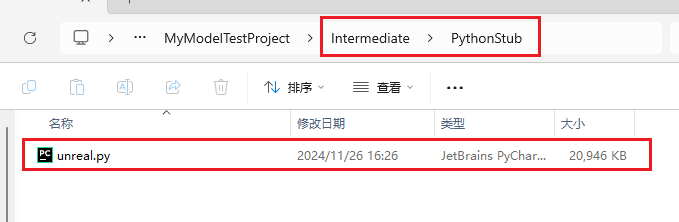

___________________________________________________________________________________________
###### [GoMenu](../UE_PythonMenu.md)
___________________________________________________________________________________________
# UE Python中调用函数


___________________________________________________________________________________________


## 目录


___________________________________________________________________________________________

### UE中调用Python函数

> 比如：
>
> - 创建一个文件，添加两个测试函数
>
>   
>
> - 需要在引擎中切换成Python模块
>
>   
>
> - 需要先导入模块（Python文件）输入代码：
>
>   
>
>   这一步的作用是引入模块 `MyLibrary` 并取别名为 `ml`
>
>   ```python
>   import MyLibrary as ml
>   ```
>
> - 然后可以使用ml调用函数，比如调用 `MyFunction2`，输入指令：
>
>   ```python
>   ml.MyFunction2(200,50)
>   ```
>
>   输出结果：
>
>   
>
> - 在输入框内按 `上箭头 ↑` 可以看到之前输入的指令
>
>   
>
>   

### 虚幻官方的Python预置功能

> 设置了Python后会出现这个文件，这里有一些功能可以调用
>
> 
> 这里是API文档：[Unreal Python API Documentation — Unreal Python 5.4 (Experimental) documentation](https://dev.epicgames.com/documentation/en-us/unreal-engine/python-api/?application_version=5.4)

------

参考链接：

[ Python in UE4 哔哩哔哩_bilibili ](https://www.bilibili.com/video/BV1PE411d7z8/?spm_id_from=333.880.my_history.page.click&vd_source=9e1e64122d802b4f7ab37bd325a89e6c)