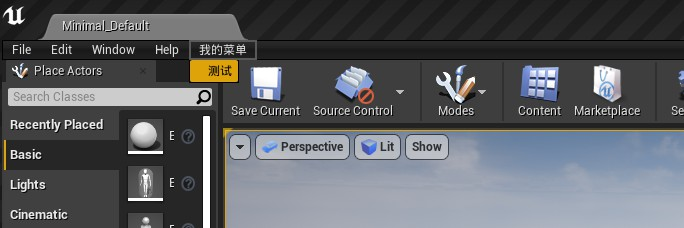
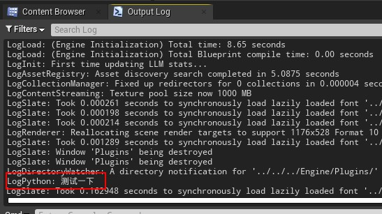
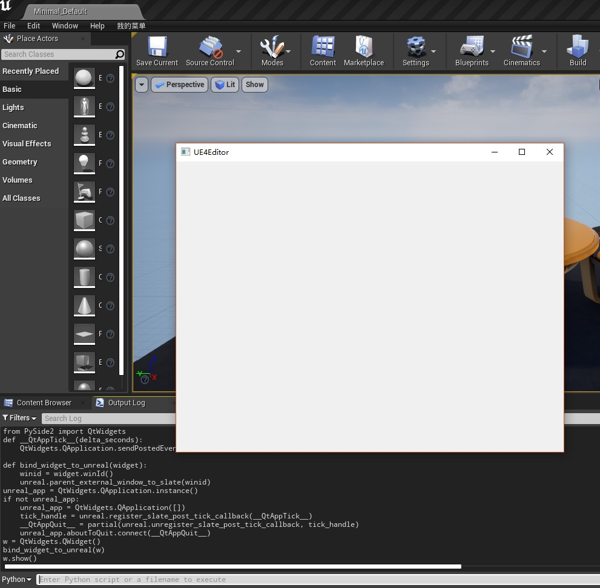
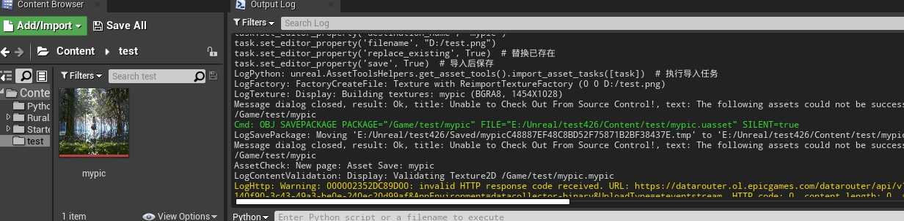
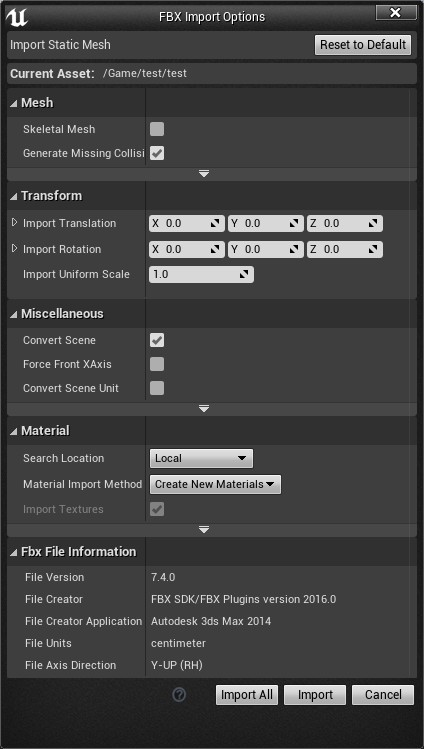
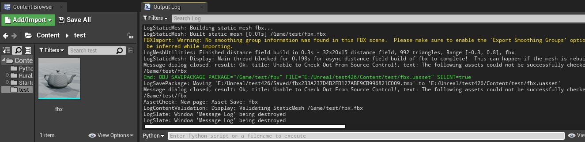
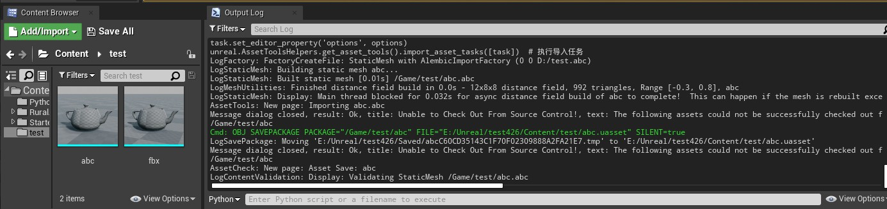

___________________________________________________________________________________________
###### [GoMenu](../UE_PythonMenu.md)
___________________________________________________________________________________________
# UE4 Python 常用功能


___________________________________________________________________________________________


## 目录


___________________________________________________________________________________________

> 以下代码基于UE4.26，引擎自带的Python版本为3.7。
>

# 添加自定义菜单

> 这个功能可以在UE4的菜单栏上添加自定义的菜单，执行自定义的功能，方便用户使用。
>
> ```python
> import unreal
> 
> menus = unreal.ToolMenus.get()
> main_menu = menus.find_menu("LevelEditor.MainMenu")  # 获取unreal的菜单控件
> 
> added_menu = main_menu.add_sub_menu(main_menu.get_name(), "MyMenu", "我的菜单", "我的菜单")  # 添加子菜单
> 
> entry = unreal.ToolMenuEntry(
>     name='func1',
>     type=unreal.MultiBlockType.MENU_ENTRY,
>     insert_position=unreal.ToolMenuInsert('', unreal.ToolMenuInsertType.DEFAULT)
> )  # 按钮
> entry.set_label('测试')
> entry.set_string_command(unreal.ToolMenuStringCommandType.PYTHON, "Name", 'print("测试一下")')  # 设置按钮的功能
> 
> 
> added_menu.add_menu_entry('MyMenu', entry)  # 将按钮添加到子菜单
> 
> 
> menus.refresh_all_widgets()  # 刷新菜单ui
> ```
>
> 运行后生成的菜单如下
>
> 
>
> 点击测试菜单命令后出现log如下
>
> 
>
> #  
>

# 图形界面

> 在UE4中使用Python的PyQt库也可以制作图形界面，但因为UE4的图形界面是使用C++开发的，因此PyQt开发的页面是无法嵌入到UE4页面中的，这一点需要注意。
>
> 下面就来实现一个Qt窗口。
>
> 首先UE4自带的Python中没有PySide库，因此需要先给引擎自带的python（路径在Engine\Binaries\ThirdParty\Python3\Win64）安装PySide库。
>
> ```python
> pip install PySide2
> ```
>
> 另外同样由于UE4的图形界面是C++开发的，因此需要将Qt的窗口类与UE4的窗口进行关联，否则会导致UE4闪退或者卡死。
>
> 一个简单窗口的代码如下
>
> ```python
> import unreal
> from functools import partial
> from PySide2 import QtWidgets
> 
> def __QtAppTick__(delta_seconds):
>     QtWidgets.QApplication.sendPostedEvents()
>     
> def bind_widget_to_unreal(widget):
>     winid = widget.winId()
>     unreal.parent_external_window_to_slate(winid)
> 
> unreal_app = QtWidgets.QApplication.instance()
> if not unreal_app:
>     unreal_app = QtWidgets.QApplication([])
>     tick_handle = unreal.register_slate_post_tick_callback(__QtAppTick__)
>     __QtAppQuit__ = partial(unreal.unregister_slate_post_tick_callback, tick_handle)
>     unreal_app.aboutToQuit.connect(__QtAppQuit__)
> 
> w = QtWidgets.QWidget()
> bind_widget_to_unreal(w)
> w.show()
> ```
>
> 执行后效果如下
>
> 
>
> 再结合[QtDesigner](https://www.yumefx.com/?p=3125)制作的ui文件和通过[Qt.py](https://github.com/mottosso/Qt.py)加载ui文件，就可以实现一个足够强大并且可以方便随时修改的UI窗口。
>
> # 
>

# 导入资产

> 对于图片、视频等资产的导入，实现是很简单的。
>
> ```python
> task = unreal.AssetImportTask()  # 创建导入的任务
> task.set_editor_property('automated', True)
> task.set_editor_property('destination_path', "/Game/test")
> task.set_editor_property('destination_name', "mypic")
> task.set_editor_property('filename', "D:/test.png")
> task.set_editor_property('replace_existing', True)  # 替换已存在
> task.set_editor_property('save', True)  # 导入后保存
> unreal.AssetToolsHelpers.get_asset_tools().import_asset_tasks([task])  # 执行导入任务
> ```
>
> 运行后，图片就被导入成功了。
>
> 
>
> 而对于fbx、abc、obj等模型文件的导入，就会比较复杂，在导入模型资产时会有如下这样的设置窗口。
>
> 
>
> 因此在使用Python导入模型资产时，也需要对这部分设置进行配置。
>
> ```python
> options = unreal.FbxImportUI()  #声明导入配置
> options.set_editor_property('import_mesh', True)
> options.set_editor_property('import_textures', False) #不导入材质
> options.set_editor_property('import_materials', False) #不导入贴图
> 
> # 对于静态的fbx设置静态数据，包括合并网格，转换单位和方向等
> options.set_editor_property('import_as_skeletal', False)
> options.static_mesh_import_data.set_editor_property('combine_meshes', True)
> options.static_mesh_import_data.set_editor_property('auto_generate_collision', False)
> options.static_mesh_import_data.set_editor_property('generate_lightmap_u_vs', False)
> options.static_mesh_import_data.set_editor_property('convert_scene', True)
> options.static_mesh_import_data.set_editor_property('convert_scene_unit', True)
> options.static_mesh_import_data.set_editor_property('vertex_color_import_option', unreal.VertexColorImportOption.REPLACE)
> 
> 
> task = unreal.AssetImportTask()  # 创建导入的任务
> task.set_editor_property('automated', True)
> task.set_editor_property('destination_path', "/Game/test")
> task.set_editor_property('destination_name', "fbx")
> task.set_editor_property('filename', "D:/test.fbx")
> task.set_editor_property('replace_existing', True)  # 替换已存在
> task.set_editor_property('save', True)  # 导入后保存
> 
> # 将设置放到导入任务中
> task.set_editor_property('options', options)
> 
> unreal.AssetToolsHelpers.get_asset_tools().import_asset_tasks([task])  # 执行导入任务
> ```
>
> 导入后效果如下
>
> 
>
> 而在导入特效或毛发等文件时，会用到abc格式，这时候需要设置abc的导入配置。
>
> 另外由于轴向的问题，默认导入的物体朝向是错误的，需要修复。
>
> ```python
> # 修复abc的轴向问题
> abc_conversion_settings = unreal.AbcConversionSettings(
>     preset=unreal.AbcConversionPreset.MAYA,
>     flip_u=False, flip_v=True, scale=[1.0, -1.0, 1.0],
>     rotation=[90.0, 0.0, 0.0])
> 
> options = unreal.AbcImportSettings() #abc导入配置
> options.set_editor_property('import_type', unreal.AlembicImportType.STATIC_MESH)
> options.set_editor_property('conversion_settings', abc_conversion_settings)
> 
> 
> task = unreal.AssetImportTask()  # 创建导入的任务
> task.set_editor_property('automated', True)
> task.set_editor_property('destination_path', "/Game/test")
> task.set_editor_property('destination_name', "abc")
> task.set_editor_property('filename', "D:/test.abc")
> task.set_editor_property('replace_existing', True)  # 替换已存在
> task.set_editor_property('save', True)  # 导入后保存
> 
> # 将设置放到导入任务中
> task.set_editor_property('options', options)
> 
> unreal.AssetToolsHelpers.get_asset_tools().import_asset_tasks([task])  # 执行导入任务
> ```
>
> 效果如下
>
> 
>
> 除了轴向以外，从Maya中导入模型时还需要注意世界比例导致的缩放问题。
>
> #  
>

# 其他功能

### 资产管理

> ```python
> # 创建文件夹
> unreal.EditorAssetLibrary.make_directory('/Game/Test/NewDirectory')
> 
> # 复制文件夹
> unreal.EditorAssetLibrary.duplicate_directory('/Game/Test/OldDirectory', '/Game/Test/NewDirectory')
> 
> # 删除文件夹 
> unreal.EditorAssetLibrary.delete_directory('/Game/Directory')
> 
> # 重命名文件夹
> unreal.EditorAssetLibrary.rename_directory('/Game/Directory', '/Game/NewDirectory')
> 
> # 复制资产
> unreal.EditorAssetLibrary.duplicate_asset('/Game/Test/Old', '/Game/Test/New')
> 
> # 删除资产
> unreal.EditorAssetLibrary.delete_asset('/Game/Test/File')
> 
> # 判断资产是否存在
> unreal.EditorAssetLibrary.does_asset_exist('/Game/Test/New')
> 
> # 重命名资产
> unreal.EditorAssetLibrary.rename_asset('/Game/Test/Old', '/Game/Test/New')
> 
> #选择指定资产
> paths = ['/Game/Test/abc','/Game/Textures/Sky/Cloud']
> unreal.EditorAssetLibrary.sync_browser_to_objects(paths)
> ```
>
> ###  
>

### 物体操作

> ```python
> # 从资产创建物体
> asset = unreal.EditorAssetLibrary.load_asset("/Game/Test/Fbx")
> actor_location = unreal.Vector(0.0, 0.0, 0.0)
> actor_rotation = unreal.Rotator(0.0, 0.0, 0.0)
> unreal.EditorLevelLibrary.spawn_actor_from_object(asset, actor_location,actor_rotation)
> 
> # 从蓝图实例化物体
> actor_class = unreal.EditorAssetLibrary.load_blueprint_class('/Game/BluePrint/MyActor')
> actor_location = unreal.Vector(0.0, 0.0, 0.0)
> actor_rotation = unreal.Rotator(0.0, 0.0, 0.0)
> unreal.EditorLevelLibrary.spawn_actor_from_class(actor_class, actor_location, actor_rotation)
> 
> # 获取场景中的所有物体
> actors = unreal.EditorLevelLibrary.get_all_level_actors()
> 
> # 获取场景中的所有组件
> components = unreal.EditorLevelLibrary.get_all_level_actors_components()
> 
> # 获取场景中所选的物体
> unreal.EditorLevelLibrary.get_selected_level_actors()
> 
> #在场景中选择物体
> unreal.EditorLevelLibrary.set_selected_level_actors(actors_to_select)
> 
> # 获取GameWorld
> world = unreal.EditorLevelLibrary.get_editor_world()
> 
> # 获取场景中某类的物体
> unreal.GameplayStatics.get_all_actors_of_class(unreal.EditorLevelLibrary.get_editor_world(), bpname)
> 
> # 获取场景中有某tag的物体
> unreal.GameplayStatics.get_all_actors_of_class(unreal.EditorLevelLibrary.get_editor_world(), tagname)
> ```

------

参考链接：

[UE4 Python之常用功能](https://www.yumefx.com/?p=3225)