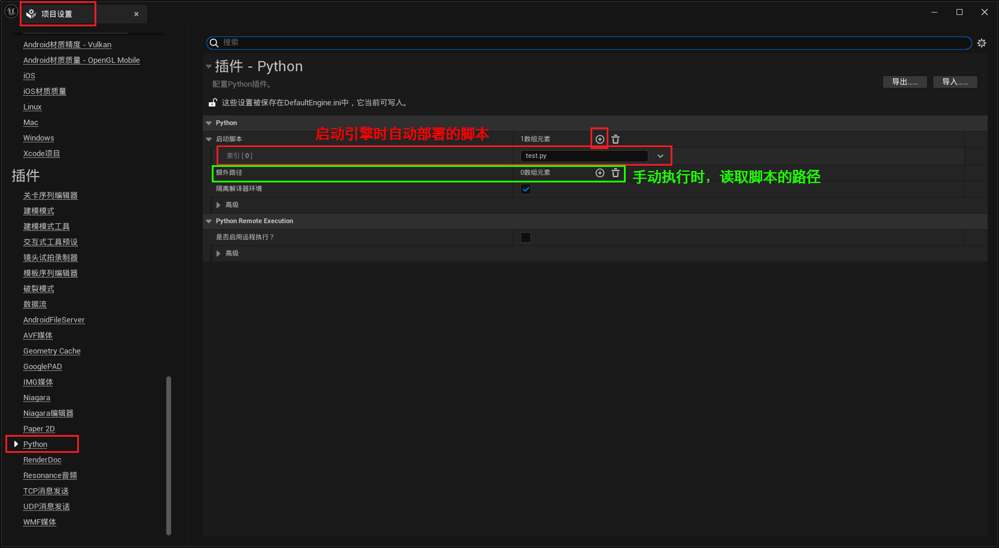

___________________________________________________________________________________________
###### [GoLibraryMainMenu](../_LibraryMainMenu_.md)
___________________________________________________________________________________________
# UE  Python插件 `PythonEditorScriptPlugin` 的使用方法

___________________________________________________________________________________________

## 目录

- [UE  TypeScripe插件 `Puerts` 的使用方法](#ue--typescripe插件-puerts-的使用方法)
  - [目录](#目录)
  - [介绍：](#介绍)
    - [`Puerts` 安装方式：](#puerts-安装方式)
      - [第一步：下载：打开github下载压缩包](#第一步下载打开github下载压缩包)
      - [第二步：打开压缩包下的Ureal文件夹，会看到一个叫 `Puerts` 的文件夹，将这个文件夹拷贝到 "项目Plugins文件夹" 下](#第二步打开压缩包下的ureal文件夹会看到一个叫-puerts-的文件夹将这个文件夹拷贝到-项目plugins文件夹-下)
      - [第三步：在命令行执行一下开启插件](#第三步在命令行执行一下开启插件)
      - [第五步：设置一下枚举类型](#第五步设置一下枚举类型)
      - [第六步：然后重新生成下项目：](#第六步然后重新生成下项目)
      - [第七步：为项目添加 `模块` 依赖](#第七步为项目添加-模块-依赖)
      - [第八步：运行项目后可以看到图标](#第八步运行项目后可以看到图标)
      - [第九步：去到工程根目录运行 `npm init -y` 创建一个默认的 `package.json`](#第九步去到工程根目录运行-npm-init--y-创建一个默认的-packagejson)
      - [第十步：需要安装 `VSCode`](#第十步需要安装-vscode)
      - [第十一步：在文件夹下创建ts文件](#第十一步在文件夹下创建ts文件)
      - [第十二步：保存ts文件后，在引擎中会多出一个BP](#第十二步保存ts文件后在引擎中会多出一个bp)

___________________________________________________________________________________________

## 介绍：

[使用Python脚本化运行虚幻编辑器 | 虚幻引擎 5.5 文档 | Epic Developer Community | Epic Developer Community](https://dev.epicgames.com/documentation/zh-cn/unreal-engine/scripting-the-unreal-editor-using-python)

### `PythonEditorScriptPlugin` 应该是默认开启的，若未开启，需要开启

>

### 运行 `Python` 脚本

#### 启动项目时运行

> 先创建一个py脚本
>
> 需要在Content目录下创建Python文件夹，把脚本文件放到这个文件夹目录下
>
> 
>
> 简单打印一个欢迎
>
> 
>
> 项目设置中进行配置
>
> 
>
> 启动项目时运行的在这里配置好后，需要重启编辑器
>
> 重启后，就可以看到打印(执行脚本)
>
> 

#### 手动执行脚本

> 手动选择执行脚本的位置
>
> 
>
> 执行后打印：
>
> 

------

参考文档：

[使用Python脚本化运行虚幻编辑器 | 虚幻引擎 5.5 文档 | Epic Developer Community | Epic Developer Community](https://dev.epicgames.com/documentation/zh-cn/unreal-engine/scripting-the-unreal-editor-using-python)