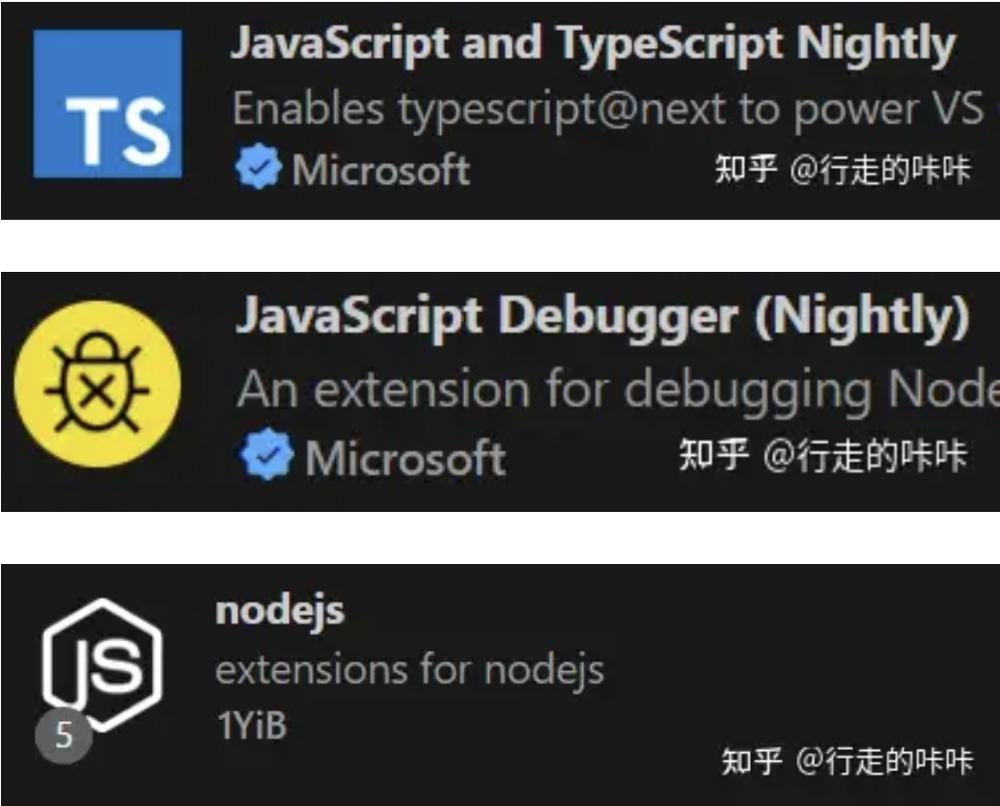
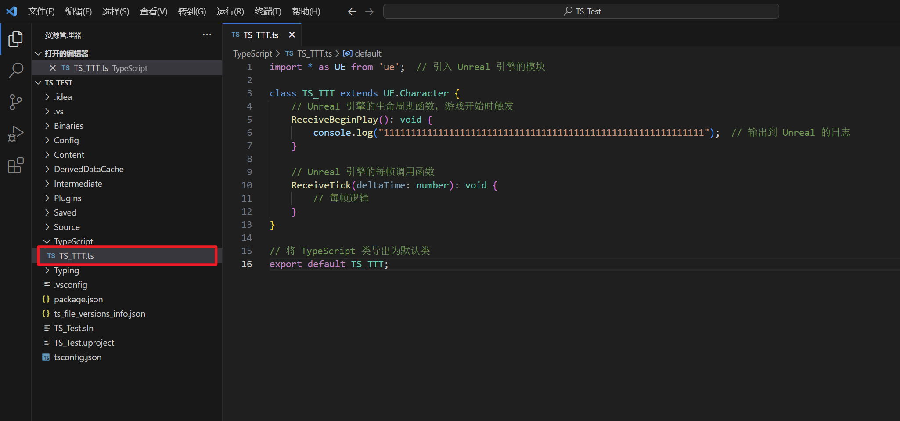

___________________________________________________________________________________________
###### [GoLibraryMainMenu](../_LibraryMainMenu_.md)
___________________________________________________________________________________________
# UE  TypeScripe插件 `Puerts` 的使用方法


___________________________________________________________________________________________


## 目录

- [UE  TypeScripe插件 `Puerts` 的使用方法](#ue--typescripe插件-puerts-的使用方法)
  - [目录](#目录)
  - [介绍：](#介绍)
    - [`Puerts` 安装方式：](#puerts-安装方式)
      - [第一步：下载：打开github下载压缩包](#第一步下载打开github下载压缩包)
      - [第二步：打开压缩包下的Ureal文件夹，会看到一个叫 `Puerts` 的文件夹，将这个文件夹拷贝到 "项目Plugins文件夹" 下](#第二步打开压缩包下的ureal文件夹会看到一个叫-puerts-的文件夹将这个文件夹拷贝到-项目plugins文件夹-下)
      - [第三步：在命令行执行一下开启插件](#第三步在命令行执行一下开启插件)
      - [第五步：设置一下枚举类型](#第五步设置一下枚举类型)
      - [第六步：然后重新生成下项目：](#第六步然后重新生成下项目)
      - [第七步：为项目添加 `模块` 依赖](#第七步为项目添加-模块-依赖)
      - [第八步：运行项目后可以看到图标](#第八步运行项目后可以看到图标)
      - [第九步：去到工程根目录运行 `npm init -y` 创建一个默认的 `package.json`](#第九步去到工程根目录运行-npm-init--y-创建一个默认的-packagejson)
      - [第十步：需要安装 `VSCode`](#第十步需要安装-vscode)
      - [第十一步：在文件夹下创建ts文件](#第十一步在文件夹下创建ts文件)
      - [第十二步：保存ts文件后，在引擎中会多出一个BP](#第十二步保存ts文件后在引擎中会多出一个bp)


___________________________________________________________________________________________

## 介绍：

[[UnrealCircle北京\]TypeScript在虚幻项目中的应用 | 梁程 金山世游_哔哩哔哩_bilibili](https://www.bilibili.com/video/BV1ms4y1T7Q7/?spm_id_from=333.880.my_history.page.click&vd_source=9e1e64122d802b4f7ab37bd325a89e6c)

<details>
<summary>Puerts介绍</summary>

>
>
>### 和Lua的对比
>
>
>

------

</details>


### `Puerts` 安装方式：

#### 第一步：下载：打开github下载压缩包

> [Tencent/puerts](https://github.com/Tencent/puerts)
> 注意下版本，如果不会就下[releases版](https://github.com/Tencent/puerts/releases)
>
> 

#### 第二步：打开压缩包下的Ureal文件夹，会看到一个叫 `Puerts` 的文件夹，将这个文件夹拷贝到 "项目Plugins文件夹" 下

> 

#### 第三步：在命令行执行一下开启插件

> 然后在 `Puerts` 目录里打开命令行执行：`node enable_puerts_module.js`
>
> ```typescript
> node enable_puerts_module.js
> ```
>
> 
>
> 

**第四步：安装Node** [下载 | Node.js 中文网 (nodejs.cn)](https://nodejs.cn/download/)

> [windows typescript环境搭建 - 知乎 (zhihu.com)](https://zhuanlan.zhihu.com/p/362772800?utm_id=0)
>
> 

#### 第五步：设置一下枚举类型

> 

#### 第六步：然后重新生成下项目：

> 

#### 第七步：为项目添加 `模块` 依赖

> ```C#
> PublicDependencyModuleNames.AddRange(new string[] { "Puerts","JsEnv" });
> ```
>
> 

#### 第八步：运行项目后可以看到图标

> 
>
> ### 可以看到 **已经启用了插件**
>
> 

#### 第九步：去到工程根目录运行 `npm init -y` 创建一个默认的 `package.json`

> ```typescript
> npm init -y
> ```
>
> 

#### 第十步：需要安装 `VSCode`

> 在 `VSCode` 中安装如下插件：
>
> - `JavaScript and TypeScript Nightly`
> - `JavaScript Debugger (Nightly)`
> - `nodejs`
>
> 

#### 第十一步：在文件夹下创建ts文件

> 
>
> ### 假如叫我这个名字 `TS_TTT.ts`
>
> 假如输入如下代码：
>
> ```typescript
> import * as UE from 'ue';  // 引入 Unreal 引擎的模块
> 
> class TS_TTT extends UE.Character {
>     // Unreal 引擎的生命周期函数，游戏开始时触发
>     ReceiveBeginPlay(): void {
>         console.log("11111111111111111111111111111111111111111111111111111111111");  // 输出到 Unreal 的日志
>     }
>     // Unreal 引擎的每帧调用函数
>     ReceiveTick(deltaTime: number): void {
>         // 每帧逻辑
>     }
> }
> // 将 TypeScript 类导出为默认类
> export default TS_TTT;
> ```
>
> ## 需要注意：
>
> - **类名** 需要和 **文件名** 保持一致
>
>   
>
> 

#### 第十二步：保存ts文件后，在引擎中会多出一个BP

> 
>
> ### 将其拖入场景，手动实例化
>
> 因为在代码中 `BeginPlay` 时打印调试信息，所以运行游戏可以看到
>
> 
>
> 如果看不到，可以编辑一下ts文件再保存（可能是ts卡了，或者有延迟，多编辑保存几次）
>
> ### 确认可以打印后，此时修改ts文件内的信息，不用编译C++代码，BP的打印也会随之更改
>
> 

------


(这一步我也不知道有什么用？先留着)在 `TypeScripe` 文件夹下创建文件 `LearPuerTsQuickStart.ts`

> ```ts
> LearPuerTsQuickStart.ts
> ```
>
> 
>
> ```typescript
> import * as UE from 'ue'
> import {$ref, $unref, $set, argv, on, toManualReleaseDelegate, releaseManualReleaseDelegate, blueprint} from 'puerts';
> 
> let GameMode = argv.getByName("GameMode") as UE.这里使用自己创建的GMCPP类去掉A的前缀;
> let MyWorld = GameMode.GetWorld();
> if(GameMode)
> {
>     UE.KismetSystemLibrary.PrintString(MyWorld,"脚本中获取到GameMode",true,true,new UE.LinearColor(1.0,0.0,0.0,1.0),5.0,"None");
> }
> ```


参考文档：

[UE4学习之路：Puerts安装和调试 - 知乎 (zhihu.com)](https://zhuanlan.zhihu.com/p/456267138?utm_psn=1819538649764741120)

[UE5 PuerTS学习与实践 - 知乎 (zhihu.com)](https://zhuanlan.zhihu.com/p/632862773)

[Puerts-Unreal使用手册 | PUER Typescript](https://puerts.github.io/docs/puerts/unreal/manual/)

[UE5 从零搭建UE的puerts开发环境 - 知乎 (zhihu.com)](https://zhuanlan.zhihu.com/p/679045148)

[脚本调用引擎API | PUER Typescript (puerts.github.io)](https://puerts.github.io/docs/puerts/unreal/script_call_uclass/)

[跟我用TypeScript做一个FPS游戏 - 知乎 (zhihu.com)](https://zhuanlan.zhihu.com/p/346531865)