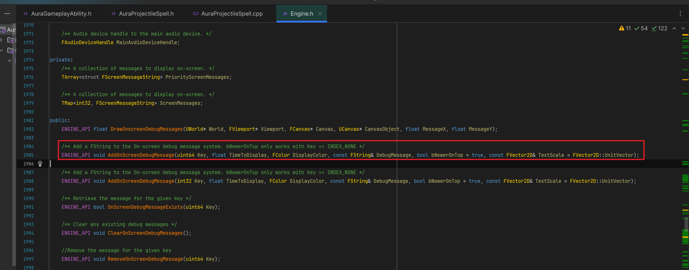
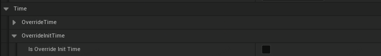
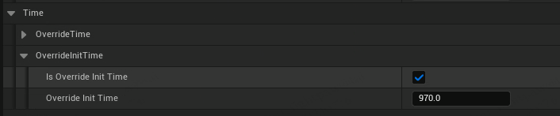

___________________________________________________________________________________________
###### [GoLibraryMainMenu](../_LibraryMainMenu_.md)
___________________________________________________________________________________________
# UE中的常用宏
___________________________________________________________________________________________


## 目录
- [UE中的常用宏](#ue中的常用宏)
  - [目录](#目录)
  - [UE\_LOG](#ue_log)
    - [UE\_LOG打印函数名](#ue_log打印函数名)
  - [UEC++中使用 `GEngine` 将消息打印到屏幕](#uec中使用-gengine-将消息打印到屏幕)
  - [宏的创建和使用](#宏的创建和使用)
    - [内联函数宏](#内联函数宏)
    - [`UFUNCTION` 相关：UE5标识符详解 | 史上最全 - 知乎 (zhihu.com)](#ufunction-相关ue5标识符详解--史上最全---知乎-zhihucom)
    - [只有当bool在编辑器中勾选true时才会显示其他选项](#只有当bool在编辑器中勾选true时才会显示其他选项)


___________________________________________________________________________________________

## UE_LOG

<details>
<summary>UE_LOG宏介绍</summary>

> - 头文件片段的语法是DECLARE_LOG_CATEGORY_EXTERN(CategoryName, DefaultVerbosity, CompileTimeVerbosity). DefaultVerbosity 是在 ini 文件或命令行中未指定详细级别时使用的详细级别。不会记录任何比这更详细的内容。CompileTimeVerbosity 是要在代码中编译的最大详细程度。任何比这更详细的内容都不会被编译。  

------

</details>

> - 使用时在头文件或者源文件最上面引入头文件之后即可
>
> ```CPP
> DECLARE_LOG_CATEGORY_CLASS(这里是自定义log名字, Log, All);
> ```
>
> - 或者
>
> ```CPP
> DECLARE_LOG_CATEGORY_EXTERN(这里是自定义log名字, Log, All);
> ```
>
> - 参考网页
>
>   [知乎——虚幻UE_LOG使用教程](https://zhuanlan.zhihu.com/p/463724067)
>
> - 使用示例：
>
> ```cpp
> DECLARE_LOG_CATEGORY_CLASS(MYlog, Log, All);
> ```

------
### UE_LOG打印函数名
>```CPP
>UE_LOG(logTemp, Error, TEXT("要打印的函数是:%hs")，__FUNCTION__);
>```
>比如在函数A中那这个打印的就是 `要打印的函数是:A`
------

## UEC++中使用 `GEngine` 将消息打印到屏幕

<details>
<summary>介绍</summary>

> - 第一个参数是消息的键（key）。如果 key 设置为 -1，则每次执行这行代码时，都会在屏幕上添加一条新消息。例如，如果将这个添加到Tick()函数中，屏幕很快就会充斥着这些消息流。如果键是正整数（键的类型是 uint64），则每条新消息都会用与其键相同的整数替换前一条消息。例如，如果调用上述函数Tick()并将其键修改为 1，则游戏中的屏幕上只会看到一条消息，因为每个新调用都会简单地替换它。  
> - 第二个参数是显示消息的时长，以秒为单位，它是浮点类型。  
> - 第三个参数是一个FColor 类型的参数，用来确定文本颜色。最好使用在游戏世界背景下易于阅读的颜色。最简单的方法是使用预定义的颜色常量，例如FColor::White. 有关可用颜色常量的完整列表，请参阅[此官方文档页面](https://link.zhihu.com/?target=https%3A//docs.unrealengine.com/en-US/API/Runtime/Core/Math/FColor/index.html)的底部。  
> - 第四个参数是消息本身。请注意，整个字符串必须只占用一个参数，因此，有多个参数的情况下需要使用FString::Printf()：  
> - GEngine->AddOnScreenDebugMessage(-1, 5.f, FColor::Red, FString::Printf(TEXT("Some variable values: x = %f, y = %f"), x, y));  
> - AddOnScreenDebugMessage()还有两个可选参数。第五个参数是一个布尔值，用于确定新消息是出现在顶部（如果为真）还是底部（如果为假）。请注意，这仅适用于键值设置为 -1 的情况。第六个参数是确定文本比例的二维向量。如果打印到屏幕上的消息太小而难以阅读，或者它们太大并占用太多屏幕空间，这将非常有用。  
> - Visual Studio 可能会在 GEngine 下划线并声称它是未定义的。但是，你无需显式包含 Engine.h 或 EngineGlobals.h 即可在任何类中使用它。尽管有红色下划线，它应该可以编译并正常工作。
>
> 源码：

------

</details>

- 使用API：

```CPP
GEngine->AddOnScreenDebugMessage(-1, 5.f, FColor::White, TEXT("This message will appear on the screen!"));
```

------

## 宏的创建和使用

可以使用 `##` 拼接

//TODO

------

### 内联函数宏

- `FORCEINLINE`

<details>
<summary>FORCEINLINE 宏介绍</summary>


>`FORCEINLINE` 是一个宏，用于强制内联函数。这个宏通常在C++代码中使用，尤其是在性能关键的代码部分，如游戏开发中。
>
>### 作用
>
>1. **强制内联**：`FORCEINLINE` 通常用于提示编译器将函数体嵌入到调用该函数的代码中，而不是单独生成一个函数调用。这有助于减少函数调用的开销，提高性能，尤其是对于短小的函数或频繁调用的函数。
>2. **优化性能**：内联函数可以减少函数调用的开销（如栈操作和跳转），特别是对于频繁调用的简单函数。这有助于提高程序的执行速度。
>3. **编译器提示**：尽管`FORCEINLINE` 提示编译器进行内联，编译器可能会根据其他优化考虑忽略这个提示。`FORCEINLINE` 只是一个建议，并不是强制编译器必须内联该函数。
>
>### 示例
>
>```cpp
>#define FORCEINLINE __forceinline
>
>class MyClass {
>public:
>    FORCEINLINE int Add(int a, int b) {
>        return a + b;
>    }
>};
>```
>
>在这个例子中，`FORCEINLINE` 宏被定义为 `__forceinline`，这是MSVC编译器中的内联指令。这个宏的具体定义可能会依赖于不同的编译器。
>
>### 编译器依赖性
>
>- **MSVC**: 使用 `__forceinline`。
>- **GCC/Clang**: 通常会使用 `inline`，但实际内联决定由编译器做出。
>
>### 结论
>
>`FORCEINLINE` 是一种编译器优化提示，建议将函数内联以提高性能，但最终的决定仍由编译器根据具体情况做出。在编写性能敏感的代码时，使用 `FORCEINLINE` 可以帮助优化执行速度，但应该根据实际需求和编译器文档使用。

------

</details>

```CPP
FORCEINLINE
```

使用示例：

```cpp
public:
	FORCEINLINE bool IsCriticalHit() const { return bIsCriticalHit; }
```

------

### `UFUNCTION` 相关：[UE5标识符详解 | 史上最全 - 知乎 (zhihu.com)](https://zhuanlan.zhihu.com/p/717920216)

- #### **默认值为 Self**：`UFUNCTION(meta = (DefaultToSelf = "WorldContextObiect")`

  ```CPP
  UFUNCTION(meta = (DefaultToSelf = "WorldContextObiect")
  void TestFunction(const UObject* WorldContextObject);
  ```

  

------

### 只有当bool在编辑器中勾选true时才会显示其他选项

- #### 比如

  ```CPP
  //是否覆盖 测试时间 (这之后时间会停止)
  UPROPERTY(EditAnywhere, Category = "Debug l Time l overrideTime")
  bool bIsOverrideTime = false;
  //覆盖的 测试时间(这之后时间会停止)
  UPROPERTY(EditAnywhere, category = "Debug | Time | 0verrideTime", meta = (Editcondition = "bIsoverrideInitTime == true", EditconditionHides))
  float OverrideTime = 0.f;
  ```
  
  上述代码当 `"bIsoverrideInitTime == true"` 时才会显示 `float`
  
  下面是图示：
  
  
  
  

------


