------

###### [返回菜单](../ALS_Menu.md)

------

# ALSv001 项目设置

------

## 目录

- [ALSv001 项目设置](#alsv001-项目设置)
  - [目录](#目录)
    - [一、新建工程](#一新建工程)
    - [二、迁移资产](#二迁移资产)
    - [三、迁移Config目录下的输入映射](#三迁移config目录下的输入映射)
    - [四、按照原有的文件结构，新建文件夹并配置部分关键资产](#四按照原有的文件结构新建文件夹并配置部分关键资产)
      - [1.创建 `PlayerController`](#1创建-playercontroller)
      - [2.创建 `Character`](#2创建-character)
      - [3.创建并配置 `GameMode`](#3创建并配置-gamemode)
    - [五、配置角色基类 `ALS_Base_CharacterBP` 的 `SkeletalMesh` `相机` `弹簧臂`](#五配置角色基类-als_base_characterbp-的-skeletalmesh-相机-弹簧臂)
    - [六、删除多余文件](#六删除多余文件)
      - [删完以后剩这些](#删完以后剩这些)

------

视频链接

> [01项目设置_哔哩哔哩_bilibili](https://www.bilibili.com/video/BV12f4y1r71N?spm_id_from=333.788.videopod.episodes&vd_source=9e1e64122d802b4f7ab37bd325a89e6c&p=2)

------

------

> ### 使用的版本
>
> 我这里使用 **UE4.26** 版本
>
> 先不考虑摄像机相关的功能，先学习动画

------

> ### 在 **第三人称模板** 的基础上做如下修改

------

### 一、新建工程

> 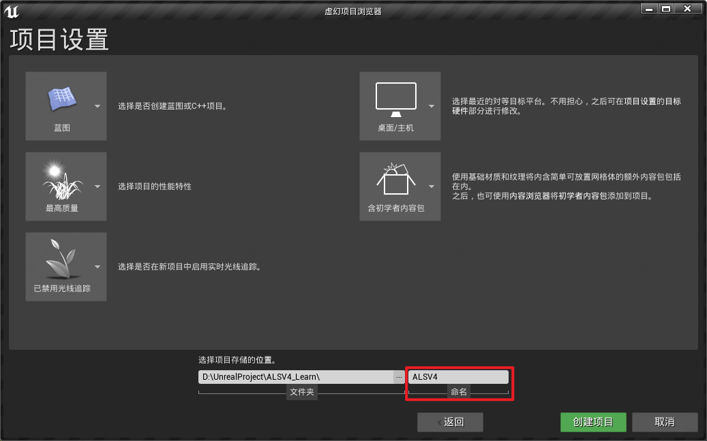

------

### 二、迁移资产

> 将 `Content\AdvancedLocomotionV4\CharacterAssets\MannequinSkeleton\AnimationExamples` 文件夹
>
> 迁移到自建的`ALSV4`项目中
>
> 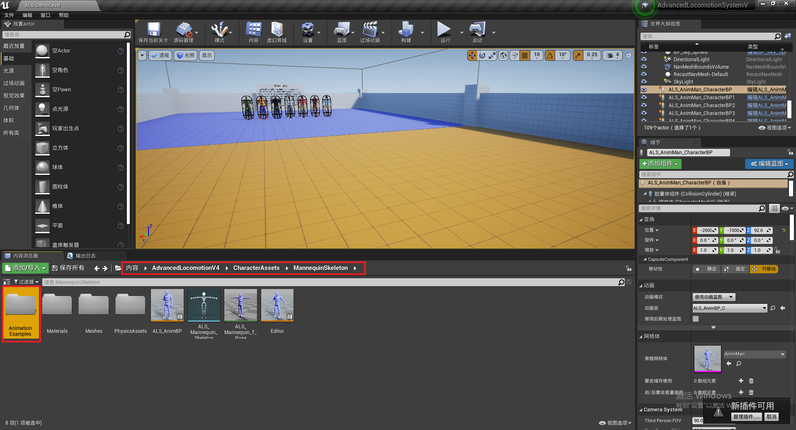
>
> 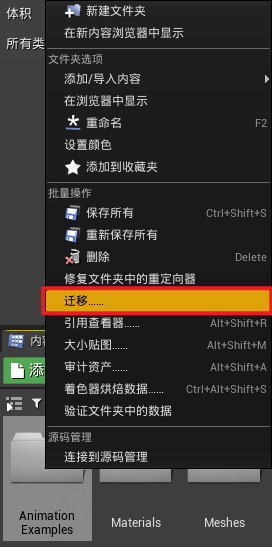
>
> 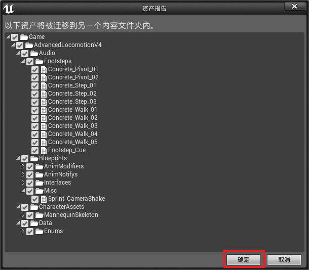

### 三、迁移Config目录下的输入映射

> 

------

> ### 完成后需要重新打开项目，Config才会生效
>
> 重新打开后，打开 **项目设置->输入** (可以看到已完成输入映射迁移)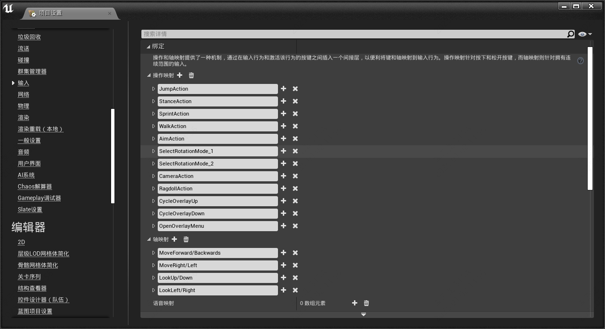

------

### 四、按照原有的文件结构，新建文件夹并配置部分关键资产

> 在 `Content\AdvancedLocomotionV4\Blueprints` 文件夹下创建 文件夹
>
> - `CharacterLogic`(存放玩家控制器)
> - `GameModes`
>
> ------

#### 1.创建 `PlayerController`

> `CharacterLogic`文件夹下创建 `PlayerController` (玩家控制器，继承自 `PlayerController`)
>
> - 命名为 `ALS_Player_Controller`
>
>   

------

#### 2.创建 `Character`

> `CharacterLogic`文件夹下创建 `Character` (玩家，继承自 `Character`)
>
> - 命名为 `ALS_Base_CharacterBP`
>
>   
>
> ------
>
> 创建 `Character` (玩家，继承自 `ALS_Base_CharacterBP`)
>
> - 命名为 `ALS_AnimMan_CharacterBP`
>
>   

------

#### 3.创建并配置 `GameMode`

> `GameModes`[^1] 文件夹下创建 `GameMode` (继承自 `GameMode`)
>
> - 命名为 `ALS_GameMode`
>
>   
>
> 配置 `ALS_GameMode`
>
> - 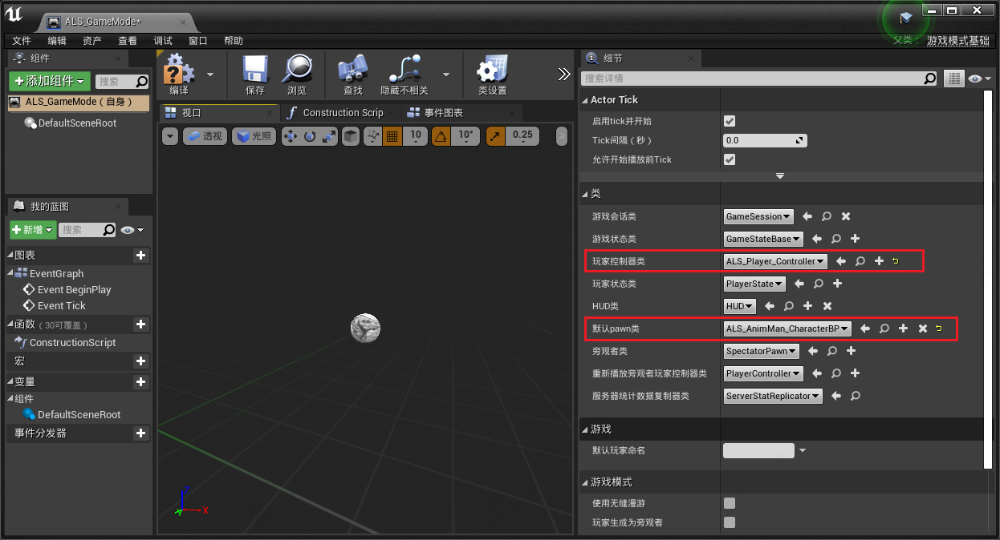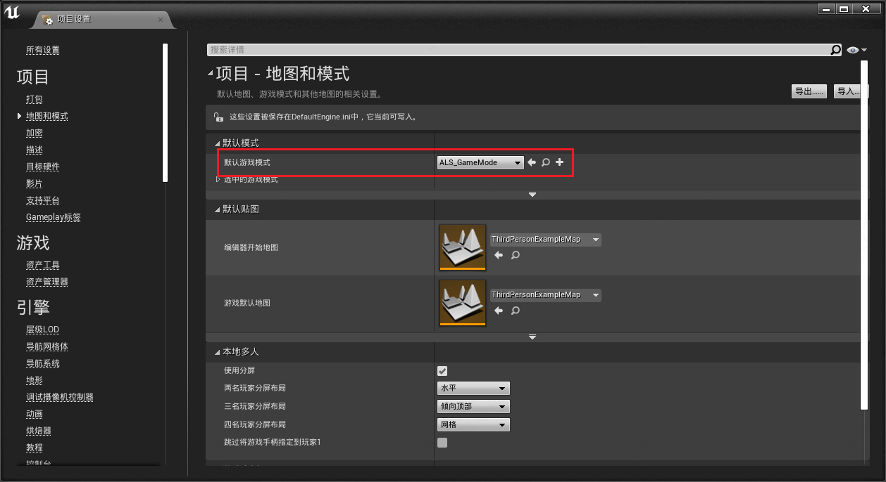

------

### 五、配置角色基类 `ALS_Base_CharacterBP` 的 `SkeletalMesh` `相机` `弹簧臂`

> - 为角色基类 `ALS_Base_CharacterBP` 设置 `SkeletalMesh`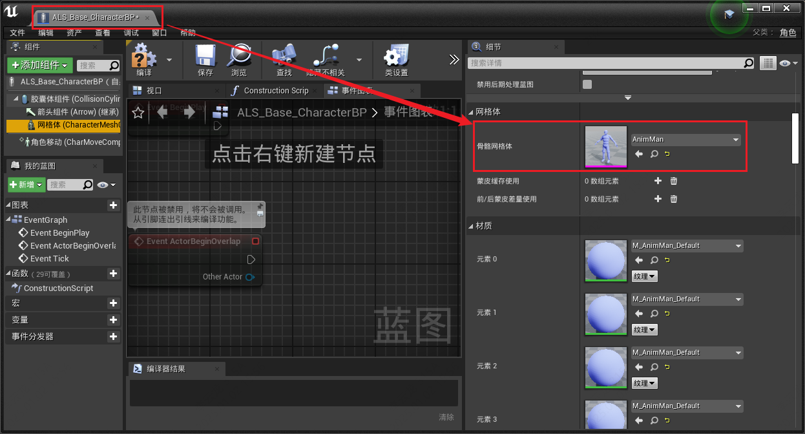
>
> - 添加弹簧臂和相机组件，调整位置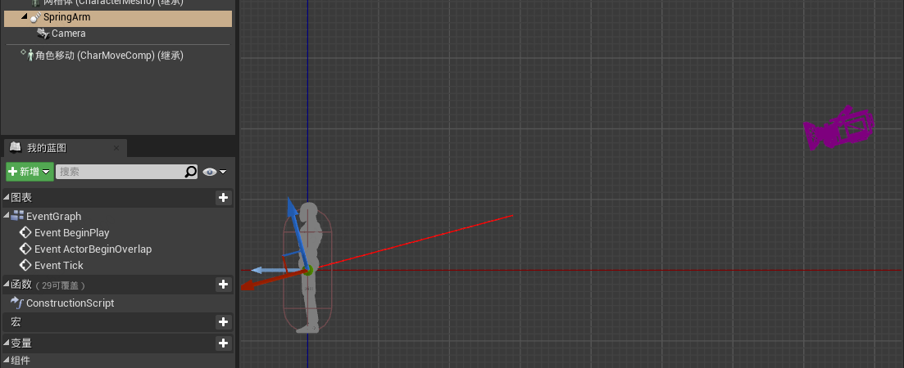

------

### 六、删除多余文件

> 这里只保留Maps
>
> 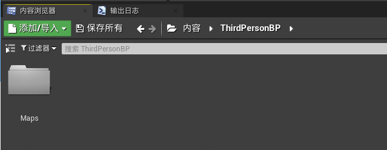
>
> 删除场景中的角色，并删除掉角色所在的文件夹 `Mannequin`
>
> 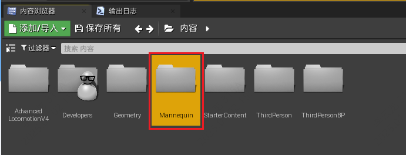

#### 删完以后剩这些

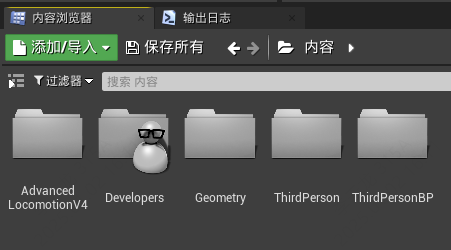

------

> ### 准备工作完成

------

[^1]: `Content\AdvancedLocomotionV4\Blueprints\GameModes`

------

[返回最上面](#返回菜单)

------
