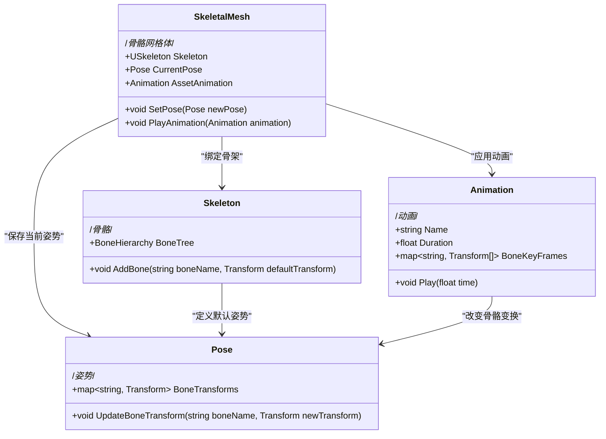
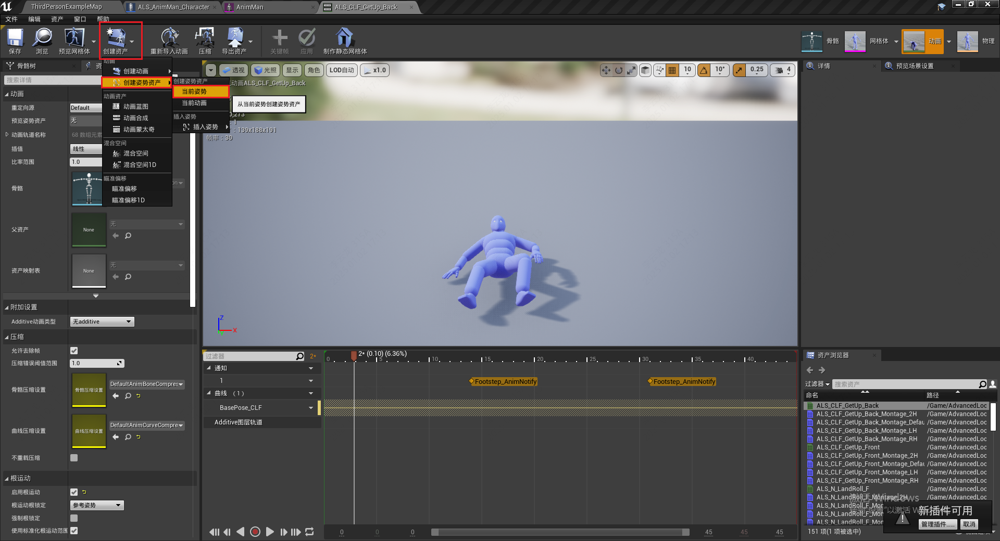
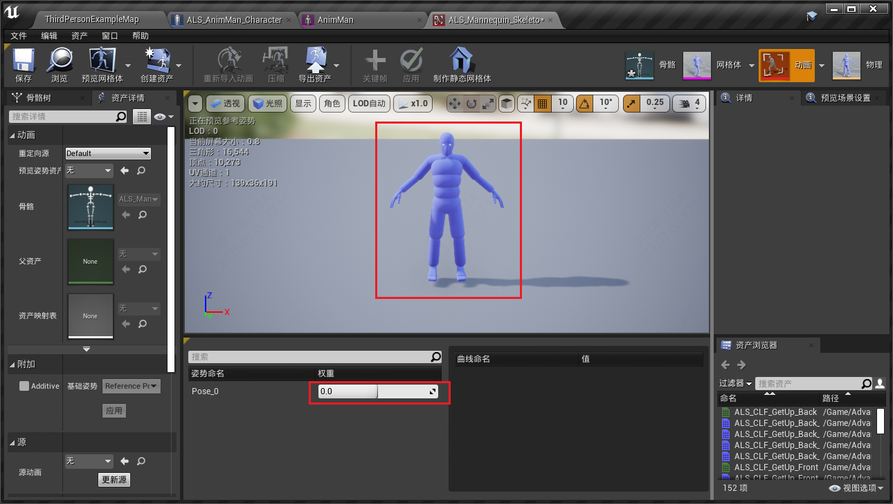
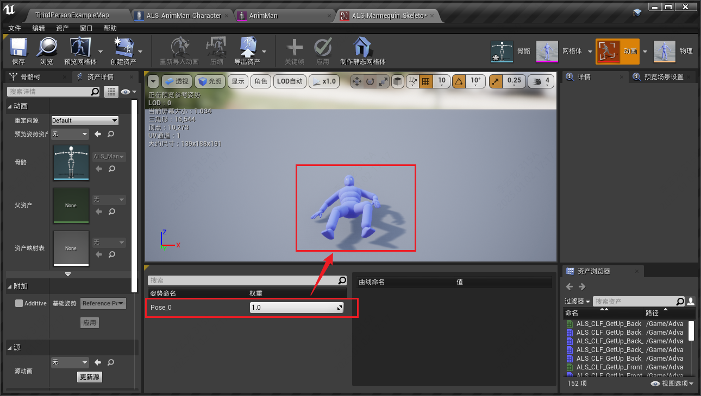
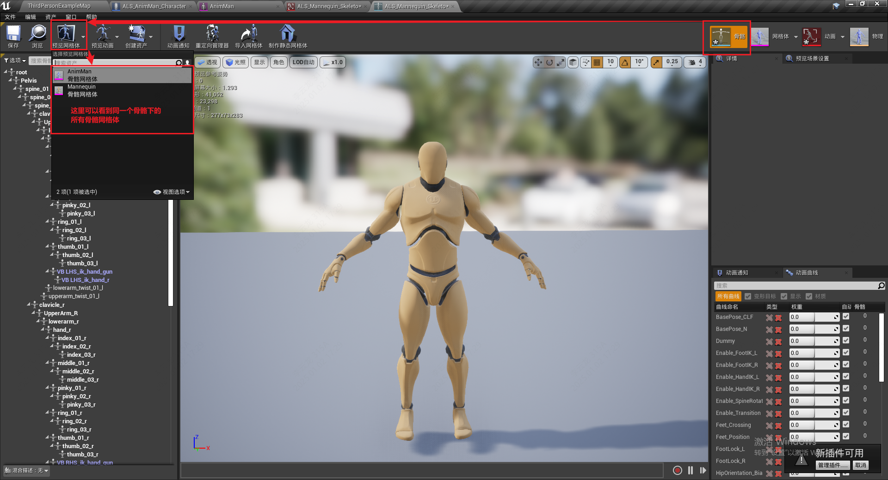

------

###### [返回菜单](../ALS_Menu.md)

------

# ALSv002 骨架-骨骼-姿势-动画

------

## 目录

- [ALSv002 骨架-骨骼-姿势-动画](#alsv002-骨架-骨骼-姿势-动画)
  - [目录](#目录)
    - [UML：`骨架` - `骨骼` - `姿势` -`动画` 四者之间的关系](#uml骨架---骨骼---姿势--动画-四者之间的关系)
    - [姿势 （Pose）权重的作用](#姿势-pose权重的作用)
      - [1.导出 姿势（Pose） 资产](#1导出-姿势pose-资产)
    - [**动画**（Animation）和**骨骼**（Skeleton）的关系](#动画animation和骨骼skeleton的关系)
      - [1.查看同一个骨架下的所有骨骼网格体](#1查看同一个骨架下的所有骨骼网格体)

------

视频链接

> [02骨架-骨骼-姿势-动画_哔哩哔哩_bilibili](https://www.bilibili.com/video/BV12f4y1r71N?spm_id_from=333.788.videopod.episodes&vd_source=9e1e64122d802b4f7ab37bd325a89e6c&p=3)

------

------

### UML：`骨架` - `骨骼` - `姿势` -`动画` 四者之间的关系

------

> - 模型，是由 `点` `线` `面` 构成的
> - 假设制作动画，直接控制顶点和面，对其进行K帧，会导致海量的数据。
> - 所以使用了 `骨架动画`[^1]

------

### 姿势 （Pose）权重的作用

#### 1.导出 姿势（Pose） 资产

> - 可以这样导出 `姿势` 资产
>
>   
>
> 导出后打开
>
> - 当权重为0时，为默认的T-Pose
>
>   
>
> - 当权重为1时，混合为当前Pose
>
>   

------

### **动画**（Animation）和**骨骼**（Skeleton）的关系

> - 当多个**骨骼网格体**（SkeletalMesh）共用一个**骨骼**（Skeleton）时，动画可以共享[^2]
>
>  - 如果 不同的**骨骼**（Skeleton）要使用相同的**动画**（Animation）,就需要 **动画重定向**

#### 1.查看同一个骨架下的所有骨骼网格体

> 

------

[^1]: 骨骼动画是一种基于骨骼驱动的动画技术，它通过操控骨骼（Skeleton）系统中骨骼节点的变换（位置、旋转、缩放），结合蒙皮（Skinning）数据实现的。蒙皮数据将网格（SkeletalMesh）的顶点与骨骼关联，每个顶点根据其绑定的骨骼权重进行变形。当骨骼发生运动时，网格顶点根据权重对骨骼的影响产生相应的形变，从而实现模型的动态表现。
[^2]: 这是因为**动画**（Animation）和**骨骼**（Skeleton）进行绑定，而非与 **骨骼网格体**（SkeletalMesh）绑定

------

[返回最上面](#返回菜单)

------
