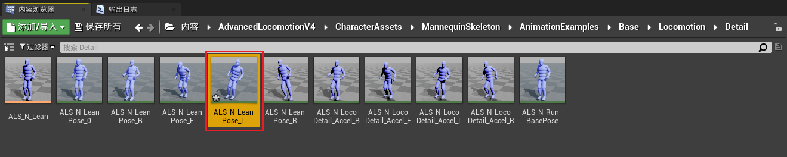
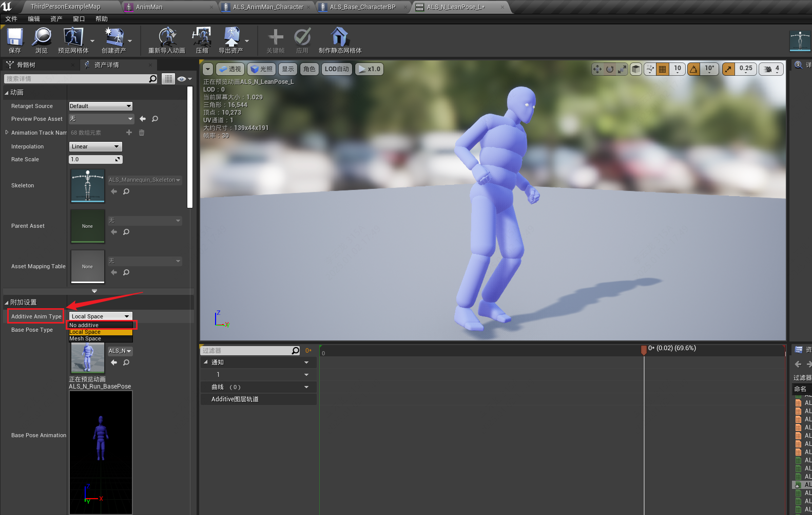
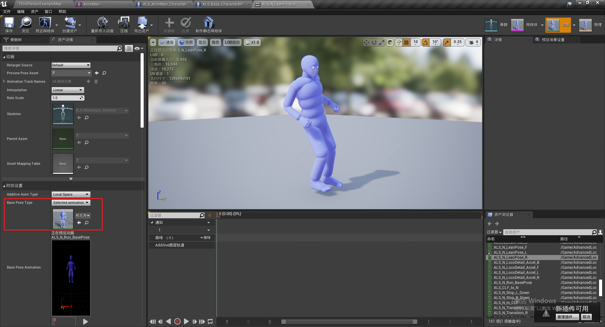
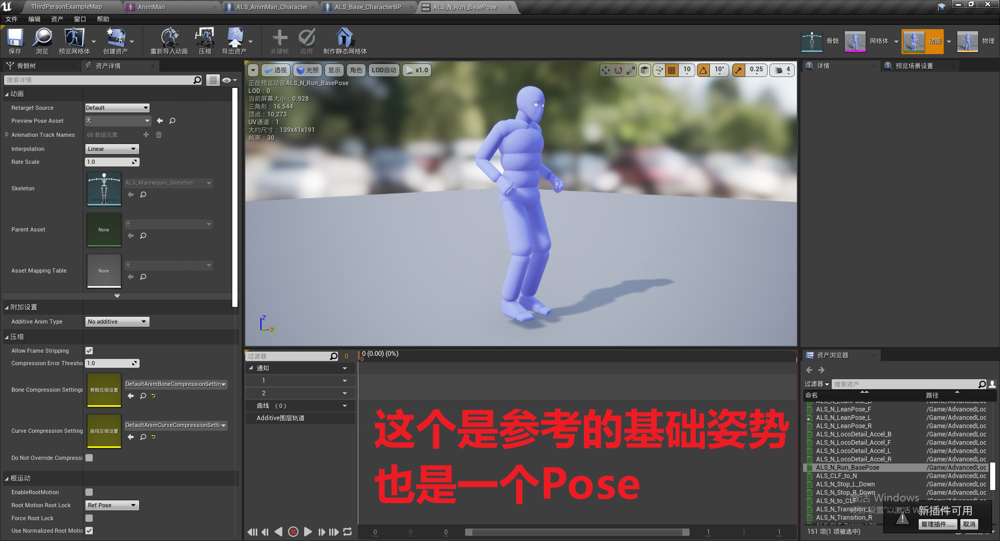
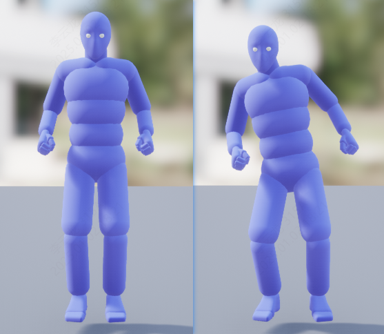

------

###### [返回菜单](../ALS_Menu.md)

------

# ALSv003 叠加动画（BlendSpace）

------

## 目录

- [ALSv003 叠加动画原理](#alsv003-叠加动画原理)
  - [目录](#目录)
    - [什么是叠加动画？](#什么是叠加动画)
    - [叠加动画一定要选择一个 `参考基础姿势(Pose)`](#叠加动画一定要选择一个-参考基础姿势pose)
    - [叠加动画原理](#叠加动画原理)

------

视频链接

> [03叠加动画_哔哩哔哩_bilibili](https://www.bilibili.com/video/BV12f4y1r71N?spm_id_from=333.788.videopod.episodes&vd_source=9e1e64122d802b4f7ab37bd325a89e6c&p=4)

------

------

### 什么是叠加动画？

> ### **叠加动画** 并不是一种 `资产`，而是一种 **`配置`**
>
> - 打开下面路径的资产
>
>   
>
> - 如果 **AdditiveAnimType**(叠加动画类型) 不是 **NoAdditive**(不叠加) **选项**，当前**动画**就会**被标记为叠加动画**
>
>   

------

### 叠加动画一定要选择一个 `参考基础姿势(Pose)`

> - 在这里选择
>
>   
>
> - 基础姿势也是Pose
>
>   

------

### 叠加动画原理

> 叠加动画是在原有的骨架动画的基础上：
>
> - **叠加动画姿势位置** 减去 **参考姿势位置**
>   - ·保存的是 **每一根骨骼的增量**
> - 也就是说**叠加动画**和**参考姿势**呈相对关系
>
> 比如，正在播放角色**跑步**动画，此时使用叠加动画(人物倾斜)，就变成了倾斜的动画

------

[返回最上面](#返回菜单)

------
