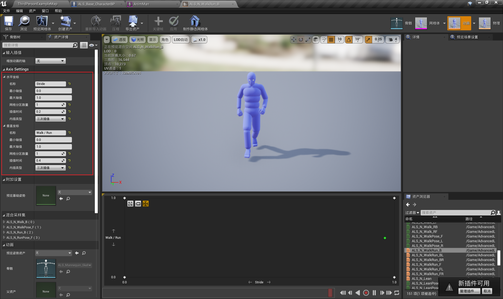

------

###### [返回菜单](../ALS_Menu.md)

------

# ALSv004 混合空间（BlendSpace）

------

## 目录

- [ALSv004 混合空间（BlendSpace）](#alsv004-混合空间blendspace)
  - [目录](#目录)
    - [调整混合空间：名称、轴值、分区、插值时间、插值类型](#调整混合空间名称轴值分区插值时间插值类型)
    - [实现 步幅大小的 控制](#实现-步幅大小的-控制)

------

视频链接

> [04混合空间_哔哩哔哩_bilibili](https://www.bilibili.com/video/BV12f4y1r71N?spm_id_from=333.788.videopod.episodes&vd_source=9e1e64122d802b4f7ab37bd325a89e6c&p=5)

------

------

> 混合空间（BlendSpace）需要与骨骼（Skeleton）绑定
>
> - 创建时 指定

------

### 调整混合空间：名称、轴值、分区、插值时间、插值类型

> - 基于当前值 计算骨骼在混合空间中的混合比例 然后导出应用
> - 插值时间——动画过渡时间
>
> 
>
>
> 

> 
动画混合空间的计算方式，比如当前为混合空间1D(0~500，0和500的位置分别有两个动作A和动作B)，当前Speed==200，计算方式？

>
> > ### 动画混合空间1D的计算方式
> >
> > 假设：
> > - **混合空间范围**：0 到 500
> > - **动画A**在位置 `0`
> > - **动画B**在位置 `500`
> > - 当前 `Speed = 200`
> >
> > #### 1. 计算权重
> > 权重的计算公式为：
> >
> > $$
> > w_B = \frac{\text{Speed} - \text{Position}_A}{\text{Position}_B - \text{Position}_A}
> > $$
> >
> > $$
> > w_A = 1 - w_B
> > $$
> >
> > 将已知值代入：
> > - \( A= 0 \)
> > - \( B = 500 \)
> > - \( Speed = 200 \)
> >
> > 计算：
> >
> > $$
> > w_B = \frac{200 - 0}{500 - 0} = \frac{200}{500} = 0.4
> > $$
> >
> > $$
> > w_A = 1 - 0.4 = 0.6
> > $$
> >
> > #### 2. 动画混合
> > 根据权重 \( w_A \) 和 \( w_B \)，最终混合动画计算如下：
> >
> > $$
> > \text{结果动画} = w_A \cdot \text{动画A} + w_B \cdot \text{动画B}
> > $$
> >
> > #### 结果
> > - 动画A的权重为 \( 0.6 \)。
> > - 动画B的权重为 \( 0.4 \)。
> > - 最终的混合结果是动画A占 \( 60\% \)，动画B占 \( 40\% \)。
> >
> > ### 总结
> > 当 \( Speed = 200 \) 时，动画混合是线性插值的结果，动画A占 \( 60% \)，动画B占 \( 40% \)。通过改变 \( Speed \) 值，Unreal 会实时调整插值比率，生成对应的动画过渡效果。
> >
> > #### 也就是 `Lerp` 的算法
>
> ------
>
> 

------

### 实现 步幅大小的 控制

> ALS中步幅的实现：使用混合空间，让姿势（Pose）和动画（Animation）混合达到了控制步幅的效果
>
> 

___________________________________________________________________________________________

[返回最上面](#返回菜单)
___________________________________________________________________________________________
